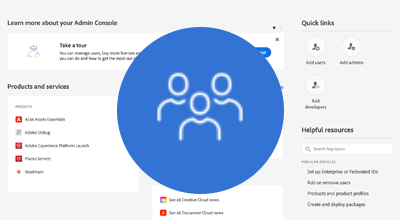

# AEM as a Cloud Service の認証

AEM as a Cloud Service は、複数の認証オプションをサポートしており、サービスの種類によって異なります。

|                       | AEM オーサー | AEM パブリッシュ |
|-----------------------|:----------:|:-----------:|
| [Adobe IMS](../accessing/overview.md) | ✔ | ✔ |
| • [Adobe IMS を介した SAML 2.0](https://experienceleague.adobe.com/docs/experience-manager-cloud-service/content/security/ims-support.html?lang=ja#how-to-set-up) | ✔ | ✔ |
| [SAML 2.0](./saml-2-0.md) | ✘ | ✔ |
| [シングルサインオン（SSO）](https://experienceleague.adobe.com/docs/experience-manager-cloud-service/content/sites/authoring/personalization/user-and-group-sync-for-publish-tier.html?lang=ja#integration-with-an-idp) | ✘ | ✔ |
| [OAuth](https://experienceleague.adobe.com/docs/experience-manager-cloud-service/content/sites/authoring/personalization/user-and-group-sync-for-publish-tier.html?lang=ja#integration-with-an-idp) | ✘ | ✔ |
| [トークン認証](../../headless-tutorial/authentication/overview.md) | ✔ | ✔ |
| 基本認証 | ✘ | ✘ |

## 認証オプション

認証方式の設定方法と使用方法について詳しくは、以下の対応するリンクをクリックしてください。

<table>
  <tr>
   <td>
      
      
<strong><a href="../accessing/overview.md">Adobe IMS</a></strong>

      

          Adobe Admin Console で Adobe IMS を使用して、AEM オーサーのアクセス権を管理します。
      

    </td>   
   <td>
      
      
<strong><a href="./saml-2-0.md">SAML 2.0</a></strong>

      

        AEM パブリッシュサービスの SAML 2.0 統合を使用して、web サイトのユーザーを IDP に対して認証します。
      

    </td>   
   <td>
      
      
<strong><a href="../../headless-tutorial/authentication/overview.md">トークン認証</a></strong>

      

        API サービストークンを使用して、アプリケーションおよびミドルウェアが AEM に対して認証を行うことを許可します。
      

    </td>   
  </tr>
</table>
