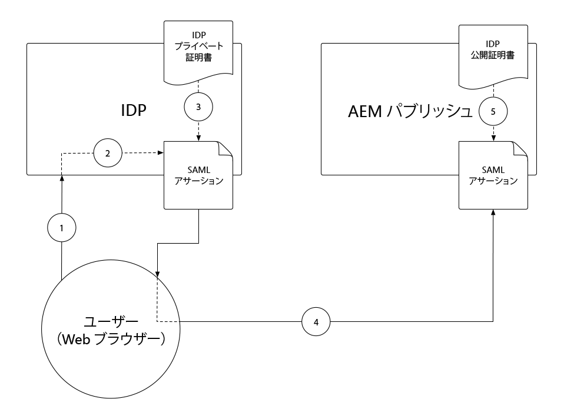
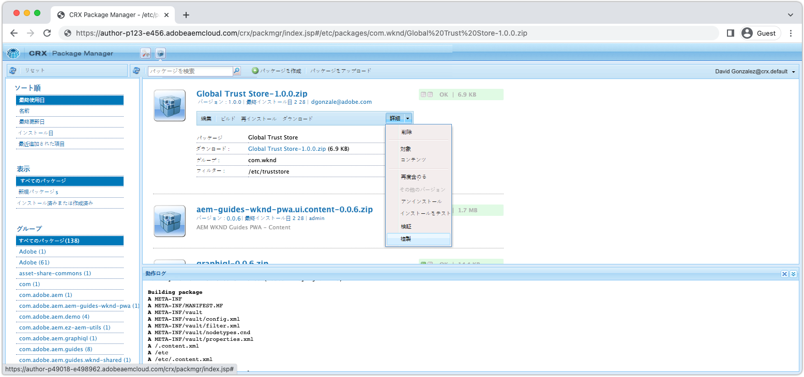
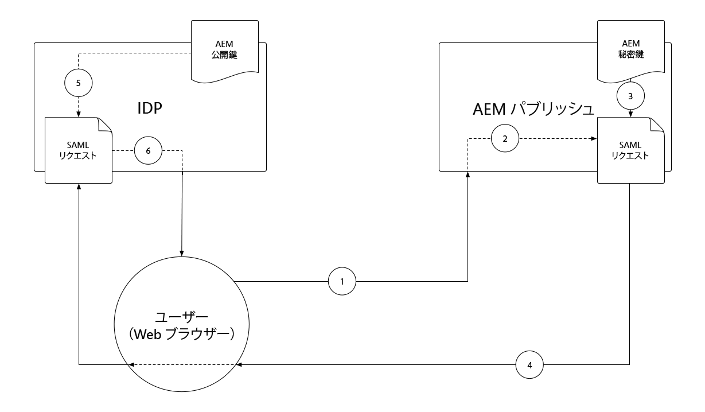
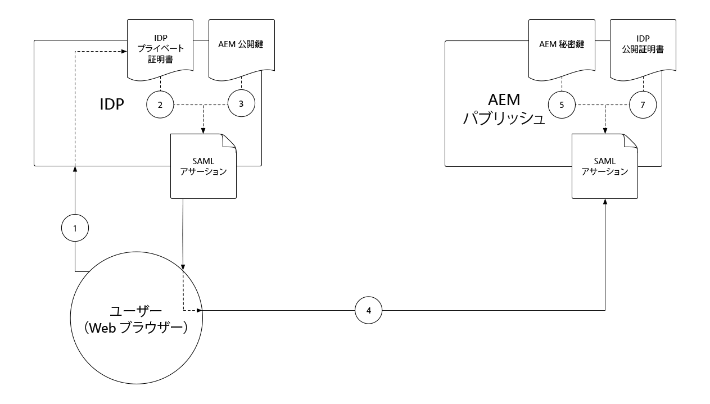
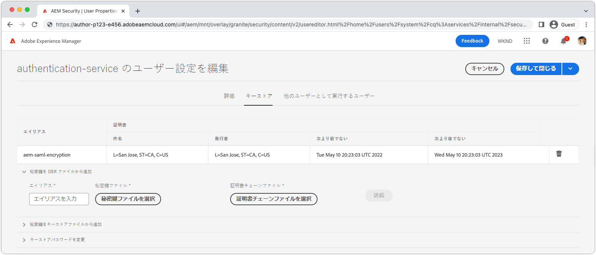

# SAML 2.0 認証{#saml-2-0-authentication}

任意の SAML 2.0 互換 IDP に対して（AEM オーサー以外の）エンドユーザーを設定し、認証する方法について説明します。

## SAML for AEM as a Cloud Service とは

AEM パブリッシュ（またはプレビュー）との SAML 2.0 統合により、AEM ベースの Web エクスペリエンスのエンドユーザーは、アドビ以外の IDP（ID プロバイダー）に対して認証し、指定された承認済みユーザーとして AEM にアクセスできます。

|                       | AEM オーサー | AEM パブリッシュ |
|-----------------------|:----------:|:-----------:|
| SAML 2.0 のサポート | ✘ | ✔ |

+++ AEM での SAML 2.0 フローの理解

AEM パブリッシュ SAML 統合の一般的なフローは次のとおりです。

1. ユーザーが、認証が必要であることを示すリクエストを AEM パブリッシュに行います。
   + ユーザーが、CUG／ACL で保護されたリソースをリクエストします。
   + ユーザーが、認証要件の対象となるリソースをリクエストします。
   + ユーザーが、ログインアクションを明示的にリクエストする AEM のログインエンドポイント（つまり、`/system/sling/login`）へのリンクをたどります。
1. AEMが、IDP に認証プロセスの開始をリクエストして、IDP に AuthnRequest を送信します。
1. ユーザーが IDP に対して認証されます。
   + ユーザーが、IDP に資格情報の入力を求められます。
   + ユーザーが既に IDP で認証されていて、追加の資格情報を提供する必要はありません。
1. IDP が、ユーザーのデータを含む SAML アサーションを生成し、IDP の非公開証明書を使用して署名します。
1. IDP 、HTTP POST 経由で SAML アサーションを、ユーザーの web ブラウザー経由で、AEM パブリッシュに送信します。
1. AEM パブリッシュ SAML アサーションを受け取り、IDP 公開証明書を使用して SAML アサーションの整合性と信頼性を検証します。
1. AEM パブリッシュ、SAML 2.0 OSGi 設定と SAML アサーションの内容に基づいて AEM ユーザーレコードを管理します。
   + ユーザーを作成する
   + ユーザー属性を同期する
   + AEM ユーザーグループのメンバーシップを更新する
1. AEM パブリッシュは HTTP 応答に AEM `login-token` Cookie を設定します。これは、AEM パブリッシュへの後続のリクエストを認証するために使用されます。
1. AEM パブリッシュは、`saml_request_path` Cookie で指定された AEM パブリッシュの URL にユーザーをリダイレクトします。

+++

## 設定の手順

>[!VIDEO](https://video.tv.adobe.com/v/343040?quality=12&learn=on)

このビデオでは、AEM as a Cloud Service のパブリッシュサービスとの SAML 2.0 統合の設定、および Okta を IDP として使用する方法について説明します。

## 前提条件

SAML 2.0 認証を設定する場合は、次の操作が必要です。

+ デプロイメントマネージャーによる Cloud Manager へのアクセス
+ AEM as a Cloud Service 環境への AEM 管理者アクセス
+ IDP への管理者アクセス
+ SAML ペイロードの暗号化に使用する公開鍵／秘密鍵のペアへのアクセス（オプション）

SAML 2.0 は、AEM パブリッシュまたはプレビューに対するユーザーの認証にのみサポートされます。 IDP を使用して AEM オーサーの認証を管理するには、[IDP を Adobe IMS と統合します](https://helpx.adobe.com/jp/enterprise/using/set-up-identity.html)。


## AEM に IDP 公開証明書をインストールする

IDP の公開証明書が AEM グローバルトラストストアに追加され、IDP から送信される SAML アサーションが有効であることを検証するために使用されます。

+++SAML アサーション署名フロー



1. ユーザーが IDP に対して認証されます。
1. IDP は、ユーザーのデータを含む SAML アサーションを生成します。
1. IDP は IDP のプライベート証明書を使用して SAML アサーションに署名します。
1. IDP は、署名された SAML アサーションを含む AEM パブリッシュの SAML エンドポイント（`.../saml_login`）へのクライアントサイドの HTTP POST を開始します。
1. AEM パブリッシュは、署名済み SAML アサーションを含む HTTP POSTを受け取り、IDP 公開証明書を使用して署名を検証できます。

+++


1. IDP から&#x200B;__公開証明書__&#x200B;ファイルを取得します。この証明書により、AEM は IDP によって AEM に提供される SAML アサーションを検証できます。

   証明書は PEM 形式で、次のようになります。

   ```
   -----BEGIN CERTIFICATE-----
   MIIC4jCBAcoCCQC33wnybT5QZDANBgkqhkiG9w0BAQsFADAyMQswCQYDVQQGEwJV
   ...
   m0eo2USlSRTVl7QHRTuiuSThHpLKQQ==
   -----END CERTIFICATE-----
   ```

1. AEM オーサーに AEM 管理者としてログインします。
1. __ツール／セキュリティ／Trust Store__ に移動します。
1. Global Trust Store を作成するか、開きます。 Global Trust Store を作成する場合は、パスワードを安全な場所に保存します。
1. 「__証明書を CER ファイルから追加__」を展開します。
1. 「__証明書ファイルを選択__」を選択して、IDP から提供される証明書ファイルをアップロードします。
1. 「__証明書をユーザーにマッピング__」を空白のままにします。
1. 「__送信__」を選択します。
1. 新しく追加された証明書は、__CRT ファイルから証明書を追加__&#x200B;セクションの上に表示されます。
1. __エイリアス__&#x200B;をメモします。この値は [SAML 2.0 認証ハンドラー OSGi 設定](#saml-2-0-authentication-handler-osgi-configuration)で使用されます。
1. 「__保存して閉じる__」を選択します。

Global Trust Store は、AEM オーサー上で IDP の公開証明書を使用して設定されますが、SAML は AEM パブリッシュでのみ使用されるので、AEM パブリッシュで IDP 公開証明書にアクセスできるようにするには、グローバルトラストストアを AEM パブリッシュにレプリケートする必要があります。



1. __ツール／デプロイメント／パッケージ__&#x200B;に移動します。
1. パッケージを作成する
   + パッケージ名：`Global Trust Store`
   + バージョン：`1.0.0`
   + グループ：`com.your.company`
1. 新しい __Global Trust Store__ パッケージを編集します。
1. 「__フィルター__」タブを選択し、ルートパス `/etc/truststore` のフィルターを追加します。
1. 「__完了__」を選択してから、「__保存__」を選択します。
1. __Global Trust Store__ パッケージの「__ビルド__」ボタンを選択します。
1. ビルドが完了したら、__その他__／__レプリケート__&#x200B;を選択して、Global Trust Store ノード（`/etc/truststore`）を AEM パブリッシュに対してアクティベートします。

## 認証サービスキーストアの作成{#authentication-service-keystore}

_認証サービスのキーストアの作成が必要なのは、[SAML 2.0 認証ハンドラーの OSGi 設定プロパティ `handleLogout`が `true`](#saml-20-authenticationsaml-2-0-authentication) に設定されている場合か、[AuthnRequest 署名／SAML アサーション暗号化](#install-aem-public-private-key-pair)が必要な場合です。_

1. AEM オーサーに AEM 管理者としてログインし、秘密鍵をアップロードします。
1. __ツール／セキュリティ／ユーザー__&#x200B;に移動し、__authentication-service__ ユーザーを選択し、上部のアクションバーから「__プロパティ__」を選択します。
1. 「__キーストア__」タブを選択します。
1. キーストアを作成するか、開きます。 キーストアを作成する場合は、パスワードを安全に保ちます。
   + [パブリック／プライベートキーストアがこのキーストアにインストールされる](#install-aem-public-private-key-pair)のは、AuthnRequest 署名／SAML アサーション暗号化が必要な場合のみです。
   + この SAML 統合がログアウトをサポートし、AuthnRequest 署名／SAML アサーションをサポートしていない場合は、空のキーストアで十分です。
1. 「__保存して閉じる__」を選択します。
1. 更新された&#x200B;__認証サービス__&#x200B;ユーザーを含むパッケージを作成します。

   _パッケージを使用して次の一時的な回避策を実行します。_

   1. __ツール／デプロイメント／パッケージ__&#x200B;に移動します。
   1. パッケージを作成する
      + パッケージ名：`Authentication Service`
      + バージョン：`1.0.0`
      + グループ：`com.your.company`
   1. 新しい&#x200B;__認証サービスキーストア__&#x200B;パッケージを編集します。
   1. 「__フィルター__」タブを選択し、ルートパス `/home/users/system/cq:services/internal/security/<AUTHENTICATION SERVICE UUID>/keystore` のフィルターを追加します。
      + `<AUTHENTICATION SERVICE UUID>` を見つけるには、__ツール／セキュリティ／ユーザー__&#x200B;に移動し、__認証サービス__&#x200B;ユーザーを選択します。UUID は、URL の最後の部分です。
   1. 「__完了__」を選択してから、「__保存__」を選択します。
   1. __認証サービスキーストア__&#x200B;パッケージの「__ビルド__」ボタンを選択します。
   1. ビルドが完了したら、__その他__／__レプリケート__&#x200B;を選択して、認証サービスキーストアを AEM パブリッシュに対してアクティベートします。

## AEM の 公開鍵と秘密鍵のペアをインストールする{#install-aem-public-private-key-pair}

_AEM 公開鍵と秘密鍵のペアのインストールはオプションです_

AEM パブリッシュは、（IDP に対して）AuthnRequest に署名し、（AEM に対して）SAML アサーションを暗号化するように設定できます。これは、AEM パブリッシュに秘密鍵を提供し、これが IDP への公開鍵と一致することで実現されます。

+++ AuthnRequest 署名フローについて（オプション）

AuthnRequest（ログインプロセスを開始する AEM パブリッシュから IDP に対するリクエスト）は、AEM パブリッシュによって署名できます。 これを行うために、AEM パブリッシュは秘密鍵を使用して AuthnRequest に署名し、IDP は公開鍵を使用して署名を検証します。これにより、IDP に対して AuthnRequest が開始され、悪意のあるサードパーティではなく AEM パブリッシュからリクエストされたことが保証されます。



1. ユーザーが AEM パブリッシュに HTTP リクエストを送信すると、IDP への SAML 認証リクエストが発生します。
1. AEM パブリッシュは、IDP に送信する SAML リクエストを生成します。
1. AEM パブリッシュが、AEM 秘密鍵を使用して SAML リクエストに署名します。
1. AEM パブリッシュが AuthnRequest を開始します。これは、署名済み SAML リクエストを含む IDP への HTTP クライアントサイドリダイレクトです。
1. IDP は AuthnRequest を受け取り、AEM 公開鍵を使用して署名を検証し、AuthnRequest を開始したのが AEM バブリッシュであることを保証します。
1. 次に、AEM パブリッシュは、IDP 公開証明書を使用して、復号化された SAML アサーションの整合性と信頼性を検証します。

+++

+++ SAML アサーション暗号化フロー（オプション）

IDP と AEM パブリッシュ間のすべての HTTP 通信は HTTPS 経由で行うので、デフォルトでセキュリティで保護されています。 ただし、必要に応じて、HTTPS によって提供される機密性に加えてさらなる機密性が必要な場合は、SAML アサーションを暗号化できます。これを行うには、IDP が秘密鍵を使用して SAML アサーションデータを暗号化し、AEM が秘密鍵を使用して SAML アサーションを復号化します。



1. ユーザーが IDP に対して認証されます。
1. IDP が、ユーザーのデータを含む SAML アサーションを生成し、IDP の非公開証明書を使用して署名します。
1. 次に、IDP は AEM の公開鍵で SAML アサーションを暗号化します。この場合、AEM 秘密鍵を復号化する必要があります。
1. 暗号化された SAML アサーションは、ユーザーの web ブラウザーを通じて AEM パブリッシュに送信されます。
1. AEM パブリッシュは SAML アサーションを受け取り、AEM の秘密鍵を使用して復号化します。
1. IDP はユーザーに認証を求めます。

+++

AuthnRequest 署名と SAML アサーション暗号化は両方ともオプションですが、[SAML 2.0 認証ハンドラーの OSGi 設定プロパティ`useEncryption`](#saml-20-authenticationsaml-2-0-authentication)を使用して有効になっています。両方とも使用するか両方とも使用しないかを選択できます。



1. AuthnRequest への署名と SAML アサーションの暗号化に使用する公開鍵、秘密鍵（PKCS#8 形式）、および証明書チェーンファイル（公開鍵の場合もあります）を取得します。 キーは、通常、IT 組織のセキュリティチームが提供します。

   + 自己署名キーペアは、__openssl__ を使用して生成できます。

   ```
   $ openssl req -x509 -sha256 -days 365 -newkey rsa:4096 -keyout aem-private.key -out aem-public.crt
   
   # Provide a password (keep in safe place), and other requested certificate information
   
   # Convert the keys to AEM's required format 
   $ openssl rsa -in aem-private.key -outform der -out aem-private.der
   $ openssl pkcs8 -topk8 -inform der -nocrypt -in aem-private.der -outform der -out aem-private-pkcs8.der
   ```

1. 公開鍵を IDP にアップロードします。
   + 上記の `openssl` メソッドを使用すると、公開鍵は `aem-public.crt` ファイルになります。
1. AEM オーサーに AEM 管理者としてログインし、秘密鍵をアップロードします。
1. __ツール／セキュリティ／Trust Store__&#x200B;に移動し、__authentication-service__ ユーザーを選択し、上部のアクションバーから「__プロパティ__」を選択します。
1. __ツール／セキュリティ／ユーザー__&#x200B;に移動し、__authentication-service__ ユーザーを選択し、上部のアクションバーから「__プロパティ__」を選択します。
1. 「__キーストア__」タブを選択します。
1. キーストアを作成するか、開きます。 キーストアを作成する場合は、パスワードを安全に保ちます。
1. 「__秘密鍵を DER ファイルから追加__」を選択し、秘密鍵とチェーンファイルを AEM に追加します。
   + __エイリアス__：意味のある名前を指定します。通常は IDP の名前を指定します。
   + __秘密鍵ファイル__：秘密鍵ファイル（DER 形式の PKCS#8）をアップロードします。
      + 上記の `openssl` メソッドを使用する場合、これは `aem-private-pkcs8.der` ファイルです
   + __証明書チェーンファイルを選択__：付属のチェーンファイル（公開鍵の場合もあります）をアップロードします。
      + 上記の `openssl` メソッドを使用する場合、これは `aem-public.crt` ファイルです
   + 「__送信__」を選択します。
1. 新しく追加された証明書は、「__CRT ファイルから証明書を追加__」セクションの上に表示されます。
   + __エイリアス__&#x200B;をメモしておいてください。このエイリアスは [SAML 2.0 認証の OSGi 設定](#saml-20-authentication-handler-osgi-configuration)で使用します。
1. 「__保存して閉じる__」を選択します。
1. 更新された&#x200B;__認証サービス__&#x200B;ユーザーを含むパッケージを作成します。

   _パッケージを使用して次の一時的な回避策を実行します。_

   1. __ツール／デプロイメント／パッケージ__&#x200B;に移動します。
   1. パッケージを作成する
      + パッケージ名：`Authentication Service`
      + バージョン：`1.0.0`
      + グループ：`com.your.company`
   1. 新しい&#x200B;__認証サービスキーストア__&#x200B;パッケージを編集します。
   1. 「__フィルター__」タブを選択し、ルートパス `/home/users/system/cq:services/internal/security/<AUTHENTICATION SERVICE UUID>/keystore` のフィルターを追加します。
      + `<AUTHENTICATION SERVICE UUID>` を見つけるには、__ツール／セキュリティ／ユーザー__&#x200B;に移動し、__認証サービス__&#x200B;ユーザーを選択します。UUID は、URL の最後の部分です。
   1. 「__完了__」を選択してから、「__保存__」を選択します。
   1. __認証サービスキーストア__&#x200B;パッケージの「__ビルド__」ボタンを選択します。
   1. ビルドが完了したら、__その他__／__レプリケート__&#x200B;を選択して、認証サービスキーストアを AEM パブリッシュに対してアクティベートします。

## SAML 2.0 認証ハンドラーの設定{#configure-saml-2-0-authentication-handler}

AEM の SAML 設定は、__Adobe Granite SAML 2.0 Authentication Handler__ の OSGi 設定により行われます。
設定は OSGi ファクトリ設定です。つまり、1 つの AEM as a Cloud Service パブリッシュサービスに、リポジトリの個別のリソースツリーをカバーする複数の SAML 設定がある場合があります。これは、マルチサイト AEM のデプロイメントに役立ちます。

+++ SAML 2.0 認証ハンドラーの OSGi 設定の用語集

### Adobe Granite SAML 2.0 Authentication Handler の OSGi 設定{#configure-saml-2-0-authentication-handler-osgi-configuration}

|                                   | OSGi のプロパティ | 必須 | 値の形式 | デフォルト値 | 説明 |
|-----------------------------------|-------------------------------|:--------:|:---------------------:|---------------------------|-------------|
| パス | `path` | ✔ | 文字列配列 | `/` | この認証ハンドラーを使用する AEM パス。 |
| IDP URL | `idpUrl` | ✔ | 文字列 |                           | SAML 認証リクエストが送信される IDP URL。 |
| IDP 証明書エイリアス | `idpCertAlias` | ✔ | 文字列 |                           | AEM Global Trust Store で見つかった IDP 証明書のエイリアス |
| IDP HTTP リダイレクト | `idpHttpRedirect` | ✘ | ブーリアン | `false` | AuthnRequest を送信する代わりに IDP URL に HTTP リダイレクトするかどうかを表します。 IDP により開始された認証の場合は `true` に設定されます。 |
| IDP 識別子 | `idpIdentifier` | ✘ | 文字列 |                           | AEM のユーザーとグループの一意性を確保する一意の IDP ID。 空の場合、`serviceProviderEntityId` が代わりに使用されます。 |
| アサーションコンシューマーサービスの URL | `assertionConsumerServiceURL` | ✘ | 文字列 |                           | `<Response>` メッセージの送信先を AEM に指定する、AuthnRequest の `AssertionConsumerServiceURL` URL 属性。 |
| SP エンティティ ID | `serviceProviderEntityId` | ✔ | 文字列 |                           | IDP に対して AEM を一意に識別します。通常は AEM ホスト名です。 |
| SP の暗号化 | `useEncryption` | ✘ | ブーリアン | `true` | IDP が SAML アサーションを暗号化するかどうかを示します。 `spPrivateKeyAlias` と `keyStorePassword` の設定が必要です。 |
| SP 秘密鍵エイリアス | `spPrivateKeyAlias` | ✘ | 文字列 |                           |  `authentication-service` ユーザーのキーストアにある秘密鍵のエイリアス。`useEncryption` が `true` に設定されている場合は必須です。 |
| SP キーストアのパスワード | `keyStorePassword` | ✘ | 文字列 |                           | 「authentication-service」ユーザーのキーストアのパスワード`useEncryption` が `true` に設定されている場合は必須です。 |
| デフォルトのリダイレクト | `defaultRedirectUrl` | ✘ | 文字列 | `/` | 認証成功後のデフォルトのリダイレクト URL。AEM ホストからの相対パス（例：`/content/wknd/us/en/html`）を指定することができます。 |
| ユーザー ID 属性 | `userIDAttribute` | ✘ | 文字列 | `uid` | AEM ユーザーのユーザー ID を含む SAML アサーション属性の名前。名前を使用するには、`Subject:NameId` を空白のままにします。 |
| AEM ユーザーの自動作成 | `createUser` | ✘ | ブーリアン | `true` | 正常な認証で AEM ユーザーが作成されるかどうかを示します。 |
| AEM ユーザー中間パス | `userIntermediatePath` | ✘ | 文字列 |                           | AEM ユーザーを作成する場合、この値が中間パスとして使用されます（例：`/home/users/<userIntermediatePath>/jane@wknd.com`）。`createUser` を `true` に設定する必要があります。 |
| AEM ユーザー属性 | `synchronizeAttributes` | ✘ | 文字列配列 |                           | AEM ユーザーに保存する SAML 属性マッピングのリスト、形式は `[ "saml-attribute-name=path/relative/to/user/node" ]`（例：`[ "firstName=profile/givenName" ]`）。[AEM ネイティブ属性の全リスト](#aem-user-attributes)をご覧ください。 |
| AEM グループにユーザーを追加 | `addGroupMemberships` | ✘ | ブーリアン | `true` | 認証に成功した後、AEM ユーザーが AEM ユーザーグループに自動的に追加されるかどうかを示します。 |
| AEM グループメンバーシップ属性 | `groupMembershipAttribute` | ✘ | 文字列 | `groupMembership` | ユーザーを追加する AEM ユーザーグループのリストを含む SAML アサーション属性の名前です。`addGroupMemberships` に `true` を設定する必要があります。 |
| デフォルトの AEM グループ | `defaultGroups` | ✘ | 文字列配列 |                           | 認証済みユーザーの AEM ユーザーグループのリストが常に追加されます（例：`[ "wknd-user" ]`）。`addGroupMemberships` に `true` を設定する必要があります。 |
| NameIDPolicy 形式 | `nameIdFormat` | ✘ | 文字列 | `urn:oasis:names:tc:SAML:2.0:nameid-format:transient` | AuthnRequest メッセージで送信する NameIDPolicy 形式パラメーターの値です。 |
| SAML 応答を格納 | `storeSAMLResponse` | ✘ | ブーリアン | `false` | AEM の `cq:User` ノードに `samlResponse` 値が格納されているかどうかを示します。 |
| ハンドルログアウト | `handleLogout` | ✘ | ブーリアン | `false` | ログアウトリクエストがこの SAML 認証ハンドラーによって処理されるかどうかを示します。`logoutUrl` が設定されている必要があります。 |
| ログアウト URL | `logoutUrl` | ✘ | 文字列 |                           | SAML ログアウトリクエストの送信先となる IDP の URL です。`handleLogout` が `true` に設定されている場合は必須です。 |
| クロック許容値 | `clockTolerance` | ✘ | 整数 | `60` | SAML アサーションを検証する際の IDP および AEM（SP）クロックの歪み許容値です。 |
| ダイジェストメソッド | `digestMethod` | ✘ | 文字列 | `http://www.w3.org/2001/04/xmlenc#sha256` | SAML メッセージへの署名時に IDP が使用するダイジェストアルゴリズムです。 |
| 署名メソッド | `signatureMethod` | ✘ | 文字列 | `http://www.w3.org/2001/04/xmldsig-more#rsa-sha256` | SAML メッセージの署名時に IDP が使用する署名アルゴリズムです。 |
| ID 同期タイプ | `identitySyncType` | ✘ | `default` か `idp` のどちらかにする必要があります。 | `default` | AEM as a Cloud Service の `from` のデフォルトは変更しないでください。 |
| サービスランキング | `service.ranking` | ✘ | 整数 | `5002` | 同じ `path` でも、より上位の設定をお勧めします。 |

### AEM ユーザー属性{#aem-user-attributes}

AEM は次のユーザー属性を使用し、Adobe Granite SAML 2.0 Authentication Handler OSGi 設定の `synchronizeAttributes` プロパティで入力できます。任意の IDP 属性は任意の AEM ユーザープロパティに同期できますが、AEM の属性プロパティ（次に示す）を使用するようにマッピングすると、AEM で自然に使用できます。

| ユーザー属性 | `rep:User` ノードからの相対的なプロパティパス |
|--------------------------------|--------------------------|
| タイトル（例：`Mrs`） | `profile/title` |
| 名前（例：名） | `profile/givenName` |
| 名前（例：姓） | `profile/familyName` |
| 役職 | `profile/jobTitle` |
| メールアドレス | `profile/email` |
| 住所 | `profile/street` |
| 市区町村 | `profile/city` |
| 郵便番号 | `profile/postalCode` |
| 国 | `profile/country` |
| 電話番号 | `profile/phoneNumber` |
| 会社情報 | `profile/aboutMe` |

+++

1. プロジェクト内の `/ui.config/src/main/content/jcr_root/wknd-examples/osgiconfig/config.publish/com.adobe.granite.auth.saml.SamlAuthenticationHandler~saml.cfg.json` に OSGi 設定ファイルを作成し、IDE で開いてください。
   + `/wknd-examples/` を `/<project name>/` に変更します。
   + ファイル名の `~` の後の識別子は、この設定を一意に識別する必要があるため、`...~okta.cfg.json` のような IDP の名前にできます。値は英数字でハイフンを使用する必要があります。
1. 次の JSON を「`com.adobe.granite.auth.saml.SamlAuthenticationHandler~...cfg.json`」ファイルに貼り付け、必要に応じて `wknd` の参照を更新してください。

   ```json
   {
       "path": [ "/content/wknd", "/content/dam/wknd" ], 
       "idpCertAlias": "$[env:SAML_IDP_CERT_ALIAS;default=certalias___1652125559800]",
       "idpIdentifier": "$[env:SAML_IDP_ID;default=http://www.okta.com/exk4z55r44Jz9C6am5d7]",
       "idpUrl": "$[env:SAML_IDP_URL;default=https://dev-5511372.okta.com/app/dev-5511372_aemasacloudservice_1/exk4z55r44Jz9C6am5d7/sso/saml]",
       "serviceProviderEntityId": "$[env:SAML_AEM_ID;default=https://publish-p123-e456.adobeaemcloud.com]",
       "useEncryption": false,
       "createUser": true,
       "userIntermediatePath": "wknd/idp",
       "synchronizeAttributes":[
           "firstName=profile/givenName"
       ],
       "addGroupMemberships": true,
       "defaultGroups": [ 
           "wknd-users"
       ]
   }
   ```

1. プロジェクトに応じて、値を更新してください。設定プロパティの説明については、上記の __SAML 2.0 Authentication Handler OSGi 設定用語集__&#x200B;を参照してください。
1. OSGi 環境変数とシークレットは、リリースサイクルと同期して値が変化する可能性がある場合や、類似の環境タイプやサービス層間で値が異なる場合に使用することが推奨されますが、必須ではありません。デフォルト値は、上記のように `$[env:..;default=the-default-value]"` 構文で設定できます。

環境ごとの OSGi 設定（`config.publish.dev`、`config.publish.stage` および `config.publish.prod`）は、SAML 設定が環境によって異なる場合に、特定の属性を使用して定義できます。

### 暗号化を使用

[AuthnRequest と SAML アサーション](#encrypting-the-authnrequest-and-saml-assertion)を暗号化する場合、プロパティとして `useEncryption`、`spPrivateKeyAlias`、`keyStorePassword` の 3 つが必要です。`keyStorePassword` はパスワードを含むので、その値は OSGi 設定ファイルに保存してはならず、[秘密の設定値](https://experienceleague.adobe.com/docs/experience-manager-cloud-service/content/implementing/deploying/configuring-osgi.html#secret-configuration-values?lang=ja)を使って挿入する必要があります。

+++（オプション）暗号化を使用するように OSGi 設定を更新する

1. `/ui.config/src/main/content/jcr_root/wknd-examples/osgiconfig/config.publish/com.adobe.granite.auth.saml.SamlAuthenticationHandler~saml.cfg.json` を IDE で開きます。
1. 次のように、`useEncryption`、`spPrivateKeyAlias`、`keyStorePassword` の 3 つのプロパティを追加します。

   ```json
   {
   "path": [ "/content/wknd", "/content/dam/wknd" ], 
   "idpCertAlias": "$[env:SAML_IDP_CERT_ALIAS;default=certalias___1234567890]",
   "idpIdentifier": "$[env:SAML_IDP_ID;default=http://www.okta.com/abcdef1235678]",
   "idpUrl": "$[env:SAML_IDP_URL;default=https://dev-5511372.okta.com/app/dev-123567890_aemasacloudservice_1/abcdef1235678/sso/saml]",
   "serviceProviderEntityId": "$[env:SAML_AEM_ID;default=https://publish-p123-e456.adobeaemcloud.com]",
   "useEncryption": true,
   "spPrivateKeyAlias": "$[env:SAML_AEM_KEYSTORE_ALIAS;default=aem-saml-encryption]",
   "keyStorePassword": "$[secret:SAML_AEM_KEYSTORE_PASSWORD]",
   "createUser": true,
   "userIntermediatePath": "wknd/idp"
   "synchronizeAttributes":[
       "firstName=profile/givenName"
   ],
   "addGroupMemberships": true,
   "defaultGroups": [ 
       "wknd-users"
   ]
   }
   ```

1. 暗号化に必要な 3 つの OSGi 設定プロパティは次のとおりです。

+ `useEncryption` を `true` に設定
+ `spPrivateKeyAlias` には、SAML 統合で使用される秘密鍵のキーストアエントリエイリアスが含まれます。
+ `keyStorePassword` には、`authentication-service` ユーザーキーストアのパスワードを含んだ [OSGi 秘密鍵設定変数](https://experienceleague.adobe.com/docs/experience-manager-cloud-service/content/implementing/deploying/configuring-osgi.html#secret-configuration-values?lang=ja)が含まれます。

+++

## リファラーフィルターの設定

SAML 認証プロセスにおいて、IDP は AEM パブリッシュの `.../saml_login` エンドポイントに対してクライアントサイドの HTTP POST を開始します。IDP と AEM パブリッシュが異なる接触チャネルに存在する場合、AEM パブリッシュの&#x200B;__リファラーフィルター__&#x200B;は、OSGi 設定を介して IDP の接触チャネルからの HTTP POST を許可するように設定されます。

1. プロジェクト内の `/ui.config/src/main/content/jcr_root/wknd-examples/osgiconfig/config.publish/org.apache.sling.security.impl.ReferrerFilter.cfg.json` に OSGi 設定ファイルを作成（または編集）します。
   + `/wknd-examples/` を `/<project name>/` に変更します
1. `allow.empty` の値が `true` に設定され、`allow.hosts`（または必要に応じて、`allow.hosts.regexp`）に IDP のオリジンが含まれ、`filter.methods` に `POST` が含まれていることを確認してください。OSGi の設定は次のようになります。

   ```json
   {
       "allow.empty": true,
       "allow.hosts.regexp": [ ],
       "allow.hosts": [ 
           "$[env:SAML_IDP_REFERRER;default=dev-123567890.okta.com]"
       ],
       "filter.methods": [
           "POST",
       ],
       "exclude.agents.regexp": [ ]
   }
   ```

AEM パブリッシュは、1 つのリファラーフィルター設定をサポートしているので、SAML 設定要件と既存の設定を結合します。

環境ごとの OSGi 設定（`config.publish.dev`、`config.publish.stage` および `config.publish.prod`）は、`allow.hosts`（または `allow.hosts.regex`）が環境間で異なる場合、特定の属性で定義できます。

## クロスオリジンリソース共有（CORS）の設定

SAML 認証プロセスにおいて、IDP は AEM パブリッシュの `.../saml_login` エンドポイントに対してクライアントサイドの HTTP POST を開始します。IDP と AEM パブリッシュが異なるホストやドメインに存在する場合、AEM パブリッシュの&#x200B;__クロスオリジンリソース共有（CORS）__&#x200B;は、IDP のホストまたはドメインからの HTTP POST を許可するように設定されている必要があります。

この HTTP POST リクエストの `Origin` ヘッダーの値は通常、AEM パブリッシュホストとは異なるので、CORS 設定が必要です。

ローカル AEM SDK（`localhost:4503`）で SAML 認証をテストする場合、IDP は `Origin` ヘッダーを `null` に設定する場合があります。その場合は、`alloworigin` リストに `"null"` を追加します。

1. プロジェクト内に OSGi 設定ファイル（`/ui.config/src/main/content/jcr_root/wknd-examples/osgiconfig/config.publish/com.adobe.granite.cors.impl.CORSPolicyImpl~saml.cfg.json`）を作成します。
   + `/wknd-examples/` をプロジェクト名に変更します。
   + ファイル名の `~` の後の識別子は、この設定を一意に識別するので、`...CORSPolicyImpl~okta.cfg.json` のような IDP の名前にすることができます。値は英数字でハイフンを使用する必要があります。
1. 次の JSON を `com.adobe.granite.cors.impl.CORSPolicyImpl~...cfg.json` ファイルにペーストします。

```json
{
    "alloworigin": [ 
        "$[env:SAML_IDP_ORIGIN;default=https://dev-1234567890.okta.com]", 
        "null"
    ],
    "allowedpaths": [ 
        ".*/saml_login"
    ],
    "supportedmethods": [ 
        "POST"
    ]
}
```

環境ごとの OSGi 設定（`config.publish.dev`、`config.publish.stage`および `config.publish.prod`）は、`alloworigin` と `allowedpaths` が環境ごとに異なる場合、特定の属性で定義することができます。

## AEM Dispatcher の設定による SAML HTTP POST の許可

IDP への認証に成功すると、IDP は HTTP POST を調整して AEM の登録済み `/saml_login` エンドポイント（IDP に設定済み）に返します。この `/saml_login` への HTTP POSTは、Dispatcher でデフォルトでブロックされるので、次の Dispatcher ルールを使用して明示的に許可する必要があります。

1. IDE で `dispatcher/src/conf.dispatcher.d/filters/filters.any` を開きます。
1. ファイルの一番下に、`/saml_login` で終わる URL への HTTP POST を許可するルールを追加します。

```
...

# Allow SAML HTTP POST to ../saml_login end points
/0190 { /type "allow" /method "POST" /url "*/saml_login" }
```

Apache web サーバーで URL の書き換えが設定されている場合（`dispatcher/src/conf.d/rewrites/rewrite.rules`）、`.../saml_login` エンドポイントへのリクエストが誤ってマングリングされないようにします。

## SAML 設定のデプロイ

OSGi 設定は、Git にコミットし、Cloud Manager を使用して AEM as a Cloud Service にデプロイする必要があります。

```
$ git remote -v            
adobe   https://git.cloudmanager.adobe.com/myOrg/myCloudManagerGit/ (fetch)
adobe   https://git.cloudmanager.adobe.com/myOrg/myCloudManagerGit/ (push)
$ git add .
$ git commit -m "SAML 2.0 configurations"
$ git push adobe saml-auth:develop
```

フルスタックデプロイメントパイプラインを使用して、ターゲットの Cloud Manager Git ブランチ（この例では `develop`）をデプロイします。
