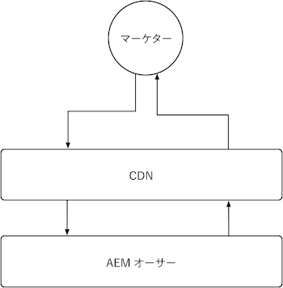
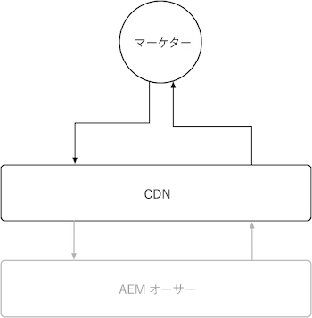

# AEM オーサー

AEM オーサーは、提供するコンテンツが非常に動的で、権限に影響を受けやすい性質を持つので、キャッシュに制限があります。通常、AEM オーサーのキャッシュをカスタマイズすることは推奨しません。代わりに、アドビが提供するキャッシュ設定を利用して、パフォーマンスを高めることをお勧めします。

{align="center"}

AEM オーサー上のキャッシュをカスタマイズすることはお勧めできません。AEM オーサーにはアドビが管理する CDN がありますが、AEM Dispatcher はないことを理解しておくと役立ちます。AEM Dispatcher を持たないので、AEM オーサーではすべての AEM Dispatcher 設定が無視されることに注意してください。

## CDN

AEM オーサーサービスは CDN を使用しますが、その目的は製品リソースの配信を強化することです。広範囲に設定せずに、そのまま作動させてください。

{align="center"}

AEM オーサー CDN は、エンドユーザー（通常はマーケターやコンテンツ作成者）と AEM オーサーの間に配置されます。オーサリングされたコンテンツではなく、AEM オーサリングエクスペリエンスを強化する静的アセットなどの、不変ファイルをキャッシュします。

AEM オーサーの CDN は、[永続クエリのカスタマイズ可能な TTL](https://experienceleague.adobe.com/docs/experience-manager-cloud-service/content/headless/graphql-api/persisted-queries.html?lang=ja#author-instances) や、[カスタムクライアントライブラリの長い TTL](https://experienceleague.adobe.com/docs/experience-manager-cloud-service/content/implementing/content-delivery/caching.html?lang=ja#client-side-libraries) など、参考となるいくつかのタイプのリソースをキャッシュします。

### デフォルトのキャッシュの有効期間

次の顧客向けリソースは AEM オーサー CDN によってキャッシュされ、デフォルトのキャッシュ有効期間は次のとおりです。

| コンテンツタイプ | デフォルトの CDN キャッシュの有効期間 |
|:------------ |:---------- |
| [永続クエリ（JSON）](https://experienceleague.adobe.com/docs/experience-manager-cloud-service/content/headless/graphql-api/persisted-queries.html?lang=ja#author-instances) | 1 分 |
| [クライアントライブラリ（JS／CSS）](https://experienceleague.adobe.com/docs/experience-manager-cloud-service/content/implementing/content-delivery/caching.html?lang=ja#client-side-libraries) | 30 日 |
| [その他すべて](https://experienceleague.adobe.com/docs/experience-manager-cloud-service/content/implementing/content-delivery/caching.html?lang=ja#other-content) | キャッシュなし |

## AEM Dispatcher

AEM オーサーサービスは AEM Dispatcher を含まず、[CDN](#cdn) のみを使用してキャッシュを行います。
