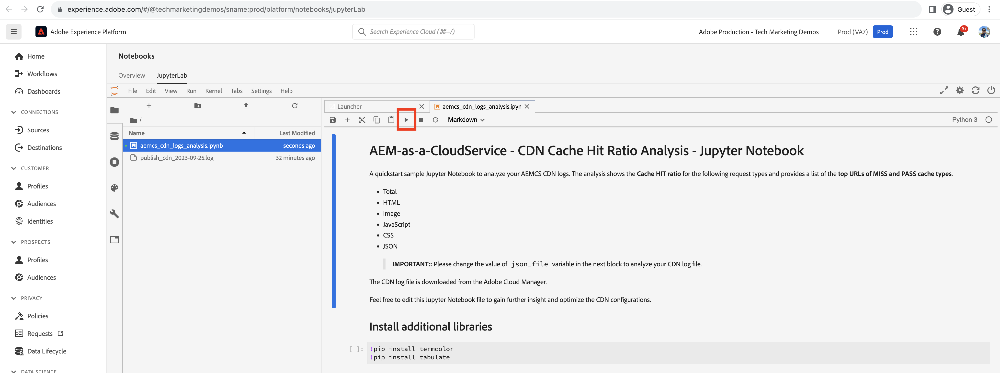

# CDN キャッシュヒット率の分析

CDN でキャッシュされるコンテンツは、web サイトユーザーが経験する待ち時間を短縮します。ユーザーは、リクエストが Apache／Dispatcher または AEM パブリッシュに戻るのを待つ必要はありません。このことを念頭に置くと、CDN でキャッシュ可能なコンテンツの量を最大限に増やすために、CDN キャッシュのヒット率を最適化することが重要です。

AEM as a Cloud Service が提供する **CDN ログ**&#x200B;を分析し、**キャッシュヒット率**、**_MISS_ および _PASS_ キャッシュタイプの上位 URL** などのインサイトを取得して最適化を実現する方法について説明します。

CDN ログは JSON 形式で利用できます。この形式には、`url`、`cache` といった様々なフィールドが含まれています。詳しくは、[CDN ログ形式](https://experienceleague.adobe.com/docs/experience-manager-cloud-service/content/implementing/developing/logging.html?lang=ja#cdn-log:~:text=Toggle%20Text%20Wrapping-,Log%20Format,-The%20CDN%20logs)を参照してください。`cache` フィールドでは、_キャッシュの状態_&#x200B;に関する情報を提供し、その考えられる値は HIT、MISS または PASS です。考えられる値の詳細を確認してみましょう。

| キャッシュの状態   考えられる値 | 説明 |
|------------------------------------|:-----------------------------------------------------:|
| HIT | リクエストしたデータは _CDN キャッシュ内で見つかるので、AEM サーバーに取得リクエストを行う必要はありません_。 |
| MISS | リクエストしたデータは _CDN キャッシュ内で見つからないので、AEM サーバーからリクエストする必要があります_。 |
| PASS | リクエストされたデータは _キャッシュされないように明示的に設定されています_ また、常にAEM サーバーから取得されます。 |

このチュートリアルの目的のために、[AEM WKND プロジェクト](https://github.com/adobe/aem-guides-wknd)が AEM as a Cloud Service 環境にデプロイされ、[Apache JMeter](https://jmeter.apache.org/) を使用して小規模なパフォーマンステストがトリガーされます。

このチュートリアルは、次の手順を実行するように構成されています。

1. Cloud Manager を使用した CDN ログのダウンロード
1. これらの CDN ログを分析するには、ローカルインストールされたダッシュボードと、リモートからアクセスする Splunk または Jupityer Notebook （Adobe Experience Platformのライセンスを取得しているユーザー用）の 2 つの方法があります
1. CDN キャッシュ設定の最適化

## CDN ログのダウンロード

CDN ログをダウンロードするには、次の手順に従います。

1. [my.cloudmanager.adobe.com](https://my.cloudmanager.adobe.com/) で Cloud Manager にログインし、組織とプログラムを選択します。

1. 必要な AEMCS 環境の場合は、省略記号メニューから「**ログをダウンロード**」を選択します。

   {width="500" zoomable="yes"}

1. が含まれる **ログをダウンロード** ダイアログで、 **公開** ドロップダウンメニューから「サービス」を選択し、の横にある「ダウンロード」アイコンをクリックします **CDN** 行。

   {width="500" zoomable="yes"}

ダウンロードしたログファイルが&#x200B;_今日_&#x200B;のファイルである場合、ファイル拡張子は `.log` です。それ以外で、過去のログファイルの場合、拡張子は `.log.gz` です。

## ダウンロードした CDN ログの分析

キャッシュヒット率、MISS および PASS キャッシュタイプの上位 URL などのインサイトを取得するには、ダウンロードした CDN ログファイルを分析します。これらのインサイトは、[CDN キャッシュ設定](https://experienceleague.adobe.com/ja/docs/experience-manager-cloud-service/content/implementing/content-delivery/caching)を最適化し、サイトのパフォーマンスを向上させるのに役立ちます。

このチュートリアルでは、CDN ログを分析するために、次の 3 つのオプションを紹介します。

1. **Elasticsearch、ログ、およびキバナ （ELK）**：です [ELK ダッシュボードツール](https://github.com/adobe/AEMCS-CDN-Log-Analysis-Tooling/blob/main/ELK/README.md) はローカルにインストールできます。
1. **Splunk**：です [Splunk ダッシュボードツール](https://github.com/adobe/AEMCS-CDN-Log-Analysis-Tooling/blob/main/Splunk/READEME.md) splunk へのアクセスが必要で、 [AEMCS ログ転送が有効](https://experienceleague.adobe.com/ja/docs/experience-manager-cloud-service/content/implementing/developing/logging#splunk-logs) :CDN ログを取り込みます。
1. **Jupyter ノートブック**：の一部としてリモートからアクセスできます [Adobe Experience Platform](https://experienceleague.adobe.com/en/docs/experience-platform/data-science-workspace/jupyterlab/analyze-your-data) Adobe Experience Platformのライセンスを取得しているお客様の場合、ソフトウェアを追加でインストールする必要はありません。

### オプション 1：ELK ダッシュボードツールの使用

[ELK スタック](https://www.elastic.co/elastic-stack)は、データを検索、分析、視覚化するためのスケーラブルなソリューションを提供するツールのセットです。Elasticsearch、Logstash、Kibana で構成されます。

主な詳細を識別するには、を使用します [AEMCS-CDN-Log-Analysis-Tooling](https://github.com/adobe/AEMCS-CDN-Log-Analysis-Tooling) プロジェクト。 このプロジェクトでは、ELK スタックの Docker コンテナと、CDN ログを分析するための事前設定済みの Kibana ダッシュボードを提供します。

1. の手順に従います [ELK Docker コンテナの設定方法](https://github.com/adobe/AEMCS-CDN-Log-Analysis-Tooling/blob/main/ELK/README.md#how-to-set-up-the-elk-docker-containerhow-to-setup-the-elk-docker-container) を選択し、必ず以下を読み込みます **CDN キャッシュヒット率** Kibana ダッシュボード。

1. CDN キャッシュヒット率と上位の URL を特定するには、次の手順に従います。

   1. ダウンロードした CDN ログファイルを環境固有のログフォルダー内（例：）にコピーします。 `ELK/logs/stage`.

   1. を開きます **CDN キャッシュヒット率** 左上隅をクリックしたダッシュボード _ナビゲーションメニュー/Analytics/ダッシュボード/CDN キャッシュヒット率_.

      {width="500" zoomable="yes"}

   1. 右上隅から目的の時間範囲を選択します。

      {width="500" zoomable="yes"}

   1. **CDN キャッシュヒット率**&#x200B;ダッシュボードは一目瞭然です。

   1. 「_合計リクエスト分析_」セクションには、次の詳細が表示されます。
      - キャッシュタイプ別のキャッシュ率
      - キャッシュタイプ別のキャッシュ数

      {width="500" zoomable="yes"}

   1. _リクエストまたは MIME タイプ別の分析_&#x200B;には、次の詳細が表示されます。
      - キャッシュタイプ別のキャッシュ率
      - キャッシュタイプ別のキャッシュ数
      - 上位の MISS および PASS URL

      {width="500" zoomable="yes"}

#### 環境名またはプログラム ID によるフィルタリング

取り込んだログを環境名でフィルタリングするには、次の手順に従います。

1. CDN キャッシュヒット率ダッシュボードで、「**フィルターを追加**」アイコンをクリックします。

   {width="500" zoomable="yes"}

1. **フィルターを追加**&#x200B;モーダルで、ドロップダウンメニューから「`aem_env_name.keyword`」フィールドを選択し、次のフィールドに `is` 演算子と目的の環境名を選択して、最後に「_フィルターを追加_」をクリックします。

   {width="500" zoomable="yes"}

#### ホスト名別のフィルタリング

取り込んだログをホスト名でフィルタリングするには、次の手順に従います。

1. CDN キャッシュヒット率ダッシュボードで、「**フィルターを追加**」アイコンをクリックします。

   {width="500" zoomable="yes"}

1. **フィルターを追加**&#x200B;モーダルで、ドロップダウンメニューから「`host.keyword`」フィールドを選択し、次のフィールドに `is` 演算子と目的のホスト名を選択して、最後に「_フィルターを追加_」をクリックします。

   {width="500" zoomable="yes"}

同様に、分析要件に基づいて、ダッシュボードにさらにフィルターを追加します。

### オプション 2:Splunk ダッシュボードツールの使用

この [Splunk](https://www.splunk.com/) は、ログの集計、分析および監視とトラブルシューティングを目的としたビジュアライゼーションの作成に役立つ、一般的なログ分析ツールです。

主な詳細を識別するには、を使用します [AEMCS-CDN-Log-Analysis-Tooling](https://github.com/adobe/AEMCS-CDN-Log-Analysis-Tooling) プロジェクト。 このプロジェクトでは、CDN ログを分析する Splunk ダッシュボードを提供します。

1. の手順に従います [AEMCS CDN ログ分析用の Splunk ダッシュボード](https://github.com/adobe/AEMCS-CDN-Log-Analysis-Tooling/blob/main/Splunk/READEME.md) を選択し、必ず以下を読み込みます **CDN キャッシュヒット率** Splunk ダッシュボード。
1. 必要に応じて、を更新します _インデックス、ソースタイプ、その他_ splunk ダッシュボードの値をフィルタリングします。

   {width="500" zoomable="yes"}

>[!NOTE]
>
>Splunk ダッシュボードの UI とグラフは ELK ダッシュボードとは異なりますが、重要な詳細は似ています。

### オプション 3：Jupyter ノートブックの使用

ソフトウェアをローカルにインストールしない場合（つまり、前のセクションの ELK ダッシュボードツールの場合）は、別の方法を使用できますが、Adobe Experience Platformのライセンスが必要です。

[Jupyter Notebook](https://jupyter.org/) は、コード、テキスト、ビジュアライゼーションを含むドキュメントを作成できるオープンソース web アプリケーションです。データの変換、ビジュアライゼーション、統計的モデリングに使用します。[Adobe Experience Platform の一部として](https://experienceleague.adobe.com/en/docs/experience-platform/data-science-workspace/jupyterlab/analyze-your-data)リモートからアクセス可能です。

#### インタラクティブ Python ノートブックファイルのダウンロード

まず、[AEM-as-a-CloudService - CDN Logs Analysis - Jupyter Notebook](./assets/cdn-logs-analysis/aemcs_cdn_logs_analysis.ipynb) ファイルをダウンロードします。これは CDN ログ分析に役立ちます。ダウンロードした 「インタラクティブ Python ノートブック」ファイルは一目瞭然ですが、以下に各セクションの主な特徴を示します。

- **追加のライブラリをインストール**：`termcolor` および `tabulate` Python ライブラリをインストールします。
- **CDN ログファイルを読み込み**：`log_file` 変数値を使用して CDN ログファイルを読み込みます。必ずその値を更新してください。また、この CDN ログを [Pandas DataFrame](https://pandas.pydata.org/docs/reference/frame.html) に変換します。
- **分析を実行**：最初のコードブロックは&#x200B;_合計、HTML、JS/CSS および画像リクエストの分析結果を表示_で、キャッシュヒット率の割合、棒グラフ、円グラフを表示します。
2 番目のコードブロックは、_HTML、JS/CSS、画像の MISS および PASS リクエスト URL の上位 5 件_&#x200B;で、URL とその数を表形式で表示します。

#### Jupyter Notebook の実行

Adobe Experience Platform で Jupyter Notebook を実行するには、次の手順に従います。

1. [Adobe Experience Cloud](https://experience.adobe.com/) にログインし、ホームページ／「**クイックアクセス**」セクション／**Experience Platform** をクリックします

   {width="500" zoomable="yes"}

1. Adobe Experience Platform ホームページ／「データサイエンス」セクションで、**Notebooks** メニュー項目をクリックします。Jupyter Notebooks 環境を開始するには、「**JupyterLab**」タブをクリックします。

   {width="500" zoomable="yes"}

1. JupyterLab メニューで、「**ファイルをアップロード**」アイコンを使用して、ダウンロードした CDN ログファイルと、`aemcs_cdn_logs_analysis.ipynb` ファイルをアップロードします。

   {width="500" zoomable="yes"}

1. `aemcs_cdn_logs_analysis.ipynb` ファイルをダブルクリックして開きます。

1. ノートブックの「**CDN ログファイルを読み込み**」セクションで、`log_file` 値を更新します。

   {width="500" zoomable="yes"}

1. 選択したセルを実行して先に進むには、「**再生**」アイコンをクリックします。

   {width="500" zoomable="yes"}

1. **合計、HTML、JS/CSS および画像リクエストの分析結果を表示**&#x200B;コードセルを実行すると、出力にキャッシュヒット率の割合、棒グラフおよび円グラフが表示されます。

   {width="500" zoomable="yes"}

1. **HTML、JS/CSS および画像の上位 5 つの MISS および PASS リクエスト URL** コードセルを実行すると、出力に上位 5 つの MISS および PASS リクエスト URL が表示されます。

   {width="500" zoomable="yes"}

Jupyter Notebook を拡張し、要件に基づいて CDN ログを分析できます。

## CDN キャッシュ設定の最適化

CDN ログを分析した後、CDN キャッシュ設定を最適化してサイトのパフォーマンスを向上させることができます。AEM のベストプラクティスは、キャッシュヒット率を 90％以上にすることです。

詳しくは、[CDN キャッシュ設定の最適化](https://experienceleague.adobe.com/ja/docs/experience-manager-cloud-service/content/implementing/content-delivery/caching)を参照してください。

AEM WKND プロジェクトには参照 CDN 設定があります。詳しくは、`wknd.vhost` ファイルの [CDN 設定](https://github.com/adobe/aem-guides-wknd/blob/main/dispatcher/src/conf.d/available_vhosts/wknd.vhost#L137-L190)を参照してください。
