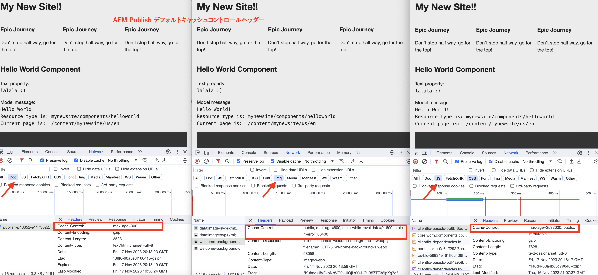

# CDN キャッシュを有効にする方法

AEM as a Cloud Service の CDN で HTTP 応答のキャッシュを有効にする方法を説明します。応答のキャッシュは、`Cache-Control`、`Surrogate-Control`、または `Expires` HTTP 応答キャッシュヘッダーによって制御されます。

これらのキャッシュヘッダーは、通常、`mod_headers` を使用して、AEM Dispatcher のホスト設定で行われますが、AEM パブリッシュ自体で実行されるカスタム Java™ コードで設定することもできます。

## 新しいデフォルトのキャッシュ動作

カスタム設定が存在しない場合は、デフォルト値が使用されます。次のスクリーンショットに、AEM Publish とオーサーのデフォルトのキャッシュ動作を示します。[AEM Project Archetype](https://github.com/adobe/aem-project-archetype) ベース `mynewsite` AEM プロジェクトがデプロイされます。

{width="800" zoomable="yes"}

詳しくは、[AEM パブリッシュ - デフォルトのキャッシュ有効期間](https://experienceleague.adobe.com/docs/experience-manager-learn/cloud-service/caching/publish.html?lang=ja#cdn-cache-life)および [AEM オーサー - デフォルトのキャッシュ有効期間](https://experienceleague.adobe.com/docs/experience-manager-learn/cloud-service/caching/author.html?lang=ja#default-cache-life) を確認してください。

つまり、AEMas a Cloud Service は、ほとんどのコンテンツタイプ（HTML、JSON、JS、CSS およびアセット）を AEM パブリッシュに、および一部のコンテンツタイプ（JS、CSS）を AEM オーサーにキャッシュします。

## キャッシュを有効にする

デフォルトのキャッシュ動作を変更するには、2 つの方法でキャッシュヘッダーを更新します。

1. **Dispatcher vhost の設定：** AEM パブリッシュでのみ使用できます。
1. **カスタム Java™コード：** AEM パブリッシュとオーサーの両方で使用できます。

これらの各オプションを確認してみましょう。

### Dispatcher フィルター設定

キャッシュを有効にする場合は、このオプションを使用することをお勧めしますが、このオプションは AEM パブリッシュでのみ使用できます。キャッシュヘッダーを更新するには、`mod_headers` モジュールと `<LocationMatch>` Apache HTTP Server の vhost ファイル内のディレクティブを使用します。一般的な構文は次のとおりです。

```
<LocationMatch "$URL$ || $URL_REGEX$">
    # Removes the response header of this name, if it exists. If there are multiple headers of the same name, all will be removed.
    Header unset Cache-Control
    Header unset Surrogate-Control
    Header unset Expires

    # Instructs the web browser and CDN to cache the response for 'max-age' value (XXX) seconds. The 'stale-while-revalidate' and 'stale-if-error' attributes controls the stale state treatment at CDN layer.
    Header set Cache-Control "max-age=XXX,stale-while-revalidate=XXX,stale-if-error=XXX"
    
    # Instructs the CDN to cache the response for 'max-age' value (XXX) seconds. The 'stale-while-revalidate' and 'stale-if-error' attributes controls the stale state treatment at CDN layer.
    Header set Surrogate-Control "max-age=XXX,stale-while-revalidate=XXX,stale-if-error=XXX"
    
    # Instructs the web browser and CDN to cache the response until the specified date and time.
    Header set Expires "Sun, 31 Dec 2023 23:59:59 GMT"
</LocationMatch>
```

次に、それぞれの&#x200B;**ヘッダー**&#x200B;の目的とヘッダーに適用可能な&#x200B;**属性**&#x200B;をまとめます。

|                     | Web ブラウザー | CDN | 説明 |
|---------------------|:-----------:|:---------:|:-----------:|
| Cache-Control | ✔ | ✔ | このヘッダーは、web ブラウザーと CDN キャッシュの有効期間を制御します。 |
| Surrogate-Control | ✘ | ✔ | このヘッダーは、CDN キャッシュの有効期間を制御します。 |
| 有効期限 | ✔ | ✔ | このヘッダーは、web ブラウザーと CDN キャッシュの有効期間を制御します。 |


- **max-age**：この属性は、応答コンテンツの TTL（「有効期間」）を秒単位で制御します。
- **stale-while-revalidate**：この属性は、受信したリクエストが秒単位で指定された期間内にある場合に、CDN レイヤーでの応答コンテンツの&#x200B;_古い状態_&#x200B;の処理を制御します。_古い状態_&#x200B;とは、TTL が切れてから、応答が再検証されるまでの期間です。
- **stale-if-error**：この属性は、オリジンサーバーが利用できず、受信したリクエストが指定された期間内に秒単位で送信された場合に、CDN レイヤーにおける応答コンテンツの&#x200B;_古い状態_&#x200B;の処理を制御します。

詳しくは、[失効と再検証](https://developer.fastly.com/learning/concepts/edge-state/cache/stale/)についての情報を参照してください。

#### 例

Web ブラウザーと CDN キャッシュの **HTML コンテンツタイプ**&#x200B;の有効期間を、古い状態の処理を行わずに _10 分_&#x200B;に増やすには、次の手順に従います。

1. AEM プロジェクト内で、目的の vhost ファイルを `dispatcher/src/conf.d/available_vhosts` ディレクトリで見つけます。
1. その vhost（例：`wknd.vhost`）ファイルを次のように更新します。

   ```
   <LocationMatch "^/content/.*\.(html)$">
       # Removes the response header if present
       Header unset Cache-Control
   
       # Instructs the web browser and CDN to cache the response for max-age value (600) seconds.
       Header set Cache-Control "max-age=600"
   </LocationMatch>
   ```

   `dispatcher/src/conf.d/enabled_vhosts` ディレクトリ内の vhost ファイルは `dispatcher/src/conf.d/available_vhosts` ディレクトリ内のファイルへの&#x200B;**シンボリックリンク**&#x200B;なので、存在しない場合は、必ずシンボリックリンクを作成してください。
1. [Cloud Manager - web 層設定パイプライン](https://experienceleague.adobe.com/docs/experience-manager-cloud-service/content/implementing/using-cloud-manager/cicd-pipelines/introduction-ci-cd-pipelines.html?lang=ja#web-tier-config-pipelines)または [RDE コマンド](https://experienceleague.adobe.com/docs/experience-manager-learn/cloud-service/developing/rde/how-to-use.html?lang=ja#deploy-apache-or-dispatcher-configuration)を使用して、目的の AEM as a Cloud Service 環境に vhost の変更をデプロイします。

ただし、web ブラウザーと CDN キャッシュの有効期間に異なる値を設定する場合は、`Surrogate-Control` ヘッダーを使用します。同様に、キャッシュを特定の日時に期限切れにするには、`Expires` ヘッダーを使用します。また、`stale-while-revalidate` および `stale-if-error` 属性を指定すると、応答コンテンツの古い状態の処理を制御できます。AEM WKND プロジェクトには、[古い状態の処理（参考例）](https://github.com/adobe/aem-guides-wknd/blob/main/dispatcher/src/conf.d/available_vhosts/wknd.vhost#L150-L155)の CDN キャッシュ設定が含まれています。

同様に、他のコンテンツタイプ（JSON、JS、CSS およびアセット）のキャッシュヘッダーも更新できます。

### カスタム Java™ コード

このオプションは、AEM パブリッシュと AEM オーサーの両方で使用できます。ただし、AEM オーサーのキャッシュを有効にして、デフォルトのキャッシュ動作を維持することはお勧めしません。

キャッシュヘッダーを更新するには、カスタム Java™ コード（Sling サーブレット、Sling サーブレットフィルター）で `HttpServletResponse` オブジェクトを使用します。一般的な構文は次のとおりです。

```java
// Instructs the web browser and CDN to cache the response for 'max-age' value (XXX) seconds. The 'stale-while-revalidate' and 'stale-if-error' attributes controls the stale state treatment at CDN layer.
response.setHeader("Cache-Control", "max-age=XXX,stale-while-revalidate=XXX,stale-if-error=XXX");

// Instructs the CDN to cache the response for 'max-age' value (XXX) seconds. The 'stale-while-revalidate' and 'stale-if-error' attributes controls the stale state treatment at CDN layer.
response.setHeader("Surrogate-Control", "max-age=XXX,stale-while-revalidate=XXX,stale-if-error=XXX");

// Instructs the web browser and CDN to cache the response until the specified date and time.
response.setHeader("Expires", "Sun, 31 Dec 2023 23:59:59 GMT");
```
