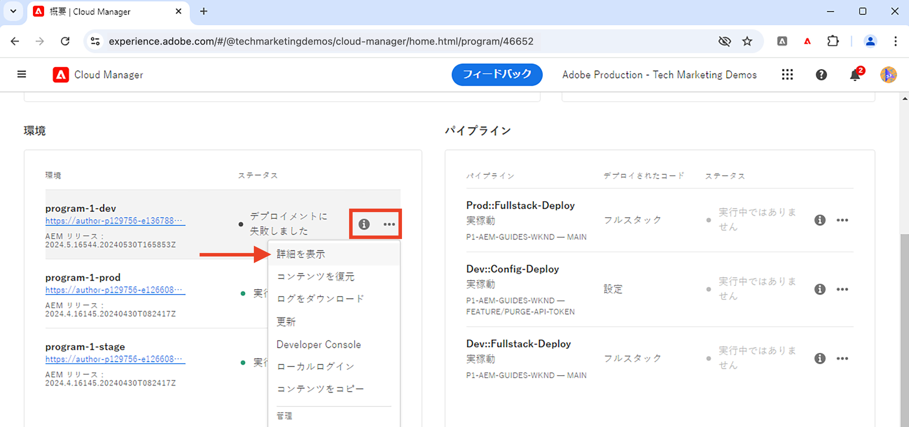
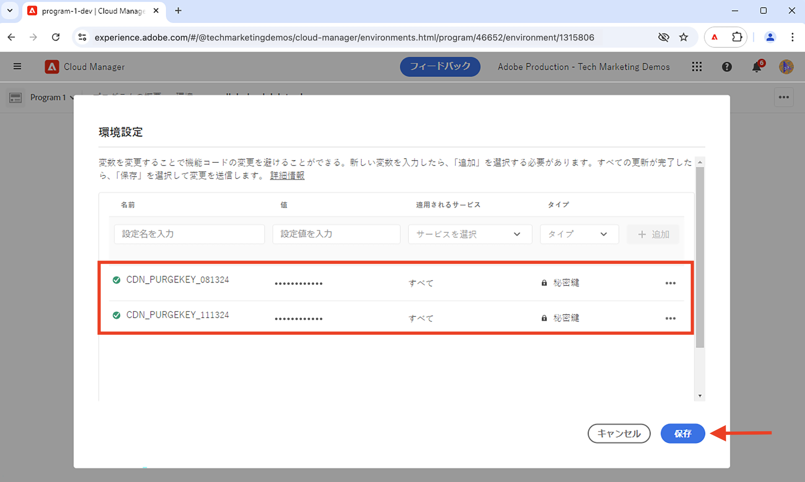
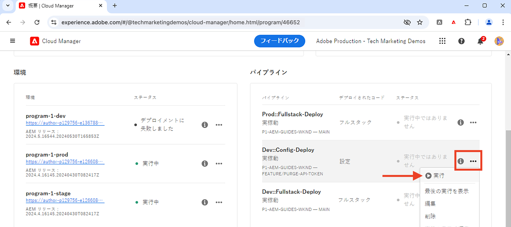

# CDN キャッシュをパージする方法

AEM as a Cloud Service の CDN からキャッシュされた HTTP 応答をパージまたは削除する方法について説明します。**API トークンをパージ**&#x200B;と呼ばれるセルフサービス機能を使用すると、特定のリソース、リソースのグループおよびキャッシュ全体のキャッシュをパージできます。

このチュートリアルでは、「API トークンをパージ」を設定し、セルフサービス機能を使用してサンプル [AEM WKND](https://github.com/adobe/aem-guides-wknd) サイトの CDN キャッシュをパージする方法について説明します。

>[!VIDEO](https://video.tv.adobe.com/v/3432948?quality=12&learn=on)

## キャッシュの無効化と明示的なパージ

CDN からキャッシュされたリソースを削除するには、次の 2 つの方法があります。

1. **キャッシュの無効化：**`Cache-Control`、`Surrogate-Control`、`Expires` などのキャッシュヘッダーに基づいて、キャッシュされたリソースを CDN から削除するプロセスです。キャッシュヘッダーの `max-age` 属性値は、リソースのキャッシュの有効期間（キャッシュの TTL（有効期限）とも呼ばれる）を決定するのに使用されます。キャッシュの有効期限が切れると、キャッシュされたリソースは CDN キャッシュから自動的に削除されます。

1. **明示的なパージ：** TTL が有効期限切れになる前に、キャッシュされたリソースを CDN キャッシュから手動で削除するプロセスです。明示的なパージは、キャッシュされたリソースをすぐに削除する場合に役立ちます。ただし、公開元サーバーへのトラフィックが増加します。

キャッシュされたリソースを CDN キャッシュから削除すると、同じリソースに対する次のリクエストでは、公開元サーバーから最新バージョンが取得されます。

## 「API トークンをパージ」の設定

「API トークンをパージ」を設定して、CDN キャッシュをパージする方法について説明します。

### CDN ルールの設定

「API トークンをパージ」を作成するには、AEM プロジェクトコードで CDN ルールを設定します。

1. AEM プロジェクトのメイン `config` フォルダーから `cdn.yaml` ファイルを開きます。例えば、[WKND プロジェクトの cdn.yaml](https://github.com/adobe/aem-guides-wknd/blob/main/config/cdn.yaml) ファイルです。

1. 次の CDN ルールを `cdn.yaml` ファイルに追加します。

```yaml
kind: "CDN"
version: "1"
metadata:
  envTypes: ["dev", "stage", "prod"]
data:  
  authentication: # The main authentication configuration
    authenticators: # The list of authenticators
       - name: purge-auth # The name of the authenticator
         type: purge  # The type of the authenticator, must be purge
         purgeKey1: ${{CDN_PURGEKEY_081324}} # The first purge key, must be referenced by the Cloud Manager secret-type environment variable name ${{CDN_EDGEKEY_073124}}
         purgeKey2: ${{CDN_PURGEKEY_111324}} # The second purge key, must be referenced by the Cloud Manager secret-type environment variable name ${{CDN_EDGEKEY_111324}}. It is used for the rotation of secrets without any interruptions.
    rules: # The list of authentication rules
       - name: purge-auth-rule # The name of the rule
         when: { reqProperty: tier, equals: "publish" } # The condition when the rule should be applied
         action: # The action to be taken when the rule is applied
           type: authenticate # The type of the action, must be authenticate
           authenticator: purge-auth # The name of the authenticator to be used, must match the name from the above authenticators list               
```

上記のルールでは、`purgeKey1` と `purgeKey2` の両方が最初から追加され、中断することなく秘密鍵のローテーションをサポートします。ただし、最初は `purgeKey1` のみを使用して、後で秘密鍵をローテーションする際に、`purgeKey2` を追加できます。

1. 変更を保存し、コミットして、Adobe アップストリームリポジトリにプッシュします。

### Cloud Manager 環境変数の作成

次に、Cloud Manager 環境変数を作成して、「API トークンをパージ」の値を保存します。

1. [my.cloudmanager.adobe.com](https://my.cloudmanager.adobe.com/) で Cloud Manager にログインし、組織とプログラムを選択します。

1. 「__環境__」セクションで、目的の環境の横にある&#x200B;**省略記号**（…）をクリックし、「**詳細を表示**」を選択します。

   

1. 次に、「**設定**」タブを選択し、「**設定を追加**」ボタンをクリックします。

1. **環境設定**&#x200B;ダイアログで、次の詳細を入力します。
   - **名前**：環境変数の名前を入力します。`cdn.yaml` ファイルの `purgeKey1` または `purgeKey2` の値と一致する必要があります。
   - **値**：「API トークンをパージ」の値を入力します。
   - **適用されたサービス**：「**すべて**」オプションを選択します。
   - **タイプ**：「**秘密鍵**」オプションを選択します。
   - 「**追加**」ボタンをクリックします。

   

1. 上記の手順を繰り返して、`purgeKey2` の値の 2 番目の環境変数を作成します。

1. 「**保存**」をクリックして、変更を保存および適用します。

### CDN ルールのデプロイ

最後に、Cloud Manager パイプラインを使用して、設定済みの CDN ルールを AEM as a Cloud Service 環境にデプロイします。

1. Cloud Manager で、「**パイプライン**」セクションに移動します。

1. 新しいパイプラインを作成するか、**設定**&#x200B;ファイルのみをデプロイする既存のパイプラインを選択します。手順について詳しくは、[設定パイプラインの作成](https://experienceleague.adobe.com/ja/docs/experience-manager-learn/cloud-service/security/traffic-filter-and-waf-rules/how-to-setup#deploy-rules-through-cloud-manager)を参照してください。

1. 「**実行**」ボタンをクリックして CDN ルールをデプロイします。

   

## 「API トークンをパージ」の使用

CDN キャッシュをパージするには、「API トークンをパージ」を使用して AEM サービス固有のドメイン URL を呼び出します。キャッシュをパージする構文は次のとおりです。

```
PURGE <URL> HTTP/1.1
Host: <AEM_SERVICE_SPECIFIC_DOMAIN>
X-AEM-Purge-Key: <PURGE_API_TOKEN>
X-AEM-Purge: <PURGE_TYPE>
Surrogate-Key: <SURROGATE_KEY>
```

場所：

- **PURGE`<URL>`**：`PURGE` メソッドの後には、パージするリソースの URL パスが続きます。
- **Host:`<AEM_SERVICE_SPECIFIC_DOMAIN>`**：AEM サービスのドメインを指定します。
- **X-AEM-Purge-Key:`<PURGE_API_TOKEN>`**：「API トークンをパージ」の値を含むカスタムヘッダー。
- **X-AEM-Purge:`<PURGE_TYPE>`**：パージ操作のタイプを指定するカスタムヘッダー。値は、`hard`、`soft` または `all` に指定できます。次の表に、各パージタイプを示します。

  | パージタイプ | 説明 |
  |:------------:|:-------------:|
  | ハード（デフォルト） | キャッシュされたリソースを直ちに削除します。公開元サーバーへのトラフィックが増加するので、これは避けてください。 |
  | ソフト | キャッシュされたリソースを古いリソースとしてマークし、公開元サーバーから最新バージョンを取得します。 |
  | すべて | CDN キャッシュからキャッシュされたすべてのリソースを削除します。 |

- **Surrogate-Key:`<SURROGATE_KEY>`**：（オプション）パージするリソースグループの代理キー（スペース区切り）を指定するカスタムヘッダー。代理キーは、リソースのグループ化に使用し、リソースの応答ヘッダーに設定する必要があります。

>[!TIP]
>
>以下の例では、デモンストレーションの目的で `X-AEM-Purge: hard` が使用されています。必要に応じて、`soft` または `all` に置き換えることができます。`hard` パージタイプを使用する場合は、公開元サーバーへのトラフィックが増加するので注意が必要です。

### 特定のリソースのキャッシュのパージ

この例では、`curl` コマンドは、AEM as a Cloud Service 環境にデプロイされた WKND サイト上の `/us/en.html` リソースのキャッシュをパージします。

```bash
curl -X PURGE "https://publish-p46652-e1315806.adobeaemcloud.com/us/en.html" \
-H "X-AEM-Purge-Key: 123456789" \
-H "X-AEM-Purge: hard"
```

パージが成功すると、JSON コンテンツを含む `200 OK` 応答が返されます。

```json
{ "status": "ok", "id": "1000098-1722961031-13237063" }
```

### リソースのグループのキャッシュのパージ

この例では、`curl` コマンドは、代理キー `wknd-assets` を使用してリソースグループのキャッシュをパージします。`Surrogate-Key` 応答ヘッダーは、次の例のように [`wknd.vhost`](https://github.com/adobe/aem-guides-wknd/blob/main/dispatcher/src/conf.d/available_vhosts/wknd.vhost#L176) に設定されます。

```http
<VirtualHost *:80>
    ...

    # Core Component Image Component: long-term caching (30 days) for immutable URLs, background refresh to avoid MISS
    <LocationMatch "^/content/.*\.coreimg.*\.(?i:jpe?g|png|gif|svg)$">
        Header set Cache-Control "max-age=2592000,stale-while-revalidate=43200,stale-if-error=43200,public,immutable" "expr=%{REQUEST_STATUS} < 400"
        # Set Surrogate-Key header to group the cache of WKND assets, thus it can be flushed independtly
        Header set Surrogate-Key "wknd-assets"
        Header set Age 0
    </LocationMatch>

    ...
</VirtualHost>
```

```bash
curl -X PURGE "https://publish-p46652-e1315806.adobeaemcloud.com" \
-H "Surrogate-Key: wknd-assets" \
-H "X-AEM-Purge-Key: 123456789" \
-H "X-AEM-Purge: hard"
```

パージが成功すると、JSON コンテンツを含む `200 OK` 応答が返されます。

```json
{ "wknd-assets": "10027-1723478994-2597809-1" }
```

### キャッシュ全体のパージ

この例では、`curl` コマンドを使用して、AEM as a Cloud Service 環境にデプロイされたサンプル WKND サイトからキャッシュ全体をパージします。

```bash
curl -X PURGE "https://publish-p46652-e1315806.adobeaemcloud.com/" \
-H "X-AEM-Purge-Key: 123456789" \
-H "X-AEM-Purge: all"
```

パージが成功すると、JSON コンテンツを含む `200 OK` 応答が返されます。

```json
{"status":"ok"}
```

### キャッシュのパージの確認

キャッシュのパージを確認するには、web ブラウザーでリソース URL にアクセスし、応答ヘッダーを確認します。`X-Cache` ヘッダー値は、`MISS` にする必要があります。


