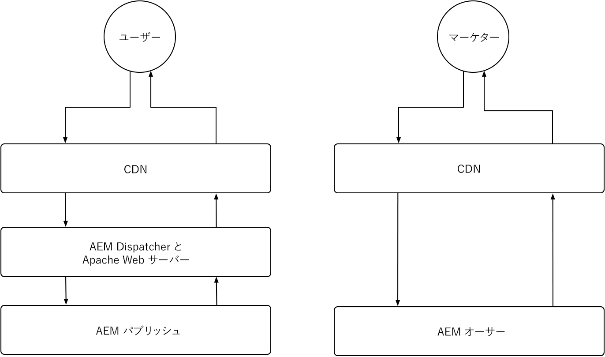
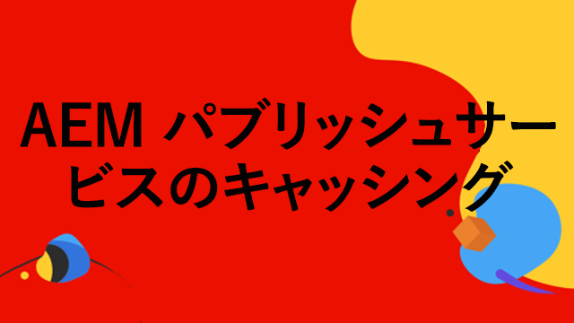
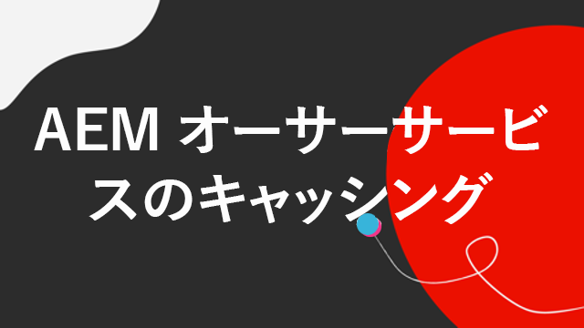

# AEM as a Cloud Service のキャッシュ

AEM as a Cloud Service では、キャッシュの理解が重要です。キャッシュには、システム効率を向上させ、読み込み時間を短縮するために、以前に取得したデータの保存と再利用が含まれます。このメカニズムにより、コンテンツ配信が大幅に高速化され、web サイトのパフォーマンスが向上し、ユーザーエクスペリエンスが最適化されます。

AEM as a Cloud Service には複数のキャッシュレイヤーがあり、オーサーサービスとパブリッシュサービスで異なる戦略があります。

{align="center"}

## AEM のキャッシュ

AEM as a Cloud Service には、CDN、AEM Dispatcher およびオプションで顧客の管理による CDN を含む、堅牢で設定可能なマルチレイヤーキャッシュ戦略があります。レイヤー全体のキャッシュを微調整してパフォーマンスを最適化し、AEM が最高のエクスペリエンスのみを提供できるようにします。AEM では、オーサーサービスとパブリッシュサービスに対してキャッシュの問題が異なります。各サービスのキャッシュ戦略については、以下で詳しく説明します。

    

    

        

          <figure class="image is-16by9">
            
          </figure>
        

        

          

            
<a href="./publish.md" title="AEM パブリッシュサービスのキャッシュ">AEM パブリッシュサービスのキャッシュ</a>

            
AEM パブリッシュサービスは、管理による CDN と AEM Dispatcher を使用して、エンドユーザーの web エクスペリエンスを最適化します。

            <a href="./publish.md" class="spectrum-Button spectrum-Button--outline spectrum-Button--primary spectrum-Button--sizeM">
 学ぶ
 </a>
          

        

      

    

    

        

            

            <figure class="image is-16by9">
                
            </figure>
            

            

            

                
<a href="./author.md" title="AEM オーサーサービスのキャッシュ">AEM オーサーサービスのキャッシュ</a>

                
AEM オーサーサービスは、管理による CDN を使用して、最適化されたオーサリングエクスペリエンスを提供します。

                <a href="./author.md" class="spectrum-Button spectrum-Button--outline spectrum-Button--primary spectrum-Button--sizeM">
 学ぶ
 </a>
            

            

        

    

