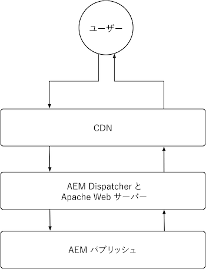
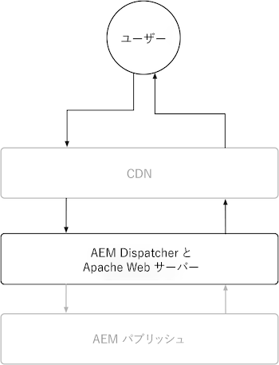

# AEM パブリッシュ

AEM パブリッシュサービスには、AEM as a Cloud Service CDN と AEM Dispatcher という 2 つのプライマリキャッシュレイヤーがあります。オプションで、顧客が管理する CDN を AEM as a Cloud Service CDN の前に配置できます。AEM as a Cloud Service CDN は、コンテンツのエッジ配信を提供し、世界中のユーザーに少ない待ち時間でエクスペリエンスを配信できるようにします。AEM Dispatcher は、AEM パブリッシュの直前にキャッシュを提供し、AEM パブリッシュ自体の不要な読み込みを軽減します。

{align="center"}

## CDN

AEM as a Cloud Service の CDN のキャッシュは、HTTP 応答キャッシュヘッダーによって制御され、コンテンツをキャッシュして、鮮度とパフォーマンスのバランスを最適化することを目的としています。CDN は、エンドユーザーと AEM Dispatcher の間に位置し、可能な限りエンドユーザーに近いコンテンツをキャッシュして、高いパフォーマンスを実現します。

{align="center"}

CDN でのコンテンツのキャッシュ方法の設定は、HTTP 応答でのキャッシュヘッダーの設定に限定されます。これらのキャッシュヘッダーは、通常、`mod_headers` を使用して、AEM Dispatcher のホスト設定で行われますが、AEM パブリッシュ自体で実行されるカスタム Java™ コードで設定することもできます。

### HTTP リクエスト／応答がキャッシュされるタイミング

AEM as a Cloud Service CDN は HTTP 応答のみをキャッシュし、以下の条件をすべて満たす必要があります。

+ HTTP 応答ステータスは `2xx` または `3xx`
+ HTTP リクエストメソッドは `GET` または `HEAD`
+ 次の HTTP 応答ヘッダー（`Cache-Control`、`Surrogate-Control` または `Expires`）の少なくとも 1 つが存在。
+ HTTP 応答には、任意のコンテンツタイプ（HTML、JSON、CSS、JS、バイナリファイルなど）を指定できます。

デフォルトでは、[AEM Dispatcher](#aem-dispatcher) によってキャッシュされない HTTP 応答は、CDN でのキャッシュを避けるために、HTTP 応答キャッシュヘッダーを自動的に削除します。この動作は、必要に応じて `mod_headers` と `Header always set ...` ディレクティブを使用して、オーバーライドできます。

### キャッシュの内容

AEM as a Cloud Service CDN は、以下をキャッシュします。

+ HTTP 応答本文
+ HTTP 応答ヘッダー

通常、単一の URL に対する HTTP リクエスト／応答は、単一のオブジェクトとしてキャッシュされます。ただし、HTTP 応答に `Vary` ヘッダーが設定されている場合、CDN は単一の URL に対して複数のオブジェクトのキャッシュを処理できます。値が厳密に制御されていないヘッダーには `Vary` を指定しないでください。これにより、多くのキャッシュミスが発生し、キャッシュのヒット率が低下する可能性があります。AEM Dispatcher で様々なリクエストのキャッシュをサポートするには、[バリアントキャッシュのドキュメントを確認してください](https://experienceleague.adobe.com/docs/experience-manager-learn/cloud-service/developing/advanced/variant-caching.html?lang=ja)。

### キャッシュの有効期間{#cdn-cache-life}

AEM パブリッシュの CDN は、TTL（有効期間）ベースです。つまり、キャッシュの有効期間は、`Cache-Control`、`Surrogate-Control` または `Expires` の HTTP 応答ヘッダーによって決まります。HTTP 応答キャッシュヘッダーがプロジェクトによって設定されておらず、[実施要件の条件](#when-are-http-requestsresponses-cached)が満たされている場合、アドビはデフォルトのキャッシュの有効期間を 10 分（600 秒）に設定します。

キャッシュヘッダーが CDN キャッシュの有効期間に与える影響を以下に示します。

+ [`Cache-Control`](https://developer.fastly.com/reference/http/http-headers/Cache-Control/) HTTP 応答ヘッダーは、web ブラウザーと CDN に応答をキャッシュする期間を指示します。値は秒単位です。例えば、`Cache-Control: max-age=3600` は、web ブラウザーに応答を 1 時間キャッシュするように指示します。`Surrogate-Control` の HTTP 応答ヘッダーも存在する場合、この値は CDN によって無視されます。
+ [`Surrogate-Control`](https://developer.fastly.com/reference/http/http-headers/Surrogate-Control/) HTTP 応答ヘッダーは、AEM CDN に応答をキャッシュする期間を指示します。値は秒単位です。例えば、`Surrogate-Control: max-age=3600` は、CDN に応答を 1 時間キャッシュするように指示します。
+ [`Expires`](https://developer.fastly.com/reference/http/http-headers/Expires/) HTTP 応答ヘッダーは、AEM CDN（および web ブラウザー）にキャッシュされた応答の有効期間を指示します。値は日付です。例えば、`Expires: Sat, 16 Sept 2023 09:00:00 EST` は、web ブラウザーに応答を指定された日時までキャッシュするように指示します。

キャッシュの有効期間がブラウザーと CDN の両方で同じである場合は、`Cache-Control` を使用してキャッシュの有効期間を制御します。Web ブラウザーが CDN とは異なる期間に応答をキャッシュする必要がある場合は、`Surrogate-Control` を使用します。

#### デフォルトのキャッシュの有効期間

HTTP 応答が[上記の修飾子に従って](#when-are-http-requestsresponses-cached) AEM Dispatcher キャッシュの対象となる場合、カスタム設定が存在しない限り、以下がデフォルト値になります。

| コンテンツタイプ | デフォルトの CDN キャッシュの有効期間 |
|:------------ |:---------- |
| [HTML／JSON／XML](https://experienceleague.adobe.com/docs/experience-manager-cloud-service/content/implementing/content-delivery/caching.html?lang=ja#html-text) | 5 分 |
| [アセット（画像、ビデオ、ドキュメントなど）](https://experienceleague.adobe.com/docs/experience-manager-cloud-service/content/implementing/content-delivery/caching.html?lang=ja#images) | 10 分 |
| [永続クエリ（JSON）](https://experienceleague.adobe.com/docs/experience-manager-cloud-service/content/headless/graphql-api/persisted-queries.html?lang=ja#publish-instances) | 2 時間 |
| [クライアントライブラリ（JS／CSS）](https://experienceleague.adobe.com/docs/experience-manager-cloud-service/content/implementing/content-delivery/caching.html?lang=ja#client-side-libraries) | 30 日 |
| [その他](https://experienceleague.adobe.com/docs/experience-manager-cloud-service/content/implementing/content-delivery/caching.html?lang=ja#other-content) | キャッシュなし |

### キャッシュルールのカスタマイズ方法

[CDN によるコンテンツのキャッシュ方法の設定](https://experienceleague.adobe.com/docs/experience-manager-cloud-service/content/implementing/content-delivery/caching.html?lang=ja#disp)は、HTTP 応答でのキャッシュヘッダーの設定に制限されます。これらのキャッシュヘッダーは通常、`mod_headers` を使用して AEM Dispatcher の `vhost` 設定で設定されますが、AEM パブリッシュ自体で実行されるカスタム Java™ コードで設定することもできます。

## AEM Dispatcher

{align="center"}

### HTTP リクエスト／応答がキャッシュされるタイミング

次の条件がすべて満たされると、対応する HTTP リクエストに対する HTTP 応答がキャッシュされます。

+ HTTP リクエストメソッドが `GET` または `HEAD`
   + `HEAD` の HTTP リクエストは、HTTP 応答ヘッダーのみをキャッシュします。応答本体はありません。
+ HTTP 応答ステータスが `200`
+ HTTP 応答がバイナリファイル用ではない。
+ HTTP リクエスト の URL パスが、拡張子（例：`.html`、`.json`、`.css`、`.js` など）で終わる。
+ HTTP リクエストに認証が含まれておらず、AEM によって認証されない。
   + ただし、認証されたリクエストのキャッシュは、[グローバルに有効にする](https://experienceleague.adobe.com/docs/experience-manager-dispatcher/using/configuring/dispatcher-configuration.html?lang=ja#caching-when-authentication-is-used)ことも、[権限に応じたキャッシュ](https://experienceleague.adobe.com/docs/experience-manager-dispatcher/using/configuring/permissions-cache.html?lang=ja)を通じて選択的に有効にすることもできます。
+ HTTP リクエストにクエリパラメーターが含まれていない。
   + ただし、[無視されたクエリパラメーター](https://experienceleague.adobe.com/docs/experience-manager-dispatcher/using/configuring/dispatcher-configuration.html?lang=ja#ignoring-url-parameters)を設定すると、無視されたクエリパラメーターを含む HTTP リクエストをキャッシュしたり、キャッシュから提供したりできるようになります。
+ HTTP リクエストのパスは、[Dispatcher の許可ルールに一致しますが、拒否ルールには一致しません](https://experienceleague.adobe.com/docs/experience-manager-dispatcher/using/configuring/dispatcher-configuration.html?lang=ja#specifying-the-documents-to-cache)。
+ HTTP 応答には、AEM パブリッシュによって設定された次の HTTP 応答ヘッダーが含まれていません。

   + `no-cache`
   + `no-store`
   + `must-revalidate`

### キャッシュの内容

AEM Dispatcher は、以下をキャッシュします。

+ HTTP 応答本文
+ Dispatcher の[キャッシュヘッダーの設定](https://experienceleague.adobe.com/docs/experience-manager-dispatcher/using/configuring/dispatcher-configuration.html?lang=ja#caching-http-response-headers)で指定された HTTP 応答ヘッダー。[AEM プロジェクトのアーキタイプ](https://github.com/adobe/aem-project-archetype/blob/develop/src/main/archetype/dispatcher.cloud/src/conf.dispatcher.d/available_farms/default.farm#L106-L113)に付属するデフォルト設定を参照してください。
   + `Cache-Control`
   + `Content-Disposition`
   + `Content-Type`
   + `Expires`
   + `Last-Modified`
   + `X-Content-Type-Options`

### キャッシュの有効期間

AEM Dispatcher は、次の方法を使用して HTTP 応答をキャッシュします。

+ コンテンツの公開または非公開などのメカニズムを通じて無効化がトリガーされるまで。
+ 明示的に [Dispatcher 設定で設定](https://experienceleague.adobe.com/docs/experience-manager-dispatcher/using/configuring/dispatcher-configuration.html?lang=ja#configuring-time-based-cache-invalidation-enablettl)されている場合の TTL（有効期間）。`enableTTL` の設定を確認して、[AEM プロジェクトアーキタイプ](https://github.com/adobe/aem-project-archetype/blob/develop/src/main/archetype/dispatcher.cloud/src/conf.dispatcher.d/available_farms/default.farm#L122-L127)のデフォルト設定を参照してください。

#### デフォルトのキャッシュの有効期間

HTTP 応答が[上記の修飾子に従って](#when-are-http-requestsresponses-cached-1) AEM Dispatcher キャッシュの対象となる場合、カスタム設定が存在しない限り、以下がデフォルト値になります。

| コンテンツタイプ | デフォルトの CDN キャッシュの有効期間 |
|:------------ |:---------- |
| [HTML／JSON／XML](https://experienceleague.adobe.com/docs/experience-manager-cloud-service/content/implementing/content-delivery/caching.html?lang=ja#html-text) | 無効化まで |
| [アセット（画像、ビデオ、ドキュメントなど）](https://experienceleague.adobe.com/docs/experience-manager-cloud-service/content/implementing/content-delivery/caching.html?lang=ja#images) | なし |
| [永続クエリ（JSON）](https://experienceleague.adobe.com/docs/experience-manager-cloud-service/content/headless/graphql-api/persisted-queries.html?lang=ja#publish-instances) | 1 分 |
| [クライアントライブラリ（JS／CSS）](https://experienceleague.adobe.com/docs/experience-manager-cloud-service/content/implementing/content-delivery/caching.html?lang=ja#client-side-libraries) | 30 日 |
| [その他](https://experienceleague.adobe.com/docs/experience-manager-cloud-service/content/implementing/content-delivery/caching.html?lang=ja#other-content) | 無効化まで |

### キャッシュルールのカスタマイズ方法

AEM Dispatcher のキャッシュは、以下を含む [Dispatcher 設定](https://experienceleague.adobe.com/docs/experience-manager-dispatcher/using/configuring/dispatcher-configuration.html?lang=ja#configuring-the-dispatcher-cache-cache)を通じて設定できます。

+ キャッシュの内容
+ 公開／非公開でキャッシュが無効化される部分
+ キャッシュの評価時に無視される HTTP リクエストのクエリパラメーター
+ キャッシュされる HTTP 応答ヘッダー
+ TTL キャッシュの有効化または無効化
+ その他

`mod_headers` を使用してキャッシュヘッダーを設定すると、`vhost` 設定は Dispatcher のキャッシュ（TTL ベース）に影響しません。これらは、AEM Dispatcher が応答を処理した後に HTTP 応答に追加されるからです。HTTP 応答ヘッダーを通じて Dispatcher のキャッシュに影響を与えるには、適切な HTTP 応答ヘッダーを設定する AEM パブリッシュで実行されるカスタム Java™ コードが必要です。
