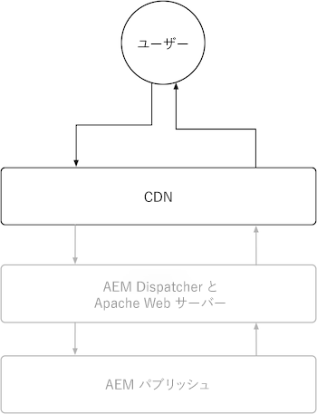

# AEM パブリッシュ

AEMパブリッシュサービスには、AEMas a Cloud Serviceの CDN とAEM Dispatcher という 2 つのプライマリキャッシュレイヤーがあります。 オプションで、顧客が管理する CDN をAEMas a Cloud ServiceCDN の前に配置できます。 AEMas a Cloud Serviceの CDN は、コンテンツのエッジ配信を提供し、エクスペリエンスを世界中のユーザーに対して待ち時間が短く配信できるようにします。 AEM Dispatcher は、AEM Publish の直前にキャッシュを提供し、AEM Publish 自体の不要な読み込みを軽減するために使用されます。

{align="center"}

## CDN

AEMas a Cloud Serviceの CDN のキャッシュは、HTTP 応答キャッシュヘッダーによって制御され、コンテンツをキャッシュしてフレッシュネスとパフォーマンスのバランスを最適化することを目的としています。 CDN は、エンドユーザーとAEM Dispatcher の間に位置し、可能な限りエンドユーザーに近いコンテンツをキャッシュして、パフォーマンスを高めます。

{align="center"}

CDN でのコンテンツのキャッシュ方法の設定は、HTTP 応答でのキャッシュヘッダーの設定に制限されます。 これらのキャッシュヘッダーは、通常、AEM Dispatcher のホスト設定で、 `mod_headers`に設定することもできますが、AEM Publish 自体で実行されるカスタム Java™コードで設定することもできます。

### HTTP リクエスト/応答は、いつキャッシュされますか？

AEMas a Cloud Serviceの CDN キャッシュは HTTP 応答のみをキャッシュし、以下の条件をすべて満たす必要があります。

+ HTTP リクエストのステータスは `2xx` または `3xx`
+ HTTP リクエストメソッド： `GET` または `HEAD`
+ 次の HTTP 応答ヘッダーの少なくとも 1 つが存在します。 `Cache-Control`, `Surrogate-Control`または  `Expires`
+ HTTP 応答には、HTML、JSON、CSS、JS、バイナリファイルなど、任意のコンテンツタイプを指定できます。

デフォルトでは、HTTP 応答は次のユーザーによってキャッシュされません。 [AEM Dispatcher](#aem-dispatcher) CDN でのキャッシュを避けるために、は自動的に HTTP 応答キャッシュヘッダーを削除します。 この動作は、 `mod_headers` と `Header always set ...` ディレクティブが必要な場合に使用します。

### キャッシュの内容

AEMas a Cloud ServiceCDN は、以下をキャッシュします。

+ HTTP 応答本文
+ HTTP 応答ヘッダー

通常、単一の URL に対する HTTP リクエスト/応答は、単一のオブジェクトとしてキャッシュされます。 ただし、CDN は、1 つの URL に対して複数のオブジェクトをキャッシュする処理を実行できます ( `Vary` ヘッダーは HTTP 応答に設定されます。 次を指定しないでください。 `Vary` 値が厳密に制御された値のセットを持たないヘッダーの場合は、多くのキャッシュミスが発生し、キャッシュのヒット率が低下する可能性があります。 AEM Dispatcher で様々な要求のキャッシュをサポートするには、以下を実行します。 [バリアントキャッシュに関するドキュメントを確認する](https://experienceleague.adobe.com/docs/experience-manager-learn/cloud-service/developing/advanced/variant-caching.html).

### キャッシュの有効期間{#cdn-cache-life}

AEM公開 CDN は TTL（有効期間）ベースです。つまり、キャッシュの有効期間は `Cache-Control`, `Surrogate-Control`または `Expires` HTTP 応答ヘッダー。 HTTP 応答キャッシュヘッダーがプロジェクトで設定されていない場合、および [実施要件基準](#when-are-http-requestsresponses-cached) が満たされた場合、Adobeはデフォルトのキャッシュ有効期間を 10 分（600 秒）に設定します。

キャッシュヘッダーが CDN キャッシュの有効期間に与える影響を次に示します。

+ [`Cache-Control`](https://developer.fastly.com/reference/http/http-headers/Cache-Control/) HTTP 応答ヘッダーは、Web ブラウザーと CDN に対し、応答をキャッシュする時間を指示します。 値は秒単位です。 例： `Cache-Control: max-age=3600` Web ブラウザーに対し、1 時間の応答をキャッシュするよう指示します。 この値は CDN では無視されます。 `Surrogate-Control` HTTP 応答ヘッダーも存在します。
+ [`Surrogate-Control`](https://developer.fastly.com/reference/http/http-headers/Surrogate-Control/) HTTP 応答ヘッダーは、AEM CDN に応答をキャッシュする時間を指示します。 値は秒単位です。 例： `Surrogate-Control: max-age=3600` は、CDN に対し、1 時間の応答をキャッシュするよう伝えます。
+ [`Expires`](https://developer.fastly.com/reference/http/http-headers/Expires/) HTTP 応答ヘッダーは、キャッシュされた応答が有効である期間をAEM CDN（および Web ブラウザー）に指示します。 値は日付です。 例： `Expires: Sat, 16 Sept 2023 09:00:00 EST` 指定された日時まで応答をキャッシュするよう Web ブラウザーに指示します。

用途 `Cache-Control` を使用して、ブラウザーと CDN の両方で同じ場合にキャッシュの有効期間を制御します。 用途 `Surrogate-Control` CDN とは異なる期間、Web ブラウザーが応答をキャッシュする場合。

#### デフォルトのキャッシュ有効期間

HTTP 応答がAEM Dispatcher のキャッシュに該当する場合 [上記の修飾子ごと](#when-are-http-requestsresponses-cached)に設定する場合、カスタム設定が存在しない限り、次の値がデフォルト値になります。

| コンテンツタイプ | デフォルトの CDN キャッシュの有効期間 |
|:------------ |:---------- |
| [HTML/JSON/XML](https://experienceleague.adobe.com/docs/experience-manager-cloud-service/content/implementing/content-delivery/caching.html#html-text) | 5 分 |
| [アセット（画像、ビデオ、ドキュメントなど）](https://experienceleague.adobe.com/docs/experience-manager-cloud-service/content/implementing/content-delivery/caching.html#images) | 10 分 |
| [永続クエリ (JSON)](https://experienceleague.adobe.com/docs/experience-manager-cloud-service/content/headless/graphql-api/persisted-queries.html?publish-instances) | 2 時間 |
| [クライアントライブラリ (JS/CSS)](https://experienceleague.adobe.com/docs/experience-manager-cloud-service/content/implementing/content-delivery/caching.html#client-side-libraries) | 30 日 |
| [その他](https://experienceleague.adobe.com/docs/experience-manager-cloud-service/content/implementing/content-delivery/caching.html#other-content) | キャッシュされていません |

### キャッシュルールのカスタマイズ方法

[CDN によるコンテンツのキャッシュ方法の設定](https://experienceleague.adobe.com/docs/experience-manager-cloud-service/content/implementing/content-delivery/caching.html#disp) は、HTTP 応答でのキャッシュヘッダーの設定に制限されています。 これらのキャッシュヘッダーは、通常、AEM Dispatcher で設定されます `vhost` 使用する設定 `mod_headers`に設定することもできますが、AEM Publish 自体で実行されるカスタム Java™コードで設定することもできます。

## AEM Dispatcher

{align="center"}

### HTTP リクエスト/応答は、いつキャッシュされますか？

次の条件がすべて満たされると、対応する HTTP 要求の HTTP 応答がキャッシュされます。

+ HTTP リクエストメソッド： `GET` または `HEAD`
   + `HEAD` HTTP リクエストは、HTTP 応答ヘッダーのみをキャッシュします。 応答体はありません。
+ HTTP 応答のステータスは `200`
+ バイナリファイルに対する HTTP 応答ではありません。
+ HTTP リクエスト URL パスは、次のように拡張子で終わります。 `.html`, `.json`, `.css`, `.js`など
+ HTTP リクエストには認証が含まれていないので、AEMによって認証されません。
   + ただし、認証済みリクエストのキャッシュ [はグローバルに有効にできます](https://experienceleague.adobe.com/docs/experience-manager-dispatcher/using/configuring/dispatcher-configuration.html#caching-when-authentication-is-used) または、選択的に [権限に影響を受けるキャッシュ](https://experienceleague.adobe.com/docs/experience-manager-dispatcher/using/configuring/permissions-cache.html?lang=ja).
+ HTTP リクエストにクエリーパラメーターが含まれていません。
   + ただし、 [無視されたクエリパラメーター](https://experienceleague.adobe.com/docs/experience-manager-dispatcher/using/configuring/dispatcher-configuration.html?lang=ja#ignoring-url-parameters) 無視されたクエリパラメーターを持つ HTTP 要求をキャッシュしたり、キャッシュから提供したりできます。
+ HTTP リクエストのパス [は Dispatcher の許可ルールと一致し、拒否ルールと一致しない](https://experienceleague.adobe.com/docs/experience-manager-dispatcher/using/configuring/dispatcher-configuration.html?lang=ja#specifying-the-documents-to-cache).
+ HTTP 応答には、次の HTTP 応答ヘッダーはAEM Publish によって設定されていません。

   + `no-cache`
   + `no-store`
   + `must-revalidate`

### キャッシュの内容

AEM Dispatcher は以下をキャッシュします。

+ HTTP 応答本文
+ Dispatcher の [キャッシュヘッダーの設定](https://experienceleague.adobe.com/docs/experience-manager-dispatcher/using/configuring/dispatcher-configuration.html#caching-http-response-headers). に付属するデフォルトの設定の確認 [AEM Project Archetype](https://github.com/adobe/aem-project-archetype/blob/develop/src/main/archetype/dispatcher.cloud/src/conf.dispatcher.d/available_farms/default.farm#L106-L113).
   + `Cache-Control`
   + `Content-Disposition`
   + `Content-Type`
   + `Expires`
   + `Last-Modified`
   + `X-Content-Type-Options`

### キャッシュの有効期間

AEM Dispatcher は、次の方法を使用して HTTP 応答をキャッシュします。

+ コンテンツの公開または非公開などのメカニズムによって無効化がトリガーされるまで。
+ TTL (time-to-live)（明示的な場合） [Dispatcher 設定で設定](https://experienceleague.adobe.com/docs/experience-manager-dispatcher/using/configuring/dispatcher-configuration.html?lang=ja#configuring-time-based-cache-invalidation-enablettl). デフォルトの設定については、 [AEM Project Archetype](https://github.com/adobe/aem-project-archetype/blob/develop/src/main/archetype/dispatcher.cloud/src/conf.dispatcher.d/available_farms/default.farm#L122-L127) 次を見て、 `enableTTL` 設定。

#### デフォルトのキャッシュ有効期間

HTTP 応答がAEM Dispatcher のキャッシュに該当する場合 [上記の修飾子ごと](#when-are-http-requestsresponses-cached-1)に設定する場合、カスタム設定が存在しない限り、次の値がデフォルト値になります。

| コンテンツタイプ | デフォルトの CDN キャッシュの有効期間 |
|:------------ |:---------- |
| [HTML/JSON/XML](https://experienceleague.adobe.com/docs/experience-manager-cloud-service/content/implementing/content-delivery/caching.html#html-text) | 無効化まで |
| [アセット（画像、ビデオ、ドキュメントなど）](https://experienceleague.adobe.com/docs/experience-manager-cloud-service/content/implementing/content-delivery/caching.html#images) | なし |
| [永続クエリ (JSON)](https://experienceleague.adobe.com/docs/experience-manager-cloud-service/content/headless/graphql-api/persisted-queries.html?publish-instances) | 1 分 |
| [クライアントライブラリ (JS/CSS)](https://experienceleague.adobe.com/docs/experience-manager-cloud-service/content/implementing/content-delivery/caching.html#client-side-libraries) | 30 日 |
| [その他](https://experienceleague.adobe.com/docs/experience-manager-cloud-service/content/implementing/content-delivery/caching.html#other-content) | 無効化まで |

### キャッシュルールのカスタマイズ方法

AEM Dispatcher のキャッシュは、 [Dispatcher の設定](https://experienceleague.adobe.com/docs/experience-manager-dispatcher/using/configuring/dispatcher-configuration.html?lang=ja#configuring-the-dispatcher-cache-cache) 次を含む：

+ キャッシュ内容
+ 公開/非公開でキャッシュのどの部分が無効化されるか
+ キャッシュの評価時に無視される HTTP リクエストクエリーパラメーター
+ キャッシュされる HTTP 応答ヘッダー
+ TTL キャッシュの有効化または無効化
+ ...その他

使用 `mod_headers` キャッシュヘッダーを設定するには `vhost` 設定は、AEM Dispatcher が応答を処理した後に HTTP 応答に追加されるので、Dispatcher キャッシュ（TTL ベース）には影響しません。 HTTP 応答ヘッダーを介した Dispatcher のキャッシュに影響を与えるには、適切な HTTP 応答ヘッダーを設定するAEM Publish で実行するカスタム Java™コードが必要です。
