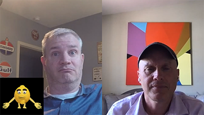

# クラウド 5

>[!VIDEO](https://video.tv.adobe.com/v/343127)

## はじめに

AEM Engineering の Cloud 5 シリーズ第 2 シーズンへようこそ。 製品の実装段階での主な問題の 1 つは、十分なコードサンプルや、これらのサンプル、ツールまたは API の実際のデモンストレーションがあることです。 このシリーズの目的は、AEMに関する有用な情報を 5 分以内に提供することです。

## 修正候補ボックス

次にアクセス： [修正候補ボックス](https://forms.office.com/r/74P5Xz4UH0) トピックのアイデアを送信する場合。

## シーズン 2

各シーズンの長さは異なり、一定のスケジュールでリリースされます。 シーズン 2 のトピックは、主に、お客様やパートナーとの日常的な取り組みで発生した過去のリクエストに基づいています。 毎週の更新情報についてはこのページを参照するか、選択したソーシャルネットワークでフォローしてください。

<table>
    <tr>
        <td>
            
            

                <a href="season-2/cloud5-experience-v-content-fragments.md"><strong>フラグメント</strong></a>        
                 <em>Darin Kuntze &amp; James Talbot 氏（シニアクラウドアーキテクト）</em>
            

            

                 
                エクスペリエンスとコンテンツフラグメントの違いに対するカラフルな取り組み。 スポイラー：みんな勝つ。
            

        </td>   
         <td>
            
            

                <a href="season-2/cloud5-repo-modernizer.md"><strong>Repository Modernizer</strong></a> 
                <em>Darin Kuntze &amp; James Talbot 氏（シニアクラウドアーキテクト）</em>
            

            

                 
                repository modenizer を使用して、既存のプロジェクトパッケージをAEM as a cloud service と互換性のある個別のパッケージに再構築する方法を簡単に説明します。
            

         </td>
         <td>
            
            

                  <a href="season-2/cloud5-admin-console.md"><strong>Admin Console</strong></a>
                <em>Darin Kuntze &amp; James Talbot 氏（シニアクラウドアーキテクト）</em>
            

            

             
               Darin と James は、管理コンソール、プロビジョニング、アクセスについて知っておくべき一般的なことについて話し合っています。
            

         </td> 
  </tr>
  <tr>
         <td>
            
            

                  <a href="season-2/cloud5-sling-job-scheduler.md"><strong>Sling ジョブ</strong></a>
                <em>Darin Kuntze &amp; James Talbot 氏（シニアクラウドアーキテクト）</em>
            

            

             
               Darin と James は、AEM as a Cloud Service でのジョブスケジューリングと消費に注意すべき潜在的な問題と事項について話し合います。
            

         </td> 
         <td>
            
            

                  <a href="season-2/cloud5-repoinit.md"><strong>Sling Repository Initializer</strong></a>
                <em>Darin Kuntze &amp; James Talbot 氏（シニアクラウドアーキテクト）</em>
            

            

             
              Sling Repository Initializer（別名 repoinit）を使用することのできる方法をいくつか説明します。
            

         </td>   
     <td>
            
      

         <a href="season-2/cloud5-fix-your-cache.md"><strong>修正…キャッシュ</strong></a>
          <em>Damian Langsweirdt &amp; James Talbot 氏（シニアクラウドアーキテクト）</em>
      

      

          
             AEM as a Cloud Service上で実行するサイトのキャッシュを最適化し、スピードアップする領域を検討します。
      

   </td> 
  </tr>
<tr>
   <td>
            
      

            <strong>修正…書き換え</strong>
          <em>Darin Kuntze &amp; James Talbot 氏（シニアクラウドアーキテクト）</em>
      

      

         
         2022 年 7 月 23 日
      

     </td>   
     <td>
            
      

            <strong>Cloud Manager の謎（英語）...エクスペリエンス監査</strong>
          <em>Darin Kuntze &amp; James Talbot 氏（シニアクラウドアーキテクト）</em>
      

      

         
        2022 年 7 月 30 日
      

   </td>
     <td>
            
      

            <strong>Cloud Manager の謎（英語）...単体テスト</strong>
          <em>Darin Kuntze &amp; Bryan Stopp 氏（シニアクラウドアーキテクト）</em>
      

      

         
         2022 年 8 月 5 日
      

   </td> 
  </tr>
    <tr>
        <td>
                
            

                <strong>Cloud Manager の謎（英語）...機能テスト</strong>         
                <em>Darin Kuntze &amp; Bryan Stopp 氏（シニアクラウドアーキテクト）</em>
            

            
 
                2022 年 8 月 12 日
            

        </td>
        <td></td>
        <td></td>
    </tr>
</table>
