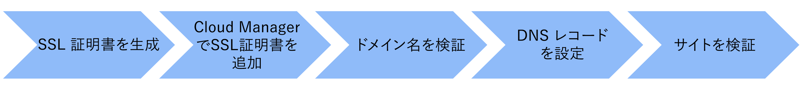

# カスタムドメイン名を追加

AEMas a Cloud Serviceの Web サイトにカスタムドメイン名を追加する方法を説明します。

このチュートリアルでは、サンプルのブランディング [AEM WKND](https://github.com/adobe/aem-guides-wknd) HTTPS アドレス可能なカスタムドメイン名を追加することで、サイトが拡張されます。 `wknd.enablementadobe.com` Transport Layer Security (TLS) を使用して、

>[!VIDEO](https://video.tv.adobe.com/v/3427817?quality=12&learn=on)

大まかな手順は次のとおりです。

{width="800" zoomable="yes"}

## 前提条件

- [OpenSSL](https://www.openssl.org/) および [掘り下げる](https://www.isc.org/blogs/dns-checker/) がローカルマシンにインストールされている。
- サードパーティのサービスへのアクセス：
   - 認証局 (CA) — サイトドメインに対して署名済みの証明書を要求する場合（例： ）。 [DigitCert](https://www.digicert.com/)
   - Domain Name System(DNS) ホスティングサービス：Azure DNS やAWS Route 53 など、カスタムドメインに DNS レコードを追加します。
- アクセス先 [AdobeCloud Manager](https://my.cloudmanager.adobe.com/) ビジネスオーナーまたはデプロイメントマネージャーの役割として。
- サンプル [AEM WKND](https://github.com/adobe/aem-guides-wknd) サイトがの AEMCS 環境にデプロイされる [生産計画](https://experienceleague.adobe.com/docs/experience-manager-cloud-service/content/implementing/using-cloud-manager/programs/introduction-production-programs.html?lang=ja) タイプ。

サードパーティのサービスにアクセスできない場合は、 _セキュリティまたはホスティングチームと協力して手順を完了する_.

## SSL 証明書を生成

以下の 2 つのオプションがあります。

- 使用 `openssl` コマンドラインツール — サイトドメインの秘密鍵と証明書署名要求 (CSR) を生成できます。 署名済み証明書を要求するには、CSR を認証局 (CA) に送信します。

- ホスティングチームが、サイトに必要な秘密鍵と署名済み証明書を提供します。

最初のオプションの手順を確認します。

秘密鍵と CSR を生成するには、次のコマンドを実行し、プロンプトが表示されたら必要な情報を指定します。

```bash
# Generate a private key and a CSR
$ openssl req -newkey rsa:2048 -keyout <YOUR-SITE-NAME>.key -out <YOUR-SITE-NAME>.csr -nodes
```

署名済み証明書を要求するには、ドキュメントに従って、生成された CSR を CA に提供します。 CA が CSR に署名すると、署名済み証明書ファイルを受け取ります。

### 署名済み証明書を確認

Cloud Manager に証明書を追加する前に署名済みの証明書を確認することをお勧めします。 次のコマンドを使用して、証明書の詳細を確認できます。

```bash
# Review the certificate details
$ openssl crl2pkcs7 -nocrl -certfile <YOUR-SIGNED-CERT>.crt | openssl pkcs7 -print_certs -noout
```

署名済みの証明書には、証明書チェーンが含まれている場合があります。この証明書チェーンには、ルート証明書と中間証明書、およびエンドエンティティ証明書が含まれています。

AdobeCloud Manager がエンドエンティティ証明書と証明書チェーンを受け入れる _別のフォームフィールドで_&#x200B;に含める必要があるので、署名済み証明書からエンドエンティティ証明書と証明書チェーンを抽出する必要があります。

このチュートリアルでは、 [DigitCert](https://www.digicert.com/) ～に対して発行された署名済み証明書 `*.enablementadobe.com` 例として、ドメインが使用されています。 エンドエンティティと証明書チェーンは、署名済みの証明書をテキストエディターで開き、 `-----BEGIN CERTIFICATE-----` および `-----END CERTIFICATE-----` マーカー。

## Cloud Manager での SSL 証明書の追加

Cloud Manager で SSL 証明書を追加するには、 [SSL 証明書を追加](https://experienceleague.adobe.com/docs/experience-manager-cloud-service/content/implementing/using-cloud-manager/manage-ssl-certificates/add-ssl-certificate.html) ドキュメント。

## ドメイン名の検証

ドメイン名を検証するには、次の手順に従います。

- Cloud Manager でドメイン名を追加するには、次の手順に従います。 [カスタムドメイン名を追加](https://experienceleague.adobe.com/docs/experience-manager-cloud-service/content/implementing/using-cloud-manager/custom-domain-names/add-custom-domain-name.html) ドキュメント。
- AEM固有の追加 [TXT レコード](https://experienceleague.adobe.com/docs/experience-manager-cloud-service/content/implementing/using-cloud-manager/custom-domain-names/add-text-record.html) を設定します。
- 上記の手順を確認するには、 `dig` コマンドを使用します。

```bash
# General syntax, the `_aemverification` is prefix provided by Adobe
$ dig _aemverification.[YOUR-DOMAIN-NAME] -t txt

# This tutorial specific example, as the subdomain `wknd.enablementadobe.com` is used
$ dig _aemverification.wknd.enablementadobe.com -t txt
```

成功した応答の例は次のようになります。

```bash
; <<>> DiG 9.10.6 <<>> _aemverification.wknd.enablementadobe.com -t txt
;; global options: +cmd
;; Got answer:
;; ->>HEADER<<- opcode: QUERY, status: NOERROR, id: 8636
;; flags: qr rd ra; QUERY: 1, ANSWER: 1, AUTHORITY: 0, ADDITIONAL: 1

;; OPT PSEUDOSECTION:
; EDNS: version: 0, flags:; udp: 1220
;; QUESTION SECTION:
;_aemverification.wknd.enablementadobe.com. IN TXT

;; ANSWER SECTION:
_aemverification.wknd.enablementadobe.com. 3600    IN TXT "adobe-aem-verification=wknd.enablementadobe.com/105881/991000/bef0e843-9280-4385-9984-357ed9a4217b"

;; Query time: 81 msec
;; SERVER: 153.32.14.247#53(153.32.14.247)
;; WHEN: Tue Mar 12 15:54:25 EDT 2024
;; MSG SIZE  rcvd: 181
```

このチュートリアルでは、Azure DNS を例として使用します。 TXT レコードを追加するには、DNS ホスティングサービスのドキュメントに従う必要があります。

以下を確認します。 [ドメイン名のステータスの確認](https://experienceleague.adobe.com/docs/experience-manager-cloud-service/content/implementing/using-cloud-manager/custom-domain-names/check-domain-name-status.html) ドキュメント（問題がある場合）。

## DNS レコードを設定

カスタムドメインの DNS レコードを設定するには、次の手順に従います。

- ルートドメイン (APEX) やサブドメイン (CNAME) などのドメインタイプに基づいて DNS レコードタイプ（CNAME または APEX）を決定し、 [DNS 設定の構成](https://experienceleague.adobe.com/docs/experience-manager-cloud-service/content/implementing/using-cloud-manager/custom-domain-names/configure-dns-settings.html) ドキュメント。
- DNS ホスティングサービスに DNS レコードを追加します。
- 次の手順に従って、DNS レコードの検証をトリガーします。 [DNS レコードのステータスの確認](https://experienceleague.adobe.com/docs/experience-manager-cloud-service/content/implementing/using-cloud-manager/custom-domain-names/check-dns-record-status.html) ドキュメント。

このチュートリアルでは、 **サブドメイン** `wknd.enablementadobe.com` が使用される場合、 `cdn.adobeaemcloud.com` が追加されます。

ただし、 **ルートドメイン**&#x200B;を使用する場合は、Adobeが提供する特定の IP アドレスを指す APEX レコードタイプ（A、ALIAS、ANAME など）を追加する必要があります。

## サイトの検証

カスタムドメイン名を使用してサイトにアクセスできることを確認するには、Web ブラウザーを開き、カスタムドメイン URL に移動します。 サイトがアクセス可能であり、ブラウザーに南京錠アイコンとの安全な接続が表示されていることを確認します。


