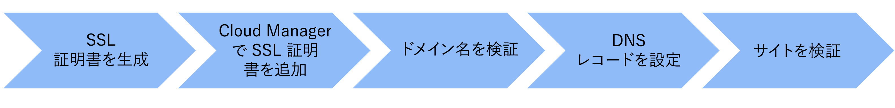

# Adobe CDN を使用したカスタムドメイン名

Adobe コンテンツ配信ネットワーク（CDN）を使用する AEM as a Cloud Service web サイトに、カスタムドメイン名を実装する方法について説明します。

このチュートリアルでは、Transport Layer Security（TLS）を使用して HTTPS アドレス可能なカスタムドメイン名 `wknd.enablementadobe.com` を追加して、サンプル [AEM WKND](https://github.com/adobe/aem-guides-wknd) サイトのブランディングを強化します。

>[!VIDEO](https://video.tv.adobe.com/v/3427903?quality=12&learn=on)

大まかな手順は次のとおりです。

{width="800" zoomable="yes"}

## 前提条件

>[!VIDEO](https://video.tv.adobe.com/v/3427909?quality=12&learn=on)

- [OpenSSL](https://www.openssl.org/) と [dig](https://www.isc.org/blogs/dns-checker/) が、ローカルマシンにインストールされている。
- 次のサードパーティのサービスへのアクセス権が付与されている。
   - 認証局（CA）- [DigitCert](https://www.digicert.com/) などのサイトドメインンに対して署名付き証明書をリクエストする場合
   - ドメイン名システム（DNS）ホスティングサービス - Azure DNS や AWS Route 53 などのカスタムドメインに対して DNS レコードを追加する場合。
- **ビジネスオーナー**&#x200B;または&#x200B;**デプロイメントマネージャー**&#x200B;の役割として [Adobe Cloud Manager](https://my.cloudmanager.adobe.com/) へのアクセス権が付与されている。
- サンプル [AEM WKND](https://github.com/adobe/aem-guides-wknd) サイトが、[実稼動プログラム](https://experienceleague.adobe.com/ja/docs/experience-manager-cloud-service/content/implementing/using-cloud-manager/programs/introduction-production-programs)タイプの AEM as a Cloud Service 環境にデプロイされている。

サードパーティのサービスへのアクセス権が付与されていない場合は、_セキュリティチームまたはホスティングチームと共同作業して手順を完了します_。

## SSL 証明書の生成

>[!VIDEO](https://video.tv.adobe.com/v/3427908?quality=12&learn=on)

以下 2 つのオプションがあります。

1. `openssl` コマンドラインツールを使用して、サイトドメインの秘密鍵と証明書署名要求（CSR）を生成します。署名付き証明書をリクエストするには、CSR を認証局（CA）に送信します。
1. ホスティングチームは、サイトに必要な秘密鍵と署名付き証明書を提供します。

最初のオプションの手順を確認してみましょう。

秘密鍵と CSR を生成するには、次のコマンドを実行し、プロンプトが表示されたら必要な情報を入力します。

```bash
# Generate a private key and a CSR
$ openssl req -newkey rsa:2048 -keyout <YOUR-SITE-NAME>.key -out <YOUR-SITE-NAME>.csr -nodes
```

署名付き証明書をリクエストするには、CA のドキュメントに従って、生成した CSR を CA に提供します。CA が CSR に署名すると、署名付き証明書ファイルを受け取ることができます。

### 署名付き証明書の確認

署名付き証明書を Cloud Manager に追加する前に確認します。次のコマンドを使用して証明書の詳細を確認します。

```bash
# Review the certificate details
$ openssl crl2pkcs7 -nocrl -certfile <YOUR-SIGNED-CERT>.crt | openssl pkcs7 -print_certs -noout
```

署名付き証明書には、ルート証明書および中間証明書と、エンドエンティティ証明書を含む証明書チェーンが含まれる場合があります。

Adobe Cloud Manager では、エンドエンティティ証明書と証明書チェーンを&#x200B;_別のフォームフィールドで_&#x200B;受け入れるので、署名付き証明書からエンドエンティティ証明書と証明書チェーンを抽出する必要があります。

このチュートリアルでは、`*.enablementadobe.com` ドメインに対して発行された [DigitCert](https://www.digicert.com/) 署名付き証明書が例として使用されます。エンドエンティティと証明書チェーンは、署名付き証明書をテキストエディターで開き、`-----BEGIN CERTIFICATE-----` マーカーと `-----END CERTIFICATE-----` マーカーの間の内容をコピーすれば抽出されます。

## Cloud Manager での SSL 証明書の追加

>[!VIDEO](https://video.tv.adobe.com/v/3427906?quality=12&learn=on)

Cloud Manager で SSL 証明書を追加するには、[SSL 証明書の追加](https://experienceleague.adobe.com/ja/docs/experience-manager-cloud-service/content/implementing/using-cloud-manager/manage-ssl-certificates/add-ssl-certificate)ドキュメントに従ってください。

## ドメイン名の検証

>[!VIDEO](https://video.tv.adobe.com/v/3427905?quality=12&learn=on)

ドメイン名を検証するには、次の手順に従います。

- [カスタムドメイン名の追加](https://experienceleague.adobe.com/ja/docs/experience-manager-cloud-service/content/implementing/using-cloud-manager/custom-domain-names/add-custom-domain-name)ドキュメントに従って、Cloud Manager にドメイン名を追加します。
- DNS ホスティングサービスに AEM 固有の [TXT レコード](https://experienceleague.adobe.com/ja/docs/experience-manager-cloud-service/content/implementing/using-cloud-manager/custom-domain-names/add-text-record)を追加します。
- `dig` コマンドを使用して DNS サーバーにクエリを実行し、上記の手順を確認します。

```bash
# General syntax, the `_aemverification` is prefix provided by Adobe
$ dig _aemverification.[YOUR-DOMAIN-NAME] -t txt

# This tutorial specific example, as the subdomain `wknd.enablementadobe.com` is used
$ dig _aemverification.wknd.enablementadobe.com -t txt
```

成功した応答のサンプルは次のようになります。

```bash
; <<>> DiG 9.10.6 <<>> _aemverification.wknd.enablementadobe.com -t txt
;; global options: +cmd
;; Got answer:
;; ->>HEADER<<- opcode: QUERY, status: NOERROR, id: 8636
;; flags: qr rd ra; QUERY: 1, ANSWER: 1, AUTHORITY: 0, ADDITIONAL: 1

;; OPT PSEUDOSECTION:
; EDNS: version: 0, flags:; udp: 1220
;; QUESTION SECTION:
;_aemverification.wknd.enablementadobe.com. IN TXT

;; ANSWER SECTION:
_aemverification.wknd.enablementadobe.com. 3600    IN TXT "adobe-aem-verification=wknd.enablementadobe.com/105881/991000/bef0e843-9280-4385-9984-357ed9a4217b"

;; Query time: 81 msec
;; SERVER: 153.32.14.247#53(153.32.14.247)
;; WHEN: Tue Mar 12 15:54:25 EDT 2024
;; MSG SIZE  rcvd: 181
```

ここのチュートリアルでは、Azure DNS を使用しますが、任意の DNS プロバイダーを使用できます。TXT レコードを追加するには、DNS ホスティングサービスのドキュメントに従う必要があります。

問題がある場合は、[ドメイン名のステータスの確認](https://experienceleague.adobe.com/ja/docs/experience-manager-cloud-service/content/implementing/using-cloud-manager/custom-domain-names/check-domain-name-status)ドキュメントを確認します。

## DNS レコードの設定

>[!VIDEO](https://video.tv.adobe.com/v/3427907?quality=12&learn=on)

カスタムドメインの DNS レコードを設定するには、次の手順に従います。

1. ルートドメイン（APEX）やサブドメイン（CNAME）などのドメインタイプに基づいて DNS レコードタイプ（CNAME または APEX）を決定し、[DNS 設定の指定](https://experienceleague.adobe.com/ja/docs/experience-manager-cloud-service/content/implementing/using-cloud-manager/custom-domain-names/configure-dns-settings)ドキュメントに従います。
1. DNS ホスティングサービスに DNS レコードを追加します。
1. [DNS レコードのステータスの確認](https://experienceleague.adobe.com/ja/docs/experience-manager-cloud-service/content/implementing/using-cloud-manager/custom-domain-names/check-dns-record-status)ドキュメントに従って、DNS レコードの検証をトリガーします。

このチュートリアルでは、**サブドメイン** `wknd.enablementadobe.com` を使用しているので、`cdn.adobeaemcloud.com` を指す CNAME レコードタイプが追加されます。

ただし、**ルートドメイン**&#x200B;を使用している場合は、アドビが提供する特定の IP アドレスを指す APEX レコードタイプ（別名 A、ALIAS、または ANAME）を追加する必要があります。

## サイトの検証

>[!VIDEO](https://video.tv.adobe.com/v/3427904?quality=12&learn=on)

カスタムドメイン名を使用してサイトにアクセスできることを確認するには、web ブラウザーを開いてカスタムドメイン URL に移動します。サイトにアクセス可能で、ブラウザーに安全な接続が南京錠のアイコンで表示されていることを確認します。

## エンドツーエンドのビデオ

また、カスタムドメイン名を Cloud Service でホストされるサイトとして AEM に追加するための概要、前提条件、上記の手順を説明するエンドツーエンドのビデオを視聴することもできます。

>[!VIDEO](https://video.tv.adobe.com/v/3427817?quality=12&learn=on)
