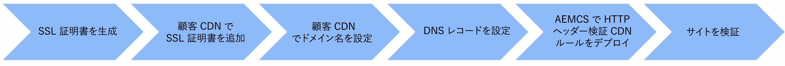

# 顧客が管理する CDN を使用したカスタムドメイン名

**顧客が管理する CDN** を使用するAEM as a Cloud Service web サイトにカスタムドメイン名を追加する方法を説明します。

このチュートリアルでは、お客様が管理する CDN を使用して、HTTPS アドレス指定可能なカスタムドメイン名 `wkndviaawscdn.enablementadobe.com` とトランスポート層セキュリティ（TLS）を追加し、サンプル [AEM WKND](https://github.com/adobe/aem-guides-wknd) サイトのブランディングを強化します。 このチュートリアルでは、AWS CloudFront は顧客が管理する CDN として使用されますが、CDN プロバイダーはAEM as a Cloud Serviceと互換性がある必要があります。

>[!VIDEO](https://video.tv.adobe.com/v/3432561?quality=12&learn=on)

大まかな手順は次のとおりです。

{width="800" zoomable="yes"}

## 前提条件

>[!VIDEO](https://video.tv.adobe.com/v/3432562?quality=12&learn=on)

- [OpenSSL](https://www.openssl.org/) と [dig](https://www.isc.org/blogs/dns-checker/) が、ローカルマシンにインストールされている。
- 次のサードパーティのサービスへのアクセス権が付与されている。
   - 認証局（CA）- [DigitCert](https://www.digicert.com/) などのサイトドメインンに対して署名付き証明書をリクエストする場合
   - 顧客 CDN – 顧客 CDN を設定し、SSL 証明書とドメインの詳細（AWS CloudFront、Azure CDN、Akamai など）を追加します。
   - ドメインネームシステム（DNS）ホスティングサービス - Azure DNS や AWS Route 53 などのカスタムドメインに対して DNS レコードを追加する場合。
- HTTP ヘッダー検証 CDN ルールをAEM as a Cloud Service環境にデプロイするには ](https://my.cloudmanager.adobe.com/)0}Adobe Cloud Manager} にアクセスします。[
- サンプル [AEM WKND](https://github.com/adobe/aem-guides-wknd) サイトは、[ 実稼動プログラム ](https://experienceleague.adobe.com/ja/docs/experience-manager-cloud-service/content/implementing/using-cloud-manager/programs/introduction-production-programs) タイプのAEM as a Cloud Service環境にデプロイされます。

サードパーティのサービスへのアクセス権が付与されていない場合は、_セキュリティチームまたはホスティングチームと共同作業して手順を完了します_。

## SSL 証明書の生成

>[!VIDEO](https://video.tv.adobe.com/v/3427908?quality=12&learn=on)

以下 2 つのオプションがあります。

1. `openssl` コマンドラインツールを使用 - サイトドメインの秘密鍵と証明書署名要求（CSR）を生成できます。署名済み証明書を要求するには、CSR を認証局（CA）に送信します。
1. ホスティングチームは、サイトに必要な秘密鍵と署名付き証明書を提供します。

最初のオプションの手順を確認してみましょう。

秘密鍵と CSR を生成するには、次のコマンドを実行し、プロンプトが表示されたら必要な情報を入力します。

```bash
# Generate a private key and a CSR
$ openssl req -newkey rsa:2048 -keyout <YOUR-SITE-NAME>.key -out <YOUR-SITE-NAME>.csr -nodes
```

署名付き証明書をリクエストするには、CA のドキュメントに従って、生成した CSR を CA に提供します。CA が CSR に署名すると、署名付き証明書ファイルを受け取ることができます。

### 署名付き証明書の確認

署名付き証明書を Cloud Manager に追加する前に確認することをお勧めします。次のコマンドを使用して証明書の詳細を確認できます。

```bash
# Review the certificate details
$ openssl crl2pkcs7 -nocrl -certfile <YOUR-SIGNED-CERT>.crt | openssl pkcs7 -print_certs -noout
```

署名付き証明書には、ルート証明書および中間証明書と、エンドエンティティ証明書を含む証明書チェーンが含まれる場合があります。

Adobe Cloud Manager では、エンドエンティティ証明書と証明書チェーンを&#x200B;_別のフォームフィールドで_&#x200B;受け入れるので、署名付き証明書からエンドエンティティ証明書と証明書チェーンを抽出する必要があります。

このチュートリアルでは、`*.enablementadobe.com` ドメインに対して発行された [DigitCert](https://www.digicert.com/) 署名付き証明書が例として使用されます。エンドエンティティと証明書チェーンは、署名付き証明書をテキストエディターで開き、`-----BEGIN CERTIFICATE-----` マーカーと `-----END CERTIFICATE-----` マーカーの間の内容をコピーすれば抽出されます。

## 顧客管理 CDN の設定

>[!VIDEO](https://video.tv.adobe.com/v/3432563?quality=12&learn=on)

AWS CloudFront、Azure CDN、Akamai などの顧客 CDN を設定し、SSL 証明書とドメインの詳細を追加します。 このチュートリアルでは、AWS CloudFront を例として使用します。 ただし、CDN ベンダーによっては、手順が異なる場合があります。 主なコールアウトは次のとおりです。

- SSL 証明書を CDN に追加します。
- カスタムドメイン名を CDN に追加します。
- 画像、CSS、JavaScript ファイルなどのコンテンツをキャッシュするように CDN を設定します。
- CDN が AEMCD オリジンに送信するすべてのリクエストにこのヘッダーを含めるように、CDN 設定に `X-Forwarded-Host` HTTP ヘッダーを追加します。
- `Host` ヘッダーの値が、プログラム ID と環境 ID を含み、`adobeaemcloud.com` で終わるデフォルトのAEM as a Cloud Service ドメインに設定されていることを確認してください。 AdobeCDN から顧客 CDN に渡される HTTP ホストヘッダー値は、デフォルトのAEM as a Cloud Service ドメインにする必要があります。その他の値を指定すると、エラーステートが発生します。

## DNS レコードの設定

>[!VIDEO](https://video.tv.adobe.com/v/3432564?quality=12&learn=on)

カスタムドメインの DNS レコードを設定するには、次の手順に従います。

1. カスタムドメインの CNAME レコードを追加し、CDN ドメイン名を指すようにします。

このチュートリアルでは、カスタムドメイン `wkndviaawscdn.enablementadobe.com` の CNAME レコードを Azure DNS に追加し、AWS CloudFront 配布ドメイン名を指すようにします。

### サイトの検証

カスタムドメイン名を使用してサイトにアクセスし、カスタムドメイン名を確認します。
AEM as a Cloud Service環境の vhhost 設定によって、機能する場合としない場合があります。

重要なセキュリティ手順は、HTTP Header Validation CDN Rule をAEM as a Cloud Service環境にデプロイすることです。 ルールにより、リクエストが他のソースからではなく、顧客 CDN から送信されることが保証されます。

## HTTP ヘッダー検証 CDN ルールを使用しない現在の作業状態

>[!VIDEO](https://video.tv.adobe.com/v/3432565?quality=12&learn=on)

HTTP Header Validation CDN ルールがない場合、`Host` ヘッダーの値は、プログラムと環境 ID を含み、`adobeaemcloud.com` で終わるデフォルトのAEM as a Cloud Service ドメインに設定されます。 Adobe CDN は、HTTP Header Validation CDN ルールがデプロイされている場合にのみ、`Host` ヘッダー値をカスタマー CDN から受信した `X-Forwarded-Host` の値に変換します。 それ以外の場合は、`Host` ヘッダー値がそのままAEM as a Cloud Service環境に渡され、`X-Forwarded-Host` ヘッダーは使用されません。

### ホストヘッダー値を印刷するサーブレットコードのサンプル

次のサーブレットコードは、JSON 応答内の `Host`、`X-Forwarded-*`、`Referer` および `Via` HTTP ヘッダー値を出力します。

```java
package com.adobe.aem.guides.wknd.core.servlets;

import java.io.IOException;
import java.util.Enumeration;

import javax.servlet.Servlet;
import javax.servlet.ServletException;

import org.apache.sling.api.SlingHttpServletRequest;
import org.apache.sling.api.SlingHttpServletResponse;
import org.apache.sling.api.resource.ResourceResolverFactory;
import org.apache.sling.api.servlets.HttpConstants;
import org.apache.sling.api.servlets.ServletResolverConstants;
import org.apache.sling.api.servlets.SlingSafeMethodsServlet;
import org.osgi.service.component.annotations.Component;
import org.osgi.service.component.annotations.Reference;

@Component(service = Servlet.class, property = {
        ServletResolverConstants.SLING_SERVLET_PATHS + "=/bin/verify-headers",
        ServletResolverConstants.SLING_SERVLET_METHODS + "=" + HttpConstants.METHOD_GET
})
public class VerifyHeadersServlet extends SlingSafeMethodsServlet {

    @Reference
    private ResourceResolverFactory resourceResolverFactory;

    @Override
    protected void doGet(SlingHttpServletRequest request, SlingHttpServletResponse response)
            throws ServletException, IOException {
        response.setContentType("application/json");
        response.setCharacterEncoding("UTF-8");

        // Create JSON response
        StringBuilder jsonResponse = new StringBuilder();
        jsonResponse.append("{");

        Enumeration<String> headerNames = request.getHeaderNames();
        boolean firstHeader = true;

        while (headerNames.hasMoreElements()) {
            String headerName = headerNames.nextElement();

            if (headerName.startsWith("X-Forwarded-") || headerName.startsWith("Host")
                    || headerName.startsWith("Referer") || headerName.startsWith("Via")) {
                if (!firstHeader) {
                    jsonResponse.append(",");
                }
                jsonResponse.append("\"").append(headerName).append("\": \"").append(request.getHeader(headerName))
                        .append("\"");
                firstHeader = false;
            }
        }

        jsonResponse.append("}");

        response.getWriter().write(jsonResponse.toString());
    }
}
```

サーブレットをテストするには、次の設定で `../dispatcher/src/conf.dispatcher.d/filters/filters.any` ファイルを更新します。 また、CDN が `/bin/*` パスを **キャッシュしない** ように設定されていることも確認します。

```plaintext
# Testing purpose bin
/0300 { /type "allow" /extension "json" /path "/bin/*"}
/0301 { /type "allow" /path "/bin/*"}
/0302 { /type "allow" /url "/bin/*"}
```

## HTTP ヘッダー検証 CDN ルールの設定とデプロイ

>[!VIDEO](https://video.tv.adobe.com/v/3432566?quality=12&learn=on)

HTTP ヘッダー検証 CDN ルールを設定してデプロイするには、次の手順に従います。

- `cdn.yaml` ファイルに HTTP ヘッダー検証 CDN ルールを追加します。次に例を示します。

  ```yaml
  kind: "CDN"
  version: "1"
  metadata:
  envTypes: ["prod"]
  data:
  authentication:
      authenticators:
      - name: edge-auth
          type: edge
          edgeKey1: ${{CDN_EDGEKEY_080124}}
          edgeKey2: ${{CDN_EDGEKEY_110124}}
      rules:
      - name: edge-auth-rule
          when: { reqProperty: tier, equals: "publish" }
          action:
          type: authenticate
          authenticator: edge-auth
  ```

- Cloud Manager UI を使用して、シークレットタイプの環境変数（CDN_EDGEKEY_080124、CDN_EDGEKEY_110124）を作成します。
- Cloud Manager パイプラインを使用して、HTTP ヘッダー検証 CDN ルールをAEM as a Cloud Service環境にデプロイします。

## X-AEM-Edge-Key HTTP Header でシークレットを渡す

>[!VIDEO](https://video.tv.adobe.com/v/3432567?quality=12&learn=on)

`X-AEM-Edge-Key` HTTP ヘッダーで秘密鍵を渡すように、顧客 CDN を更新します。 秘密鍵は、顧客 CDN からのリクエストであることを検証し、`Host` ヘッダー値をAdobeCDN から受信したリク `X-Forwarded-Host` ストの値に変換するために、顧客 CDN で使用されます。

## エンドツーエンドのビデオ

また、上記の手順を示すエンドツーエンドのビデオを視聴して、顧客が管理する CDN を使用してカスタムドメイン名をAEM as a Cloud Serviceがホストするサイトに追加することもできます。

>[!VIDEO](https://video.tv.adobe.com/v/3432568?quality=12&learn=on)
