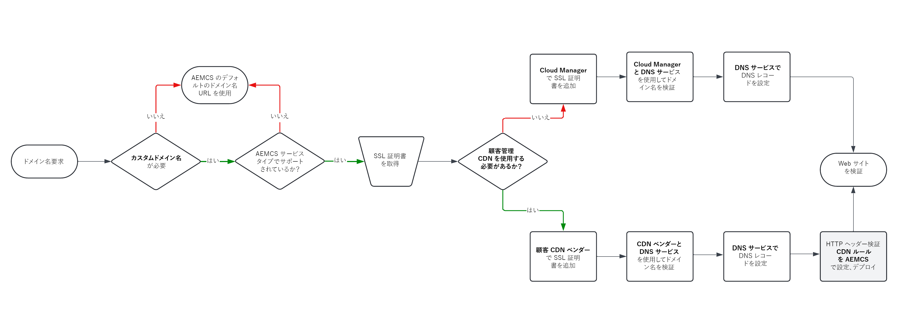

# カスタムドメイン名のオプション

AEM as a Cloud Serviceでホストされる web サイトのドメイン名を管理および実装する方法について説明します。

>[!VIDEO](https://video.tv.adobe.com/v/3432632?quality=12&learn=on)

## 事前準備

カスタムドメイン名の実装を開始する前に、次の概念を理解しておく必要があります。

### ドメイン名とは

ドメイン名は、adobe.comのような人間にわかりやすい名前の web サイト名で、インターネット上の特定の場所（IP アドレスは 170.2.14.16 など）を指します。

### AEM as a Cloud Serviceのデフォルトのドメイン名

デフォルトでは、AEM as a Cloud Serviceには、`*.adobeaemcloud.com` で終わるデフォルトのドメイン名がプロビジョニングされます。 `*.adobeaemcloud.com` に対して発行されたワイルドカード SSL 証明書はすべての環境に自動的に適用され、このワイルドカード証明書はAdobeの責任となります。

デフォルトのドメイン名は `https://<SERVICE-TYPE>-p<PROGRAM-ID>-e<ENVIRONMENT-ID>.adobeaemcloud.com` 形式です。

- `<SERVICE-TYPE>` は、**author**、**publish** または **preview** です。
- `<PROGRAM-ID>` は、プログラムの一意の ID です。 1 つの組織に複数のプログラムを含めることができます。
- `<ENVIRONMENT-ID>` は環境の一意の ID で、各プログラムには 4 つの環境（**迅速な開発（RDE）**、**開発**、**ステージ**、**実稼動** が含まれています。 各環境には、プレビュー環境を持たない **RDE** を除く、上記の 3 つのサービスタイプが含まれています。

要約すると、すべてのAEM as a Cloud Service環境がプロビジョニングされると、デフォルトのドメイン名と組み合わされた一意の URL である **11** （RDE にはプレビュー環境がありません）が設定されます。

### Adobe管理 CDN と顧客管理 CDN の比較

待ち時間を短縮し、web サイトのパフォーマンスを向上させるために、AEM as a Cloud Serviceは、Adobeが管理するコンテンツ配信ネットワーク（CDN）と統合されています。 Adobeが管理する CDN は、すべての環境で自動的に有効になります。 詳しくは、[AEM as a Cloud Serviceのキャッシュ ](../caching/overview.md) を参照してください。

ただし、お客様は、**顧客管理 CDN** と呼ばれる独自の CDN を使用することもできます。 必須ではありませんが、企業の方針やその他の理由で使用するお客様はほとんどいません。 この場合、CDN の設定と設定は顧客が管理する必要があります。

### カスタムドメイン名

ブランディング、信頼性、ビジネス開発の目的で、カスタムドメイン名はデフォルトのドメイン名よりも常に優先されます。 ただし、適用できるのは **パブリッシュ** および **プレビュー** サービスタイプに対してのみで、**オーサー** には適用できません。

カスタムドメイン名を追加する場合は、指定したカスタムドメインの有効な SSL 証明書を指定する必要があります。 SSL 証明書は、信頼された証明機関（CA）によって署名された有効な証明書である必要があります。

通常、お客様は実稼働環境（AEM as a Cloud Service web サイト）にはカスタムドメイン名を使用し、場合によっては **ステージング** や **開発** などの下位環境にも使用します。

| AEM サービスタイプ | カスタムドメインはサポートされていますか？ |
|---------------------|:-----------------------:|
| 作成者 | ✘ |
| プレビュー | ✔ |
| 公開 | ✔ |

## ドメイン名の実装

Adobe管理 CDN または顧客管理 CDN を使用してドメイン名を実装するには、次のフローチャートの手順に従います。

{width="800" zoomable="yes"}

また、次の表に、特定の設定を管理する場所を示します。

| カスタムドメイン名（を含む） | に SSL 証明書を追加 | にドメイン名を追加 | で DNS レコードを設定 | HTTP ヘッダー検証 CDN ルールが必要ですか？ |
|---------------------|:-----------------------:|-----------------------:|-----------------------:|-----------------------:|
| Adobeが管理する CDN | Adobe Cloud Manager | Adobe Cloud Manager | DNS ホスティングサービス | ✘ |
| 顧客の管理による CDN | CDN ベンダー | CDN ベンダー | DNS ホスティングサービス | ✔ |

### ステップバイステップのチュートリアル

ドメイン名の管理プロセスを理解したら、次のチュートリアルに従って、AEM as a Cloud Service web サイトにカスタムドメイン名を実装できます。

**[Adobe管理 CDN を使用したカスタムドメイン名](./custom-domain-name-with-adobe-managed-cdn.md)**：このチュートリアルでは、Adobe管理 CDN を使用して **AEM as a Cloud Serviceの web サイトにカスタムドメイン名を追加する方法を説明します**。
**[顧客の管理による CDN を使用するカスタムドメイン名](./custom-domain-names-with-customer-managed-cdn.md)**：このチュートリアルでは、顧客の管理による CDN を使用して **AEM as a Cloud Serviceの web サイトにカスタムドメイン名を追加する方法を説明します**。

