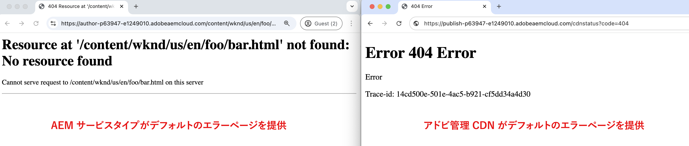
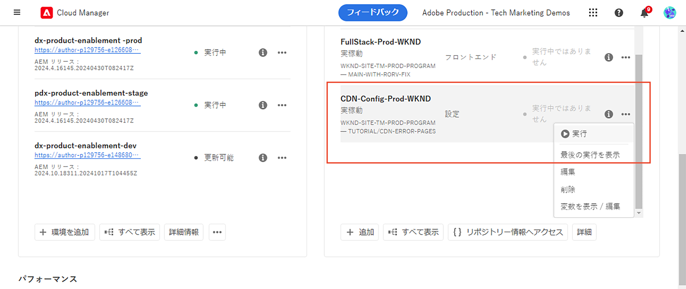

# カスタムエラーページ

AEM as a Cloud Service でホストされる web サイトにカスタムエラーページを実装する方法について説明します。

このチュートリアルでは、次の内容について説明します。

- デフォルトのエラーページ
- エラーページの提供元
   - AEM サービスタイプ - オーサー、パブリッシュ、プレビュー
   - アドビが管理する CDN
- エラーページをカスタマイズするためのオプション
   - ErrorDocument Apache ディレクティブ
   - ACS AEM Commons - エラーページハンドラー
   - CDN エラーページ

## デフォルトのエラーページ

エラーページが表示されるタイミング、デフォルトのエラーページ、およびエラーページの提供元を確認しましょう。

エラーページは、次の場合に表示されます。

- ページが存在しない（404）
- ページへのアクセスが承認されていない（403）
- コードの問題またはサーバーに到達できないので、サーバーエラーが発生する（500）.

AEM as a Cloud Service では、上記のシナリオに対して&#x200B;_デフォルトのエラーページ_&#x200B;が提供されます。これは汎用のページで、ブランドと一致しません。

デフォルトのエラーページは、_AEM サービスタイプ_（オーサー、パブリッシュ、プレビュー）または&#x200B;_アドビが管理する CDN_ から&#x200B;_提供されます_。詳しくは、次の表を参照してください。

| エラーページの提供元 | 詳細 |
|---------------------|:-----------------------:|
| AEM サービスタイプ - オーサー、パブリッシュ、プレビュー | ページリクエストがAEM サービスタイプによって提供され、上記のエラーシナリオのいずれかが発生した場合、エラーページはAEM サービスタイプから提供されます。 デフォルトでは、`x-aem-error-pass: true` ヘッダーが設定されていない場合、5XX エラーページはAdobeが管理する CDN エラーページによって上書きされます。 |
| アドビが管理する CDN | アドビが管理する CDN が _AEM サービスタイプ（接触チャネルサーバー）に到達できない_&#x200B;場合、エラーページはアドビが管理する CDNから提供されます。**可能性が低いイベントですが、計画する価値はあります。** |

>[!NOTE]
>
>AEM as Cloud Service では、バックエンドから 5XX エラーを受け取った場合、CDN は汎用のエラーページを返します。 バックエンドの実際の応答が通過できるようにするには、応答に `x-aem-error-pass: true` というヘッダーを追加する必要があります。
>これは、AEM または Apache／Dispatcher レイヤーからの応答に対してのみ機能します。中間のインフラストラクチャレイヤーから発生したその他の予期しないエラーの場合も、汎用のエラーページが表示されます。


例えば、AEM サービスタイプとアドビが管理する CDN から提供されるデフォルトのエラーページは次のとおりです。



ただし、_AEM サービスタイプとアドビが管理する CDN エラーページの両方をカスタマイズ_&#x200B;して、ブランドに一致させて、より優れたユーザーエクスペリエンスを提供できます。

## エラーページをカスタマイズするためのオプション

エラーページをカスタマイズするには、次のオプションを使用できます。

| 適用先 | オプション名 | 説明 |
|---------------------|:-----------------------:|:-----------------------:|
| AEM サービスタイプ - パブリッシュとプレビュー | ErrorDocument ディレクティブ | カスタムエラーページへのパスを指定するには、Apache 設定ファイルの [ErrorDocument](https://httpd.apache.org/docs/2.4/custom-error.html) ディレクティブを使用します。AEM サービスタイプ（パブリッシュとプレビュー）にのみ適用されます。 |
| AEM サービスタイプ – オーサー、パブリッシュ、プレビュー | ACS AEM Commons エラーページハンドラー | [ACS AEM Commons エラーページハンドラー](https://adobe-consulting-services.github.io/acs-aem-commons/features/error-handler/index.html)を使用して、すべての AEM サービスタイプでエラーをカスタマイズします。 |
| アドビが管理する CDN | CDN エラーページ | CDN エラーページを使用して、アドビが管理する CDN が AEM サービスタイプ（接触チャネルサーバー）に到達できない場合のエラーページをカスタマイズします。 |


## 前提条件

このチュートリアルでは、_ErrorDocument_ ディレクティブ、_ACS AEM Commons エラーページハンドラー_&#x200B;および _CDN エラーページ_&#x200B;オプションを使用して、エラーページをカスタマイズする方法について説明します。このチュートリアルに従うには、以下が必要です。

- [ローカル AEM 開発環境](https://experienceleague.adobe.com/ja/docs/experience-manager-learn/cloud-service/local-development-environment-set-up/overview)または AEM as a Cloud Service 環境。「_CDN エラーページ_」オプションは、AEM as a Cloud Service 環境に適用できます。

- エラーページをカスタマイズする [AEM WKND プロジェクト](https://github.com/adobe/aem-guides-wknd)。

## 設定

- AEM WKND プロジェクトのクローンを作成し、ローカル AEM 開発環境にデプロイするには、次の手順に従います。

  ```
  # For local AEM development environment
  $ git clone git@github.com:adobe/aem-guides-wknd.git
  $ cd aem-guides-wknd
  $ mvn clean install -PautoInstallSinglePackage -PautoInstallSinglePackagePublish
  ```

- AEM as a Cloud Service 環境の場合、[フルスタックパイプライン](https://experienceleague.adobe.com/ja/docs/experience-manager-cloud-service/content/implementing/using-cloud-manager/cicd-pipelines/introduction-ci-cd-pipelines#full-stack-pipeline)を実行して AEM WKND プロジェクトをデプロイします。[実稼動以外のパイプライン](https://experienceleague.adobe.com/ja/docs/experience-manager-learn/cloud-service/cloud-manager/cicd-non-production-pipeline)の例を参照してください。

- WKND サイトページが正しくレンダリングされていることを確認します。

## AEM が提供するエラーページをカスタマイズするための ErrorDocument Apache ディレクティブ{#errordocument}

AEM が提供するエラーページをカスタマイズするには、`ErrorDocument` Apache ディレクティブを使用します。

AEM as a Cloud Service では、`ErrorDocument` Apache ディレクティブオプションは、パブリッシュおよびプレビューサービスタイプにのみ適用されます。Apache と Dispatcher はデプロイメントアーキテクチャの一部ではないので、オーサーサービスタイプには適用されません。

[AEM WKND](https://github.com/adobe/aem-guides-wknd) プロジェクトで `ErrorDocument` Apache ディレクティブを使用してカスタムエラーページを表示する方法を確認しましょう。

- `ui.content.sample` モジュールには、ブランドの[エラーページ](https://github.com/adobe/aem-guides-wknd/tree/main/ui.content.sample/src/main/content/jcr_root/content/wknd/language-masters/en/errors) @ `/content/wknd/language-masters/en/errors` が含まれます。[ローカルの AEM](http://localhost:4502/sites.html/content/wknd/language-masters/en/errors) または AEM as a Cloud Service `https://author-p<ID>-e<ID>.adobeaemcloud.com/ui#/aem/sites.html/content/wknd/language-masters/en/errors` 環境で確認します。

- `dispatcher` モジュールの `wknd.vhost` ファイルには次の内容が含まれます。
   - 上記の[エラーページ](https://github.com/adobe/aem-guides-wknd/blob/main/dispatcher/src/conf.d/variables/custom.vars#L7-L8)を指す [ErrorDocument ディレクティブ](https://github.com/adobe/aem-guides-wknd/blob/main/dispatcher/src/conf.d/available_vhosts/wknd.vhost#L139-L143)。
   - [DispatcherPassError](https://github.com/adobe/aem-guides-wknd/blob/main/dispatcher/src/conf.d/available_vhosts/wknd.vhost#L133) の値は 1 に設定されているので、Dispatcher では Apache にすべてのエラーを処理させます。

  ```
  # In `wknd.vhost` file:
  
  ...
  
  ## ErrorDocument directive
  ErrorDocument 404 ${404_PAGE}
  ErrorDocument 500 ${500_PAGE}
  ErrorDocument 502 ${500_PAGE}
  ErrorDocument 503 ${500_PAGE}
  ErrorDocument 504 ${500_PAGE}
  
  ## Add Header for 5XX error page response
  <IfModule mod_headers.c>
    ### By default, CDN overrides 5XX error pages. To allow the actual response of the backend to pass through, add the header x-aem-error-pass: true
    Header set x-aem-error-pass "true" "expr=%{REQUEST_STATUS} >= 500 && %{REQUEST_STATUS} < 600"
  </IfModule>
  
  ...
  ## DispatcherPassError directive
  <IfModule disp_apache2.c>
      ...
      DispatcherPassError        1
  </IfModule>
  
  # In `custom.vars` file
  ...
  ## Define the error page paths
  Define 404_PAGE /content/wknd/us/en/errors/404.html
  Define 500_PAGE /content/wknd/us/en/errors/500.html
  ...
  ```

- お使いの環境に正しくないページ名またはパス（例：[https://publish-p105881-e991000.adobeaemcloud.com/us/en/foo/bar.html](https://publish-p105881-e991000.adobeaemcloud.com/us/en/foo/bar.html)）を入力して、WKND サイトのカスタムエラーページを確認します。

## AEM が提供するエラーページをカスタマイズするための ACS AEM Commons エラーページハンドラー{#acs-aem-commons}

_すべての AEM サービスタイプ_&#x200B;で AEM が提供するエラーページをカスタマイズするには、[ACS AEM Commons エラーページハンドラー](https://adobe-consulting-services.github.io/acs-aem-commons/features/error-handler/index.html)オプションを使用できます。

。詳細な手順については、[使用方法](https://adobe-consulting-services.github.io/acs-aem-commons/features/error-handler/index.html#how-to-use)の節を参照してください。

## CDN が提供するエラーページをカスタマイズするための CDN エラーページ{#cdn-error-pages}

アドビが管理する CDN によって提供されるエラーページをカスタマイズするには、CDN エラーページ オプションを使用します。

CDN エラーページを実装して、アドビが管理する CDN が AEM サービスタイプ（接触チャネルサーバー）に到達できない場合のエラーページをカスタマイズしましょう。

>[!IMPORTANT]
>
> _アドビが管理する CDN が AEM サービスタイプ（接触チャネルサーバー）に到達できない_&#x200B;ことは&#x200B;**可能性が低いイベント**&#x200B;ですが、計画する価値はあります。

CDN エラーページを実装する大まかな手順は次のとおりです。

- カスタムエラーページコンテンツを単一ページアプリケーション（SPA）として開発します。
- CDN エラーページに必要な静的ファイルを、パブリックアクセス可能な場所にホストします。
- CDN ルール（errorPages）を設定し、上記の静的ファイルを参照します。
- Cloud Manager パイプラインを使用して、設定済みの CDN ルールを AEM as a Cloud Service 環境にデプロイします。
- CDN エラーページをテストします。


### CDN エラーページの概要

CDN エラーページは、アドビが管理する CDN によって単一ページアプリケーション（SPA）として実装されます。アドビが管理する CDN によって配信される SPA HTML ドキュメントには、最小限の HTML スニペットが含まれます。カスタムエラーページのコンテンツは、JavaScript ファイルを使用して動的に生成されます。JavaScript ファイルは、お客様がパブリックアクセス可能な場所で開発およびホストする必要があります。

アドビが管理する CDN によって配信される HTML スニペットの構造は次のとおりです。

```html
<!DOCTYPE html>
<html lang="en">
  <head>
    
    ...

    <title>{title}</title>
    <link rel="icon" href="{icoUrl}">
    <link rel="stylesheet" href="{cssUrl}">
  </head>
  <body>
    <script src="{jsUrl}"></script>
  </body>
</html>
```

HTMLスニペットには、次のプレースホルダーが含まれます。

1. **jsUrl**：HTML 要素を動的に作成してエラーページのコンテンツをレンダリングする JavaScript ファイルの絶対 URL。
1. **cssUrl**：エラーページのコンテンツのスタイルを設定する CSS ファイルの絶対 URL。
1. **icoUrl**：favicon の絶対 URL。


### カスタムエラーページの開発

WKND 固有のブランドのエラーページのコンテンツを単一ページアプリケーション（SPA）として開発しましょう。

デモの目的で、[React](https://react.dev/) を使用しますが、任意の JavaScript フレームワークやライブラリを使用できます。

- 次のコマンドを実行して、新しい React プロジェクトを作成します。

  ```
  $ npx create-react-app aem-cdn-error-page
  ```

- お気に入りのコードエディターでプロジェクトを開き、以下のファイルを更新します。

   - `src/App.js`：エラーページのコンテンツをレンダリングするメインコンポーネントです。

     ```javascript
     import logo from "./wknd-logo.png";
     import "./App.css";
     
     function App() {
       return (
         <>
           <div className="App">
             <div className="container">
             
             </div>
           </div>
           <div className="container">
             <div className="error-code">CDN Error Page</div>
             <h1 className="error-message">Ruh-Roh! Page Not Found</h1>
             <p className="error-description">
               We're sorry, we are unable to fetch this page!
             </p>
           </div>
         </>
       );
     }
     
     export default App;
     ```

   - `src/App.css`：エラーページのコンテンツのスタイルを設定します。

     ```css
     .App {
       text-align: left;
     }
     
     .App-logo {
       height: 14vmin;
       pointer-events: none;
     }
     
     
     body {
       margin-top: 0;
       padding: 0;
       font-family: Arial, sans-serif;
       background-color: #fff;
       color: #333;
       display: flex;
       justify-content: center;
       align-items: center;
     }
     
     .container {
       text-align: letf;
       padding-top: 10px;
     }
     
     .error-code {
       font-size: 4rem;
       font-weight: bold;
       color: #ff6b6b;
     }
     
     .error-message {
       font-size: 2.5rem;
       margin-bottom: 10px;
     }
     
     .error-description {
       font-size: 1rem;
       margin-bottom: 20px;
     }
     ```

   - `wknd-logo.png` ファイルを `src` フォルダーに追加します。[ファイル](https://github.com/adobe/aem-guides-wknd/blob/main/ui.frontend/src/main/webpack/resources/images/favicons/favicon-512.png)を `wknd-logo.png` としてコピーします。

   - `favicon.ico` ファイルを `public` フォルダーに追加します。[ファイル](https://github.com/adobe/aem-guides-wknd/blob/main/ui.frontend/src/main/webpack/resources/images/favicons/favicon-32.png)を `favicon.ico` としてコピーします。

   - プロジェクトを実行して、WKND ブランドの CDN エラーページのコンテンツを確認します。

     ```
     $ npm start
     ```

     ブラウザーを開き、`http://localhost:3000/` に移動して、CDN エラー ページのコンテンツを確認します。

   - 静的ファイルを生成するプロジェクトを作成します。

     ```
     $ npm run build
     ```

     静的ファイルは、`build` フォルダーに生成されます。


または、上記の React プロジェクトファイルを含む [aem-cdn-error-page.zip](./assets/aem-cdn-error-page.zip) ファイルをダウンロードすることもできます。

次に、上記の静的ファイルをパブリックアクセス可能な場所にホストします。

### CDN エラーページに必要な静的ファイルのホスト

Azure Blob Storage で静的ファイルをホストしましょう。ただし、[Netlify](https://www.netlify.com/)、[Vercel](https://vercel.com/)、[AWS S3](https://aws.amazon.com/s3/) などの静的ファイルホスティングサービスを使用できます。

- コンテナーを作成し、静的ファイルをアップロードするには、公式の [Azure Blob Storage](https://learn.microsoft.com/ja-jp/azure/storage/blobs/storage-quickstart-blobs-portal) ドキュメントに従います。

  >[!IMPORTANT]
  >
  >他の静的ファイルホスティングサービスを使用している場合は、静的ファイルをホストするためのドキュメントに従います。

- 静的ファイルがパブリックアクセス可能であることを確認します。WKND デモ固有のストレージアカウント設定は、次のとおりです。

   - **ストレージアカウント名**：`aemcdnerrorpageresources`
   - **コンテナ名**：`static-files`

  

- 上記の `static-files` コンテナには、`build` フォルダーから以下のファイルがアップロードされます。

   - `error.js`：`build/static/js/main.<hash>.js` ファイルの名前が `error.js` に変更され、[パブリックアクセス可能になりました](https://aemcdnerrorpageresources.blob.core.windows.net/static-files/error.js)。
   - `error.css`：`build/static/css/main.<hash>.css` ファイルの名前が `error.css` に変更され、[パブリックアクセス可能になりました](https://aemcdnerrorpageresources.blob.core.windows.net/static-files/error.css)。
   - `favicon.ico`：`build/favicon.ico` ファイルがそのままアップロードされ、[パブリックにアクセス可能になりました](https://aemcdnerrorpageresources.blob.core.windows.net/static-files/favicon.ico)。

次に、CDN ルール（errorPages）を設定し、上記の静的ファイルを参照します。

### CDN ルールの設定

上記の静的ファイルを使用して CDN エラーページのコンテンツをレンダリングする `errorPages` CDN ルールを設定しましょう。

1. AEM プロジェクトのメイン `config` フォルダーから `cdn.yaml` ファイルを開きます。例えば、[WKND プロジェクトの cdn.yaml](https://github.com/adobe/aem-guides-wknd/blob/main/config/cdn.yaml) ファイルです。

1. 次の CDN ルールを `cdn.yaml` ファイルに追加します。

   ```yaml
   kind: "CDN"
   version: "1"
   metadata:
     envTypes: ["dev", "stage", "prod"]
   data:
     # The CDN Error Page configuration. 
     # The error page is displayed when the Adobe-managed CDN is unable to reach the origin server.
     # It is implemented as a Single Page Application (SPA) and WKND branded content must be generated dynamically using the JavaScript file 
     errorPages:
       spa:
         title: Adobe AEM CDN Error Page # The title of the error page
         icoUrl: https://aemcdnerrorpageresources.blob.core.windows.net/static-files/favicon.ico # The PUBLIC URL of the favicon
         cssUrl: https://aemcdnerrorpageresources.blob.core.windows.net/static-files/error.css # The PUBLIC URL of the CSS file
         jsUrl: https://aemcdnerrorpageresources.blob.core.windows.net/static-files/error.js # The PUBLIC URL of the JavaScript file
   ```

1. 変更を保存し、コミットして、Adobe アップストリームリポジトリにプッシュします。

### CDN ルールのデプロイ

最後に、Cloud Manager パイプラインを使用して、設定済みの CDN ルールを AEM as a Cloud Service 環境にデプロイします。

1. Cloud Manager で、「**パイプライン**」セクションに移動します。

1. 新しいパイプラインを作成するか、**設定**&#x200B;ファイルのみをデプロイする既存のパイプラインを選択します。手順について詳しくは、[設定パイプラインの作成](https://experienceleague.adobe.com/ja/docs/experience-manager-learn/cloud-service/security/traffic-filter-and-waf-rules/how-to-setup#deploy-rules-through-cloud-manager)を参照してください。

1. 「**実行**」ボタンをクリックして CDN ルールをデプロイします。



### CDN エラーページのテスト

CDN エラーページをテストするには、次の手順に従います。

- ブラウザーで、AEM as a Cloud ServiceのPublish URL に移動し、`cdnstatus?code=404` をその URL に追加します（例：[https://publish-p105881-e991000.adobeaemcloud.com/cdnstatus?code=404](https://publish-p105881-e991000.adobeaemcloud.com/cdnstatus?code=404)。または [ カスタムドメイン URL](https://wknd.enablementadobe.com/cdnstatus?code=404) を使用してアクセスします）

  

- サポートされているコードは、403、404、406、500 および 503 です。

- ブラウザーのネットワークタブを確認して、静的ファイルが Azure Blob Storage から読み込まれていることを確認します。アドビが管理する CDN によって配信される HTML ドキュメントには最小限のコンテンツが含まれ、JavaScript ファイルによってブランドのエラーページのコンテンツが動的に作成されます。

  

## 概要

このチュートリアルでは、エラーページの提供元となるデフォルトのエラーページと、エラーページをカスタマイズするオプションについて説明しました。`ErrorDocument` Apache ディレクティブ、`ACS AEM Commons Error Page Handler`、および `CDN Error Pages` オプションを使用してカスタムエラーページを実装する方法について説明しました。

## その他のリソース

- [CDN エラーページの設定](https://experienceleague.adobe.com/ja/docs/experience-manager-cloud-service/content/implementing/content-delivery/cdn-error-pages)

- [Cloud Manager - 設定パイプライン](https://experienceleague.adobe.com/ja/docs/experience-manager-cloud-service/content/implementing/using-cloud-manager/cicd-pipelines/introduction-ci-cd-pipelines#config-deployment-pipeline)
