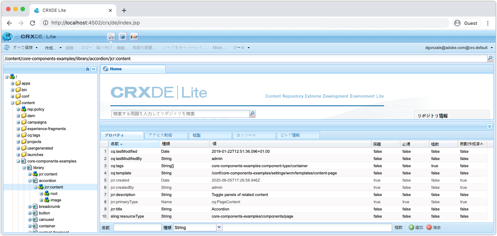
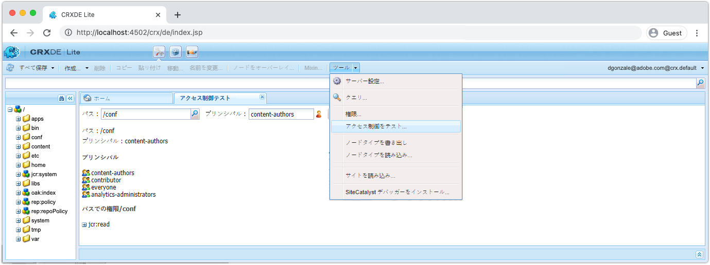

# AEM SDK をデバッグするその他のツール

AEM SDK のローカルクイックスタートでアプリケーションをデバッグするには、その他の様々なツールが役立ちます。

## CRXDE Lite

CRXDE Lite は、JCR（AEM のデータリポジトリ）とやり取りするための web ベースのインターフェイスです。CRXDE Lite を使用すると、ノード、プロパティ、プロパティ値、アクセス許可など、JCR を完全に表示できます。

CRXDE Lite は次の場所にあります。

+ ツール／一般／CRXDE Lite
+ または、[http://localhost:4502/crx/de/index.jsp](http://localhost:4502/crx/de/index.jsp) で直接確認できます。

### コンテンツのデバッグ

CRXDE Lite では、JCR に直接アクセスできます。CRXDE Lite 経由で表示されるコンテンツは、ユーザーに付与された権限によって制限されます。つまり、アクセス権によっては、JCR 内のすべての項目を表示または変更できない場合があります。

+ JCR 構造は、左側のナビゲーションパネルを使用してナビゲーションおよび操作します
+ 左側のナビゲーションウィンドウでノードを選択すると、ノードプロパティが下側のパネルに表示されます。
   + プロパティは、ウィンドウから追加、削除、変更できます
+ 左側のナビゲーションでファイルノードをダブルクリックすると、右上のパネルにファイルのコンテンツが表示されます
+ 左上の「すべて保存」ボタンをクリックして変更内容を保存するか、「すべて保存」の横にある下向き矢印をクリックして、未保存の変更内容を元に戻します。

CRXDE Lite を通じて AEM SDK に直接加えられた変更は、追跡と管理が困難な場合があります。必要に応じて、CRXDE Lite を通じて行われた変更を AEM プロジェクトの可変コンテンツパッケージ（`ui.content`）に戻し、Git にコミットされていることを確認します。CRXDE Lite を通じて AEM SDK に直接変更を加えるのではなく、すべてのアプリケーションコンテンツの変更をコードベースから開始し、デプロイメントを介して AEM SDK に送るのが理想です。

### アクセス制御のデバッグ

CRXDE Lite を使用すると、特定のユーザーまたはグループ（プリンシパル）の特定のノードに対するアクセス制御をテストおよび評価できます。

CRXDE Lite で「アクセス制御のテスト」コンソールにアクセスするには、次の場所に移動します。

+ CRXDE Lite／ツール／アクセス制御をテスト...

1. 「パス」フィールドを使用して、評価する JCR パスを選択します
1. 「プリンシパル」フィールドを使用して、パスを評価するユーザーまたはグループを選択します
1. 「テスト」ボタンをクリックします

結果は次のように表示されます。

+ __Path__ 評価されたパスを繰り返します
+ __Principal__ パスが評価されたユーザーまたはグループを繰り返します
+ __Principals__ 選択したプリンシパルが属するすべてのプリンシパルの一覧が表示されます。
   + これは、継承を通じてアクセス許可を提供する推移的なグループメンバーシップの理解に役立ちます。
+ __パスでの権限__ 選択したプリンシパルが評価されたパスに対して持つすべての JCR 権限の一覧が表示されます

## クエリの説明を実行

AEM のクエリの解釈と実行方法についての重要なインサイトを得られる、AEM SDK のローカルクイックスタートにある web ベースのクエリの説明ツールと、クエリが AEM で高パフォーマンスな方法で実行されていることを確認するために非常に役立つツールについて説明します。

クエリの説明は次の場所にあります。

+ ツール／診断／クエリパフォーマンス／「クエリの説明」タブ
+ [http://localhost:4502/libs/granite/operations/content/diagnosistools/queryPerformance.html](http://localhost:4502/libs/granite/operations/content/diagnosistools/queryPerformance.html)／「クエリの説明」タブ

## QueryBuilder デバッガー

QueryBuilder デバッガーは、AEM の [QueryBuilder](https://experienceleague.adobe.com/docs/experience-manager-65/developing/platform/query-builder/querybuilder-api.html?lang=ja) 構文を使用した検索クエリのデバッグと理解に役立つ web ベースのツールです。

QueryBuilder デバッガーは次の場所にあります。

+ [http://localhost:4502/libs/cq/search/content/querydebug.html](http://localhost:4502/libs/cq/search/content/querydebug.html)
