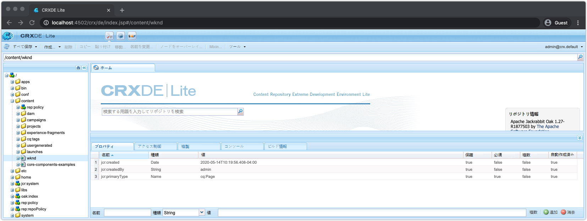
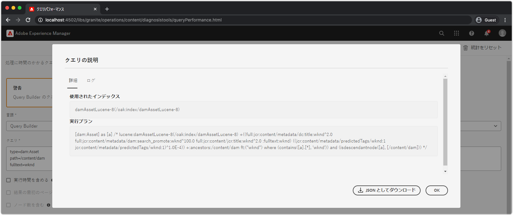

# AEM SDKをデバッグするその他のツール

その他の様々なツールが、AEM SDKのローカルクイックスタートでのアプリケーションのデバッグに役立ちます。

## CRXDE Lite

CRXDE Liteは、JCR(AEMデータリポジトリ)とやり取りするためのWebベースのインターフェイスです。 CRXDE Liteは、ノード、プロパティ、プロパティ値、権限など、JCRを完全に表示できます。

CRXDE Liteは次の場所にあります。

+ ツール/一般/CRXDE Lite
+ または[http://localhost:4502/crx/de/index.jsp](http://localhost:4502/crx/de/index.jsp)に直接アクセスします。

## クエリの説明を実行

AEM SDKのローカルクイックスタートでクエリWebベースのツールについて説明する。AEMによるクエリの解釈と実行方法に関する重要なインサイトと、AEMによるクエリの実行を確実に確実にする非常に役立つツールが提供されます。

「クエリの説明を実行」は次の場所にあります。

+ ツール/診断/クエリパフォーマンス/「クエリの説明」タブ
+ [http://localhost:4502/libs/granite/operations/content/diagnosistools/queryPerformance.html](http://localhost:4502/libs/granite/operations/content/diagnosistools/queryPerformance.html) /「クエリの説明を実行」タブ

## QueryBuilderデバッガー

QueryBuilder Debuggerは、AEM [QueryBuilder](https://docs.adobe.com/content/help/en/experience-manager-65/developing/platform/query-builder/querybuilder-api.html)構文を使用して検索クエリをデバッグし、理解するのに役立つWebベースのツールです。

QueryBuilder Debuggerは次の場所にあります。

+ [http://localhost:4502/libs/cq/search/content/querydebug.html](http://localhost:4502/libs/cq/search/content/querydebug.html)

