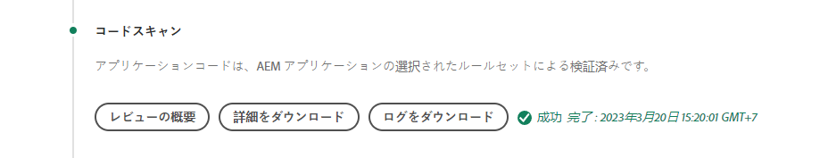
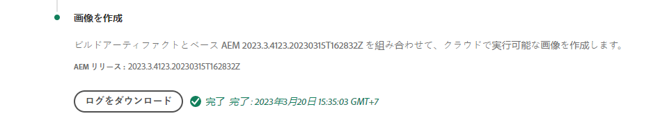

# Cloud Serviceの構築と展開としてのAEMのデバッグ

AdobeCloud Managerは、コードの構築とAEMへのCloud Serviceとしてのデプロイを容易にします。 エラーは、ビルドプロセスのステップ中に発生し、解決のために操作が必要になる場合があります。 このガイドでは、展開時に発生する一般的なエラーと、その最適なアプローチ方法について詳しく説明します。


## 検証

検証手順では、Cloud Managerの基本的な設定が有効であることを確認するだけです。 一般的な検証エラーには、次のものがあります。

### 環境が無効な状態です

+ __エラーメッセージ：__ 環境は無効な状態です。
   
+ __原因：パイプライン__ のターゲット環境は、現在新しいビルドを受け入れられない状態です。
+ __解決：状態が実行中の（または更新可能な）状態に解決されるのを__ 待ちます。環境を削除する場合は、環境を再作成するか、別の環境を選択して作成します。

### パイプラインに関連付けられた環境が見つかりません

+ __エラーメッセージ：__ 環境は削除済みとしてマークされています。
   
+ __原因：パイプライン__ が使用するように構成されている環境が削除されました。同じ名前の新しい環境が再作成されても、Cloud Managerは、同じ名前の環境にパイプラインを自動的に再関連付けしません。
+ __解決：パイプライン設定を__ 編集し、デプロイ先の環境を再度選択します。

### パイプラインに関連付けられたGitブランチが見つかりません

+ __エラーメッセージ：__ 無効なパイプライン：XXXXX.Reason=Branch=xxxxがリポジトリに見つかりません。
   
+ __原因：パイプライン__ が使用するように構成されているGitブランチが削除されました。
+ __解決：見つからないGitブランチを__ 同じ名前で再作成するか、別の既存のブランチから構築するようにパイプラインを再設定してください。

## ビルドおよび単体テスト


ビルドとユニットのテスト段階では、パイプラインの構成済みGitブランチからチェックアウトされたプロジェクトのMavenビルド(`mvn clean package`)が実行されます。

このフェーズで識別されるエラーは、次の例外を除き、ローカルでのプロジェクト構築の再生産が可能です。

+ [Maven Central](https://search.maven.org/)で使用できないMaven依存関係が使用され、依存関係を含むMavenリポジトリは次のいずれかです。
   + プライベートの内部Mavenリポジトリなど、Cloud Managerからの未到達、またはMavenリポジトリに認証が必要で、正しくない秘密鍵証明書が提供されています。
   + プロジェクトの`pom.xml`に明示的に登録されていません。 Mavenリポジトリを含めると、構築時間が長くなるので、使用しないことに注意してください。
+ タイミングの問題が原因で、単体テストが失敗しました。 これは、ユニットテストがタイミングに依存する場合に発生する可能性があります。 強力なインジケーターは、テストコードの`.sleep(..)`に依存しています。
+ サポートされていないMavenプラグインの使用。

## コードスキャン



コードスキャンは、JavaとAEM固有のベストプラクティスを組み合わせて使用し、静的コード分析を実行します。

コードにCritical Securityの脆弱性が存在する場合、コードをスキャンするとビルドエラーが発生します。 小さい違反は上書きできますが、修正することをお勧めします。 コードのスキャンは不完全で、[偽陽性](https://docs.adobe.com/content/help/en/experience-manager-cloud-service/implementing/developing/understand-test-results.html#dealing-with-false-positives)が発生する可能性があることに注意してください。

コードのスキャンの問題を解決するには、Cloud Managerから提供されるCSV形式のレポートを&#x200B;**「詳細をダウンロード」**&#x200B;ボタンからダウンロードし、エントリを確認します。

詳しくは、AEM固有のルールを参照してください。Cloud Managerのドキュメント&#39;[カスタムAEM固有のコードスキャンルール](https://docs.adobe.com/content/help/en/experience-manager-cloud-manager/using/how-to-use/custom-code-quality-rules.html)を参照してください。

## 画像を作成



ビルド画像は、ビルドとユニットのテストの手順で作成されたビルド済みのコードアーティファクトとAEMリリースを組み合わせて、デプロイ可能な単一のアーティファクトを形成する役割を持ちます。

コードの構築とコンパイルの問題はビルドと単体テストで見つかりますが、カスタムビルドの成果物をAEMリリースと組み合わせようとすると、設定や構造上の問題が発生する可能性があります。

### 重複OSGi設定

複数のOSGi設定が、ターゲットAEM環境の実行モードで解決される場合、のビルド手順は次のエラーで失敗します。

```
[ERROR] Unable to convert content-package [/tmp/packages/enduser.all-1.0-SNAPSHOT.zip]: 
Configuration ‘com.example.ExampleComponent’ already defined in Feature Model ‘com.example.groupId:example.all:slingosgifeature:xxxxx:X.X’, 
set the ‘mergeConfigurations’ flag to ‘true’ if you want to merge multiple configurations with same PID
```

#### 原因1

+ __原因：__ AEMプロジェクトのすべてのパッケージ、複数のコードパッケージを含む、同じOSGi設定が複数のコードパッケージで提供されているため、競合が発生し、イメージのビルド手順でどちらを使用すべきかを判断できず、ビルドに失敗します。一意の名前が付けられている限り、OSGiファクトリ設定には適用されません。
+ __解決：AEMアプリケーションの一部として展開されるすべてのコードパッケージ（付属のサードパーティコードパッケージを含む）を__ 確認し、実行モードを介してターゲット環境に解決される重複OSGiの設定を探します。エラーメッセージの「mergeConfigurationsフラグをtrueに設定」は、AEMではクラウドサービスとして使用できないので、無視する必要があります。

#### 原因2

+ __原因：AEM__ プロジェクトに同じコードパッケージが2回含まれている場合、そのパッケージに含まれるOSGi設定が複製されます。
+ __解決：すべてのプロジェクトに埋め込まれたすべてのpom.xmlパッケージを__ 確認し、 `filevault-package-maven-plugin` [](https://docs.adobe.com/content/help/en/experience-manager-cloud-service/implementing/developing/aem-project-content-package-structure.html#cloud-manager-target) 設定がに設定されていることを確認 `<cloudManagerTarget>none</cloudManagerTarget>`します。

### 誤ったレポイントスクリプト

レポイントスクリプトは、ベースラインコンテンツ、ユーザー、ACLなどを定義します。 AEMではCloud Serviceとして、レポイントスクリプトはビルドイメージの間に適用されますが、AEM SDKのローカルクイックスタートでは、OSGiレポイントファクトリ設定がアクティブ化されるときに適用されます。 このため、AEM SDKのローカルクイックスタートで、Repointスクリプトが（ログを使用して）静かに失敗し、イメージのビルド手順が失敗してデプロイメントが停止する場合があります。

+ __原因：レポイント__ スクリプトの形式が正しくありません。失敗したスクリプトがリポジトリに対して実行される後は、すべてのレポジトリスクリプトがリポジトリに対して実行されるので、リポジトリは不完全な状態のままになる可能性があります。
+ __解決：レポイントスクリプトOSGi設定がデプロイされている場合にAEM SDKのローカルクイックスタートを__ 確認し、エラーの有無と内容を確認します。

### 未満のレポイントコンテンツの依存関係

レポイントスクリプトは、ベースラインコンテンツ、ユーザー、ACLなどを定義します。 AEM SDKのローカルクイックスタートでは、リポジトリがアクティブになった後、またはコンテンツの直接変更やコンテンツパッケージ経由でコンテンツが変更された後に、リポイントスクリプトが適用されます。 AEMでは、Cloud Serviceとして、レポイントスクリプトは、レポイントスクリプトが依存するコンテンツを含まないリポジトリに対して、イメージの構築中に適用されます。

+ __原因：レポイント__ スクリプトは、存在しないコンテンツに依存します。
+ __解像度：レポイントスクリプトが依存するコンテンツが存在することを__ 確認します。これは、多くの場合、欠落しているが必要なコンテンツ構造を定義するディレクティブが欠けている、適切に定義されていないレポイントスクリプトを示しています。 これは、AEMを削除し、JARを解凍し、repointスクリプトを含むリポイントOSGi設定をinstallフォルダーに追加して、AEMを起動することで、ローカルで再現できます。 このエラーは、AEM SDKのローカルクイックスタートのerror.logに表示されます。


### アプリケーションのコアコンポーネントのバージョンがデプロイ済みのバージョンよりも大きい

_この問題は、最新のAEMリリースに対して自動更新されない非実稼働環境にのみ影響します。_

AEMは、各AEMリリースで最新のコアコンポーネントバージョンが自動的にCloud Serviceに含まれます。つまり、Cloud Service環境としてのAEMが自動的または手動で更新された後は、最新バージョンのコアコンポーネントがデプロイされます。

次の場合に「イメージをビルド」ステップが失敗する可能性があります。

+ 展開アプリケーションは、`core` （OSGiバンドル）プロジェクトの依存バージョンを達成したコアコンポーネントを更新します
+ 展開アプリケーションは、新しいコアコンポーネントバージョンを含むAEMリリースを使用するように更新されていないCloud Service環境としてサンドボックス（実稼働環境以外）AEMに展開されます。

この障害を防ぐには、Cloud Service環境としてAEMのアップデートが利用可能な場合は常に、次のビルド/デプロイの一環としてアップデートを含め、必ずアプリケーションコードベースのコアコンポーネントのバージョンを増やしてからアップデートを含めます。

+ __症状：「Build Image」__
ステップが失敗し、 
`com.adobe.cq.wcm.core.components...` 特定のバージョン範囲のパッケージを `core` プロジェクトで読み込めませんでした。

   ```
   [ERROR] Bundle com.example.core:0.0.3-SNAPSHOT is importing package(s) Package com.adobe.cq.wcm.core.components.models;version=[12.13,13) in start level 20 but no bundle is exporting these for that start level in the required version range.
   [ERROR] Analyser detected errors on feature 'com.adobe.granite:aem-ethos-app-image:slingosgifeature:aem-runtime-application-publish-dev:1.0.0-SNAPSHOT'. See log output for error messages.
   [INFO] ------------------------------------------------------------------------
   [INFO] BUILD FAILURE
   [INFO] ------------------------------------------------------------------------
   ```

+ __原因：__  ( `core` プロジェクトで定義された)アプリケーションのOSGiバンドルは、AEMにCloud Serviceとしてデプロイされたものとは異なるバージョンレベルで、コアコンポーネントのコア依存関係からJavaクラスをインポートします。
+ __解像度:__
   + Gitを使用して、コアコンポーネントのバージョンが増加する前に存在する作業コミットに戻します。 このコミットをCloud Manager Gitブランチにプッシュし、このブランチから環境の更新を実行します。 これにより、AEMがCloud Serviceとして最新のAEMリリースにアップグレードされます。リリースには、最新のコアコンポーネントバージョンが含まれます。 Cloud ServiceとしてのAEMが最新のAEMリリースに更新され、最新のコアコンポーネントバージョンがリリースされたら、最初に失敗したコードを再デプロイします。
   + この問題をローカルで再現するには、AEM SDKのバージョンが、AEMとCloud Service環境が使用しているAEMのリリースバージョンと同じであることを確認してください。


### Adobeサポートケースの作成

上記のトラブルシューティング方法で問題が解決しない場合は、次の方法でAdobeサポートケースを作成してください。

+ [Adobe Admin Console](https://adminconsole.adobe.com) >サポートタブ>ケースを作成

   _複数のAdobe組織のメンバーの場合は、ケースを作成する前に、Adobe組織スイッチャーで、失敗したパイプラインを持つAdobe組織が選択されていることを確認します。_

## 展開先

「展開先」の手順では、ビルド画像で生成されたコードアーティファクトを取得し、開始がそれを使用して新しいAEM作成者と発行サービスを作成し、成功した場合は、古いAEM作成者と発行サービスを削除します。 この手順では、可変コンテンツのパッケージとインデックスもインストールおよび更新します。

「展開先」の手順をデバッグする前に、Cloud Serviceログ](./logs.md)として[AEMを確認してください。 `aemerror`ログには、ポッドの起動と停止に関する情報が含まれており、この情報は問題への展開に関する開始である可能性があります。 Cloud Managerの展開先の「ログをダウンロード」ボタンから利用できるログは`aemerror`ログではなく、アプリケーションの開始アップに関する詳細な情報は含まれていません。


次の3つの主な原因で、「Deploy to」ステップが失敗する場合があります。

### Cloud Managerパイプラインには、古いAEMバージョンが含まれています

+ __原因：Cloud Managerのパイプライン__ には、ターゲット環境にデプロイされているAEMより古いバージョンが含まれています。これは、パイプラインが再使用され、新しいバージョンのAEMを実行している新しい環境を指し示す場合に発生する可能性があります。 これは、環境のAEMのバージョンがパイプラインのAEMのバージョンより大きいかどうかを確認することで識別できます。
   
+ __解像度:__
   + ターゲット環境に利用可能な更新がある場合は、環境のアクションから「更新」を選択し、ビルドを再実行します。
   + ターゲット環境に利用可能なアップデートがない場合は、最新バージョンのAEMが実行されています。 この問題を解決するには、パイプラインを削除し、再作成します。


### Cloud Managerがタイムアウトになりました

新しくデプロイされたAEMサービスの開始中に実行されるコードは、長い時間がかかるので、デプロイを完了する前にCloud Managerがタイムアウトします。 この場合、Cloud Managerのステータスが「失敗」と報告された場合でも、最終的に展開が成功する可能性があります。

+ __原因：__ カスタムコードは、大きなクエリやコンテンツトラーバルなどの操作を早い段階でOSGiバンドルやコンポーネントのライフサイクルの初期段階でトリガーされ、AEMの開始を大幅に遅延させる可能性があります。
+ __解決方法：OSGi Bundleのライフサイクルの初期に実行されるコードの実装を__ 確認し、Cloud Managerによって示されるように、失敗時(ログ時間(GMT)頃)にAEM AuthorおよびPublishサービスの `aemerror` ログを確認し、カスタムログ実行プロセスを示すログメッセージを探します。

### 互換性のないコードまたは設定

ほとんどのコードと設定の違反は、ビルドの前のバージョンで検出されますが、カスタムコードや設定では、Cloud ServiceとしてAEMとの互換性がなく、コンテナで実行されるまで検出されません。

+ __原因：__ カスタムコードは、大きなクエリやコンテンツトラーバルなど長い操作を呼び出して、OSGiバンドルの初期段階でトリガーされたり、コンポーネントのライフサイクルがAEMの開始を大幅に遅延させたりする場合があります。
+ __解決：Cloud Managerで示さ__ れているように、エラーが発生した前後(ログ時間(GMT)にAEM AuthorサービスとPublishサービスの `aemerror` ログを確認します。
   1. ログで、カスタムアプリケーションが提供するJavaクラスがスローしたERRORを確認します。 問題が見つかった場合は、解決し、修正済みのコードをプッシュして、パイプラインを再構築します。
   1. カスタムアプリケーションで拡張/対話を行うAEMの側面で報告されたERRORがログにないか確認し、それらを調べます。これらのエラーは、Javaクラスに直接関連付けられない場合があります。 問題が見つかった場合は、解決し、修正済みのコードをプッシュして、パイプラインを再構築します。

### コンテンツパッケージに/varを含める

`/var` は、様々な一過性のランタイムコンテンツを含む可変です。コンテンツパッケージに`/var`を含める(例： `ui.content`)をCloud Manager経由でデプロイすると、デプロイの手順が失敗する場合があります。

この問題は、最初の展開でエラーが発生することはなく、後続の展開でのみ識別が困難です。 顕著な症状は次のとおりです。

+ ただし、初期のデプロイメントは成功しましたが、デプロイメントに含まれる新しいまたは変更可能なコンテンツは、AEM Publishサービスに存在しないように見えます。
+ AEM Author内のコンテンツのアクティベーション/アクティベーション解除がブロックされています
+ その後のデプロイは、「展開先」の手順で失敗し、「展開先」の手順は約60分後に失敗します。

この問題を検証するには、次の手順に従います。

1. 展開の一部であるコンテンツパッケージが1つ以上あると判断すると、`/var`に書き込まれます。
1. 次の場所でプライマリ（太字の）配布キューがブロックされていることを確認します。
   + AEM Author/ツール/デプロイメント/配布
      
1. 後続のデプロイメントが失敗した場合は、「ログをダウンロード」ボタンを使用して、Cloud Managerの「デプロイ先」ログをダウンロードします。

   

   ...を実行し、ログ・ステートメント間に約60分があることを確認します。

   ```
   2020-01-01T01:01:02+0000 Begin deployment in aem-program-x-env-y-dev [CorrelationId: 1234]
   ```

   ... および ...

   ```
   2020-01-01T02:04:10+0000 Failed deployment in aem-program-x-env-y-dev
   ```

   このログには、最初のデプロイメントで成功とレポートされるインジケータは含まれず、失敗した後のデプロイメントの場合にのみ表示されます。

+ __原因：AEM発行サービスにコンテンツパッケージを展開するのに使用される__ AEMレプリケーションサービスユーザーは、AEM発行 `/var` に書き込めません。この結果、AEM Publishサービスへのコンテンツパッケージのデプロイメントは失敗します。
+ __解決：__ この問題を解決する次の方法は、優先順に表示されます。
   1. `/var`リソースが不要な場合は、`/var`下のリソースを、アプリケーションの一部として展開されているコンテンツパッケージから削除します。
   2. `/var`リソースが必要な場合は、[repoint](https://docs.adobe.com/content/help/en/experience-manager-cloud-service/implementing/deploying/overview.html#repoinit)を使用してノード構造を定義します。 レポイントスクリプトは、OSGi実行モードを介して、AEM Author、AEM Publish、またはその両方を対象にすることができます。
   3. `/var`リソースがAEMの作成者に対してのみ必要で、[repoint](https://docs.adobe.com/content/help/en/experience-manager-cloud-service/implementing/deploying/overview.html#repoinit)を使って適切にモデル化できない場合は、AEM Authorに[embedded](https://docs.adobe.com/content/help/en/experience-manager-cloud-service/implementing/developing/aem-project-content-package-structure.html#embeddeds)するだけでインストールされる個別のコンテンツパッケージ(`<target>/apps/example-packages/content/install.author</target>`)に移動します。`all`

### Adobeサポートケースの作成

上記のトラブルシューティング方法で問題が解決しない場合は、次の方法でAdobeサポートケースを作成してください。

+ [Adobe Admin Console](https://adminconsole.adobe.com) >サポートタブ>ケースを作成

   _複数のAdobe組織のメンバーの場合は、ケースを作成する前に、Adobe組織スイッチャーで、失敗したパイプラインを持つAdobe組織が選択されていることを確認します。_
