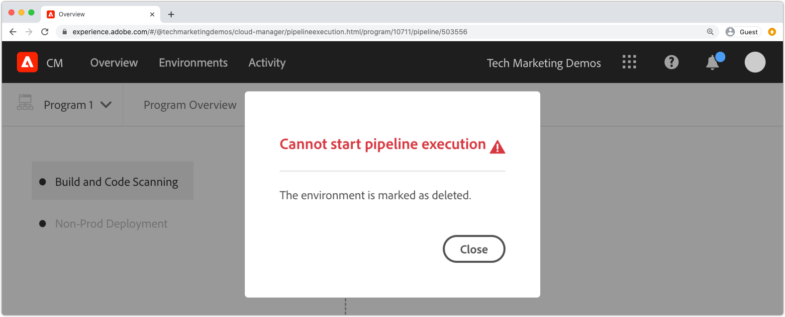

# AEM as aCloud Serviceビルドおよびデプロイメントのデバッグ

AdobeCloud Managerは、コード構築とAEM as a Managerへのデプロイメントを容易にします。 エラーは、ビルドプロセスのステップ中に発生し、解決のためのアクションが必要になる場合があります。 このガイドでは、デプロイメントでの一般的なエラーと、それらに最も適したアプローチについて説明します。


## 検証

検証手順では、単純にCloud Managerの基本的な設定が有効であることを確認します。 一般的な検証エラーは次のとおりです。

### 環境が無効な状態です

+ __エラーメッセージ：__ 環境が無効な状態です。
   
+ __原因：__ パイプラインのターゲット環境は、移行状態で、その時点では新しいビルドを受け入れることができません。
+ __解決方法：__ 状態が実行中（または更新可能）の状態に解決されるまで待ちます。環境を削除する場合は、環境を再作成するか、別の環境を選択してビルドします。

### パイプラインに関連付けられている環境が見つかりません

+ __エラーメッセージ：__ 環境が削除済みとマークされています。
   
+ __原因：__ パイプラインで使用するように設定されている環境が削除されました。同じ名前の新しい環境が再作成されても、 Cloud Managerは、同じ名前の環境にパイプラインを自動的に再関連付けしません。
+ __解決方法：__ パイプライン設定を編集し、デプロイ先の環境を再選択します。

### パイプラインに関連付けられているGitブランチが見つかりません

+ __エラーメッセージ：__ 無効なパイプライン：XXXXXReason=Branch=xxxxがリポジトリに見つかりません。
   
+ __原因：__ パイプラインが使用するように設定されているGitブランチが削除されました。
+ __解決方法：__ 見つからないGitブランチを同じ名前で再作成するか、別の既存のブランチから構築するようにパイプラインを再設定します。

## ビルドおよび単体テスト


ビルドおよび単体テスト段階では、パイプラインの設定済みGitブランチからチェックアウトされたプロジェクトのMavenビルド(`mvn clean package`)を実行します。

このフェーズで特定されたエラーは、次の例外を除き、プロジェクトをローカルに再生可能に構築する必要があります。

+ [Maven Central](https://search.maven.org/)で使用できないMaven依存関係が使用され、依存関係を含むMavenリポジトリは次のいずれかです。
   + プライベート内部MavenリポジトリーやMavenリポジトリーなど、Cloud Managerから到達できない場合は、認証が必要で、誤った資格情報が指定されています。
   + プロジェクトの`pom.xml`に明示的に登録されていません。 ビルド時間が長くなるので、Mavenリポジトリを含めることは推奨されません。
+ タイミングの問題が原因で単体テストが失敗する。 これは、単体テストがタイミングに依存する場合に発生する可能性があります。 強い指標は、テストコードの`.sleep(..)`に依存しています。
+ サポートされていないMavenプラグインの使用。

## コードスキャン


コードスキャンは、JavaとAEM固有のベストプラクティスを組み合わせて使用し、静的コード分析を実行します。

コードに重大なセキュリティの脆弱性が存在する場合、コードスキャンによってビルドエラーが発生します。 それより小さい違反は上書きできますが、修正することをお勧めします。 コードスキャンは不完全で、[偽陽性](https://experienceleague.adobe.com/docs/experience-manager-cloud-service/implementing/using-cloud-manager/test-results/overview-test-results.html#dealing-with-false-positives)が発生する可能性があることに注意してください。

コードスキャンの問題を解決するには、「**詳細をダウンロード**」ボタンをクリックしてCloud ManagerからCSV形式のレポートをダウンロードし、エントリを確認します。

詳しくは、 AEM固有のルールに関するドキュメントの[カスタムAEM固有のコードスキャンルール](https://experienceleague.adobe.com/docs/experience-manager-cloud-manager/using/how-to-use/custom-code-quality-rules.html)を参照してください。

## 画像を作成


ビルドイメージは、ビルドとユニットテストの手順で作成されたビルドコードアーティファクトとAEMリリースを組み合わせて、デプロイ可能な単一のアーティファクトを形成します。

ビルドと単体テストでは、コードのビルドとコンパイルの問題は見つかりますが、カスタムビルドアーティファクトをAEMリリースと組み合わせようとすると、設定または構造の問題が特定される場合があります。

### OSGi設定の複製

複数のOSGi設定がターゲットAEM環境の実行モードで解決される場合、画像のビルドステップは次のエラーで失敗します。

```
[ERROR] Unable to convert content-package [/tmp/packages/enduser.all-1.0-SNAPSHOT.zip]: 
Configuration ‘com.example.ExampleComponent’ already defined in Feature Model ‘com.example.groupId:example.all:slingosgifeature:xxxxx:X.X’, 
set the ‘mergeConfigurations’ flag to ‘true’ if you want to merge multiple configurations with same PID
```

#### 原因1

+ __原因：__  AEMプロジェクトのすべてのパッケージに複数のコードパッケージが含まれ、同じOSGi設定が複数のコードパッケージで提供されているので競合が発生し、画像のビルド手順でどちらを使用するかを判断できず、ビルドに失敗します。一意の名前がある限り、OSGiファクトリ設定には適用されません。
+ __解決方法：__ AEMアプリケーションの一部としてデプロイされるすべてのコードパッケージ（含まれるサードパーティコードパッケージを含む）を確認し、実行モードでターゲット環境に解決される重複したOSGi設定を探します。AEM as a Cloud Serviceでは、エラーメッセージの「mergeConfigurationsフラグをtrueに設定する」というガイダンスは使用できないので、無視する必要があります。

#### 原因2

+ __原因：__  AEMプロジェクトに同じコードパッケージが誤って2回含まれている場合、そのパッケージに含まれるOSGi設定が重複しています。
+ __解決方法：__ すべてのプロジェクトに埋め込まれているパッケージのすべてのpom.xmlを確認し、設定がに設定されているこ `filevault-package-maven-plugin` [](https://experienceleague.adobe.com/docs/experience-manager-cloud-service/implementing/developing/aem-project-content-package-structure.html#cloud-manager-target) とを確認し `<cloudManagerTarget>none</cloudManagerTarget>`ます。

### repoinitスクリプトの形式が正しくありません

repoinitスクリプトは、ベースラインコンテンツ、ユーザー、ACLなどを定義します。 AEM as aCloud Serviceでは、repoinitスクリプトはビルド画像の間に適用されますが、AEM SDKのローカルクイックスタートでは、OSGi repoinitファクトリ設定がアクティブ化されると適用されます。 このため、AEM SDKのローカルクイックスタートでRepoinitスクリプトが（ログ付きで）静的に失敗し、「画像のビルド」手順が失敗してデプロイメントが停止する場合があります。

+ __原因：__ repoinitスクリプトの形式が正しくありません。失敗したスクリプトがリポジトリに対して実行された後に、repoinitスクリプトが実行されるので、リポジトリは不完全な状態のままになる場合があります。
+ __解決方法：__ repoinitスクリプトのOSGi設定がデプロイされた場合にAEM SDKのローカルクイックスタートを確認し、エラーの有無と内容を確認します。

### 未満のrepoinitコンテンツの依存関係

repoinitスクリプトは、ベースラインコンテンツ、ユーザー、ACLなどを定義します。 AEM SDKのローカルクイックスタートでは、repoinit OSGiファクトリ設定がアクティブになったとき、つまり、リポジトリがアクティブになった後に、コンテンツの変更が直接またはコンテンツパッケージを介して発生したときに、repoinitスクリプトが適用されます。 AEM as aCloud Serviceでは、repoinitスクリプトは、repoinitスクリプトが依存するコンテンツを含まない可能性のあるリポジトリに対して、画像のビルド中に適用されます。

+ __原因：__ repoinitスクリプトは、存在しないコンテンツに依存します。
+ __解決方法：__ repoinitスクリプトが依存するコンテンツが存在することを確認します。多くの場合、これは、欠落しているが必要なコンテンツ構造を定義するディレクティブが欠落している、不適切に定義されたrepoinitスクリプトを示します。 これは、AEMを削除し、JARを解凍し、repoinitスクリプトを含むrepoinit OSGi設定をinstallフォルダーに追加して、AEMを起動することで、ローカルで再現できます。 エラーは、AEM SDKのローカルクイックスタートのerror.logに表示されます。


### アプリケーションのコアコンポーネントのバージョンが、デプロイ済みのバージョンよりも大きい

_この問題は、最新のAEMリリースに自動更新されない実稼動環境にのみ影響します。_

AEM as a AEMCloud Serviceでは、すべてのCloud Serviceリリースで最新のコアコンポーネントバージョンが自動的に含まれます。つまり、AEM as a  an a Core Components環境が自動または手動で更新された後に、最新バージョンのコアコンポーネントがデプロイされます。

次の場合に、画像のビルド手順が失敗する可能性があります。

+ デプロイアプリケーションは、`core`（OSGiバンドル）プロジェクトのコアコンポーネントmaven依存関係バージョンを更新します
+ その後、デプロイ済みアプリケーションは、その新しいコアコンポーネントバージョンを含むAEMリリースを使用するように更新されていないCloud Service環境として、サンドボックス（非実稼動）のAEMにデプロイされます。

このエラーを防ぐには、AEM as aCloud Service環境のアップデートが利用可能な場合は常に、次のビルド/デプロイの一部としてアップデートを含め、アプリケーションコードベースでコアコンポーネントバージョンを増分した後に必ずアップデートを含めます。

+ __症状：__
イメージの作成手順が失敗し、 
`com.adobe.cq.wcm.core.components...` 特定のバージョン範囲のパッケージをプロジェクトでインポートできま `core` せんでした。

   ```
   [ERROR] Bundle com.example.core:0.0.3-SNAPSHOT is importing package(s) Package com.adobe.cq.wcm.core.components.models;version=[12.13,13) in start level 20 but no bundle is exporting these for that start level in the required version range.
   [ERROR] Analyser detected errors on feature 'com.adobe.granite:aem-ethos-app-image:slingosgifeature:aem-runtime-application-publish-dev:1.0.0-SNAPSHOT'. See log output for error messages.
   [INFO] ------------------------------------------------------------------------
   [INFO] BUILD FAILURE
   [INFO] ------------------------------------------------------------------------
   ```

+ __原因：__  （プロジェクトで定義された）アプリケーションのOSGiバンドル `core` は、コアコンポーネントのコア依存関係からJavaクラスを、Cloud ServiceとしてAEMにデプロイされるものとは異なるバージョンレベルでインポートします。
+ __解決方法:__
   + Gitを使用して、コアコンポーネントのバージョンが増える前に存在する作業用コミットに戻します。 このコミットをCloud Manager Gitブランチにプッシュし、このブランチから環境の更新を実行します。 これにより、AEM as a AEMが最新リリースにアップグレードされ、最新のコアコンポーネントCloud Serviceが含まれます。 AEM as aCloud Serviceが最新のAEMリリース（最新のコアコンポーネントバージョンを使用）に更新されたら、最初に失敗したコードを再デプロイします。
   + この問題をローカルで再現するには、AEM SDKのバージョンが、AEM as a AEM環境で使用されているのと同じCloud Serviceリリースバージョンであることを確認します。


### Adobeサポートケースの作成

上記のトラブルシューティング方法で問題が解決しない場合は、次の方法でAdobeサポートケースを作成してください。

+ [Adobe Admin Console](https://adminconsole.adobe.com) /「サポート」タブ/ケースを作成

   _複数のAdobe組織のメンバーの場合は、ケースを作成する前に、Adobe組織スイッチャーで、失敗したパイプラインを持つAdobe組織が選択されていることを確認します。_

## 配置先

デプロイ先の手順では、ビルド画像で生成されたコードアーティファクトを取得し、それを使用して新しいAEMオーサーサービスとパブリッシュサービスを開始し、成功したら、古いAEMオーサーサービスとパブリッシュサービスを削除します。 可変コンテンツパッケージとインデックスも、この手順でインストールおよび更新します。

「デプロイ先」の手順をデバッグする前に、[AEM as aCloud Serviceログ](./logs.md)について理解しておいてください。 `aemerror`ログには、問題へのデプロイに関連する可能性のあるポッドの起動と停止に関する情報が含まれています。 Cloud Managerのデプロイ先ステップの「ログをダウンロード」ボタンから利用できるログは`aemerror`ログではなく、アプリケーションの起動に関する詳細情報は含まれていません。


デプロイ先の手順が失敗する主な理由は次の3つです。

### Cloud Managerパイプラインには、古いAEMバージョンが含まれます

+ __原因：__ Cloud Managerパイプラインには、ターゲット環境にデプロイされるよりも古いバージョンのAEMが含まれます。これは、パイプラインが再利用され、新しいバージョンのAEMを実行している新しい環境を指す場合に発生する可能性があります。 これは、環境のAEMバージョンがパイプラインのAEMバージョンよりも大きいかどうかを確認することで識別できます。
   
+ __解決方法:__
   + ターゲット環境で「更新」を使用できる場合は、環境のアクションから「更新」を選択し、ビルドを再実行します。
   + ターゲット環境で「Update Available」（更新可能）が設定されていない場合は、最新バージョンのAEMが実行されています。 これを解決するには、パイプラインを削除し、再作成します。


### Cloud Managerがタイムアウトする

新しくデプロイされたAEMサービスの起動中に実行されるコードは、Cloud Managerがタイムアウトするまでに、デプロイを完了するまでに時間がかかります。 このような場合、デプロイメントは最終的に成功する可能性があり、Cloud Managerのステータスが「失敗」とレポートされたと考えてもかまいません。

+ __原因：__ カスタムコードは、OSGiバンドルまたはコンポーネントのライフサイクルの早い段階でトリガーされた大きなクエリやコンテンツトラバーサルなどの操作を実行し、AEMの起動時間を大幅に遅延させる可能性があります。
+ __解決方法：__ OSGiバンドルのライフサイクルの初期に実行されるコードの実装を確認し、Cloud Managerで示されるように、失敗時（GMTでのログ時間）にAEMオーサーサービスとパブリッシュサービスのログを確認 `aemerror` し、カスタムログプロセスを示すログメッセージを探します。

### 互換性のないコードまたは設定

ほとんどのコードおよび設定違反は、ビルドの前の段階でキャッチされますが、カスタムコードまたは設定がCloud ServiceとしてのAEMと互換性を持たず、コンテナで実行されるまで検出されない可能性があります。

+ __原因：__ カスタムコードは、大きなクエリやコンテンツトラバーサルなど、AEMの起動時間をOSGiバンドルやコンポーネントのライフサイクルの早い段階でトリガーする長い操作を呼び出す可能性があります。
+ __解決方法：__ Cloud Managerで `aemerror` 示されているように、失敗の前後（GMTでのログ時間）にAEMオーサーサービスとパブリッシュサービスのログを確認します。
   1. ログで、カスタムアプリケーションで提供されるJavaクラスでスローされたエラーを確認します。 問題が見つかった場合は、解決し、修正済みコードをプッシュして、パイプラインを再構築します。
   1. カスタムアプリケーションで拡張/インタラクションを行うAEMの側面で報告されたエラーのログを確認し、それらを調べます。これらのエラーは、Javaクラスに直接関連付けられない場合があります。 問題が見つかった場合は、解決し、修正済みコードをプッシュして、パイプラインを再構築します。

### コンテンツパッケージに/varを含める

`/var` は、様々な一時的なランタイムコンテンツを含む可変です。コンテンツパッケージに`/var`を含める(例： `ui.content`)をCloud Manager経由でデプロイすると、デプロイの手順が失敗する場合があります。

この問題は、最初のデプロイメントでエラーが発生することはなく、後続のデプロイメントでのみ発生するので、特定が困難です。 顕著な症状は次のとおりです。

+ ただし、初期デプロイメントは成功します。ただし、デプロイメントの一部である可変コンテンツの新規または変更は、AEMパブリッシュサービスに存在しないように見えます。
+ AEMオーサーでのコンテンツのアクティベート/アクティベート解除がブロックされています
+ その後のデプロイメントは、デプロイ先の手順で失敗し、デプロイ先の手順は約60分後に失敗します。

この問題を検証するには、動作が失敗する原因を次に示します。

1. デプロイメントに含まれるコンテンツパッケージが少なくとも1つあると判断すると、 `/var`に書き込まれます。
1. 次の場所でプライマリ（太字の）配布キューがブロックされていることを確認します。
   + AEMオーサー/ツール/デプロイメント/配布
      
1. 後続のデプロイメントに失敗した場合は、「ログをダウンロード」ボタンを使用してCloud Managerの「デプロイ先」ログをダウンロードします。

   

   ログステートメント間に約60分があることを確認します。

   ```
   2020-01-01T01:01:02+0000 Begin deployment in aem-program-x-env-y-dev [CorrelationId: 1234]
   ```

   ... および ...

   ```
   2020-01-01T02:04:10+0000 Failed deployment in aem-program-x-env-y-dev
   ```

   このログには、最初のデプロイメントで、成功したと報告される指標は含まれず、後続のデプロイメントで失敗した場合にのみ報告されます。

+ __原因：AEMパブリッシュサービスにコンテンツパッケージをデプロイする際に使用される__ AEMレプリケーションサービスユーザーは、AEMパブリッシュに書き込む `/var` ことができません。その結果、コンテンツパッケージのAEMパブリッシュサービスへのデプロイメントが失敗します。
+ __解決方法：__ この問題を解決するには、次の方法を好みの順序で示します。
   1. `/var`リソースが不要な場合は、アプリケーションの一部としてデプロイされたコンテンツパッケージから`/var`の下にあるリソースを削除します。
   2. `/var`リソースが必要な場合は、[repoinit](https://experienceleague.adobe.com/docs/experience-manager-cloud-service/implementing/deploying/overview.html#repoinit)を使用してノード構造を定義します。 repoinitスクリプトは、OSGi実行モードを介して、AEMオーサー、AEMパブリッシュ、またはその両方をターゲットに設定できます。
   3. `/var`リソースがAEMオーサーでのみ必要で、[repoinit](https://experienceleague.adobe.com/docs/experience-manager-cloud-service/implementing/deploying/overview.html#repoinit)を使用して合理的にモデル化できない場合は、AEMオーサーの実行モードフォルダー(`<target>/apps/example-packages/content/install.author</target>`)の`all`パッケージに[埋め込むだけでAEMオーサーにインストールされる個別のコンテンツパッケージに移動します。](https://experienceleague.adobe.com/docs/experience-manager-cloud-service/implementing/developing/aem-project-content-package-structure.html#embeddeds)
   4. この[AdobeKB](https://helpx.adobe.com/in/experience-manager/kb/cm/cloudmanager-deploy-fails-due-to-sling-distribution-aem.html)の説明に従って、適切なACLを`sling-distribution-importer`サービスユーザーに提供します。

### Adobeサポートケースの作成

上記のトラブルシューティング方法で問題が解決しない場合は、次の方法でAdobeサポートケースを作成してください。

+ [Adobe Admin Console](https://adminconsole.adobe.com) /「サポート」タブ/ケースを作成

   _複数のAdobe組織のメンバーの場合は、ケースを作成する前に、Adobe組織スイッチャーで、失敗したパイプラインを持つAdobe組織が選択されていることを確認します。_
