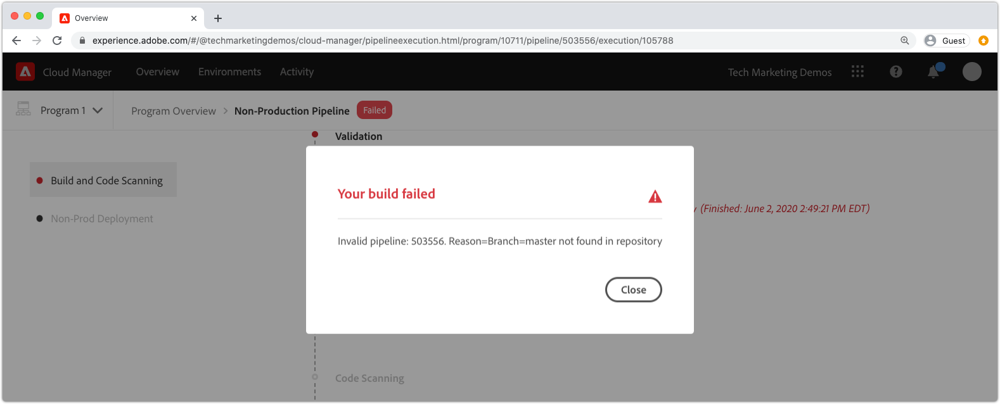

# AEMのas a Cloud Service的なビルドとデプロイメントのデバッグ

AdobeCloud Manager は、AEM as a Cloud Serviceへのコード構築とデプロイメントを容易におこないます。 ビルドプロセスのステップ中にエラーが発生し、解決のためのアクションが必要になる場合があります。 このガイドでは、デプロイメントでの一般的なエラーと、それらに最も適したアプローチ方法について説明します。


## 検証

検証手順では、単に基本的な Cloud Manager 設定が有効であることを確認するだけです。 一般的な検証エラーは次のとおりです。

### 環境が無効な状態です

+ __エラーメッセージ：__ 環境が無効な状態です。
   
+ __原因：__ パイプラインのターゲット環境は移行状態にあり、その時点では新しいビルドを受け入れることができません。
+ __解像度：__ 状態が実行中（または利用可能な更新）状態に解決されるまで待ちます。 環境を削除する場合は、環境を再作成するか、別の環境を選択してビルドします。

### パイプラインに関連付けられている環境が見つかりません

+ __エラーメッセージ：__ 環境が削除済みとマークされます。
   
+ __原因：__ パイプラインが使用するように設定された環境は削除されました。
同じ名前の新しい環境が再作成されても、Cloud Manager は、同じ名前の環境にパイプラインを自動的に関連付け直しません。
+ __解像度：__ パイプライン設定を編集し、デプロイ先の環境を再選択します。

### パイプラインに関連付けられた Git ブランチが見つかりません

+ __エラーメッセージ：__ 無効なパイプライン：XXXXX. Reason=Branch=xxxx がリポジトリ内に見つかりません。
   
+ __原因：__ パイプラインで使用するように設定された Git ブランチが削除されました。
+ __解像度：__ 見つからない Git ブランチを、完全に同じ名前で再作成するか、別の既存のブランチからビルドするようにパイプラインを再設定します。

## ビルドおよび単体テスト


ビルドおよび単体テストフェーズでは、Maven ビルド (`mvn clean package`) が、パイプラインの設定済み Git ブランチからチェックアウトされたプロジェクトの。

このフェーズで特定されたエラーは、次の例外を除き、プロジェクトをローカルに構築して再生産可能にする必要があります。

+ Maven の依存関係は次の場所で使用できません： [Maven Central](https://search.maven.org/) が使用され、依存関係を含む Maven リポジトリは次のいずれかになります。
   + プライベートの内部 Maven リポジトリーや Maven リポジトリーなど、Cloud Manager からは到達できません。認証が必要で、不正な資格情報が提供されています。
   + プロジェクトの `pom.xml`. Maven リポジトリを含めるとビルド時間が長くなるので、推奨されません。
+ タイミングの問題が原因で単体テストが失敗しました。 これは、単体テストがタイミングに依存する場合に発生する可能性があります。 強い指標は次のことに依存しています： `.sleep(..)` を設定します。
+ サポートされていない Maven プラグインの使用。

## コードスキャン


コードスキャンは、Java とAEM固有のベストプラクティスを組み合わせて使用し、静的コード分析を実行します。

コードスキャンを実行すると、コードに重大なセキュリティの脆弱性が存在する場合にビルドエラーが発生します。 より小さい違反は上書きできますが、修正することをお勧めします。 コードスキャンは不完全で、結果として [偽陽性](https://experienceleague.adobe.com/docs/experience-manager-cloud-service/implementing/using-cloud-manager/test-results/overview-test-results.html#dealing-with-false-positives).

コードスキャンの問題を解決するには、CSV 形式のレポートをダウンロードして、 **詳細をダウンロード** 」ボタンをクリックし、エントリを確認します。

詳しくは、AEM固有のルールについては、 Cloud Manager のドキュメントを参照してください。 [カスタムのAEM固有のコードスキャンルール](https://experienceleague.adobe.com/docs/experience-manager-cloud-manager/using/how-to-use/custom-code-quality-rules.html).

## 画像を作成


ビルドイメージは、ビルドとユニットテストの手順で作成されたビルドコードアーティファクトとAEMリリースを組み合わせて、デプロイ可能な単一のアーティファクトを形成する役割を持ちます。

ビルドと単体テストでは、コードのビルドとコンパイルの問題が見つかりますが、カスタムビルドアーティファクトとAEMリリースを組み合わせようとすると、設定や構造上の問題が識別される場合があります。

### OSGi 設定が重複しています

複数の OSGi 設定がターゲットAEM環境の実行モードで解決された場合、「画像のビルド」ステップは次のエラーで失敗します。

```
[ERROR] Unable to convert content-package [/tmp/packages/enduser.all-1.0-SNAPSHOT.zip]: 
Configuration 'com.example.ExampleComponent' already defined in Feature Model 'com.example.groupId:example.all:slingosgifeature:xxxxx:X.X', 
set the 'mergeConfigurations' flag to 'true' if you want to merge multiple configurations with same PID
```

#### 原因 1

+ __原因：__ AEMプロジェクトの all パッケージには複数のコードパッケージが含まれ、同じ OSGi 設定が複数のコードパッケージで提供されているので競合が発生し、画像のビルド手順でどちらを使用するかを決定できず、ビルドに失敗します。 一意の名前がある限り、これは OSGi ファクトリ設定には適用されません。
+ __解像度：__ AEMアプリケーションの一部としてデプロイされているすべてのコードパッケージ（含まれるサードパーティのコードパッケージを含む）を確認し、実行モードを介してターゲット環境に解決される重複した OSGi 設定を探します。 AEM as a Cloud Service では、エラーメッセージの「mergeConfigurations フラグを true に設定する」というガイダンスは使用できないので、無視する必要があります。

#### 原因 2

+ __原因：__ AEMプロジェクトのに誤って同じコードパッケージが 2 回含まれるので、そのパッケージに含まれる OSGi 設定が複製されます。
+ __解像度：__ すべてのプロジェクトに埋め込まれているすべての pom.xml パッケージを確認し、 `filevault-package-maven-plugin` [設定](https://experienceleague.adobe.com/docs/experience-manager-cloud-service/implementing/developing/aem-project-content-package-structure.html#cloud-manager-target) に設定 `<cloudManagerTarget>none</cloudManagerTarget>`.

### repoinit スクリプトの形式が正しくありません

repoinit スクリプトは、ベースラインコンテンツ、ユーザー、ACL などを定義します。 AEMas a Cloud Serviceでは、repoinit スクリプトはビルド画像の間に適用されますが、AEM SDK のローカルクイックスタートでは、OSGi repoinit ファクトリ設定がアクティブ化されると適用されます。 このため、AEM SDK のローカルクイックスタートで Repoinit スクリプトが（ログと共に）静かに失敗し、「画像のビルド」手順が失敗して、デプロイメントが停止する場合があります。

+ __原因：__ repoinit スクリプトの形式が正しくありません。 これにより、失敗したスクリプトがリポジトリに対して実行されない後に、repoinit スクリプトが実行された後、リポジトリが不完全な状態のままになる場合があります。
+ __解像度：__ repoinit スクリプト OSGi 設定がデプロイされた場合にAEM SDK のローカルクイックスタートを確認し、エラーの有無と内容を判断します。

### 未満の repoinit コンテンツの依存関係

repoinit スクリプトは、ベースラインコンテンツ、ユーザー、ACL などを定義します。 AEM SDK のローカルクイックスタートでは、repoinit OSGi ファクトリ設定がアクティブになったとき、つまり、リポジトリがアクティブになった後に、直接またはコンテンツパッケージを介してコンテンツの変更が発生した場合に、repoinit スクリプトが適用されます。 AEM as a Cloud Serviceでは、repoinit スクリプトが依存するコンテンツを含まない可能性のあるリポジトリに対して、画像のビルド中に repoinit スクリプトが適用されます。

+ __原因：__ repoinit スクリプトは存在しないコンテンツに依存します。
+ __解像度：__ repoinit スクリプトが依存するコンテンツが存在することを確認します。 多くの場合、これは不適切に定義された repoinit スクリプトで、それらの欠落しているが必要なコンテンツ構造を定義するディレクティブが欠落していることを示しています。 これは、AEMを削除し、JAR を展開し、repoinit スクリプトを含む repoinit OSGi 設定を install フォルダーに追加して、AEMを起動することで、ローカルで再現できます。 エラーは、AEM SDK のローカルクイックスタートの error.log に表示されます。


### アプリケーションのコアコンポーネントのバージョンが、デプロイ済みのバージョンよりも大きいです

_この問題が影響するのは、最新のAEMリリースに自動更新されない、実稼動以外の環境のみです。_

AEM as a Cloud Serviceでは、すべてのAEMリリースで最新のコアコンポーネントバージョンが自動的に含まれます。つまり、AEMのas a Cloud Service環境が自動または手動で更新された後に、最新バージョンのコアコンポーネントがデプロイされます。

次の場合に、画像のビルドの手順が失敗する可能性があります。

+ デプロイアプリケーションは、 `core` （OSGi バンドル）プロジェクト
+ その後、デプロイアプリケーションは、その新しいコアコンポーネントバージョンを含むAEMリリースを使用するように更新されていない、サンドボックス（非実稼動）AEMas a Cloud Service環境にデプロイされます。

このエラーを防ぐには、AEMas a Cloud Service環境のアップデートが使用可能な場合は常に、次のビルド/デプロイの一部としてアップデートを含め、アプリケーションコードベースでコアコンポーネントのバージョンを増分した後に必ずアップデートを含めます。

+ __症状：__
画像の作成手順が失敗し、 
`com.adobe.cq.wcm.core.components...` 特定のバージョン範囲のパッケージを、 `core` プロジェクト。

   ```
   [ERROR] Bundle com.example.core:0.0.3-SNAPSHOT is importing package(s) Package com.adobe.cq.wcm.core.components.models;version=[12.13,13) in start level 20 but no bundle is exporting these for that start level in the required version range.
   [ERROR] Analyser detected errors on feature 'com.adobe.granite:aem-ethos-app-image:slingosgifeature:aem-runtime-application-publish-dev:1.0.0-SNAPSHOT'. See log output for error messages.
   [INFO] ------------------------------------------------------------------------
   [INFO] BUILD FAILURE
   [INFO] ------------------------------------------------------------------------
   ```

+ __原因：__  アプリケーションの OSGi バンドル ( `core` プロジェクト ) は、AEM as a Cloud Serviceにデプロイされているものとは異なるバージョンレベルで、コアコンポーネントのコア依存関係から Java クラスを読み込みます。
+ __解決方法:__
   + Git を使用して、コアコンポーネントのバージョン増分前に存在する作業用コミットに戻します。 このコミットを Cloud Manager Git ブランチにプッシュし、このブランチから環境の更新を実行します。 これにより、AEMが最新のAEMリリースにアップグレードされ、最新のコアコンポーネントバージョンが含まれます。 AEMas a Cloud Serviceが最新のAEMリリースに更新され（最新のコアコンポーネントバージョンが使用される）、最初に失敗したコードを再デプロイします。
   + この問題をローカルで再現するには、AEM SDK のバージョンが、AEM as a Cloud Service環境で使用されているAEMのリリースバージョンと同じであることを確認します。


### Adobeサポートケースの作成

上記のトラブルシューティング方法で問題が解決しない場合は、次の方法でAdobeサポートケースを作成してください。

+ [Adobe Admin Console](https://adminconsole.adobe.com) /「サポート」タブ/ケースを作成

   _複数のAdobe組織のメンバーの場合は、ケースを作成する前に、Adobe組織スイッチャーで、失敗したパイプラインを持つAdobe組織が選択されていることを確認します。_

## デプロイ先

デプロイ先の手順では、ビルド画像で生成されたコードアーティファクトを取得し、それを使用して新しい AEM オーサーサービスとパブリッシュサービスを開始し、成功したら、古い AEM オーサーサービスとパブリッシュサービスを削除します。 可変コンテンツパッケージとインデックスも、この手順でインストールおよび更新します。

に慣れてください。 [AEMas a Cloud Serviceログ](./logs.md) を実行します。 この `aemerror` ログには、問題へのデプロイに関連する可能性のある pod の起動および停止に関する情報が含まれています。 Cloud Manager のデプロイ先ステップの「ログをダウンロード」ボタンから利用できるログは、 `aemerror` ログに記録され、アプリケーションの起動に関する詳細情報は含まれません。


「デプロイ先」ステップが失敗する主な 3 つの理由：

### Cloud Manager パイプラインには古いAEMバージョンが含まれます

+ __原因：__ Cloud Manager パイプラインには、ターゲット環境にデプロイされるAEMよりも古いバージョンの CD が含まれます。 これは、新しいバージョンのAEMを実行している新しい環境をパイプラインが再利用し、指すように設定された場合に発生する可能性があります。 これは、環境のAEMのバージョンがパイプラインのAEMのバージョンよりも大きいかどうかを確認することで識別できます。
   
+ __解決方法:__
   + ターゲット環境で「更新を使用可能」が設定されている場合は、環境のアクションから「更新」を選択し、ビルドを再実行します。
   + 対象の環境で「Update Available」（更新可能）が設定されていない場合、最新バージョンのAEMが実行されています。 これを解決するには、パイプラインを削除し、再作成します。


### Cloud Manager がタイムアウトしました

新しくデプロイされたAEMサービスの起動中に実行されるコードは、長時間を要するので、Cloud Manager がタイムアウトしてからデプロイを完了する必要があります。 この場合、Cloud Manager のステータスが「失敗」とレポートされたと考えても、最終的にデプロイメントが成功する可能性があります。

+ __原因：__ カスタムコードは、OSGi バンドルまたはコンポーネントのライフサイクルの早い段階でトリガーされた大きなクエリやコンテンツトラバーサルなどの操作を実行し、AEMの起動時間を大幅に遅らせる場合があります。
+ __解像度：__ OSGi バンドルのライフサイクルの初期に実行されるコードの実装を確認し、 `aemerror` Cloud Manager で示されるように、失敗前後の AEM オーサーサービスおよびパブリッシュサービスのログ（GMT でのログ時間）と、カスタムログ実行プロセスを示すログメッセージを探します。

### 互換性のないコードまたは設定

ほとんどのコードおよび設定違反は、ビルドの前半でキャッチされますが、カスタムコードまたは設定をAEMas a Cloud Serviceと互換性がなく、コンテナで実行されるまで検出されなくなる可能性があります。

+ __原因：__ カスタムコードを使用すると、大きなクエリやコンテンツトラバーサルなど、AEMの起動時間が OSGi バンドルやコンポーネントのライフサイクルの早い段階でトリガーされる長い操作によって大幅に遅延する場合があります。
+ __解像度：__ 以下を確認します。 `aemerror` Cloud Manager で示される、失敗の前後（GMT でのログ時間）に AEM オーサーおよびパブリッシュサービスのログ。
   1. ログで、カスタムアプリケーションで提供される Java クラスでスローされた ERROR を確認します。 問題が見つかった場合は、解決し、修正されたコードをプッシュして、パイプラインを再構築します。
   1. カスタムアプリケーションで拡張/インタラクションをおこなうAEMの側面で報告されたエラーがログに記録されていないかを確認し、それらを調べます。これらのエラーは、Java クラスに直接関連付けられない場合があります。 問題が見つかった場合は、解決し、修正されたコードをプッシュして、パイプラインを再構築します。

### コンテンツパッケージに/var を含める

`/var` は、一時的なランタイムコンテンツの様々なを含む可変です。 次を含む `/var` コンテンツパッケージ内 ( 例： `ui.content`) が Cloud Manager を使用してデプロイされると、デプロイの手順が失敗する場合があります。

この問題は、最初のデプロイメントでは失敗せず、後続のデプロイメントでのみ失敗するので、特定が困難です。 顕著な症状は次のとおりです。

+ ただし、初期のデプロイメントは成功しました。ただし、デプロイメントの一部である新しいまたは変更された可変コンテンツが AEM パブリッシュサービスに存在していないように見えます。
+ AEM オーサーでのコンテンツのアクティベート/アクティベート解除がブロックされています
+ その後のデプロイメントは「デプロイ先」の手順で失敗し、「デプロイ先」の手順は約 60 分後に失敗します。

この問題を検証するには、次のように動作が失敗する原因が考えられます。

1. デプロイメントに含まれるコンテンツパッケージを少なくとも 1 つ特定し、に書き込む `/var`.
1. 次の場所で、プライマリ（太字の）配布キューがブロックされていることを確認します。
   + AEM オーサー/ツール/デプロイメント/配布
      
1. 後続のデプロイメントに失敗した場合は、「ログをダウンロード」ボタンを使用して、Cloud Manager の「デプロイ先」ログをダウンロードします。

   

   ログステートメントの間に約 60 分があることを確認します。

   ```
   2020-01-01T01:01:02+0000 Begin deployment in aem-program-x-env-y-dev [CorrelationId: 1234]
   ```

   ... および ...

   ```
   2020-01-01T02:04:10+0000 Failed deployment in aem-program-x-env-y-dev
   ```

   このログには、最初のデプロイメントで成功と報告される指標は含まれず、後続の失敗したデプロイメントでのみ報告されます。

+ __原因：__ AEM パブリッシュサービスにコンテンツパッケージをデプロイする際に使用するAEMレプリケーションサービスユーザーは、に書き込むことができません `/var` AEM パブリッシュで、 その結果、AEM パブリッシュサービスへのコンテンツパッケージのデプロイメントに失敗します。
+ __解像度：__ この問題を解決する次の方法は、好みに応じて表示されます。
   1. この `/var` リソースは、以下のリソースを削除する必要はありません。 `/var` アプリケーションの一部としてデプロイされるコンテンツパッケージから。
   2. この `/var` リソースが必要な場合は、 [repoinit](https://experienceleague.adobe.com/docs/experience-manager-cloud-service/implementing/deploying/overview.html#repoinit). repoinit スクリプトは、OSGi 実行モードを介して、AEM オーサー、AEM パブリッシュ、またはその両方をターゲットにすることができます。
   3. この `/var` リソースはAEMオーサーでのみ必要で、を使用して合理的にモデル化することはできません。 [repoinit](https://experienceleague.adobe.com/docs/experience-manager-cloud-service/implementing/deploying/overview.html#repoinit)AEM オーサーインストールにのみインストールされる、個別のコンテンツパッケージに移動します ( [埋め込み](https://experienceleague.adobe.com/docs/experience-manager-cloud-service/implementing/developing/aem-project-content-package-structure.html?lang=ja#embeddeds) it in `all` AEM オーサー実行モードフォルダーのパッケージ (`<target>/apps/example-packages/content/install.author</target>`) をクリックします。
   4. に適切な ACL を指定 `sling-distribution-importer` この説明に従ってサービスユーザーが [AdobeKB](https://helpx.adobe.com/in/experience-manager/kb/cm/cloudmanager-deploy-fails-due-to-sling-distribution-aem.html).

### Adobeサポートケースの作成

上記のトラブルシューティング方法で問題が解決しない場合は、次の方法でAdobeサポートケースを作成してください。

+ [Adobe Admin Console](https://adminconsole.adobe.com) /「サポート」タブ/ケースを作成

   _複数のAdobe組織のメンバーの場合は、ケースを作成する前に、Adobe組織スイッチャーで、失敗したパイプラインを持つAdobe組織が選択されていることを確認します。_
