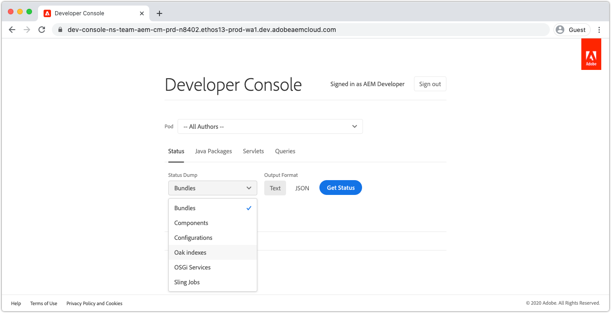
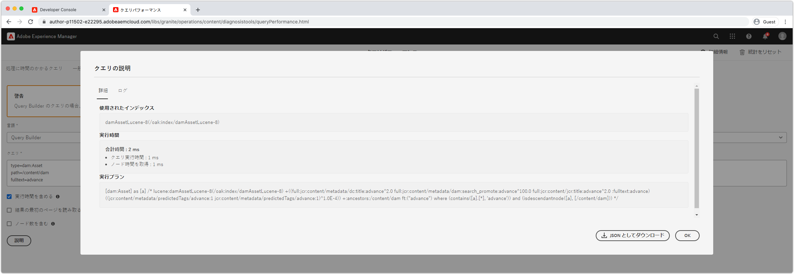

# Developer ConsoleでのCloud ServiceとしてのAEMのデバッグ

AEMCloud Serviceは、実行中のAEMサービスの様々な詳細を表示する各環境に対して開発者コンソールを提供します。この詳細はデバッグに役立ちます。

Cloud Service環境としての各AEMには、独自の開発者コンソールがあります。

## 開発者コンソールへのアクセス

Developer Consoleにアクセスして使用するには、[AdobeのAdmin Console](https://adminconsole.adobe.com)を介して、開発者のAdobe IDに次の権限を与える必要があります。

1. Cloud MangerおよびAEMにCloud Service製品として影響を与えたAdobe組織が、Adobe組織の切り替えボタンでアクティブであることを確認します。
1. 開発者は、Cloud Manager製品の&#x200B;__開発者 —Cloud Service__&#x200B;製品プロファイルのメンバーである必要があります。
   + このメンバーシップが存在しない場合、開発者はDeveloper Consoleにログインできません。
1. 開発者は、AEM Authorおよび発行サービスの&#x200B;__AEM Administrators__&#x200B;製品プロファイルのメンバーである必要があります。
   + このメンバーシップが存在しない場合、[status](#status)ダンプは401 Unauthorizedエラーでタイムアウトします。

### Developer Consoleへのアクセスのトラブルシューティング

#### 401ステータスのダンプ時の未承認エラー

ステータスをダンプする際に401 Unauthorizedエラーが報告される場合は、ユーザーがAEMに必要な権限を持っていないか、ログイントークンの使用が無効か期限切れであることを意味します。

401 Unauthorizedの問題を解決するには：

1. ユーザーが、Developer Consoleの関連AEMに対応する適切なAdobeIMS製品プロファイル(AEM AdministratorsまたはAEM Users)のメンバーであることを、Cloud Service製品インスタンスとして確認します。
   + Developer Consoleは2つのAdobeIMS製品インスタンスにアクセスします。AEMはCloud Serviceの作成者および発行製品インスタンスとして使用されているので、開発者コンソールを介したアクセスが必要なサービス層に応じて、適切な製品プロファイルが使用されていることを確認してください。
1. AEMにCloud Service（作成者または公開）としてログインし、ユーザーとグループが正しくAEMに同期されていることを確認します。
   + Developer Consoleでは、対応するAEMサービス層にユーザーレコードを作成し、そのサービス層に対して認証を行う必要があります。
1. ブラウザーのCookieとアプリケーションの状態(ローカルストレージ)を消去し、Developer Consoleに再ログインします。アクセストークンーDeveloper Consoleで正しく使用され、有効期限が切れていないことを確認します。

## ポッド

Cloud Service作成者サービスとしてのAEMと発行サービスは、トラフィックの変動と周期的な更新をダウンタイムなしに処理するために、それぞれ複数のインスタンスで構成されています。 これらのインスタンスは、「ポッド」と呼ばれます。 開発者コンソールのポッド選択は、他のコントロールを介して公開されるデータの範囲を定義します。

+ ポッドは、AEMサービス（作成者または発行）の一部である個別のインスタンスです
+ ポッドは一時的なもので、AEMはCloud Serviceが必要に応じてポッドを作成し、破棄します
+ Cloud Service環境として関連付けられたAEMに含まれるポッドのみが、環境のDeveloper Consoleのポッド切り替えボタンとして表示されます。
+ ポッド切り替えボタンの下部にある便利なオプションでは、サービスタイプ別にポッドを選択できます。
   + すべての発言者
   + すべての発行者
   + すべてのインスタンス

## ステータス

ステータスには、特定のAEMランタイム状態をテキストまたはJSON出力で出力するためのオプションが用意されています。 開発者コンソールは、AEM SDKのローカルクイックスタートのOSGi Webコンソールと同様の情報を提供しますが、開発者コンソールは読み取り専用とマークされています。

### バンドル

すべてのOSGiバンドルのリストをAEMにバンドルします。 この機能は、AEM SDKのローカルクイックスタートのOSGi Bundles](http://localhost:4502/system/console/bundles)(`/system/console/bundles`)に似ています。[

バンドルは次の方法でデバッグに役立ちます。

+ AEMにサービスとしてデプロイされたすべてのOSGiバンドルの一覧
+ 各OSGiバンドルの状態のリスト活動しているか否かを含む
+ OSGiバンドルがアクティブにならない原因となる未解決の依存関係への詳細の提供

### コンポーネント

コンポーネントリストは、AEMのすべてのOSGiコンポーネントを選択します。 この機能は、AEM SDKのローカルクイックスタートの`/system/console/components`にあるOSGiコンポーネント](http://localhost:4502/system/console/components)に似ています。[

コンポーネントは次の方法でデバッグするのに役立ちます。

+ AEMにデプロイされたすべてのOSGiコンポーネントをCloud Serviceとして一覧表示する
+ 各OSGiコンポーネントの状態の指定活動的か不満かを含む
+ 未満のサービス参照に詳細を指定すると、OSGiコンポーネントがアクティブにならなくなる場合があります。
+ OSGiコンポーネントにバインドされたOSGiプロパティとその値のリスト

### 設定

設定リストは、すべてのOSGiコンポーネントの設定（OSGiのプロパティと値）をします。 この機能は、AEM SDKのローカルクイックスタートのOSGi Configuration Manager](http://localhost:4502/system/console/configMgr)(`/system/console/configMgr`)に似ています。[

設定は、次の方法でデバッグするのに役立ちます。

+ OSGiコンポーネント別のOSGiプロパティとその値のリスト
+ 誤った設定のプロパティの特定と識別

### Oak インデックス

Oakインデックスは、`/oak:index`の下に定義されたノードのダンプを提供します。 AEMインデックスが変更された場合に、マージされたインデックスは表示されないことに注意してください。

Oakインデックスは、次の方法でデバッグに役立ちます。

+ AEMでの検索クエリの実行方法に関するインサイトを提供する、すべてのOak Index定義のリスト。 AEMインデックスに変更された場合、ここでは反映されません。 この表示は、AEMが提供するインデックス、またはカスタムコードが提供するインデックスのみで役立ちます。

### OSGiサービス

コンポーネントは、すべてのOSGiサービスをリストします。 この機能は、AEM SDKのローカルクイックスタートのOSGi Services](http://localhost:4502/system/console/services) (`/system/console/services`)に似ています。[

OSGi Servicesヘルプ：

+ AEM内のすべてのOSGiサービスの一覧、および提供するOSGiバンドルと、それを使用するすべてのOSGiバンドル

### Sling ジョブ

Sling JobsリストはすべてのSling Jobsキューを選択します。 この機能は、AEM SDKのローカルクイックスタートのジョブ](http://localhost:4502/system/console/slingevent) (`/system/console/slingevent`)に似ています。[

Slingジョブは、次の方法でデバッグする際に役立ちます。

+ Slingジョブキューとその設定の一覧
+ アクティブで、キューに登録され、処理されたSlingジョブの数に対するインサイトを提供します。これは、AEMでSlingジョブによって実行されるワークフロー、一時的なワークフロー、その他の作業の問題をデバッグするのに役立ちます。

## Javaパッケージ

Javaパッケージを使用すると、JavaパッケージとバージョンがAEMでCloud Serviceとして使用できるかどうかを確認できます。 この機能は、AEM SDKのローカルクイックスタートの[依存関係ファインダー](http://localhost:4502/system/console/depfinder) (`/system/console/depfinder`)と同じです。

Javaパッケージは、未解決のインポートまたはスクリプト（HTL、JSPなど）の未解決のクラスが原因で、バンドルが開始されていないのの撮影に問題を起こすために使用されます。 Javaパッケージレポートでバンドルが報告されない場合、Javaパッケージをエクスポートします（または、OSGiバンドルによってインポートされたバージョンとバージョンが一致しません）。

+ プロジェクトのAEM API maven依存関係のバージョンが環境のAEMリリースバージョンと一致していることを確認します（可能であれば、すべて最新のバージョンに更新してください）。
+ Mavenプロジェクトで追加のMaven依存関係が使用される場合
   + AEM SDK API依存関係が提供する代替APIを代わりに使用できるかどうかを判断します。
   + 追加の依存関係が必要な場合は、コアOSGiバンドルが`ui.apps`パッケージに埋め込まれるのと同様に、（プレーンJARではなく）OSGiバンドルとして提供され、プロジェクトのコードパッケージ(`ui.apps`)に埋め込まれていることを確認します。

## サーブレット

サーブレットは、AEMがURLをJavaサーブレットまたはスクリプト(HTL、JSP)に解決し、最終的に要求を処理する方法に関するインサイトを提供するために使用します。 この機能は、AEM SDKのローカルクイックスタートの[`/system/console/servletresolver`にあるSling Servlet Resolver](http://localhost:4502/system/console/servletresolver)と同じです。

サーブレットは、デバッグによる次の決定に役立ちます。

+ URLをアドレス指定可能な部分（リソース、セレクター、拡張子）に分解する方法。
+ URLが解決されるサーブレットまたはスクリプト。形式が正しくないURLや登録が正しくないサーブレット/スクリプトを特定するのに役立ちます。

## クエリ

クエリは、AEMで検索クエリが実行される内容と方法に関する洞察を提供するのに役立ちます。 この機能は、AEM SDKのローカルクイックスタートのツール/クエリパフォーマンス](http://localhost:4502/libs/granite/operations/content/diagnosistools/queryPerformance.html)コンソールと同じです。[

クエリは、特定のポッドが選択されている場合にのみ機能します。ポッドのクエリパフォーマンスWebコンソールが開くので、開発者はAEMサービスにログインするためのアクセス権を持つ必要があります。

クエリは、次の方法でデバッグするのに役立ちます。

+ Oakがクエリを解釈、分析、実行する方法を説明する。 これは、クエリの動作が遅い理由を追跡し、速度を上げる方法を理解する際に非常に重要です。
+ AEMで実行されている最も人気のあるクエリと説明機能のリスト。
+ AEMで実行されている最も遅いクエリを、説明機能と共にリストに表示する。
