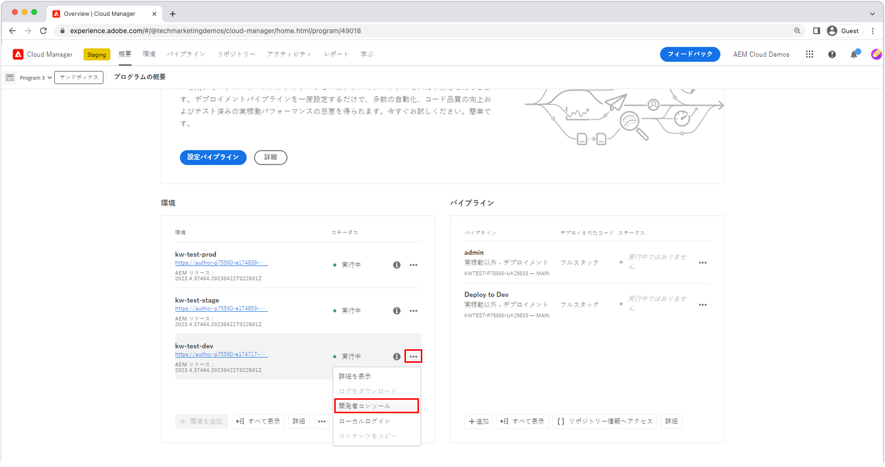

# Developer Console での AEM as a Cloud Service のデバッグ

AEM as a Cloud Service には、デバッグに役立つ、実行中の AEM サービスの様々な詳細を表示する Developer Console が環境ごとに用意されています。

各 AEM as a Cloud Service 環境には、専用の Developer Console があります。

## Developer Console に移動します。

Developer Console には、AEM as a Cloud Service 環境ごとに、Cloud Manager を介してアクセスします。

 に移動します。

1. __[Cloud Manager](https://my.cloudmanager.adobe.com/)__ に移動します。
2. AEM as a Cloud Service 環境を含んだ&#x200B;__プログラム__&#x200B;を開いて、Developer Console を開きます。
3. __環境__&#x200B;を見つけて、「`...`」を選択します。
4. ドロップダウンリストから、「__Developer Console__」を選択します。

## Developer Console へのアクセス

Developer Console にアクセスして使用するには、 [アドビの Admin Console](https://adminconsole.adobe.com) で開発者の Adobe ID に以下の権限が付与される必要があります。

1. Cloud Manager および AEM as a Cloud Service 製品を有効にしたアドビ組織が、アドビ組織スイッチャーでアクティブになっていることを確認します。
1. 開発者は、[Cloud Manager 製品&#x200B;__の開発者 - Cloud Service__ 製品プロファイル](https://experienceleague.adobe.com/docs/experience-manager-cloud-service/content/onboarding/journey/assign-profiles-cloud-manager.html?lang=ja#assign-developer)のメンバーであることが必要です。
   + このメンバーシップが存在しない場合、開発者は Developer Console にログインできません。
1. 開発者は、AEM オーサーまたはパブリッシュの [__AEM ユーザー__&#x200B;または __AEM 管理者__&#x200B;製品プロファイル](https://experienceleague.adobe.com/docs/experience-manager-cloud-service/content/onboarding/journey/assign-profiles-aem.html?lang=ja#aem-product-profiles)のメンバーであることが必要です。
   + このメンバーシップが存在しない場合、 [ステータス](#status)ダンプは 401 Unauthorized エラーでタイムアウトします。

### Developer Console へのアクセスのトラブルシューティング

#### ステータスのダンピング時の 401 Unauthorized エラー

ステータスのダンプに 401 Unauthorized エラーが報告される場合、AEM as a Cloud Service で必要な権限を持つユーザーがまだ存在していないか、使用するログイントークンが無効か、期限切れです。

401 Unauthorized の問題を解決するには、以下の手順を実行します。

1. ユーザーが、Developer Console に関連付けられている AEM as a Cloud Service 製品インスタンス向けの適切な Adobe IMS 製品プロファイル（AEM 管理者または AEM ユーザー）のメンバーであることを確認します。
   + Developer Console では、2 つの Adobe IMS 製品インスタンス（AEM as a Cloud Service のオーサーおよびパブリッシュ製品インスタンス）にアクセスするので、Developer Console からのアクセスが必要なサービス層に応じて、正しい製品プロファイルが使用されていることを確認します。
1. AEM as a Cloud Service（オーサーまたはパブリッシュ）にログインし、ユーザーとグループが AEM に正しく同期されていることを確認します。
   + Developer Console では、対応する AEM サービス層でユーザーレコードを作成して、そのサービス層に対して認証できるようにする必要があります。
1. ブラウザーの Cookie とアプリケーションの状態（ローカルストレージ）を消去し、Developer Console に再ログインしたあと、Developer Console で使用しているアクセストークンが正しく、期限切れでないことを確認します。

## ポッド

トラフィックの変動とローリング更新をダウンタイムなしで処理するために、AEM as a Cloud Service のオーサーサービスとパブリッシュサービスは、それぞれ複数のインスタンスで構成されています。 これらのインスタンスは、ポッドと呼ばれます。 Developer Console でポッドを選択すると、他のコントロールを使用して公開されるデータの範囲が定義されます。

+ ポッドは、AEM Service（オーサーまたはパブリッシュ）の一部を成す個別のインスタンスです
+ ポッドは一時的なもので、AEM as a Cloud Service が必要に応じて作成および破棄します。
+ 関連する AEM as a Cloud Service 環境の一部を成すポッドのみが、その環境の Developer Console のポッドスイッチャーに一覧表示されます。
+ ポッドスイッチャーの下部にある便利なオプションを使用すると、サービスタイプ別にポッドを選択できます。
   + すべてのオーサー
   + すべてのパブリッシュ
   + すべてのインスタンス

## ステータス

「ステータス」タブは、特定の AEM ランタイム状態をテキストまたは JSON 形式で出力するオプションを提供します。 Developer Console は、AEM SDK のローカルクイックスタートの OSGi web コンソールと同様の情報を提供しますが、大きな違いは Developer Console が読み取り専用であることです。

### バンドル

バンドルには、AEM 内のすべての OSGi バンドルが一覧表示されます。 この機能は、`/system/console/bundles` の [AEM SDK のローカルクイックスタートの OSGi バンドル](http://localhost:4502/system/console/bundles)に似ています。

「バンドル」は、次の方法でデバッグに役立ちます。

+ AEM as a Service にデプロイされたすべての OSGi バンドルを一覧表示する
+ アクティブかどうかを含め、各 OSGi バンドルのステートを一覧表示する
+ OSGi バンドルがアクティブにならない原因となっている未解決の依存関係に関する詳細を提供する

### コンポーネント

コンポーネントは、AEM 内のすべての OSGi コンポーネントをリストします。この機能は、`/system/console/components` にある [AEM SDK ローカルクイックスタートの OSGi コンポーネント](http://localhost:4502/system/console/components)と同様です。

「コンポーネント」は、次の方法でデバッグに役立ちます。

+ AEM as a Cloud Service にデプロイされているすべての OSGi コンポーネントを一覧表示する
+ アクティブか未解決かを含め、それぞれの OSGi コンポーネントの状態を提供する
+ OSGi コンポーネントがアクティブにならない原因となっている可能性のある未解決のサービス参照に関する詳細を提供する
+ OSGi コンポーネントにバインドされている OSGi プロパティとその値を一覧表示する。
   + これは、[OSGi 環境設定変数](https://experienceleague.adobe.com/docs/experience-manager-cloud-service/content/implementing/deploying/configuring-osgi.html?lang=ja#environment-specific-configuration-values)を通じて挿入された実際の値を表示します。

### 設定

設定には、OSGi コンポーネントのすべての設定（OSGi プロパティとその値）が一覧表示されます。この機能は、`/system/console/configMgr` にある [AEM SDK ローカルクイックスタートの OSGi 設定マネージャー](http://localhost:4502/system/console/configMgr)と同様です。

「設定」は、次の方法でデバッグに役立ちます。

+ OSGi プロパティとその値を OSGi コンポーネント別に一覧表示する
   + これは、[OSGi 環境設定変数](https://experienceleague.adobe.com/docs/experience-manager-cloud-service/content/implementing/deploying/configuring-osgi.html?lang=ja#environment-specific-configuration-values)を通じて挿入された実際の値を表示するものではありません。挿入された値については、上記の[コンポーネント](#components)を参照してください。
+ 誤って設定されたプロパティを特定し識別する

### Oak インデックス

Oak インデックスは、`/oak:index` 下に定義されたノードのダンプを提供します。AEM インデックスが変更されたときに発生する結合インデックスは表示されないことに注意してください。

「Oak インデックス」は、次の方法でデバッグに役立ちます。

+ AEM での検索クエリの実行方法に関するインサイトを提供するすべての Oak インデックス定義を一覧表示する。AEM インデックスに対する変更はここには反映されないことに注意してください。このビューは、AEM でのみ提供されるインデックスまたはカスタムコードでのみ提供されるインデックスの場合にのみ役に立ちます。

### OSGi サービス

コンポーネントは、すべての OSGi サービスを一覧表示します。この機能は、`/system/console/services`にある [AEM SDK ローカルクイックスタートの OSGi サービス](http://localhost:4502/system/console/services)と同様です。

「OSGi サービス」は、次の方法でデバッグに役立ちます。

+ AEM のすべての OSGi サービス、それぞれのサービスで提供される OSGi バンドルおよび使用されるすべての OSGi バンドルを一覧表示する

### Sling ジョブ

Sling ジョブには、すべての Sling ジョブキューが表示されます。この機能は、`/system/console/slingevent` にある [AEM SDK ローカルクイックスタートのジョブ](http://localhost:4502/system/console/slingevent)に似ています。

「Sling ジョブ」は、次の方法でデバッグに役立ちます。

+ Sling ジョブキューとその設定を一覧表示する
+ アクティブ、待機中および処理済みの Sling ジョブの数に関するインサイトを提供する（AEM の Sling ジョブで実行されるワークフロー、一時的なワークフローおよびその他の作業に関する問題のデバッグに役立ちます）。

## Java パッケージ

Java パッケージでは、Java パッケージとバージョンが AEM as a Cloud Service で使用できるかどうかを確認できます。この機能は、`/system/console/depfinder` にある [AEM SDK ローカルクイックスタートの依存関係ファインダー](http://localhost:4502/system/console/depfinder)と同じです。

Java パッケージを使用すると、未解決の読み込みやスクリプト（HTL や JSP など）内の未解決のクラスが原因でバンドルが起動されない問題をトラブルシューティングすることができます。Java パッケージを書き出しているバンドルがないと「Java パッケージ」タブにレポートされる場合（またはバージョンが OSGi バンドルで読み込まれたバージョンと一致しない場合）は、以下の指示に従います。

+ プロジェクトの AEM API Maven 依存関係のバージョンが、環境の AEM リリースバージョンと一致することを確認します（また、可能な場合はすべてを最新のバージョンに更新します）。
+ Maven プロジェクトで追加の Maven 依存関係が使用されている場合は、以下の指示に従います。
   + AEM SDK API の依存関係で提供されている代替 API を代わりに使用できるかどうかを判断します。
   + 追加の依存関係が必要な場合は、それが（普通の Jar ではなく）OSGi バンドルとして提供されることと、コア OSGi バンドルを `ui.apps` パッケージに組み込む場合と同様の方法でプロジェクトのコードパッケージ（`ui.apps`）に組み込まれることを確認します。

## サーブレット

「サーブレット」タブは、AEM が URL を、最終的にリクエストを処理する Java サーブレットやスクリプト（HTL、JSP）に解決する方法に関するインサイトを提供するために使用します。この機能は、`/system/console/servletresolver`にある [AEM SDK ローカルクイックスタートの Sling サーブレットリゾルバー](http://localhost:4502/system/console/servletresolver)と同じです。

「サーブレット」タブはデバッグに役立ち、次の情報を確認できます。

+ URL をそのアドレス可能な部分（リソース、セレクター、拡張子）に分解する方法。
+ URL が解決されるサーブレットまたはスクリプト（正しくない形式の URL や誤って登録されたサーブレット／スクリプトの識別に役立ちます）。

## クエリ

「クエリ」タブは、AEM での検索クエリの実行内容および方法に関するインサイトを提供します。この機能は、[AEM SDK ローカルクイックスタートのツール／クエリパフォーマンス](http://localhost:4502/libs/granite/operations/content/diagnosistools/queryPerformance.html)コンソールと同じです。

「クエリ」タブは、特定のポッドが選択されている場合にのみ機能します。これは、そのポッドのクエリパフォーマンス web コンソールを開くので、開発者が AEM サービスにログインするためのアクセス権を持っている必要があるからです。

「クエリ」タブは、次の方法でデバッグに役立ちます。

+ Oak によるクエリの解釈、分析および実行方法を説明する。 これは、クエリの処理速度が遅い理由を追跡し高速化する方法を理解するうえで非常に重要です。
+ AEM で実行中の最も一般的なクエリを一覧表示し、それらのクエリを説明する機能を提供する。
+ AEM で実行中の最も遅いクエリを一覧表示し、それらのクエリを説明する機能を提供する。
