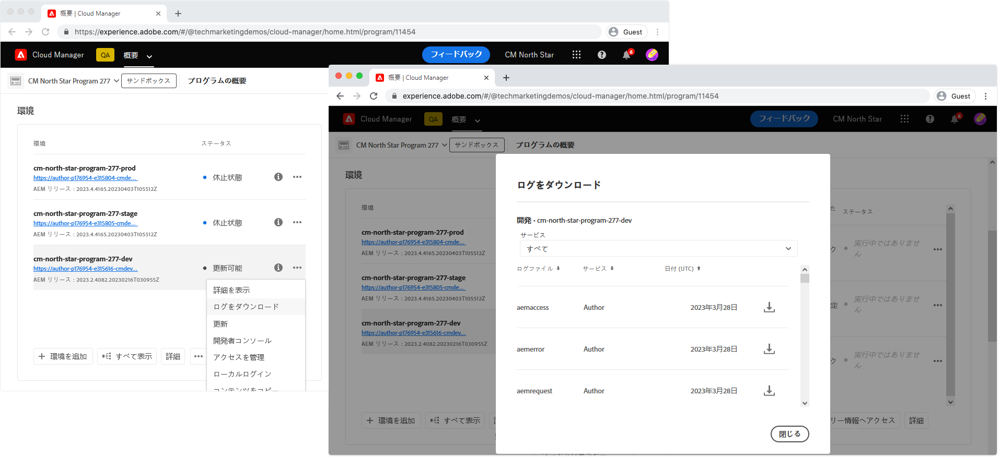

# ログを使用したCloud ServiceとしてのAEMのデバッグ

ログは、AEMでAEMアプリケーションをCloud Serviceとしてデバッグする際の最前線として機能しますが、デプロイされたAEMアプリケーションでの適切なログの記録に依存します。

特定の環境のAEMサービス（作成者、発行/発行ディスパッチャー）のすべてのログアクティビティは、そのサービス内の別のポッドがログステートメントを生成した場合でも、単一のログファイルに統合されます。

ポッドIDは各ログステートメントに提供され、ログステートメントのフィルタリングまたは照合を可能にします。 ポッドIDの形式は次のとおりです。

+ `cm-p<PROGRAM ID>-e<ENVIRONMENT ID>-aem-<author|publish>-<POD NAME>`
+ 例: `cm-p12345-e56789-aem-author-abcdefabde-98765`

## カスタムログファイル

AEM asCloud Servicesはカスタムログファイルをサポートしませんが、カスタムログはサポートしています。

AEMでJavaログをCloud Serviceとして([Cloud Manager](#cloud-manager)または[Adobe I/OCLI](#aio)を介して)利用できるようにするには、カスタムログ文を`error.log`に記述する必要があります。 `example.log`などのカスタム名付きログに書き込まれたログは、AEMからCloud Serviceとしてアクセスできません。

## AEM AuthorとPublishのサービスログ

AEM AuthorサービスとPublishサービスの両方で、AEMランタイムサーバーログが提供されます。

+ `aemerror` はJavaエラーログです(AEM SDKのローカルクイックスタート `/crx-quickstart/error.log` にあります)。環境タイプごとのカスタムロガーの[推奨ログレベル](#log-levels)を次に示します。
   + 開発: `DEBUG`
   + ステージ: `WARN`
   + 実稼動: `ERROR`
+ `aemaccess` 詳細を含むAEMサービスへのリストHTTP要求
+ `aemrequest` リストAEMサービスに対して行われたHTTP要求と、それに対応するHTTP応答

## AEM発行ディスパッチャーログ

Apache WebサーバーとディスパッチャーのログはAEM発行ディスパッチャーのみが提供します。これらの要素はAEM発行層にのみ存在し、AEM作成者層には存在しません。

+ `httpdaccess` AEMサービスのApache Webサーバー/ディスパッチャーに対して行われたリストHTTPリクエスト。
+ `httperror`  リストは、Apache Webサーバーからのメッセージをログに記録し、などのサポートされるApacheモジュールのデバッグに役立ち `mod_rewrite`ます。
   + 開発: `DEBUG`
   + ステージ: `WARN`
   + 実稼動: `ERROR`
+ `aemdispatcher` リストは、フィルタリングやキャッシュメッセージからの提供など、ディスパッチャーモジュールからのメッセージをログに記録します。
   + 開発: `DEBUG`
   + ステージ: `WARN`
   + 実稼動: `ERROR`

## Cloud Manager{#cloud-manager}

AdobeCloud Managerでは、環境のログのダウンロードアクションを使用して、ログを日別にダウンロードできます。



これらのログは、任意のログ分析ツールを使用してダウンロードおよび検査できます。

## Adobe I/OCLIとCloud Managerプラグイン{#aio}

AdobeCloud Managerは、[Adobe I/OCLI](https://github.com/adobe/aio-cli)を介したCloud ServiceログとしてのAEMへのアクセスをサポートしています。Adobe I/OCLI](https://github.com/adobe/aio-cli-plugin-cloudmanager)用の[Cloud Managerプラグインを使用します。

まず、[Cloud Managerプラグイン](../../local-development-environment/development-tools.md#aio-cli)でAdobe I/Oを設定します。

関連するプログラムIDと環境IDが特定されていることを確認し、[リスト利用可能なログオプション](https://github.com/adobe/aio-cli-plugin-cloudmanager#aio-cloudmanagerlist-available-log-options-environmentid)を使用して、[tail](#aio-cli-tail-logs)または[download](#aio-cli-download-logs)ログに使用するログオプションをリストします。

```
$ aio cloudmanager:list-programs
Program Id Name      Enabled 
14304      Program 1 true    
11454      Program 2 true 
11502      Program 3 true    

$ aio config:set cloudmanager_programid <PROGRAM ID>

$ aio cloudmanager:list-environments        
Environment Id Name            Type  Description 
22295          program-3-dev   dev               
22310          program-3-prod  prod              
22294          program-3-stage stage   

$ aio cloudmanager:list-available-log-options <ENVIRONMENT ID>
Environment Id Service    Name          
22295          author     aemaccess     
22295          author     aemerror      
22295          author     aemrequest    
22295          publish    aemaccess     
22295          publish    aemerror      
22295          publish    aemrequest    
22295          dispatcher httpdaccess   
22295          dispatcher httpderror    
22295          dispatcher aemdispatcher 
```

### 尾行ログ{#aio-cli-tail-logs}

Adobe I/OCLIは、[tail-logs](https://github.com/adobe/aio-cli-plugin-cloudmanager#aio-cloudmanagertail-log-environmentid-service-name)コマンドを使用して、AEMからリアルタイムでログをCloud Serviceとして記録する機能を提供します。 尾行は、AEM上でCloud Service環境としてアクションが実行される際に、リアルタイムログアクティビティを監視するのに役立ちます。

```
$ aio config:set cloudmanager_programid <PROGRAM ID>
$ aio cloudmanager:tail-logs <ENVIRONMENT ID> <SERVICE> <NAME>
```

`grep`などの他のコマンドラインツールは、`tail-logs`と連携して、関心のあるログ文を分離するのに役立ちます。次に例を示します。

```
$ aio cloudmanager:tail-logs 12345 author | grep com.example.MySlingModel
```

...`com.example.MySlingModel`から生成されたログ文のみを表示するか、その中にその文字列を含めます。

### ログのダウンロード{#aio-cli-download-logs}

Adobe I/OCLIは、[download-logs](https://github.com/adobe/aio-cli-plugin-cloudmanager#aio-cloudmanagerdownload-logs-environmentid-service-name-days))コマンドを使用して、AEMからログをCloud Serviceとしてダウンロードする機能を提供します。 これにより、Cloud Manager Web UIからログをダウンロードした場合と同じ結果になります。異なるのは、`download-logs`コマンドにより、ログの要求日数に基づいて、日単位でログが統合される点です。

```
$ aio config:set cloudmanager_programid <PROGRAM ID>
$ aio cloudmanager:download-logs <ENVIRONMENT> <SERVICE> <NAME> <DAYS>
```

## ログについて

AEMにCloud Serviceとしてログインすると、複数のポッドがログ文を書き込みます。 複数のAEMインスタンスが同じログファイルに書き込むので、デバッグ中に分析し、ノイズを低減する方法を理解することが重要です。 説明するために、次の`aemerror`ログスニペットが使用されます。

```
01.01.2020 12:00:00.000 [cm-p12345-e56789-aem-author-abcdefg-1111] *DEBUG* [qtp2078364989-269] com.example.components.impl.ExampleModelImpl Preparing to collect resources
01.01.2020 12:00:01.002 [cm-p12345-e56789-aem-author-abcdefg-2222] *WARN*  [qtp40782847611-87] com.example.services.impl.ExampleServiceImpl Unable to resolve resource [ /content/example ] to a resource. Aborting.
01.01.2020 12:00:02.003 [cm-p12345-e56789-aem-author-abcdefg-1111] *ERROR* [qtp2078364989-269] com.example.components.impl.ExampleModelImpl Unable to collect any resources
```

日時以降のデータポイントであるポッドIDを使用して、ログをポッドまたはサービス内のAEMインスタンスで照合できるので、コードの実行のトレースと理解が容易です。

__ポッドcm-p12345-e56789-aem-author-abcdefg-1111__

```
01.01.2020 12:00:00.000 [cm-p12345-e56789-aem-author-abcdefg-1111] *DEBUG* [qtp2078364989-269] com.example.components.impl.ExampleModelImpl Preparing to collect resources
01.01.2020 12:00:02.003 [cm-p12345-e56789-aem-author-abcdefg-1111] *ERROR* [qtp2078364989-269] com.example.components.impl.ExampleModelImpl Unable to collect any resources
```

__ポッドcm-p12345-e56789-aem-author-abcdefg-2222__

```
01.01.2020 12:00:01.002 [cm-p12345-e56789-aem-author-abcdefg-2222] *WARN*  [qtp2078364989-269] com.example.services.impl.ExampleServiceImpl Unable to resolve resource [ /content/example ] to a resource. Aborting.
```

## 推奨ログレベル{#log-levels}

AdobeのAEMごとのログレベルに関する一般的なガイダンスは、次のとおりです。Cloud Service環境

+ ローカル開発(AEM SDK):`DEBUG`
+ 開発: `DEBUG`
+ ステージ: `WARN`
+ 実稼動: `ERROR`

AEMをCloud Serviceとして使用する場合は、各環境タイプに対して最も適切なログレベルを設定します。ログレベルはコード内に保持されます

+ Javaログ設定はOSGi設定で維持されます
+ ディスパッチャープロジェクト内のApache Webサーバーおよびディスパッチャーのログレベル

...したがって、変更するには展開が必要になります。

### Javaログレベルを設定する環境固有の変数

各環境に静的な既知のJavaログレベルを設定する代わりに、AEMをCloud Serviceの[環境固有の変数](https://docs.adobe.com/content/help/en/experience-manager-cloud-service/implementing/deploying/configuring-osgi.html#environment-specific-configuration-values)として使用し、ログレベルをパラメータ化し、[Adobe I/OCLIとCloud Manager plugin](#aio-cli)を使用して値を動的に変更できます。

これには、環境固有の変数プレースホルダーを使用するようにOSGi設定のログを更新する必要があります。 [ログレベルのデフォルト](https://docs.adobe.com/content/help/en/experience-manager-cloud-service/implementing/deploying/configuring-osgi.html#default-values) 値は、 [Adobeの推奨に従って設定する必要があります](#log-levels)。次に例を示します。

`/apps/example/config/org.apache.sling.commons.log.LogManager.factory.config-example.cfg.json`

```
{
    "org.apache.sling.commons.log.names": ["com.example"],
    "org.apache.sling.commons.log.level": "$[env:LOG_LEVEL;default=DEBUG]"
}
```

このアプローチは、次の点を考慮する必要があるマイナス面を持っています。

+ [環境変数の数には限りがあり](https://docs.adobe.com/content/help/en/experience-manager-cloud-service/implementing/deploying/configuring-osgi.html#number-of-variables)、ログレベルを管理する変数を作成する場合は1つを使用します。
+ 環境変数は、[Adobe I/OCLI](https://github.com/adobe/aio-cli-plugin-cloudmanager#aio-cloudmanagerset-environment-variables-environmentid)または[Cloud Manager HTTP API](https://docs.adobe.com/content/help/en/experience-manager-cloud-service/implementing/deploying/configuring-osgi.html#cloud-manager-api-format-for-setting-properties)を介してのみプログラムで管理できます。
+ 環境変数に対する変更は、サポートされているツールで手動でリセットする必要があります。 実稼働環境などの高トラフィック環境をより冗長なログレベルにリセットし忘れた場合、ログが増大し、AEMのパフォーマンスに影響を与える可能性があります。

_環境固有の変数は、Apache Webサーバーやディスパッチャーログの設定では動作しません。これは、これらの変数がOSGi設定を介して設定されないためです。_