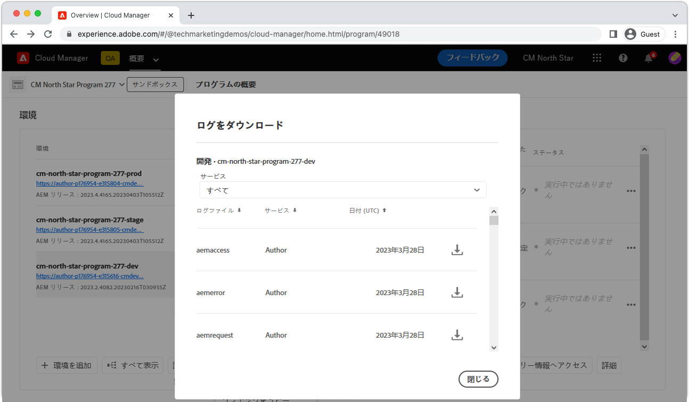
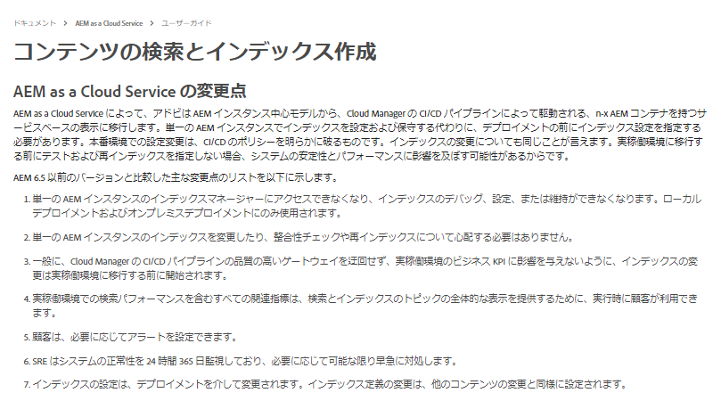

# トラバーサルの警告

>[!TIP]
>今後の参照用に、このページをブックマークに追加してください。

_トラバーサルの警告とは_

トラバーサルの警告は、パフォーマンスの低いクエリが AEM パブリッシュサービスで実行されていることを示す __aemerror__ ログステートメントです。トラバーサル警告は通常、AEM で次の 2 つの方法で表示されます。

1. インデックスを使用しない&#x200B;__低速クエリ__&#x200B;によって、応答時間が遅くなる。
1. __失敗したクエリ__&#x200B;が `RuntimeNodeTraversalException` をスローして、エクスペリエンスが損なわれる。

トラバーサルの警告をオフにすると、AEM のパフォーマンスが低下し、ユーザーのエクスペリエンスが壊れる場合があります。

## トラバーサルの警告を解決する方法

トラバーサル警告の軽減には、分析、調整、検証の 3 つの簡単な手順を使用してアプローチできます。最適な調整を特定する前に、調整と検証を数回繰り返すことを想定してください。

<div class="columns is-multiline">

<!-- Analyze -->
<div class="column is-half-tablet is-half-desktop is-one-third-widescreen" aria-label="Analyze" tabindex="0">
   <div class="x-card">
       <div class="card-image">
           <figure class="image is-16by9">
               <a href="#analyze" title="分析" tabindex="-1">
                   
               </a>
           </figure>
       </div>
       <div class="card-content is-padded-small">
           <div class="content">
                <p class="headline is-size-5 has-text-weight-bold">問題を分析</p>
               <p class="is-size-6">トラバースしているクエリを特定し、理解します。</p>
               <a href="#analyze" class="spectrum-Button spectrum-Button--outline spectrum-Button--primary spectrum-Button--sizeM">
                   <span class="spectrum-Button-label has-no-wrap has-text-weight-bold">分析</span>
               </a>
           </div>
       </div>
   </div>
</div>

<!-- Adjust -->
<div class="column is-half-tablet is-half-desktop is-one-third-widescreen" aria-label="Adjust" tabindex="0">
   <div class="x-card">
       <div class="card-image">
           <figure class="image is-16by9">
               <a href="#adjust" title="調整" tabindex="-1">
                   
               </a>
           </figure>
       </div>
       <div class="card-content is-padded-small">
           <div class="content">
                <p class="headline is-size-5 has-text-weight-bold">コードまたは設定を調整する</p>
               <p class="is-size-6">クエリトラバーサルを避けるために、クエリとインデックスを更新します。</p>
               <a href="#adjust" class="spectrum-Button spectrum-Button--outline spectrum-Button--primary spectrum-Button--sizeM">
                   <span class="spectrum-Button-label has-no-wrap has-text-weight-bold">調整</span>
               </a>
           </div>
       </div>
   </div>
</div>

<!-- Verify -->
<div class="column is-half-tablet is-half-desktop is-one-third-widescreen" aria-label="Verify" tabindex="0">
   <div class="x-card">
       <div class="card-image">
           <figure class="image is-16by9">
               <a href="#verify" title="確認" tabindex="-1">
                   
               </a>
           </figure>
       </div>
       <div class="card-content is-padded-small">
           <div class="content">
                <p class="headline is-size-5 has-text-weight-bold">調整が行われたことを確認します</p>                       
               <p class="is-size-6">クエリとインデックスの変更を検証すると、トラバーサルが削除されます。</p>
               <a href="#verify" class="spectrum-Button spectrum-Button--outline spectrum-Button--primary spectrum-Button--sizeM">
                   <span class="spectrum-Button-label has-no-wrap has-text-weight-bold">検証</span>
               </a>
           </div>
       </div>
   </div>
</div>

</div>

## &#x200B;1. 分析{#analyze}

まず、トラバーサルの警告を表示している AEM パブリッシュサービスを特定します。 これを行うには、Cloud Managerから [ パブリッシュサービスの `aemerror` ログをダウンロード ](https://experienceleague.adobe.com/docs/experience-manager-learn/cloud-service/debugging/debugging-aem-as-a-cloud-service/logs.html#cloud-manager?lang=ja){target="_blank"} 過去 __3 日間）すべての環境（開発、ステージング、実稼動__ から行います。



ログファイルを開き、Java™クラス `org.apache.jackrabbit.oak.plugins.index.Cursors$TraversingCursor` を検索します。トラバーサルの警告を含むログには、次のような一連の文が含まれます。

```log
24.05.2022 14:18:46.146 [cm-p123-e456-aem-author-9876-edcba] *WARN* [192.150.10.214 [1653401908419] GET /content/wknd/us/en/example.html HTTP/1.1] 
org.apache.jackrabbit.oak.plugins.index.Cursors$TraversingCursor Traversed 5000 nodes with filter 
Filter(query=select [jcr:path], [jcr:score], * from [nt:base] as a where [xyz] = 'abc' and isdescendantnode(a, '/content') 
/* xpath: /jcr:root/content//element(*, nt:base)[(@xyz = 'abc')] */, path=/content//*, property=[xyz=[abc]]) 
called by apps.wknd.components.search.example__002e__jsp._jspService; 
consider creating an index or changing the query
```

クエリの実行状況に応じて、ログステートメントには、クエリの作成者に関する次の役立つ情報が含まれる場合があります。

+ クエリの実行に関連付けられた HTTP リクエスト URL

   + 例：`GET /content/wknd/us/en/example.html HTTP/1.1`

+ Oak クエリ構文

   + 例：`select [jcr:path], [jcr:score], * from [nt:base] as a where [xyz] = 'abc' and isdescendantnode(a, '/content')`

+ XPath クエリ

   + 例：`/jcr:root/content//element(*, nt:base)[(@xyz = 'abc')] */, path=/content//*, property=[xyz=[abc]])`

+ クエリを実行するコード

   + 例:  `apps.wknd.components.search.example__002e__jsp._jspService` → `/apps/wknd/components/search/example.html`

__失敗したクエリ__ が後に続く `RuntimeNodeTraversalException` 文。次のようになります。

```log
24.05.2022 14:18:47.240 [cm-p123-e456-aem-author-9876-edcba] *WARN* [192.150.10.214 [1653401908419] GET /content/wknd/us/en/example.html HTTP/1.1] 
org.apache.jackrabbit.oak.query.FilterIterators The query read or traversed more than 100000 nodes.
org.apache.jackrabbit.oak.query.RuntimeNodeTraversalException: 
    The query read or traversed more than 100000 nodes. To avoid affecting other tasks, processing was stopped.
    ...
```

## &#x200B;2. 調整{#adjust}

問題のあるクエリとその呼び出しコードが見つかったら、調整を行う必要があります。 トラバーサルの警告を軽減するために、次の 2 種類の調整を行うことができます。

### クエリを調整

__クエリを変更__&#x200B;して、既存のインデックス制限に解決する新しいクエリ制限を追加します。 可能であれば、インデックスを変更するよりもクエリを変更することをお勧めします。

+ [ クエリのパフォーマンスを調整する方法を説明します ](https://experienceleague.adobe.com/docs/experience-manager-65/developing/bestpractices/troubleshooting-slow-queries.html#query-performance-tuning?lang=ja){target="_blank"}。

### インデックスの調整

__AEM インデックスを変更（または作成）__&#x200B;して、既存のクエリ制限をインデックスの更新で解決できるようにします。

+ [ 既存のインデックスを調整する方法を学ぶ ](https://experienceleague.adobe.com/docs/experience-manager-65/developing/bestpractices/troubleshooting-slow-queries.html#query-performance-tuning?lang=ja){target="_blank"}
+ [ インデックスの作成方法を学ぶ ](https://experienceleague.adobe.com/docs/experience-manager-65/developing/bestpractices/troubleshooting-slow-queries.html#create-a-new-index?lang=ja){target="_blank"}

## &#x200B;3. 検証{#verify}

クエリ、インデックス、またはその両方に対して行われた調整は、トラバーサルの警告を軽減するために検証する必要があります。


[ クエリの調整 ](#adjust-the-query) のみを行う場合、クエリはDeveloper Console [ クエリの説明 ](https://experienceleague.adobe.com/docs/experience-manager-learn/cloud-service/debugging/debugging-aem-as-a-cloud-service/developer-console.html?lang=ja#queries){target="_blank"} を介して、AEM as a Cloud Service上で直接テストできます。 AEM オーサーサービスに対して説明クエリを実行しますが、インデックス定義は作成者サービスとパブリッシュサービスで同じなので、AEM オーサーサービスに対してクエリを検証すれば十分です。

[インデックスの調整](#adjust-the-index)を行う場合は、インデックスを AEM as a Cloud Service にデプロイする必要があります。 インデックスの調整がデプロイされた状態では、Developer Consoleの [ 説明クエリ ](https://experienceleague.adobe.com/docs/experience-manager-learn/cloud-service/debugging/debugging-aem-as-a-cloud-service/developer-console.html?lang=ja#queries){target="_blank"} を使用して、クエリを実行してさらに調整できます。

最終的に、すべての変更（クエリとコード）は Git にコミットされ、Cloud Manager を使用して AEM as a Cloud Serviceにデプロイされます。 デプロイ後、元のトラバーサル警告に関連付けられたコードパスをテストし、トラバーサル警告が `aemerror` ログに表示されないことを確認します。

## その他のリソース

AEM のインデックス、検索、トラバーサルの警告について理解するために、その他の役に立つリソースを確認します。

<div class="columns is-multiline">

<!-- Cloud 5 - Search &amp; Indexing -->
<div class="column is-half-tablet is-half-desktop is-one-third-widescreen" aria-label="Cloud 5 - Search &amp; Indexing" tabindex="0">
   <div class="card">
       <div class="card-image">
           <figure class="image is-16by9">
               <a href="https://experienceleague.adobe.com/docs/experience-manager-learn/cloud-service/expert-resources/cloud-5/cloud5-aem-search-and-indexing.html?lang=ja" title="Cloud 5 - 検索とインデックス作成" tabindex="-1"></a>
           </figure>
       </div>
       <div class="card-content is-padded-small">
           <div class="content">
               <p class="headline is-size-6 has-text-weight-bold"><a href="https://experienceleague.adobe.com/docs/experience-manager-learn/cloud-service/expert-resources/cloud-5/cloud5-aem-search-and-indexing.html?lang=ja" title="Cloud 5 - 検索とインデックス作成">Cloud 5 - 検索とインデックス作成</a></p>
               <p class="is-size-6">Cloud 5 チームが、AEM as a Cloud Service での検索とインデックス作成の詳細について説明します。</p>
               <a href="https://experienceleague.adobe.com/docs/experience-manager-learn/cloud-service/expert-resources/cloud-5/cloud5-aem-search-and-indexing.html?lang=ja" class="spectrum-Button spectrum-Button--outline spectrum-Button--primary spectrum-Button--sizeM">
                   <span class="spectrum-Button-label has-no-wrap has-text-weight-bold">詳細情報</span>
               </a>
           </div>
       </div>
   </div>
</div>

<!-- Content Search and Indexing -->
<div class="column is-half-tablet is-half-desktop is-one-third-widescreen" aria-label="Content Search and Indexing
" tabindex="0">
   <div class="card">
       <div class="card-image">
           <figure class="image is-16by9">
               <a href="https://experienceleague.adobe.com/docs/experience-manager-cloud-service/content/operations/indexing.html?lang=ja" title="コンテンツの検索とインデックス作成" tabindex="-1">
                   
               </a>
           </figure>
       </div>
       <div class="card-content is-padded-small">
           <div class="content">
               <p class="headline is-size-6 has-text-weight-bold"><a href="https://experienceleague.adobe.com/docs/experience-manager-cloud-service/content/operations/indexing.html?lang=ja" title="コンテンツの検索とインデックス作成">コンテンツの検索とインデックス作成に関するドキュメント</a></p>
               <p class="is-size-6">AEM as a Cloud Service でインデックスを作成および管理する方法について学習します。</p>
               <a href="https://experienceleague.adobe.com/docs/experience-manager-cloud-service/content/operations/indexing.html?lang=ja" class="spectrum-Button spectrum-Button--outline spectrum-Button--primary spectrum-Button--sizeM">
                   <span class="spectrum-Button-label has-no-wrap has-text-weight-bold">詳細情報</span>
               </a>
           </div>
       </div>
   </div>
</div>

<!-- Modernizing your Oak indexes -->
<div class="column is-half-tablet is-half-desktop is-one-third-widescreen" aria-label="Modernizing your Oak indexes" tabindex="0">
   <div class="card">
       <div class="card-image">
           <figure class="image is-16by9">
               <a href="https://experienceleague.adobe.com/docs/experience-manager-learn/cloud-service/migration/moving-to-aem-as-a-cloud-service/search-and-indexing.html?lang=ja" title="Oak インデックスの最新化" tabindex="-1">
                   
               </a>
           </figure>
       </div>
       <div class="card-content is-padded-small">
           <div class="content">
               <p class="headline is-size-6 has-text-weight-bold"><a href="https://experienceleague.adobe.com/docs/experience-manager-learn/cloud-service/migration/moving-to-aem-as-a-cloud-service/search-and-indexing.html?lang=ja" title="Oak インデックスの最新化">Oak インデックスの最新化</a></p>
               <p class="is-size-6">AEM 6 Oak インデックス定義を AEMas a Cloud Service 互換に変換し、今後インデックスを維持する方法を学習します。</p>
               <a href="https://experienceleague.adobe.com/docs/experience-manager-learn/cloud-service/migration/moving-to-aem-as-a-cloud-service/search-and-indexing.html?lang=ja" class="spectrum-Button spectrum-Button--outline spectrum-Button--primary spectrum-Button--sizeM">
                   <span class="spectrum-Button-label has-no-wrap has-text-weight-bold">詳細情報</span>
               </a>
           </div>
       </div>
   </div>
</div>

<!-- Index definition documentation -->
<div class="column is-half-tablet is-half-desktop is-one-third-widescreen" aria-label="Index definition documentation" tabindex="0">
   <div class="card">
       <div class="card-image">
           <figure class="image is-16by9">
               <a href="https://jackrabbit.apache.org/oak/docs/query/lucene.html" title="インデックス定義ドキュメント" tabindex="-1">
                   
               </a>
           </figure>
       </div>
       <div class="card-content is-padded-small">
           <div class="content">
               <p class="headline is-size-6 has-text-weight-bold"><a href="https://jackrabbit.apache.org/oak/docs/query/lucene.html" title="インデックス定義ドキュメント">Lucene インデックスに関するドキュメント</a></p>
               <p class="has-ellipsis is-size-6">サポートされる Lucene インデックス設定がすべて文書化されている Apache Oak Jackrabbit Lucene インデックスリファレンス</p>
               <a href="https://jackrabbit.apache.org/oak/docs/query/lucene.html" class="spectrum-Button spectrum-Button--outline spectrum-Button--primary spectrum-Button--sizeM">
                   <span class="spectrum-Button-label has-no-wrap has-text-weight-bold">詳細情報</span>
               </a>
           </div>
       </div>
   </div>
</div>

</div>
