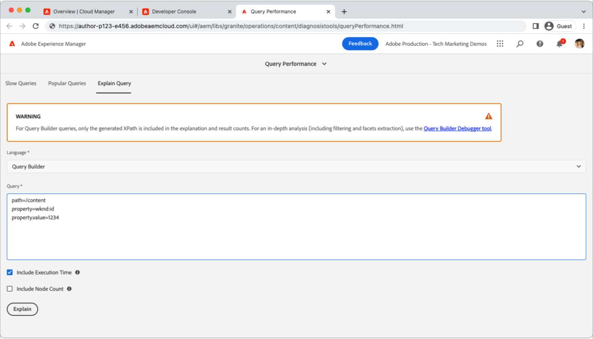

# トラバーサルの警告

>[!TIP]
>このページを後で参照できるようにブックマークします。

_トラバーサル警告とは_

トラバーサルの警告は次のとおりです __aeerror__ パフォーマンスの低いクエリを示すログステートメントが AEM パブリッシュサービスで実行されている。 トラバーサル警告は通常、AEMで次の 2 つの方法で表示されます。

1. __処理に時間のかかるクエリ__ インデックスを使用しない場合は、応答時間が遅くなります。
1. __失敗したクエリ__、 `RuntimeNodeTraversalException`その結果、エクスペリエンスが壊れてしまいます。

トラバーサル警告をオフにすると、AEMのパフォーマンスが低下し、ユーザーのエクスペリエンスが壊れる場合があります。

## トラバーサルの警告を解決する方法

トラバーサル警告の軽減は、次の 3 つの簡単な手順を使用してアプローチできます。分析、調整、検証 最適な調整を特定する前に、調整と検証の反復をいくつか期待します。

<div class="columns is-multiline">

<!-- Analyze -->
<div class="column is-half-tablet is-half-desktop is-one-third-widescreen" aria-label="Analyze" tabindex="0">
   <div class="x-card">
       <div class="card-image">
           <figure class="image is-16by9">
               <a href="#analyze" title="分析" tabindex="-1">
                   
               </a>
           </figure>
       </div>
       <div class="card-content is-padded-small">
           <div class="content">
                <p class="headline is-size-5 has-text-weight-bold">問題を分析</p>
               <p class="is-size-6">トラバースしているクエリを特定し、理解します。</p>
               <a href="#analyze" class="spectrum-Button spectrum-Button--outline spectrum-Button--primary spectrum-Button--sizeM">
                   <span class="spectrum-Button-label has-no-wrap has-text-weight-bold">分析</span>
               </a>
           </div>
       </div>
   </div>
</div>

<!-- Adjust -->
<div class="column is-half-tablet is-half-desktop is-one-third-widescreen" aria-label="Adjust" tabindex="0">
   <div class="x-card">
       <div class="card-image">
           <figure class="image is-16by9">
               <a href="#adjust" title="調整" tabindex="-1">
                   
               </a>
           </figure>
       </div>
       <div class="card-content is-padded-small">
           <div class="content">
                <p class="headline is-size-5 has-text-weight-bold">コードまたは設定を調整する</p>
               <p class="is-size-6">クエリトラバーサルを避けるために、クエリとインデックスを更新します。</p>
               <a href="#adjust" class="spectrum-Button spectrum-Button--outline spectrum-Button--primary spectrum-Button--sizeM">
                   <span class="spectrum-Button-label has-no-wrap has-text-weight-bold">調整</span>
               </a>
           </div>
       </div>
   </div>
</div>

<!-- Verify -->
<div class="column is-half-tablet is-half-desktop is-one-third-widescreen" aria-label="Verify" tabindex="0">
   <div class="x-card">
       <div class="card-image">
           <figure class="image is-16by9">
               <a href="#verify" title="確認" tabindex="-1">
                   
               </a>
           </figure>
       </div>
       <div class="card-content is-padded-small">
           <div class="content">
                <p class="headline is-size-5 has-text-weight-bold">調整が行われたことを確認します</p>                       
               <p class="is-size-6">クエリとインデックスの変更を検証すると、トラバーサルが削除されます。</p>
               <a href="#verify" class="spectrum-Button spectrum-Button--outline spectrum-Button--primary spectrum-Button--sizeM">
                   <span class="spectrum-Button-label has-no-wrap has-text-weight-bold">検証</span>
               </a>
           </div>
       </div>
   </div>
</div>

</div>

## 1.分析{#analyze}

まず、トラバーサル警告を表示している AEM パブリッシュサービスを特定します。 これをおこなうには、Cloud Manager で、 [パブリッシュサービスのダウンロード `aemerror` ログ](https://experienceleague.adobe.com/docs/experience-manager-learn/cloud-service/debugging/debugging-aem-as-a-cloud-service/logs.html#cloud-manager)過去のすべての環境（開発、ステージング、実稼動）の {target=&quot;_blank&quot;} __三日__.


ログファイルを開き、Java™クラスを検索します。 `org.apache.jackrabbit.oak.plugins.index.Cursors$TraversingCursor`. トラバーサルの警告を含むログには、次のような一連の文が含まれます。

```log
24.05.2022 14:18:46.146 [cm-p123-e456-aem-author-9876-edcba] *WARN* [192.150.10.214 [1653401908419] GET /content/wknd/us/en/example.html HTTP/1.1] 
org.apache.jackrabbit.oak.plugins.index.Cursors$TraversingCursor Traversed 5000 nodes with filter 
Filter(query=select [jcr:path], [jcr:score], * from [nt:base] as a where [xyz] = 'abc' and isdescendantnode(a, '/content') 
/* xpath: /jcr:root/content//element(*, nt:base)[(@xyz = 'abc')] */, path=/content//*, property=[xyz=[abc]]) 
called by apps.wknd.components.search.example__002e__jsp._jspService; 
consider creating an index or changing the query
```

クエリの実行状況に応じて、ログステートメントには、クエリの作成者に関する次の役立つ情報が含まれる場合があります。

+ クエリの実行に関連付けられた HTTP リクエスト URL

   + 例：`GET /content/wknd/us/en/example.html HTTP/1.1`

+ Oak クエリ構文

   + 例：`select [jcr:path], [jcr:score], * from [nt:base] as a where [xyz] = 'abc' and isdescendantnode(a, '/content')`

+ XPath クエリ

   + 例：`/jcr:root/content//element(*, nt:base)[(@xyz = 'abc')] */, path=/content//*, property=[xyz=[abc]])`

+ クエリを実行するコード

   + 例:  `apps.wknd.components.search.example__002e__jsp._jspService` → `/apps/wknd/components/search/example.html`

__失敗したクエリ__ が後に続く `RuntimeNodeTraversalException` 文。次に似ています。

```log
24.05.2022 14:18:47.240 [cm-p123-e456-aem-author-9876-edcba] *WARN* [192.150.10.214 [1653401908419] GET /content/wknd/us/en/example.html HTTP/1.1] 
org.apache.jackrabbit.oak.query.FilterIterators The query read or traversed more than 100000 nodes.
org.apache.jackrabbit.oak.query.RuntimeNodeTraversalException: 
    The query read or traversed more than 100000 nodes. To avoid affecting other tasks, processing was stopped.
    ...
```

## 2.調整{#adjust}

問題のあるクエリとその呼び出しコードが見つかったら、調整をおこなう必要があります。 トラバーサルの警告を軽減するために、次の 2 種類の調整を行うことができます。

### クエリを調整

__クエリの変更__ をクリックして、既存のインデックス制限に解決する新しいクエリ制限を追加します。 可能な場合は、クエリをインデックスの変更に変更することをお勧めします。

+ [クエリのパフォーマンスを調整する方法を説明します](https://experienceleague.adobe.com/docs/experience-manager-65/developing/bestpractices/troubleshooting-slow-queries.html#query-performance-tuning){target=&quot;_blank&quot;}

### インデックスの調整

__AEMインデックスの変更（または作成）__ これにより、既存のクエリ制限をインデックスの更新に解決できます。

+ [既存のインデックスを調整する方法を説明します](https://experienceleague.adobe.com/docs/experience-manager-65/developing/bestpractices/troubleshooting-slow-queries.html#query-performance-tuning){target=&quot;_blank&quot;}
+ [インデックスの作成方法を説明します](https://experienceleague.adobe.com/docs/experience-manager-65/developing/bestpractices/troubleshooting-slow-queries.html#create-a-new-index){target=&quot;_blank&quot;}

## 3.検証{#verify}

クエリ、インデックス、またはその両方に対して行われた調整は、トラバーサルの警告を軽減するために検証する必要があります。



次の場合のみ [クエリの調整](#adjust-the-query) クエリを作成すると、AEM as a Cloud Service上で開発者コンソールの [クエリの説明を実行](https://experienceleague.adobe.com/docs/experience-manager-learn/cloud-service/debugging/debugging-aem-as-a-cloud-service/developer-console.html#queries){target=&quot;_blank&quot;}。 AEM オーサーサービスに対して説明クエリを実行しますが、インデックス定義はオーサーサービスとパブリッシュサービスで同じなので、AEM オーサーサービスに対してクエリを検証すれば十分です。

If [インデックスの調整](#adjust-the-index) を作成する場合は、インデックスをAEM as a Cloud Serviceにデプロイする必要があります。 インデックスの調整がデプロイされた状態で、開発者コンソールの [クエリの説明を実行](https://experienceleague.adobe.com/docs/experience-manager-learn/cloud-service/debugging/debugging-aem-as-a-cloud-service/developer-console.html#queries){target=&quot;_blank&quot;} を使用して、クエリを実行し、さらに調整できます。

最終的に、すべての変更（クエリとコード）は Git にコミットされ、Cloud Manager を使用してAEM as a Cloud Serviceにデプロイされます。 デプロイ後、元のトラバーサル警告に関連付けられたコードパスをテストし、トラバーサル警告が `aemerror` ログ。

## その他のリソース

AEMのインデックス、検索、トラバーサルの警告について理解するために、その他の役に立つリソースを確認します。

<div class="columns is-multiline">

<!-- Cloud 5 - Search &amp; Indexing -->
<div class="column is-half-tablet is-half-desktop is-one-third-widescreen" aria-label="Cloud 5 - Search &amp; Indexing" tabindex="0">
   <div class="card">
       <div class="card-image">
           <figure class="image is-16by9">
               <a href="https://experienceleague.adobe.com/docs/experience-manager-learn/cloud-service/cloud-5/cloud5-aem-search-and-indexing.html" title="Cloud 5 — 検索とインデックス作成" tabindex="-1"></a>
           </figure>
       </div>
       <div class="card-content is-padded-small">
           <div class="content">
               <p class="headline is-size-6 has-text-weight-bold"><a href="https://experienceleague.adobe.com/docs/experience-manager-learn/cloud-service/cloud-5/cloud5-aem-search-and-indexing.html" title="Cloud 5 — 検索とインデックス作成">Cloud 5 — 検索とインデックス作成</a></p>
               <p class="is-size-6">Cloud 5 チームでは、AEM as a Cloud Serviceの検索とインデックス作成の詳細について説明します。</p>
               <a href="https://experienceleague.adobe.com/docs/experience-manager-learn/cloud-service/cloud-5/cloud5-aem-search-and-indexing.html" class="spectrum-Button spectrum-Button--outline spectrum-Button--primary spectrum-Button--sizeM">
                   <span class="spectrum-Button-label has-no-wrap has-text-weight-bold">表示</span>
               </a>
           </div>
       </div>
   </div>
</div>

<!-- Content Search and Indexing -->
<div class="column is-half-tablet is-half-desktop is-one-third-widescreen" aria-label="Content Search and Indexing
" tabindex="0">
   <div class="card">
       <div class="card-image">
           <figure class="image is-16by9">
               <a href="https://experienceleague.adobe.com/docs/experience-manager-cloud-service/content/operations/indexing.html?lang=ja" title="コンテンツの検索とインデックス作成" tabindex="-1">
                   
               </a>
           </figure>
       </div>
       <div class="card-content is-padded-small">
           <div class="content">
               <p class="headline is-size-6 has-text-weight-bold"><a href="https://experienceleague.adobe.com/docs/experience-manager-cloud-service/content/operations/indexing.html" title="コンテンツの検索とインデックス作成">コンテンツの検索とインデックス作成に関するドキュメント</a></p>
               <p class="is-size-6">AEM as a Cloud Serviceでインデックスを作成および管理する方法について説明します。</p>
               <a href="https://experienceleague.adobe.com/docs/experience-manager-cloud-service/content/operations/indexing.html" class="spectrum-Button spectrum-Button--outline spectrum-Button--primary spectrum-Button--sizeM">
                   <span class="spectrum-Button-label has-no-wrap has-text-weight-bold">表示</span>
               </a>
           </div>
       </div>
   </div>
</div>

<!-- Modernizing your Oak indexes -->
<div class="column is-half-tablet is-half-desktop is-one-third-widescreen" aria-label="Modernizing your Oak indexes" tabindex="0">
   <div class="card">
       <div class="card-image">
           <figure class="image is-16by9">
               <a href="https://experienceleague.adobe.com/docs/experience-manager-learn/cloud-service/migration/moving-to-aem-as-a-cloud-service/search-and-indexing.html" title="Oak インデックスの最新化" tabindex="-1">
                   
               </a>
           </figure>
       </div>
       <div class="card-content is-padded-small">
           <div class="content">
               <p class="headline is-size-6 has-text-weight-bold"><a href="https://experienceleague.adobe.com/docs/experience-manager-learn/cloud-service/migration/moving-to-aem-as-a-cloud-service/search-and-indexing.html" title="Oak インデックスの最新化">Oak インデックスの最新化</a></p>
               <p class="is-size-6">AEM 6 Oak インデックス定義をAEMas a Cloud Service互換に変換し、今後インデックスを維持する方法を説明します。</p>
               <a href="https://experienceleague.adobe.com/docs/experience-manager-learn/cloud-service/migration/moving-to-aem-as-a-cloud-service/search-and-indexing.html" class="spectrum-Button spectrum-Button--outline spectrum-Button--primary spectrum-Button--sizeM">
                   <span class="spectrum-Button-label has-no-wrap has-text-weight-bold">表示</span>
               </a>
           </div>
       </div>
   </div>
</div>

<!-- Index definition documentation -->
<div class="column is-half-tablet is-half-desktop is-one-third-widescreen" aria-label="Index definition documentation" tabindex="0">
   <div class="card">
       <div class="card-image">
           <figure class="image is-16by9">
               <a href="https://jackrabbit.apache.org/oak/docs/query/lucene.html" title="インデックス定義ドキュメント" tabindex="-1">
                   
               </a>
           </figure>
       </div>
       <div class="card-content is-padded-small">
           <div class="content">
               <p class="headline is-size-6 has-text-weight-bold"><a href="https://jackrabbit.apache.org/oak/docs/query/lucene.html" title="インデックス定義ドキュメント">Lucene Index ドキュメント</a></p>
               <p class="has-ellipsis is-size-6">Apache Oak Jackrabbit Lucene インデックスリファレンスでは、サポートされる Lucene インデックス設定をすべて説明しています。</p>
               <a href="https://jackrabbit.apache.org/oak/docs/query/lucene.html" class="spectrum-Button spectrum-Button--outline spectrum-Button--primary spectrum-Button--sizeM">
                   <span class="spectrum-Button-label has-no-wrap has-text-weight-bold">表示</span>
               </a>
           </div>
       </div>
   </div>
</div>

</div>
