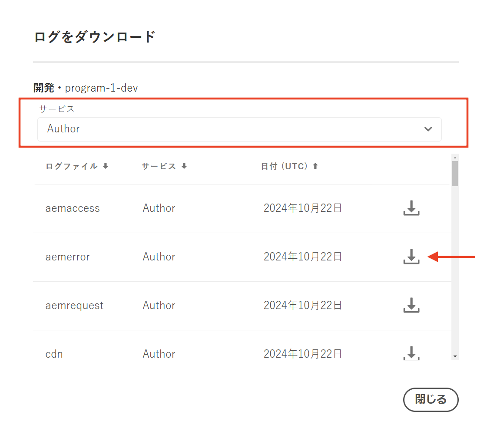

# AEM as a Cloud Service のリーダーインスタンスでのジョブの実行方法

AEM as a Cloud Service の一部として、AEM オーサーサービスのリーダーインスタンスでのジョブの実行方法と、1 回のみの実行の設定方法について説明します。

Sling ジョブは、バックグラウンドで動作する非同期タスクで、システムまたはユーザーがトリガーするイベントを処理するように設計されています。デフォルトでは、これらのジョブはクラスター内のすべてのインスタンス（ポッド）に均等に分散されます。

詳しくは、[Apache Sling のイベントとジョブの取り扱い](https://sling.apache.org/documentation/bundles/apache-sling-eventing-and-job-handling.html)を参照してください。

## ジョブの作成と処理

デモの目的で、_ジョブプロセッサーにメッセージをログに記録するように指示するシンプルなジョブ_&#x200B;を作成しましょう。

### ジョブの作成

次のコードを使用して、Apache Sling ジョブを&#x200B;_作成_&#x200B;します。

```java
package com.adobe.aem.guides.wknd.core.sling.jobs.impl;

import java.util.HashMap;
import java.util.Map;

import org.apache.sling.event.jobs.JobManager;
import org.osgi.service.component.annotations.Activate;
import org.osgi.service.component.annotations.Component;
import org.osgi.service.component.annotations.Reference;
import org.slf4j.Logger;
import org.slf4j.LoggerFactory;

@Component(immediate = true)
public class SimpleJobCreaterImpl {

    private static final Logger log = LoggerFactory.getLogger(SimpleJobCreaterImpl.class);

    // Define the topic on which the job will be created
    protected static final String TOPIC = "wknd/simple/job/topic";

    // Inject a JobManager
    @Reference
    private JobManager jobManager;

    @Activate
    protected final void activate() throws Exception {
        log.info("SimpleJobCreater activated successfully");
        createJob();
        log.info("SimpleJobCreater created a job");
    }

    private void createJob() {
        // Create a job and add it on the above defined topic
        Map<String, Object> jobProperties = new HashMap<>();
        jobProperties.put("action", "log");
        jobProperties.put("message", "Job metadata is: Created in activate method");
        jobManager.addJob(TOPIC, jobProperties);
    }
}
```

上記のコードで注意すべき重要なポイントは次のとおりです。

- ジョブペイロードには、`action` と `message` という 2 つのプロパティがあります。
- [JobManager](https://javadoc.io/doc/com.adobe.aem/aem-sdk-api/latest/org/apache/sling/event/jobs/JobManager.html) の `addJob(...)` メソッドを使用すると、ジョブがトピック `wknd/simple/job/topic` に追加されます。

### ジョブの処理

次のコードを使用して、上記の Apache Sling ジョブを&#x200B;_処理_&#x200B;します。

```java
package com.adobe.aem.guides.wknd.core.sling.jobs.impl;

import org.apache.sling.event.jobs.Job;
import org.apache.sling.event.jobs.consumer.JobConsumer;
import org.osgi.service.component.annotations.Component;
import org.slf4j.Logger;
import org.slf4j.LoggerFactory;

@Component(service = JobConsumer.class, property = {
        JobConsumer.PROPERTY_TOPICS + "=" + SimpleJobCreaterImpl.TOPIC
}, immediate = true)
public class SimpleJobConsumerImpl implements JobConsumer {

    private static final Logger log = LoggerFactory.getLogger(SimpleJobConsumerImpl.class);

    @Override
    public JobResult process(Job job) {
        // Get the action and message properties
        String action = job.getProperty("action", String.class);
        String message = job.getProperty("message", String.class);

        // Log the message
        if ("log".equals(action)) {
            log.info("Processing WKND Job, and {}", message);
        }

        // Return a successful result
        return JobResult.OK;
    }

}
```

上記のコードで注意すべき重要なポイントは次のとおりです。

- `SimpleJobConsumerImpl` クラスは、`JobConsumer` インターフェイスを実装しています。
- これは、トピック `wknd/simple/job/topic` からのジョブを使用するために登録されたサービスです。
- `process(...)` メソッドは、ジョブペイロードの `message` プロパティをログに記録してジョブを処理します。

### デフォルトのジョブ処理

上記のコードを AEM as a Cloud Service 環境にデプロイし、複数の AEM オーサー JVM を持つクラスターとして動作する AEM オーサーサービスで実行すると、ジョブは各 AEM オーサーインスタンス（ポッド）で 1 回実行されます。つまり、作成したジョブの数はポッドの数と一致します。ポッドの数は常に 1 個以上になります（非 RDE 環境の場合）が、AEM as a Cloud Service の内部リソース管理に基づいて変動します。

`wknd/simple/job/topic` は AEM のメインキューに関連付けられて、使用可能なすべてのインスタンスにジョブを分散するので、ジョブは各 AEM オーサーインスタンス（ポッド）で実行されます。

リソースや外部サービスの作成や更新など、ジョブが状態の変更を担当している場合は、これが問題になることがよくあります。

AEM オーサーサービスでジョブを 1 回のみ実行する場合は、次に説明する[ジョブキューの設定](#how-to-run-a-job-on-the-leader-instance)を追加します。

これを確認するには、[Cloud Manager](https://experienceleague.adobe.com/ja/docs/experience-manager-learn/cloud-service/debugging/debugging-aem-as-a-cloud-service/logs#cloud-manager) で AEM オーサーサービスのログを確認します。




以下が表示されます。

```
<DD.MM.YYYY HH:mm:ss.SSS> [cm-pxxxx-exxxx-aem-author-68775db964-nxxcx] *INFO* [sling-oak-observation-15] org.apache.sling.event.impl.jobs.queues.JobQueueImpl.<main queue> Starting job queue <main queue>
<DD.MM.YYYY HH:mm:ss.SSS> INFO [com.adobe.aem.guides.wknd.core.sling.jobs.impl.SimpleJobConsumerImpl] Processing WKND Job, and Job metadata is: Created in activate method

<DD.MM.YYYY HH:mm:ss.SSS> [cm-pxxxx-exxxx-aem-author-68775db964-r4zk7] *INFO* [sling-oak-observation-11] org.apache.sling.event.impl.jobs.queues.JobQueueImpl.<main queue> Starting job queue <main queue>
<DD.MM.YYYY HH:mm:ss.SSS> INFO [com.adobe.aem.guides.wknd.core.sling.jobs.impl.SimpleJobConsumerImpl] Processing WKND Job, and Job metadata is: Created in activate method
```

ログエントリは 2 つあり、AEM オーサーインスタンス（`68775db964-nxxcx` と `68775db964-r4zk7`）ごとに 1 つずつあり、各インスタンス（ポッド）がジョブを処理したことを示しています。

## リーダーインスタンスでのジョブの実行方法

AEM オーサーサービスでジョブを _1 回のみ_&#x200B;実行するには、**順序付き**&#x200B;タイプの新しい Sling ジョブキューを作成し、ジョブトピック（`wknd/simple/job/topic`）をこのキューに関連付けます。この設定では、リーダーの AEM オーサーインスタンス（ポッド）のみがジョブを処理できます。

AEM プロジェクトの `ui.config` モジュールで、OSGi 設定ファイル（`org.apache.sling.event.jobs.QueueConfiguration~wknd.cfg.json`）を作成し、`ui.config/src/main/content/jcr_root/apps/wknd/osgiconfig/config.author` フォルダーに保存します。

```json
{
    "queue.name":"WKND Queue - ORDERED",
    "queue.topics":[
      "wknd/simple/job/topic"
    ],
    "queue.type":"ORDERED",
    "queue.retries":1,
    "queue.maxparallel":1.0
  }
```

上記の設定で注意すべき重要なポイントは次のとおりです。

- キュートピックは `wknd/simple/job/topic` に設定されています。
- キュータイプは `ORDERED` に設定されています。
- 並列ジョブの最大数は `1` に設定されています。

上記の設定をデプロイすると、ジョブはリーダーインスタンスによって排他的に処理され、AEM オーサーサービス全体で 1 回のみ実行されるようになります。

```
<DD.MM.YYYY HH:mm:ss.SSS> [cm-pxxxx-exxxx-aem-author-7475cf85df-qdbq5] *INFO* [FelixLogListener] Events.Service.org.apache.sling.event Service [QueueMBean for queue WKND Queue - ORDERED,7755, [org.apache.sling.event.jobs.jmx.StatisticsMBean]] ServiceEvent REGISTERED
<DD.MM.YYYY HH:mm:ss.SSS> INFO [com.adobe.aem.guides.wknd.core.sling.jobs.impl.SimpleJobConsumerImpl] Processing WKND Job, and Job metadata is: Created in activate method
<DD.MM.YYYY HH:mm:ss.SSS> [com.adobe.aem.guides.wknd.core.sling.jobs.impl.SimpleJobConsumerImpl] Processing WKND Job, and Job metadata is: Created in activate method
```
