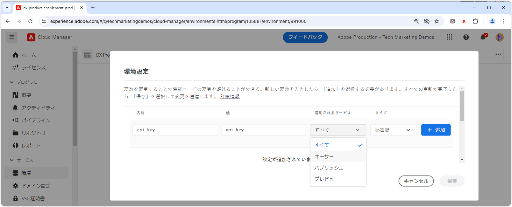

# AEM as a Cloud Service での秘密鍵の管理

API キーやパスワードなどの秘密鍵の管理は、アプリケーションのセキュリティを維持するのに重要です。Adobe Experience Manager（AEM）as a Cloud Service では、秘密鍵を安全に処理する堅牢なツールを提供します。

このチュートリアルでは、AEM 内で秘密鍵を管理するベストプラクティスについて説明します。ここでは、機密情報を保護し、アプリケーションの安全性と機密性を維持することを目的とした AEM が提供するツールとテクニックについて説明します。

このチュートリアルでは、AEM Java 開発、OSGi サービス、Sling モデル、Adobe Cloud Manager に関する実用的な知識があることを前提としています。

## 秘密鍵マネージャー OSGi サービス

AEM as a Cloud Service では、OSGi サービスを通じて秘密鍵を管理することで、拡張性の高い安全なアプローチが実現します。OSGi サービスは、OSGi 設定を通じて定義され、Cloud Manager 経由で設定される API キーやパスワードなどの機密情報を処理するように設定できます。

### OSGi サービスの実装

[OSGi 設定から秘密鍵を公開](https://experienceleague.adobe.com/ja/docs/experience-manager-cloud-service/content/implementing/deploying/configuring-osgi#secret-configuration-values)するカスタム OSGi サービスの開発について説明します。

実装では、`@Activate` メソッドを介して OSGi 設定から秘密鍵を読み取り、`getSecret(String secretName)` メソッドを通じて公開します。または、秘密鍵ごとに `getApiKey()` のような個別のメソッドを作成できますが、このアプローチでは秘密鍵が追加または削除されるたびにメンテナンスが必要になります。

```java
package com.example.core.util.impl;

import com.example.core.util.SecretsManager;
import org.osgi.service.component.annotations.*;
import org.slf4j.Logger;
import org.slf4j.LoggerFactory;
import org.apache.sling.api.resource.ValueMap;
import org.apache.sling.api.resource.ValueMapDecorator;
import java.util.Map;

@Component(
    service = { SecretsManager.class }
)
public class SecretsManagerImpl implements SecretsManager {
    private static final Logger log = LoggerFactory.getLogger(SecretsManagerImpl.class);
 
    private ValueMap secrets;

    @Override
    public String getSecret(String secretName) {
        return secrets.get(secretName, String.class);
    }

    @Activate
    @Modified
    protected void activate(Map<String, Object> properties) {
        secrets = new ValueMapDecorator(properties);
    }
}
```

OSGi サービスとしては、Java インターフェイス経由で登録して使用することをお勧めします。以下は、消費者が OSGi プロパティ名で秘密鍵を取得できるようにするシンプルなインターフェイスです。

```java
package com.example.core.util;

import org.osgi.annotation.versioning.ConsumerType;

@ConsumerType
public interface SecretsManager {
    String getSecret(String secretName);
}
```

## OSGi 設定への秘密鍵のマッピング

OSGi サービスで秘密鍵の値を公開するには、[OSGi 秘密鍵設定値](https://experienceleague.adobe.com/ja/docs/experience-manager-cloud-service/content/implementing/deploying/configuring-osgi#secret-configuration-values)を使用して、OSGi 設定にマッピングします。`SecretsManager.getSecret()` メソッドから秘密鍵の値を取得するキーとして OSGi プロパティ名を定義します。

AEM Maven プロジェクトの OSGi 設定ファイル `/apps/example/osgiconfig/config/com.example.core.util.impl.SecretsManagerImpl.cfg.json` で秘密鍵を定義します。各プロパティは AEM で公開される秘密鍵を表し、値は Cloud Manager 経由で設定されます。キーは、`SecretsManager` サービスから秘密鍵の値の取得に使用される OSGi プロパティ名です。

```json
{
    "api.key": "$[secret:api_key]",
    "service.password": "$[secret:service_password]"
}
```

また、共有秘密鍵マネージャー OSGi サービスを使用する代わりに、秘密鍵を使用する特定のサービスの OSGi 設定に秘密鍵を直接含めることもできます。このアプローチは、秘密鍵が単一の OSGi サービスでのみ必要であり、複数のサービス間で共有されない場合に役立ちます。この場合、秘密鍵の値は、特定のサービス用の OSGi 設定ファイルで定義され、`@Activate` メソッドを通じてサービスの Java コードでアクセスされます。

## 秘密鍵の使用

秘密鍵は、Sling モデルや別の OSGi サービスなど、様々な方法で OSGi サービスから使用できます。両方から秘密鍵を使用する方法の例を以下に示します。

### Sling モデルから

Sling モデルは、多くの場合、AEM サイトコンポーネントのビジネスロジックを提供します。`SecretsManager` OSGi サービスは、`@OsgiService` 注釈を通じて使用でき、Sling モデル内で使用して秘密鍵の値を取得できます。

```java
import com.example.core.util.SecretsManager;
import org.apache.sling.api.resource.Resource;
import org.apache.sling.api.servlets.SlingHttpServletRequest;
import org.apache.sling.models.annotations.Model;
import org.apache.sling.models.annotations.OsgiService;

@Model(
    adaptables = {SlingHttpServletRequest.class, Resource.class},
    adapters = {ExampleDatabaseModel.class}
)
public class ExampleDatabaseModelImpl implements ExampleDatabaseModel {

    @OsgiService
    SecretsManager secretsManager;

    @Override 
    public String doWork() {
        final String secret = secretsManager.getSecret("api.key");
        // Do work with secret
    }
}
```

### OSGi サービスから

OSGi サービスは、多くの場合、Sling モデル、ワークフローなどの AEM サービス、またはその他のカスタム OSGi サービスで使用される、AEM 内で再利用可能なビジネスロジックを公開します。`SecretsManager` OSGi サービスは、`@Reference` 注釈を通じて使用でき、OSGi サービス内で使用して秘密鍵の値を取得できます。

```java
import com.example.core.util.SecretsManager;
import org.osgi.service.component.annotations.Component;
import org.osgi.service.component.annotations.Reference;

@Component
public class ExampleSecretConsumerImpl implements ExampleSecretConsumer {

    @Reference
    SecretsManager secretsManager;

    public void doWork() {
        final String secret = secretsManager.getSecret("service.password");
        // Do work with the secret
    }
}
```

## Cloud Manager での秘密鍵の設定

OSGi サービスと設定が整ったら、最後の手順として Cloud Manager で秘密鍵の値を設定します。

秘密鍵の値は、[Cloud Manager API](https://developer.adobe.com/experience-cloud/cloud-manager/reference/api/#tag/Variables) 経由で設定することも、より一般的には [Cloud Manager UI](https://experienceleague.adobe.com/ja/docs/experience-manager-cloud-service/content/implementing/using-cloud-manager/environment-variables#overview) 経由で設定することもできます。Cloud Manager UI 経由で秘密鍵の変数を適用するには：



1. [Adobe Cloud Manager](https://my.cloudmanager.adobe.com) にログインします。
1. 秘密鍵を設定する AEM プログラムと環境を選択します。
1. 環境の詳細表示で、「**設定**」タブを選択します。
1. 「**追加**」を選択します。
1. 環境設定ダイアログで、次の操作を実行します。
   - OSGi 設定で参照される秘密鍵の変数名（例：`api_key`）を入力します。
   - 秘密鍵の値を入力します。
   - 秘密鍵を適用する AEM サービスを選択します。
   - タイプとして「**秘密鍵**」を選択します。
1. 「**追加**」を選択して、秘密鍵を保持します。
1. 必要な数の秘密鍵を追加します。完了したら、「**保存**」を選択して、変更を AEM 環境に直ちに適用します。

秘密鍵に Cloud Manager 設定を使用すると、様々な環境やサービスに異なる値を適用し、AEM アプリケーションを再デプロイせずに秘密鍵をローテーションできるというメリットがあります。
