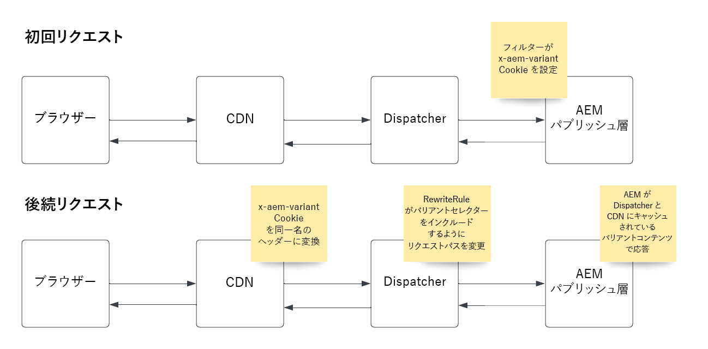

# ページバリアントのキャッシュ

ページのバリアントのキャッシュをサポートするために AEM as a Cloud Service を設定および使用する方法について説明します。

## 使用例

+ ユーザーの位置情報や動的コンテンツを含むページのキャッシュに基づいて、異なるサービスオファーのセットと対応する価格オプションを提供するサービスプロバイダーは、CDN と Dispatcher で管理する必要があります。

+ 小売の顧客は国内に店舗を持ち、各ストアの場所に応じて異なるオファーが提供されます。また、動的コンテンツを含むページのキャッシュは、CDN と Dispatcher で管理する必要があります。

## ソリューションの概要

+ バリアントキーと、そのキーの値の数を指定します。 この例では、米国の州ごとに異なるので、最大数は 50 です。これは、CDN でバリアント制限に関する問題を引き起こさないほど小さい数です。 [バリアント制限](#variant-limitations)の節を確認してください。

+ AEM コードは、最初の HTTP リクエストに対応する HTTP 応答で、Cookie __「x-aem-variant」__ を訪問者の州（例：`Set-Cookie: x-aem-variant=NY`）に設定する必要があります。

+ 訪問者からの以降のリクエストでは、その Cookie を送信し（例： `"Cookie: x-aem-variant=NY"`）、Cookie は CDN レベルで定義済みのヘッダー（つまり、`x-aem-variant:NY`）に変換され、Dispatcher に渡されます。

+ Apache 書き換えルールは、リクエストパスを変更して、ヘッダー値をページ URL に Apache Sling として含めます（例：`/page.variant=NY.html`）。これにより、AEM パブリッシュは、セレクターと Dispatcher に基づいて異なるコンテンツを提供し、バリアントごとに 1 ページをキャッシュできます。

+ AEM Dispatcher から送信される応答には、HTTP 応答ヘッダー `Vary: x-aem-variant` が含まれている必要があります。これは、CDN に対し、ヘッダー値ごとに異なるキャッシュコピーを保存するように指示します。

>[!TIP]
>
>Cookie が設定された場合（例：Set-Cookie:x-aem-variant=NY）、応答はキャッシュ不可にする必要があります（Cache-Control: private または Cache-Control: no-cache）

## HTTP リクエストフロー



>[!NOTE]
>
>上記の最初の HTTP リクエストフローは、バリアントを使用するコンテンツがリクエストされる前に実行する必要があります。

## 使用方法

1. この機能を実演するには、[WKND](https://experienceleague.adobe.com/docs/experience-manager-learn/getting-started-wknd-tutorial-develop/overview.html?lang=ja) の実装を例として示します。

1.  AEM で [SlingServletFilter](https://sling.apache.org/documentation/the-sling-engine/filters.html) を実装して、バリアント値を使用して HTTP 応答に `x-aem-variant` Cookie を設定します。

1. AEM の CDN は、`x-aem-variant` Cookie を同じ名前の HTTP ヘッダーに自動的に変換します。

1. `dispatcher` プロジェクトに Apache web サーバー mod_rewrite ルールを追加して、バリアントセレクターを含めるようにリクエストパスを変更します。

1. Cloud Manager を使用してフィルターおよび書き換えルールをデプロイします。

1. リクエストフロー全体をテストします。

## コードサンプル

+ `x-aem-variant` Cookie に AEM の値を設定する SlingServletFilter のサンプル

  ```
  package com.adobe.aem.guides.wknd.core.servlets.filters;
  
  import javax.servlet.*;
  import java.io.IOException;
  
  import org.apache.sling.api.SlingHttpServletRequest;
  import org.apache.sling.api.SlingHttpServletResponse;
  import org.apache.sling.servlets.annotations.SlingServletFilter;
  import org.apache.sling.servlets.annotations.SlingServletFilterScope;
  import org.osgi.service.component.annotations.Component;
  import org.slf4j.Logger;
  import org.slf4j.LoggerFactory;
  
  
  // Invoke filter on  HTTP GET /content/wknd.*.foo|bar.html|json requests.
  // This code and scope is for example purposes only, and will not interfere with other requests.
  @Component
  @SlingServletFilter(scope = {SlingServletFilterScope.REQUEST},
          resourceTypes = {"cq:Page"},
          pattern = "/content/wknd/.*",
          extensions = {"html", "json"},
          methods = {"GET"})
  public class PageVariantFilter implements Filter {
      private static final Logger log = LoggerFactory.getLogger(PageVariantFilter.class);
      private static final String VARIANT_COOKIE_NAME = "x-aem-variant";
  
      @Override
      public void init(FilterConfig filterConfig) throws ServletException { }
  
      @Override
      public void doFilter(ServletRequest servletRequest, ServletResponse servletResponse, FilterChain filterChain) throws IOException, ServletException {
          SlingHttpServletResponse slingResponse = (SlingHttpServletResponse) servletResponse;
          SlingHttpServletRequest slingRequest = (SlingHttpServletRequest) servletRequest;
  
          // Check is the variant was previously set
          final String existingVariant = slingRequest.getCookie(VARIANT_COOKIE_NAME).getValue();
  
          if (existingVariant == null) {
              // Variant has not been set, so set it now
              String newVariant = "NY"; // Hard coding as an example, but should be a calculated value
              slingResponse.setHeader("Set-Cookie", VARIANT_COOKIE_NAME + "=" + newVariant + "; Path=/; HttpOnly; Secure; SameSite=Strict");
              log.debug("x-aem-variant cookie is set with the value {}", newVariant);
          } else {
              log.debug("x-aem-variant previously set with value {}", existingVariant);
          }
  
          filterChain.doFilter(servletRequest, slingResponse);
      }
  
      @Override
      public void destroy() { }
  }
  ```

+ Git でソースコードとして管理され、Cloud Manager を使用してデプロイされる __dispatcher/src/conf.d/rewrite.rules__ ファイルでのサンプル書き換えルール

  ```
  ...
  
  RewriteCond %{REQUEST_URI} ^/us/.*  
  RewriteCond %{HTTP:x-aem-variant} ^.*$  
  RewriteRule ^([^?]+)\.(html.*)$ /content/wknd$1.variant=%{HTTP:x-aem-variant}.$2 [PT,L] 
  
  ...
  ```

## バリアントの制限

+ AEM CDN では、最大 200 個のバリエーションを管理できます。 これは、`x-aem-variant` ヘッダーには、最大 200 個の一意の値を設定できます。 詳しくは、[CDN 設定の制限](https://docs.fastly.com/en/guides/resource-limits)を確認してください。

+ 選択したバリアントキーがこの数を超えないように注意する必要があります。  例えば、ユーザー ID は、ほとんどの web サイトで 200 個を超える可能性が高いので、適切なキーではありません。一方、国内の州／地域は、その国に 200 個未満の州がある場合に適しています。

>[!NOTE]
>
>バリアントが 200 を超える場合、CDN は、ページコンテンツではなく「バリアントが多すぎます」という応答を返します。
