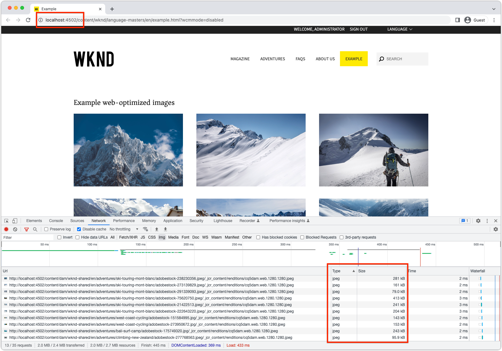

# Web に最適化された画像配信 Java™ API

AEM as a Cloud Service の web に最適化された画像配信 Java™ API を使用して、パフォーマンスの高い web エクスペリエンスを開発する方法を説明します。

AEM as a Cloud Service では、アセットの最適化された画像 web レンディションを自動的に生成する [web に最適化された画像配信](https://experienceleague.adobe.com/docs/experience-manager-core-components/using/developing/web-optimized-image-delivery.html?lang=ja)をサポートしています。Web に最適化された画像配信は、主に次の 3 つのアプローチで使用できます。

1. [AEM Core WCM コンポーネントの使用](https://experienceleague.adobe.com/docs/experience-manager-core-components/using/introduction.html?lang=ja)
2. [AEM WCM コアコンポーネントの画像コンポーネントを拡張](https://experienceleague.adobe.com/docs/experience-manager-learn/getting-started-wknd-tutorial-develop/project-archetype/custom-component.html?lang=ja#tackling-the-image-problem)するカスタムコンポーネントの作成
3. AssetDelivery Java™ API を使用して web に最適化された画像 URL を生成するカスタムコンポーネントの作成

この記事では、AEM as a Cloud Service と AEM SDK の両方でコードベースが機能するように、web に最適化された画像 Java™ API をカスタムコンポーネントで使用する方法について説明します。

## Java™ API

[AssetDelivery API](https://javadoc.io/doc/com.adobe.aem/aem-sdk-api/latest/com/adobe/cq/wcm/spi/AssetDelivery.html) は、画像アセットの web に最適化された配信 URL を生成する OSGi サービスです。`AssetDelivery.getDeliveryURL(...)` の使用可能なオプションは、[ここに記載されています](https://experienceleague.adobe.com/docs/experience-manager-core-components/using/developing/web-optimized-image-delivery.html?lang=ja#can-i-use-web-optimized-image-delivery-with-my-own-component%3F)。

`AssetDelivery` OSGi サービスは、AEM as a Cloud Service で実行している場合にのみ利用できます。AEM SDK では、`AssetDelivery` OSGi サービスへの参照は `null` を返します。AEM as a Cloud Service で実行する場合は web に最適化された URL を条件付きで使用し、AEM SDK ではフォールバック画像 URL を使用することをお勧めします。通常、アセットの web レンディションが十分なフォールバックになります。


### OSGi サービスでの API の使用

`AssetDelivery` 参照をカスタム OSGi サービスでオプションとしてマークすると、カスタム OSGi サービスを AEM SDK で引き続き使用できるようになります。

```java
import com.adobe.cq.wcm.spi.AssetDelivery;
...
@Reference(cardinality = ReferenceCardinality.OPTIONAL)
private volatile AssetDelivery assetDelivery;
```

### Sling モデルでの API の使用

`AssetDelivery` 参照をカスタム Sling モデルでオプションとしてマークすると、カスタム Sling モデルを AEM SDK で引き続き使用できるようになります。

```java
import com.adobe.cq.wcm.spi.AssetDelivery;
...
@OSGiService(injectionStrategy = InjectionStrategy.OPTIONAL)
private AssetDelivery assetDelivery;
```

### API の条件付き使用

`AssetDelivery` OSGi サービスを使用できるかどうかに応じて、web に最適化された画像 URL またはフォールバック URL を条件付きで返します。条件付き使用では、AEM SDK でコードを実行する際にコードを機能させることができます。

```java
if (assetDelivery != null ) {
    // When running on AEM as a Cloud Service use the real web-optimized image URL.
    return assetDelivery.getDeliveryURL(...);
} else {
    // When running on AEM SDK, use some fallback image so the experience does not break.
    // What the fallback is up to you! 
    return getFallbackURL(...);
}
```

## サンプルコード

次のコードでは、web に最適化された画像 URL を使用して画像アセットのリストを表示するサンプルコンポーネントを作成します。

このコードを AEM as a Cloud Service 上で実行する場合は、web に最適化された WebP 画像レンディションをカスタムコンポーネントで使用します。


_AEM as a Cloud Service では AssetDelivery API をサポートしているので、web に最適化された WebP レンディションが使用されます_

コードを AEM SDK で実行する場合は、最適でない静的 web レンディションが使用され、ローカル開発時にコンポーネントを機能させることができます。



_AEM SDK では AssetDelivery API をサポートしていないので、フォールバック静的 web レンディション（PNG または JPEG）が使用されます_

実装は、論理的に次の 3 つの部分に分かれます。

1. `WebOptimizedImage` OSGi サービスは、AEM が提供する `AssetDelivery` OSGi サービスの「スマートプロキシ」として機能し、AEM as a Cloud Service と AEM SDK の両方での実行を処理できます。
2. `ExampleWebOptimizedImages` Sling モデルは、表示する画像アセットとその web に最適化された URL のリストを収集するビジネスロジックを提供します。
3. `example-web-optimized-images` AEMコンポーネントは、web に最適化された画像のリストを表示する HTL を実装します。

以下のコード例をコードベースにコピーし、必要に応じて更新できます。

### OSGi サービス

`WebOptimizedImage` OSGi サービスは、アドレス可能なパブリックインターフェイス（`WebOptimizedImage`）と内部実装（`WebOptimizedImageImpl`）に分かれます。`WebOptimizedImageImpl` は、AEM as a Cloud Service で動作している場合は web に最適化された画像 URL を返し、AEM SDK で動作している場合は静的 web レンディション URL を返します。これにより、コンポーネントが AEM SDK で引き続き機能できるようになります。

#### インターフェイス

インターフェイスでは、Sling モデルなどの他のコードが操作できる OSGi サービス契約を定義します。

```java
package com.adobe.aem.guides.wknd.core.images;

import org.apache.sling.api.resource.ResourceResolver;
import org.osgi.annotation.versioning.ProviderType;

import java.util.Map;

/**
 * OSGi Service that acts as a facade for the AssetDelivery API, such that a fallback can be automatically served on the AEM SDK.
 *
 * This service can be extended to provide additional functionality, such as srcsets, etc.
 */
@ProviderType
public interface WebOptimizedImage {
    /**
     * Returns the Web Optimized Image URL.
     * @param resourceResolver the user's resource resolver
     * @param path the path to the asset
     * @param options the options to pass to the AssetDelivery API
     * @return the Web Optimized Image URL
     */
    String getDeliveryURL(ResourceResolver resourceResolver, String path, Map<String, Object> options);
}
```

#### 実装

OSGi サービスの実装には、AEM の `AssetDelivery` OSGi サービスへのオプション参照と、AEM SDK 上で `AssetDelivery` が `null` である場合に適切な画像 URL を選択するためのフォールバックロジックが含まれています。フォールバックロジックは、要件に応じて更新できます。

```java
package com.adobe.aem.guides.wknd.core.images.impl;

import com.adobe.aem.guides.wknd.core.images.WebOptimizedImage;
import com.adobe.cq.wcm.spi.AssetDelivery;
import com.day.cq.dam.api.Asset;
import com.day.cq.dam.api.Rendition;
import com.day.cq.dam.api.RenditionPicker;
import com.day.cq.dam.commons.util.DamUtil;
import org.apache.commons.lang3.StringUtils;
import org.apache.sling.api.resource.Resource;
import org.apache.sling.api.resource.ResourceResolver;
import org.osgi.service.component.annotations.Component;
import org.osgi.service.component.annotations.Reference;
import org.osgi.service.component.annotations.ReferenceCardinality;

import java.util.Map;
@Component
public class WebOptimizedImageImpl implements WebOptimizedImage {
    private static final String DEFAULT_FORMAT = "webp";
    @Reference(cardinality = ReferenceCardinality.OPTIONAL)
    private volatile AssetDelivery assetDelivery;

    /**
     * Returns the Web Optimized Image URL.
     * @param resourceResolver the user's resource resolver
     * @param path the path to the asset
     * @param options the options to pass to the AssetDelivery API
     * @return the Web Optimized Image URL
     */
    @Override
    public String getDeliveryURL(ResourceResolver resourceResolver, String path, Map<String, Object> options) {
        if (assetDelivery != null) {
            return getWebOptimizedUrl(resourceResolver, path, options);
        } else {
            return getFallbackUrl(resourceResolver, path);
        }
    }
    /**
     * Uses the AssetDelivery API to get the Web Optimized Image URL.
     * @param resourceResolver the user's resource resolver
     * @param path the path to the asset
     * @param options the options to pass to the AssetDelivery API
     * @return the Web Optimized Image URL
     */
    private String getWebOptimizedUrl(ResourceResolver resourceResolver, String path, Map<String, Object> options) {
        Resource resource = resourceResolver.getResource(path);
        Asset asset = DamUtil.resolveToAsset(resource);

        // These 3 options are required for the AssetDelivery API to work, else it will return null
        options.put("path", asset.getPath());
        options.put("format", StringUtils.defaultString((String) options.get("format"), DEFAULT_FORMAT));
        options.put("seoname", StringUtils.defaultString((String) options.get("seoname"), asset.getName()));

        // The resource only provides the security context into AEM so the asset's UUID can be looked up for the Web Optimized Image URL
        return assetDelivery.getDeliveryURL(resource, options);
    }

    /**
     * Fallback to the static web rendition if the AssetDelivery API is not available, meaning the code is running on the AEM SDK.
     * @param resourceResolver the user's resource resolver
     * @param path the path to the asset
     * @return the path to the web rendition
     */
    private String getFallbackUrl(ResourceResolver resourceResolver, String path) {
        Resource resource = resourceResolver.getResource(path);
        Asset asset = DamUtil.resolveToAsset(resource);

        return asset.getRendition(WebRenditionPicker).getPath();
    }

    /**
     * Picks the web rendition of the asset.
     */
    private static final RenditionPicker WebRenditionPicker = new RenditionPicker() {
        @Override
        public Rendition getRendition(Asset asset) {
            return asset.getRenditions().stream().filter(rendition -> StringUtils.startsWith(rendition.getName(), "cq5dam.web.")).findFirst().orElse(asset.getOriginal());
        }
    };
}
```

### Sling モデル

`ExampleWebOptimizedImages` Sling モデルは、アドレス指定可能なパブリックインターフェイス（`ExampleWebOptimizedImages`）と内部実装（`ExampleWebOptimizedImagesImpl`）に分かれています。

`ExampleWebOptimizedImagesImpl` Sling モデルは、表示する画像アセットのリストを収集し、カスタム `WebOptimizedImage` OSGi サービスを呼び出して、web に最適化された画像 URL を取得します。この Sling モデルは AEM コンポーネントを表すので、`isEmpty()`、`getId()`、`getData()` などの通常のメソッドを持っていますが、これらのメソッドは web に最適化された画像の使用には直接関係しません。

#### インターフェイス

インターフェイスでは、HTL などの他のコードがやり取りできる Sling モデルコントラクトを定義します。

```java
package com.adobe.aem.guides.wknd.core.models;

import com.adobe.cq.wcm.core.components.models.datalayer.ComponentData;
import com.fasterxml.jackson.annotation.JsonProperty;

import java.util.List;

public interface ExampleWebOptimizedImages {

    /**
     * @return a list of web optimized images for the component to display. Each item in the list has necessary information to render the image.
     */
    List getImages();

    /**
     * @return true if this component has no images to display.
     */
    boolean isEmpty();

    /**
     * @return String representing the unique identifier of the ExampleWebOptimizedImages component on a page
     */
    String getId();

    /**
     * @return JSON data to populate the data layer
     */
    @JsonProperty("dataLayer")
    default ComponentData getData() {
        return null;
    }

    /**
     * Describes a web optimized image.
     */
    interface Img {
        /**
         * @return the URL to the web optimized rendition of the image.
         */
        String getSrc();

        /**
         * @return the alt text of the web optimized image.
         */
        String getAlt();

        /**
         * @return the height of the web optimized image.
         */
        String getHeight();
        /**
         * @return the width of the web optimized image.
         */
        String getWidth();
    }
}
```

#### 実装

Sling モデルでは、カスタム `WebOptimizeImage` OSGi サービスを使用して、そのコンポーネントに表示される画像アセットの web に最適化された画像 URL を収集します。

この例では、画像アセットの収集に単純なクエリを使用しています。

```java
package com.adobe.aem.guides.wknd.core.models.impl;

import com.adobe.aem.guides.wknd.core.images.WebOptimizedImage;
import com.adobe.aem.guides.wknd.core.models.ExampleWebOptimizedImages;
import com.adobe.cq.wcm.core.components.models.datalayer.ComponentData;
import com.adobe.cq.wcm.core.components.models.datalayer.builder.DataLayerBuilder;
import com.adobe.cq.wcm.core.components.util.ComponentUtils;
import com.day.cq.dam.api.Asset;
import com.day.cq.dam.commons.util.DamUtil;
import com.day.cq.wcm.api.Page;
import com.day.cq.wcm.api.components.ComponentContext;
import org.apache.sling.api.SlingHttpServletRequest;
import org.apache.sling.api.resource.Resource;
import org.apache.sling.models.annotations.DefaultInjectionStrategy;
import org.apache.sling.models.annotations.Model;
import org.apache.sling.models.annotations.Required;
import org.apache.sling.models.annotations.injectorspecific.OSGiService;
import org.apache.sling.models.annotations.injectorspecific.ScriptVariable;
import org.apache.sling.models.annotations.injectorspecific.Self;

import java.util.*;

@Model(
        adaptables = {SlingHttpServletRequest.class},
        adapters = {ExampleWebOptimizedImages.class},
        resourceType = {ExampleWebOptimizedImagesImpl.RESOURCE_TYPE},
        defaultInjectionStrategy = DefaultInjectionStrategy.OPTIONAL
)
public class ExampleWebOptimizedImagesImpl implements ExampleWebOptimizedImages {

    protected static final String RESOURCE_TYPE = "wknd/components/example-web-optimized-images";

    private static final int MAX_RESULTS = 10;

    @Self
    @Required
    private SlingHttpServletRequest request;

    @OSGiService
    private WebOptimizedImage webOptimizedImage;

    @ScriptVariable
    private Page currentPage;

    @ScriptVariable
    protected ComponentContext componentContext;

    private List images;

    // XPath query to find image assets to display
    private static final String XPATH_QUERY = "/jcr:root/content/dam/wknd-shared/en/adventures//element(*, dam:Asset) [ (jcr:contains(jcr:content/metadata/@dc:format, 'image/')) ]";
    @Override
    public List getImages() {

        if (images == null) {
            images = new ArrayList<>();

            // Set the AssetDelivery options to request a web-optimized rendition.
            // These options can be set as required by the implementation (Dialog, pass in from HTL via @RequestAttribute)
            final Map<String, Object> options = new HashMap<>();
            options.put("format", "webp");
            options.put("preferwebp", "true");
            options.put("width", "350");
            options.put("height", "350");

            final Iterator<Resource> results = request.getResourceResolver().findResources(XPATH_QUERY, "xpath");

            while (results.hasNext() && images.size() < MAX_RESULTS) {
                Resource resource = results.next();
                Asset asset = DamUtil.resolveToAsset(resource);

                // Get the image URL; the web-optimized rendition on AEM as a Cloud Service, or the static web rendition fallback on AEM SDK
                final String url = webOptimizedImage.getDeliveryURL(request.getResourceResolver(), resource.getPath(), options);

                // Add the image to the list that is passed to the HTL component to display
                // We'll add some extra attributes so that the HTL can display the image in a performant, SEO-friendly, and accessible way
                // ImgImpl can be extended to add additional attributes, such as srcset, etc.
                images.add(new ImgImpl(url, asset.getName(), (String) options.get("height"), (String) options.get("width")));
            }
        }

        return this.images;
    }

    @Override
    public boolean isEmpty() {
        return getImages().isEmpty();
    }

    @Override
    public String getId() {
        return ComponentUtils.getId(request.getResource(), currentPage, componentContext);
    }

    @Override
    public ComponentData getData() {
        if (ComponentUtils.isDataLayerEnabled(request.getResource())) {
            return DataLayerBuilder.forComponent()
                    .withId(() -> getId())
                    .withType(() -> RESOURCE_TYPE)
                    .build();
        }
        return null;
    }

    class ImgImpl implements Img {
        private final String url;
        private final String alt;
        private final int height;
        private final int width;

        public ImgImpl(String url, String alt, String height, String width) {
            this.url = url;
            this.alt = alt;
            this.height = Integer.parseInt(height);
            this.width = Integer.parseInt(width);
        }

        @Override
        public String getSrc() {
            return url;
        }

        @Override
        public String getAlt() {
            return alt;
        }

        @Override
        public String getHeight() {
            return height + "px";
        }

        @Override
        public String getWidth() {
            return width + "px";
        }
    }
}
```

### AEM コンポーネント

AEM コンポーネントは、`WebOptimizedImagesImpl` Sling モデル実装の Sling リソースタイプにバインドされており、画像のリストの表示を担当します。


このコンポーネントは、AEM as a Cloud Service で動作する場合は、web に最適化された WebP 画像を含んだ `Img` オブジェクトのリストを `getImages()` で受け取ります。このコンポーネントは、AEM SDK で動作する場合は、静的 PNG／JPEG web 画像を含んだ `Img` オブジェクトのリストを `getImages()` で受け取ります。

#### HTL

HTL では `WebOptimizedImages` Sling モデルを使用し、`getImages()` から返される `Img` オブジェクトのリストをレンダリングします。

```html
<style>
    .cmp-example-web-optimized-images__list {
        width: 100%;
        list-style: none;
        padding: 0;
        display: flex;
        flex-wrap: wrap;
        justify-content: space-between;
        gap: 2rem;
    }

    .cmp-example-web-optimized-images-list__item {
        margin: 0;
        padding: 0;
    }
</style>

<div data-sly-use.exampleImages="com.adobe.aem.guides.wknd.core.models.ExampleWebOptimizedImages"
     data-sly-use.placeholderTemplate="core/wcm/components/commons/v1/templates.html"
     data-sly-test.hasContent="${!exampleImages.empty}"
     data-cmp-data-layer="${exampleImages.data.json}">

    <h3>Example web-optimized images</h3>

    <ul class="cmp-example-web-optimized-images__list"
        data-sly-list.item="${exampleImages.images}">
        <li class="cmp-example-web-optimized-images-list__item">
            
        </li>
    </ul>
</div>
<sly data-sly-call="${placeholderTemplate.placeholder @ isEmpty=!hasContent, classAppend='cmp-example-web-optimized-images'}"></sly>
```
