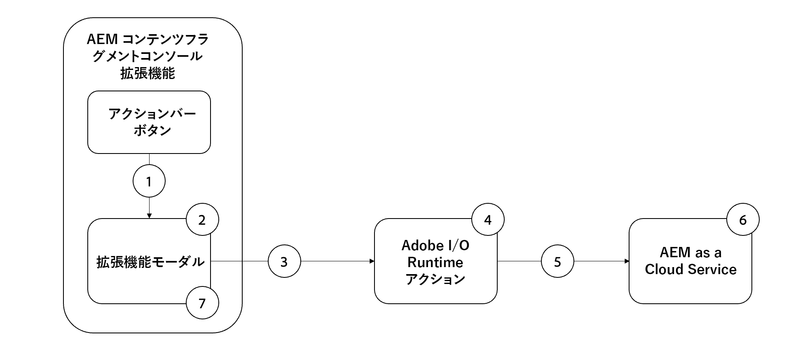

# プロパティの一括更新の例の拡張

{align="center"}

この例のAEMコンテンツフラグメントコンソール拡張機能は、 [アクションバー](../action-bar.md) コンテンツフラグメントプロパティを一括で共通の値に更新する拡張機能。

この例の拡張機能の機能フローは次のとおりです。

{align="center"}

1. 「コンテンツフラグメント」を選択し、 [アクションバー](#extension-registration) が開きます。 [モーダル](#modal).
1. この [モーダル](#modal) は、 [React スペクトル](https://react-spectrum.adobe.com/react-spectrum/).
1. フォームを送信すると、選択したコンテンツフラグメントのリストとAEMホストが [カスタムAdobe I/O Runtimeアクション](#adobe-io-runtime-action).
1. この [Adobe I/O Runtime action](#adobe-io-runtime-action) は入力を検証し、AEMに対して HTTPPUTリクエストを実行して、選択したコンテンツフラグメントを更新します。
1. 指定したプロパティを更新するための、コンテンツフラグメントごとの一連の HTTPPUT。
1. AEM as a Cloud Serviceは、コンテンツフラグメントに対するプロパティの更新を保持し、Adobe I/O Runtimeのアクションに成功または失敗の応答を返します。
1. モーダルは、Adobe I/O Runtimeアクションからの応答を受け取り、成功した一括更新のリストを表示します。

このビデオでは、サンプルの一括プロパティ更新拡張機能、その仕組み、開発方法について説明します。

>[!VIDEO](https://video.tv.adobe.com/v/3412296/?quality=12&learn=on)

## App Builder 拡張機能アプリ

この例では、既存のAdobe Developer Console プロジェクトを使用し、を介して App Builder アプリを初期化する際に、次のオプションを使用します `aio app init`.

+ どのテンプレートを検索しますか？: `All Extension Points`
+ インストールするテンプレートを選択してください：` @adobe/aem-cf-admin-ui-ext-tpl`
+ 拡張機能に名前を付けますか？: `Bulk property update`
+ 拡張機能の短い説明を入力してください。 `An example action bar extension that bulk updates a single property one or more content fragments.`
+ どのバージョンから始めますか？: `0.0.1`
+ 次に何をしますか？
   + `Add a custom button to Action Bar`
      + ボタンのラベル名を指定してください： `Bulk property update`
      + ボタンのモーダルを表示する必要がある場合は、 `y`
   + `Add server-side handler`
      + Adobe I/O Runtimeでは、サーバーレスのコードをオンデマンドで呼び出すことができます。 このアクションの名前を指定してください： `generic`

生成された App Builder 拡張機能アプリが、以下のように更新されます。

## アプリルート{#app-routes}

この `src/aem-cf-console-admin-1/web-src/src/components/App.js` に [React ルーター](https://reactrouter.com/en/main).

次の 2 つの論理セットのルートがあります。

1. 最初のルートは、リクエストを `index.html`: [拡張登録](#extension-registration).

   ```javascript
   <Route index element={<ExtensionRegistration />} />
   ```

1. 2 つ目のルートセットは、拡張機能のモーダルのコンテンツをレンダリングする React コンポーネントに URL をマッピングします。 この `:selection` param は、区切られたリストコンテンツフラグメントのパスを表します。

   拡張機能に、個別のアクションを呼び出すための複数のボタンがある場合、各ボタン [拡張登録](#extension-registration) は、ここで定義されたルートにマッピングされます。

   ```javascript
   <Route
       exact path="content-fragment/:selection/bulk-property-update"
       element={<BulkPropertyUpdateModal />}
       />
   ```

## 拡張機能の登録

`ExtensionRegistration.js`、にマッピングされます。 `index.html` ルート。AEM拡張機能のエントリポイントで、次の項目を定義します。

1. AEMオーサリングエクスペリエンス (`actionBar` または `headerMenu`)
1. 内の拡張機能ボタンの定義 `getButton()` 関数
1. ボタンのクリックハンドラー ( `onClick()` 関数

+ `src/aem-cf-console-admin-1/web-src/src/components/ExtensionRegistration.js`

```javascript
function ExtensionRegistration() {
  const init = async () => {
    const guestConnection = await register({
      id: extensionId,
      methods: {
        // Configure your Action Bar button here
        actionBar: {
          getButton() {
            return {
              'id': 'bulk-property-update',     // Unique ID for the button
              'label': 'Bulk property update',  // Button label 
              'icon': 'Edit'                    // Button icon; get name from: https://spectrum.adobe.com/page/icons/ (Remove spaces, keep uppercase)
            }
          },

          // Click handler for the extension button
          onClick(selections) {
            // Collect the selected content fragment paths 
            const selectionIds = selections.map(selection => selection.id);

            // Create a URL that maps to the 
            const modalURL = "/index.html#" + generatePath(
              "/content-fragment/:selection/bulk-property-update",
              {
                // Set the :selection React route parameter to an encoded, delimited list of paths of the selected content fragments
                selection: encodeURIComponent(selectionIds.join('|'))
              }
            );

            // Open the route in the extension modal using the constructed URL
            guestConnection.host.modal.showUrl({
              title: "Bulk property update",
              url: modalURL
            })
          }
        },

      }
    })
  }
  init().catch(console.error)
```

## モーダル

拡張機能の各ルート ( [`App.js`](#app-routes)は、拡張機能のモーダルでレンダリングする React コンポーネントにマッピングされます。

このサンプルアプリでは、モーダル React コンポーネント (`BulkPropertyUpdateModal.js`) には 3 つの状態があります。

1. 読み込み中。ユーザーが待機する必要があることを示します
1. プロパティの一括更新フォーム。更新するプロパティ名と値をユーザーが指定できます。
1. 一括プロパティ更新操作の応答。更新されたコンテンツフラグメントと更新できなかったコンテンツフラグメントが一覧表示されます。

重要な点は、拡張機能からAEMとのインタラクションはすべて、 [AppBuilder Adobe I/O Runtimeアクション](https://developer.adobe.com/runtime/docs/guides/using/creating_actions/)：で実行される個別のサーバーレスプロセスです。 [Adobe I/O Runtime](https://developer.adobe.com/runtime/docs/).
AEMとの通信にAdobe I/O Runtimeアクションを使用することは、クロスオリジンリソース共有 (CORS) 接続の問題を回避することです。

一括プロパティ更新フォームが送信されると、 `onSubmitHandler()` 現在のAEMホスト（ドメイン）とユーザーのAEMアクセストークンを渡して、Adobe I/O Runtimeアクションを呼び出します。その後、が [AEM Content Fragment API](https://experienceleague.adobe.com/docs/experience-manager-65/assets/extending/assets-api-content-fragments.html?lang=ja) をクリックして、コンテンツフラグメントを更新します。

Adobe I/O Runtimeアクションからの応答を受け取ると、モーダルが更新され、一括プロパティ更新操作の結果が表示されます。

+ `src/aem-cf-console-admin-1/web-src/src/components/BulkPropertyUpdateModal.js`

```javascript
import React, { useState, useEffect } from 'react'
import { attach } from "@adobe/uix-guest"
import {
  Flex,
  Form,
  Provider,
  Content,
  defaultTheme,
  ContextualHelp,
  Text,
  TextField,
  ButtonGroup,
  Button,
  Heading,
  ListView,
  Item,
} from '@adobe/react-spectrum'

import Spinner from "./Spinner"

import { useParams } from "react-router-dom"

import allActions from '../config.json'
import actionWebInvoke from '../utils'

import { extensionId } from "./Constants"

export default function BulkPropertyUpdateModal() {
  // Set up state used by the React component
  const [guestConnection, setGuestConnection] = useState()
  
  const [actionInvokeInProgress, setActionInvokeInProgress] = useState(false);
  const [actionResponse, setActionResponse] = useState();

  const [propertyName, setPropertyName] = useState(null);
  const [propertyValue, setPropertyValue] = useState(null);
  const [validationState, setValidationState] = useState({});

  // Get the selected content fragment paths from the route parameter `:selection`
  let { selection } = useParams();
  let fragmentIds = selection?.split('|') || [];
  
  console.log('Content Fragment Ids', fragmentIds);

  if (!fragmentIds || fragmentIds.length === 0) {
    console.error("Unable to locate a list of Content Fragments to update.")
    return;
  }

  // Asynchronously attach the extension to AEM, we must wait or the guestConnection to be set before doing anything in the modal
  useEffect(() => {
    (async () => {
      const guestConnection = await attach({ id: extensionId })
      setGuestConnection(guestConnection);
    })()
  }, [])


  // Determine view to display in the modal
  if (!guestConnection) {
    // If the guestConnection is not initialized, display a loading spinner
    return <Spinner />
  } else if (actionInvokeInProgress) {
    // If the bulk property action has been invoked but not completed, display a loading spinner
    return <Spinner />
  } else if (actionResponse) {
    // If the bulk property action has completed, display the response
    return renderResponse();
  } else {
    // Else display the bulk property update form
    return renderForm();
  }

  /**
   * Renders the Bulk Property Update form. 
   * This form has two fields:
   * - Property Name: The name of the Content Fragment property name to update
   * - Property Value: the value the Content Fragment property, specified by the Property Name, will be updated to
   * 
   * @returns the Bulk Property Update form
   */
  function renderForm() {
    return (
      // Use React Spectrum components to render the form
      <Provider theme={defaultTheme} colorScheme='light'>
        <Content width="100%">
          <Flex width="100%">
            <Form 
              width="100%">
              <TextField label="Property name"
                          isRequired={true}
                          validationState={validationState?.propertyName}
                onChange={setPropertyName}
                contextualHelp={
                  <ContextualHelp>
                    <Heading>Need help?</Heading>
                    <Content>
                      <Text>The <strong>Property name</strong> must be a valid for the Content Fragment model(s) the selected Content Fragments implement.</Text>
                    </Content>
                  </ContextualHelp>
                } />

              <TextField
                label="Property value"
                validationState={validationState?.propertyValue}
                onChange={setPropertyValue} />

              <ButtonGroup align="start" marginTop="size-200">
                <Button variant="cta" onPress={onSubmitHandler}>Update {fragmentIds.length} Content Fragments</Button>
              </ButtonGroup>
            </Form>
          </Flex>

          {/* Render the close button so the user can close the modal */}
          {renderCloseButton()}
        </Content>
      </Provider>
    )
  }
  /**
   * Display the response from the Adobe I/O Runtime action in the modal.
   * This includes:
   * - A list of content fragments that were updated successfully
   * - A list a content fragments that failed to update
   * 
   * @returns the response view
   */
  function renderResponse() {
    // Separate the successful and failed content fragments updates
    const successes = actionResponse.filter(item => item.status === 200);
    const failures = actionResponse.filter(item => item.status !== 200);

    return (
      <Provider theme={defaultTheme} colorScheme='light'>
        <Content width="100%">

          <Text>Bulk updated property <strong>{propertyName}</strong> with value <strong>{propertyValue}</strong></Text>

          {/* Render the list of content fragments that were updated successfully */}
          {successes.length > 0 &&
            <><Heading level="4">{successes.length} Content Fragments successfully updated</Heading>
              <ListView
                items={successes}
                selectionMode="none"
                aria-label="Successful updates"
              >
                {(item) => (
                  <Item key={item.fragmentId} textValue={item.fragmentId.split('/').pop()}>
                    {item.fragmentId.split('/').pop()}
                  </Item>
                )}
              </ListView></>}

          {/* Render the list of content fragments that failed to update */}
          {failures.length > 0 &&
            <><Heading level="4">{failures.length} Content Fragments failed to update</Heading><ListView
              items={failures}
              selectionMode="none"
              aria-label="Failed updates"
            >
              {(item) => (
                <Item key={item.fragmentId} textValue={item.fragmentId.split('/').pop()}>
                  {item.fragmentId.split('/').pop()}
                </Item>
              )}
            </ListView></>}

          {/* Render the close button so the user can close the modal */}
          {renderCloseButton()}
        </Content>
      </Provider>);
  }

  /**
   * Provide a close button for the modal, else it cannot be closed (without refreshing the browser window)
   * 
   * @returns a button that closes the modal.
   */
   function renderCloseButton() {
    return (
      <Flex width="100%" justifyContent="end" alignItems="center" marginTop="size-400">
        <ButtonGroup align="end">
          <Button variant="primary" onPress={() => guestConnection.host.modal.close()}>Close</Button>
        </ButtonGroup>
      </Flex>
    );
  }

  /**
   * Handle the Bulk Property Update form submission.
   * This function calls the supporting Adobe I/O Runtime action to update the selected Content Fragments, and then returns the response for display in the modal
   * When invoking the Adobe I/O Runtime action, the following parameters are passed as they're used by the action to connect to AEM:
   * - AEM Host to connect to
   * - AEM access token to connect to AEM with
   * - The list of Content Fragment paths to update
   * - The Content Fragment property name to update
   * - The value to update the Content Fragment property to
   * 
   * @returns a list of content fragment update successes and failures
   */
  async function onSubmitHandler() {
    // Validate the form input fields
    if (propertyName?.length > 1) {
      setValidationState({propertyName: 'valid', propertyValue: 'valid'});
    } else {
      setValidationState({propertyName: 'invalid', propertyValue: 'valid'});
      return;
    }

    // Mark the extension as invoking the action, so the loading spinner is displayed
    setActionInvokeInProgress(true);

    // Set the HTTP headers to access the Adobe I/O runtime action
    const headers = {
      'Authorization': 'Bearer ' + guestConnection.sharedContext.get('auth').imsToken,
      'x-gw-ims-org-id': guestConnection.sharedContext.get('auth').imsOrg
    };

    console.log('headers', headers);

    // Set the parameters to pass to the Adobe I/O Runtime action
    const params = {
      aemHost: `https://${guestConnection.sharedContext.get('aemHost')}`,

      fragmentIds: fragmentIds,
      propertyName: propertyName,
      propertyValue: propertyValue
    };

    // Invoke the Adobe I/O Runtime action named `generic`. This name defined in the `ext.config.yaml` file.
    const action = 'generic';

    try {
      // Invoke Adobe I/O Runtime action with the configured headers and parameters
      const actionResponse = await actionWebInvoke(allActions[action], headers, params);

      // Set the response from the Adobe I/O Runtime action
      setActionResponse(actionResponse);

      console.log(`Response from ${action}:`, actionResponse)
    } catch (e) {
      // Log and store any errors
      console.error(e)
    }

    // Set the action as no longer being invoked, so the loading spinner is hidden
    setActionInvokeInProgress(false);
  }
}
```


## Adobe I/O Runtime action

AEM拡張機能の App Builder アプリは、0 個または複数のAdobe I/O Runtimeアクションを定義または使用できます。
Adobeランタイムアクションは、AEMまたはその他のAdobeWeb サービスとの対話を必要とする作業を担当する必要があります。

このサンプルアプリでは、Adobe I/O Runtimeアクションは、デフォルトの名前を使用します。 `generic`  — は次を担当します。

1. AEMコンテンツフラグメント API に対して一連の HTTP リクエストを実行して、コンテンツフラグメントを更新する。
1. これらの HTTP 要求の応答を収集し、成功と失敗に照合する
1. モーダル (`BulkPropertyUpdateModal.js`)

+ `src/aem-cf-console-admin-1/actions/generic/index.js`


```javascript
const fetch = require('node-fetch')
const { Core } = require('@adobe/aio-sdk')
const { errorResponse, getBearerToken, stringParameters, checkMissingRequestInputs } = require('../utils')

// main function that will be executed by Adobe I/O Runtime
async function main (params) {
  // create a Logger
  const logger = Core.Logger('main', { level: params.LOG_LEVEL || 'info' })

  try {
    // 'info' is the default level if not set
    logger.info('Calling the main action')

    // log parameters, only if params.LOG_LEVEL === 'debug'
    logger.debug(stringParameters(params))

    // check for missing request input parameters and headers
    const requiredParams = [ 'aemHost', 'fragmentIds', 'propertyName', 'propertyValue' ]
    const requiredHeaders = ['Authorization']
    const errorMessage = checkMissingRequestInputs(params, requiredParams, requiredHeaders)
    if (errorMessage) {
      // return and log client errors
      return errorResponse(400, errorMessage, logger)
    }
      
    const body = {
      "properties": {
        "elements": {
          [params.propertyName]: {
            "value": params.propertyValue
          }
        }
      }
    };

    // Extract the user Bearer token from the Authorization header used to authenticate the request to AEM
    const accessToken = getBearerToken(params);

    let results = await Promise.all(params.fragmentIds.map(async (fragmentId) => {

      logger.info(`Updating fragment ${fragmentId} with property ${params.propertyName} and value ${params.propertyValue}`);

      const res = await fetch(`${params.aemHost}${fragmentId.replace('/content/dam/', '/api/assets/')}.json`, { 
        method: 'put',
        body: JSON.stringify(body),
        headers: {
          'Authorization': `Bearer ${accessToken}`,
          'Content-Type': 'application/json'
        }
      });

      if (res.ok) {
        logger.info(`Successfully updated ${fragmentId}`);
        return { fragmentId, status: res.status, statusText: res.statusText, body: await res.json() };
      } else {
        logger.info(`Failed to update ${fragmentId}`);
        return { fragmentId, status: res.status, statusText: res.statusText, body: await res.text() };
      }
    }));

    const response = {
      statusCode: 200,
      body: results
    };

    logger.info('Adobe I/O Runtime action response', response);

    // Return the response to the A
     return response;

  } catch (error) {
    // log any server errors
    logger.error(error)
    // return with 500
    return errorResponse(500, 'server error', logger)
  }
}

exports.main = main
```
