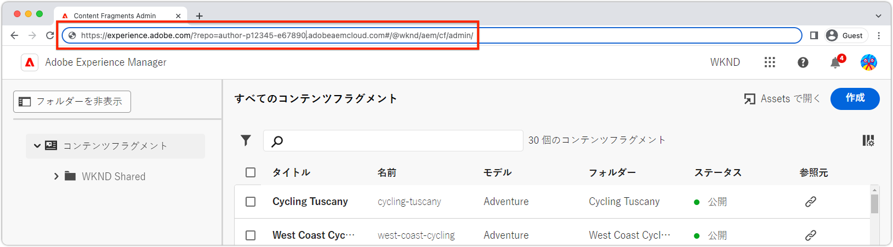

# 拡張機能のテスト

AEMコンテンツフラグメントコンソール拡張は、拡張機能が属するAdobe組織内の任意のAEMas a Cloud Service環境に対してテストできます。

拡張機能のテストは、AEMコンテンツフラグメントコンソールに拡張機能の読み込みを指示する、特別に作成された URL を使用しておこなわれます。

>[!VIDEO](https://video.tv.adobe.com/v/3412877/?quality=12&learn=on)

## AEMコンテンツフラグメントコンソールの URL

{align="center"}

実稼動以外の拡張機能をAEMコンテンツフラグメントコンソールにマウントする URL を作成するには、目的のAEMコンテンツフラグメントコンソールの URL を収集する必要があります。 AEMas a Cloud Service環境に移動して拡張機能をテストし、その URL をAEMコンテンツフラグメントコンソールにコピーします。

1. 目的のAEMas a Cloud Service環境にログインします。

   + 次の目的でAEM開発環境を使用： [開発ビルドのテスト](#testing-development-builds)
   + AEM Stage または QA 開発環境を [テストステージビルド](#testing-stage-builds)

1. を選択します。 __コンテンツフラグメント__ アイコン
1. ブラウザーでAEMコンテンツフラグメントコンソールが読み込まれるのを待ちます。
1. AEMコンテンツフラグメントコンソールの URL をブラウザーのアドレスバーからコピーします。次のようになります。

   ```
   https://experience.adobe.com/?repo=author-p1234-e5678.adobeaemcloud.com#/@wknd/aem/cf/admin
   ```

この URL は、開発およびステージテスト用に URL を作成する際に以下で使用されます。

## テストローカル開発ビルド

1. 拡張プロジェクトのルートへのコマンドラインを開きます。
1. AEMコンテンツフラグメントコンソール拡張機能をローカルの App Builder アプリとして実行する

   ```shell
   $ aio app run
   ...
   No change to package.json was detected. No package manager install will be executed.
   
   To view your local application:
     -> https://localhost:9080
   To view your deployed application in the Experience Cloud shell:
     -> https://experience.adobe.com/?devMode=true#/custom-apps/?localDevUrl=https://localhost:9080
   ```

上記のように、ローカルアプリケーションの URL をメモします。 `-> https://localhost:9080`

1. 次の 2 つのクエリパラメーターを [AEMコンテンツフラグメントコンソールの URL](#aem-content-fragment-console-url)
   + `&devMode=true`
   + `&ext=<LOCAL APPLICATION URL>`通常は `&ext=https://localhost:9080`.

   上記の 2 つのクエリパラメーター (`devMode` および `ext`) を __first__ コンテンツフラグメントコンソールはハッシュルート (`#/@wknd/aem/...`) の代わりに、 `#` は機能しません。

   テスト URL は次のようになります。

   ```
   https://experience.adobe.com/?devMode=true&ext=https://localhost:9080&repo=author-p1234-e5678.adobeaemcloud.com#/@wknd/aem/cf/admin
   ```

1. テスト URL をコピーして、ブラウザーに貼り付けます。

   + 最初に、定期的に、 [HTTPS 証明書を受け入れる](https://developer.adobe.com/uix/docs/services/aem-cf-console-admin/extension-development/#accepting-the-certificate-first-time-users) ローカルアプリケーションのホスト (`https://localhost:9080`) をクリックします。

1. AEMコンテンツフラグメントコンソールは、テスト用に挿入された拡張機能のローカルバージョンと共に読み込まれ、ローカルの App Builder アプリケーションが実行中である限り、変更をホットリロードします。

>[!IMPORTANT]
>
>この方法を使用する場合、開発中の拡張機能はエクスペリエンスにのみ影響し、AEMコンテンツフラグメントコンソールの他のすべてのユーザーは、挿入された拡張機能なしでその拡張機能にアクセスできます。


## テストステージビルド

1. 拡張プロジェクトのルートへのコマンドラインを開きます。
1. ステージワークスペースがアクティブ（またはテストに使用されている Workspace）であることを確認します。

   ```shell
   $ aio app use -w Stage
   ```
   変更を `.env` および `.aio`.
1. 更新された拡張機能 App Builder アプリをデプロイします。 ログインしていない場合は、を実行します。 `aio login` 1 つ目は

   ```shell
   $ aio app deploy
   ...
   Your deployed actions:
   web actions:
     -> https://98765-123aquarat.adobeio-static.net/api/v1/web/aem-cf-console-admin-1/generic 
   To view your deployed application:
     -> https://98765-123aquarat.adobeio-static.net/index.html
   To view your deployed application in the Experience Cloud shell:
     -> https://experience.adobe.com/?devMode=true#/custom-apps/?localDevUrl=https://98765-123aquarat.adobeio-static.net/index.html
   New Extension Point(s) in Workspace 'Production': 'aem/cf-console-admin/1'
   Successful deployment 🏄
   ```

1. 次の 2 つのクエリパラメーターを [AEMコンテンツフラグメントコンソールの URL](#aem-content-fragment-console-url)
   + `&devMode=true`
   + `&ext=<DEPLOYED APPLICATION URL>`

   上記の 2 つのクエリパラメーター (`devMode` および `ext`) を __first__ コンテンツフラグメントコンソールはハッシュルート (`#/@wknd/aem/...`) の代わりに、 `#` は機能しません。

   テスト URL は次のようになります。

   ```
   https://experience.adobe.com/?devMode=true&ext=https://98765-123aquarat.adobeio-static.net/index.html&repo=author-p1234-e5678.adobeaemcloud.com#/@wknd/aem/cf/admin
   ```

1. テスト URL をコピーして、ブラウザーに貼り付けます。
1. AEMコンテンツフラグメントコンソールは、のステージングワークスペースにデプロイされた拡張機能のバージョンを挿入します。 このステージ URL は、QA またはビジネスユーザーに共有してテストできます。

この方法を使用する場合、Staged 拡張機能は、クラフトステージ URL を使用してアクセスするときにAEMコンテンツフラグメントコンソールのにのみ挿入されます。

1. デプロイされた拡張機能は、次を実行して更新できます： `aio app deploy` この場合も、テスト URL を使用すると、これらの変更が自動的に反映されます。
1. テスト用に拡張機能を削除するには、次を実行します。 `aio app undeploy`.


