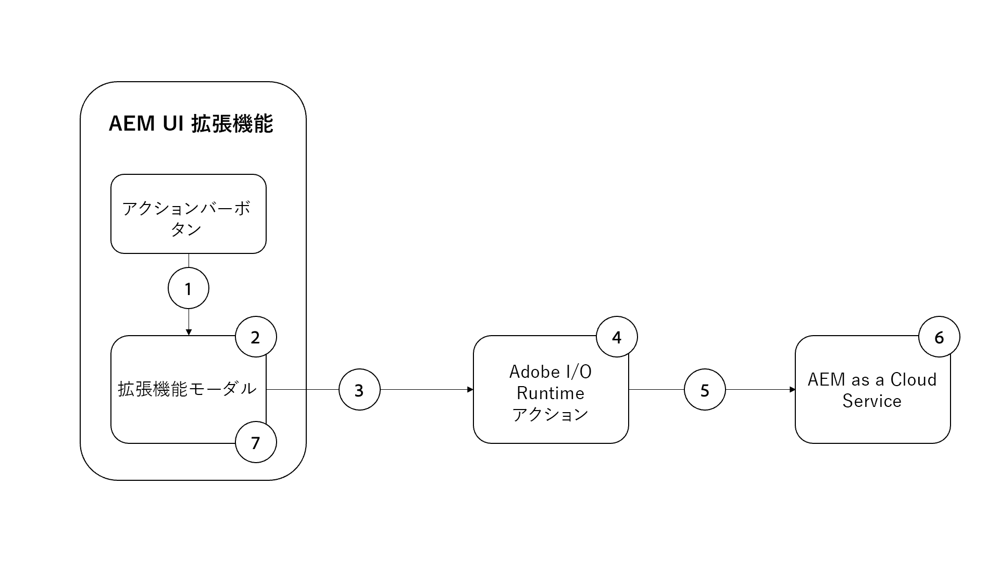

# OpenAI を使用した AEM 画像アセットの生成

OpenAI または DALL.E 2 で画像を生成して AEM DAM にアップロードし、コンテンツ速度を向上させる方法を説明します。

>[!VIDEO](https://video.tv.adobe.com/v/3413093?quality=12&learn=on)

この例の AEM コンテンツフラグメントコンソール拡張機能は、[OpenAI API](https://openai.com/api/) または [DALL.E 2](https://openai.com/dall-e-2/) を使用して、自然言語入力からデジタル画像を生成する[アクションバー](https://developer.adobe.com/uix/docs/services/aem-cf-console-admin/api/action-bar/)拡張機能です。生成された画像が AEM DAM にアップロードされ、選択されたコンテンツフラグメントの画像プロパティが更新されて、DAM から新しく生成され、アップロードされたこの画像が参照されます。

この例では、次のことを学びます。

1. [OpenAI API](https://beta.openai.com/docs/guides/images/image-generation-beta) または [DALL.E 2](https://openai.com/dall-e-2/) を使用した画像生成
2. AEM への画像のアップロード
3. コンテンツフラグメントプロパティの更新

この例の拡張機能の機能フローは次のとおりです。

{align="center"}

1. 「コンテンツフラグメント」を選択し、[アクションバー](#extension-registration)の拡張機能の「`Generate Image`」ボタンをクリックして[モーダル](#modal)を開きます。
1. [モーダル](#modal)には、[React Spectrum](https://react-spectrum.adobe.com/react-spectrum/) で作成されたカスタムの入力が表示されます。
1. フォームを送信すると、ユーザーが指定した `Image Description` テキスト、選択されているコンテンツフラグメント、AEM ホストが [Adobe I/O Runtime のカスタムアクション](#adobe-io-runtime-action)に送信されます。
1. [Adobe I/O Runtime アクション](#adobe-io-runtime-action)が入力を検証します。
1. 次に、OpenAI の[画像生成](https://beta.openai.com/docs/guides/images/image-generation-beta) API を呼び出し、`Image Description` テキストを使って、生成する画像を指定します。
1. [画像生成](https://beta.openai.com/docs/guides/images/image-generation-beta)エンドポイントはプロンプトリクエストパラメータ値を使用して、_1024 x 1024_ ピクセルの元画像を作成し、生成された画像 URL を応答として返します。
1. [Adobe I/O Runtime アクション](#adobe-io-runtime-action) が、生成された画像を App Builder ランタイムにダウンロードします。
1. 次に、事前に定義されたパスの下で、App Builder ランタイムから AEM DAM への画像のアップロードを開始します。
1. AEM as a Cloud Service は画像を DAM に保存し、Adobe I/O Runtime アクションに対して成功または失敗の応答を返します。 アップロード応答が成功すると、Adobe I/O Runtime アクションから AEM への別の HTTP リクエストを使用して、選択されたコンテンツフラグメントの画像プロパティ値が更新されます。
1. モーダルは、Adobe I/O Runtime アクションから応答を受け取り、新しく生成されてアップロードされた画像の AEM アセットの詳細リンクを提供します。

## 拡張機能ポイント

この例では、拡張機能ポイント `actionBar` まで拡張して、コンテンツフラグメントコンソールにカスタムボタンを追加します。

| AEM UI 拡張 | 拡張機能ポイント |
| ------------------------ | --------------------- | 
| [コンテンツフラグメントコンソール](https://developer.adobe.com/uix/docs/services/aem-cf-console-admin/) | [アクションバー](https://developer.adobe.com/uix/docs/services/aem-cf-console-admin/api/action-bar/) |

## 拡張機能の例

この例では、既存の Adobe Developer Console プロジェクトと、`aio app init` を介して App Builder アプリを初期化する際の次のオプションを使用しています。

+ 検索するテンプレート：`All Extension Points`
+ インストールするテンプレートを選択：` @adobe/aem-cf-admin-ui-ext-tpl`
+ 拡張機能の名前は？：`Image generation`
+ 拡張機能の短い説明を入力：`An example action bar extension that generates an image using OpenAI and uploads it to AEM DAM.`
+ 開始するバージョン：`0.0.1`
+ 次は何を行いますか？
   + `Add a custom button to Action Bar`
      + ボタンのラベル名を指定：`Generate Image`
      + ボタンのモーダルを表示する必要がありますか？`y`
   + `Add server-side handler`
      + Adobe I/O Runtime では、サーバーレスのコードをオンデマンドで呼び出すことができます。 このアクションの名前を指定：`generate-image`

生成された App Builder 拡張機能アプリが、以下に示すようにアップデートされます。

### 初期設定

1. 無料の [OpenAI API](https://openai.com/api/) アカウントに新規登録して、[API キー](https://beta.openai.com/account/api-keys)を作成します
1. このキーを App Builder プロジェクトの `.env` ファイルに追加します

   ```
       # Specify your secrets here
       # This file must not be committed to source control
       ## Adobe I/O Runtime credentials
       ...
       AIO_runtime_apihost=https://adobeioruntime.net
       ...
       # OpenAI secret API key
       OPENAI_API_KEY=my-openai-secrete-key-to-generate-images
       ...
   ```

1. `OPENAI_API_KEY` をパラメーターとして Adobe I/O Runtime アクションに渡し、`src/aem-cf-console-admin-1/ext.config.yaml` を更新します

   ```yaml
       ...
   
       runtimeManifest:
         packages:
           aem-cf-console-admin-1:
             license: Apache-2.0
             actions:
               generate-image:
                 function: actions/generate-image/index.js
                 web: 'yes'
                 runtime: nodejs:16
                 inputs:
                   LOG_LEVEL: debug
                   OPENAI_API_KEY: $OPENAI_API_KEY
       ...
   ```

1. Node.js ライブラリの下にインストールします
   1. [OpenAI Node.js ライブラリ](https://github.com/openai/openai-node#installation)：OpenAI API を簡単に呼び出す
   1. [AEM Upload](https://github.com/adobe/aem-upload#install) ：画像を AEM-CS インスタンスにアップロードする。


>[!TIP]
>
>以降の節では、React と Adobe I/O Runtime アクションの主な JavaScript ファイルについて説明します。参考のために、AppBuilder プロジェクトの `web-src` および `actions` フォルダー内の主要なファイルが提供されています。詳しくは、[adobe-appbuilder-cfc-ext-image-generation-code.zip](./assets/digital-image-generation/adobe-appbuilder-cfc-ext-image-generation-code.zip) を参照してください。


### アプリルート{#app-routes}

`src/aem-cf-console-admin-1/web-src/src/components/App.js` には [React ルーター](https://reactrouter.com/en/main)が含まれています。

次の 2 つの論理セットのルートがあります。

1. 最初のルートはリクエストを `index.html` にマップし、[拡張機能登録](#extension-registration)を担当する React コンポーネントを呼び出します。

   ```javascript
   <Route index element={<ExtensionRegistration />} />
   ```

1. 2 つ目のルートセットは、拡張機能のモーダルのコンテンツをレンダリングする React コンポーネントに URL をマップします。 この `:selection` param は、区切られたリストコンテンツフラグメントのパスを表します。

   個別のアクションを呼び出すための複数のボタンが拡張機能にある場合、それぞれの[拡張機能の登録](#extension-registration)は、ここで定義されたルートにマップされます。

   ```javascript
   <Route
       exact path="content-fragment/:selection/generate-image-modal"
       element={<GenerateImageModal />}
       />
   ```

### 拡張機能の登録

`index.html` ルートにマッピングされた `ExtensionRegistration.js` は、AEM 拡張機能のエントリポイントであり、以下を定義します。

1. AEM オーサリングエクスペリエンスに表示される「拡張機能」ボタンの場所（`actionBar` または `headerMenu`）
1. `getButtons()` 関数内の拡張機能ボタンの定義 
1. `onClick()` 関数内のボタンのクリックハンドラー

+ `src/aem-cf-console-admin-1/web-src/src/components/ExtensionRegistration.js`

```javascript
import React from "react";
import { generatePath } from "react-router";
import { Text } from "@adobe/react-spectrum";
import { register } from "@adobe/uix-guest";
import { extensionId } from "./Constants";

function ExtensionRegistration() {
  const init = async () => {
    const guestConnection = await register({
      id: extensionId, // Some unique ID for the extension used to facilitate communication between the extension and Content Fragment Console
      methods: {
        // Configure your Action Bar button here
        actionBar: {
          getButtons() {
            return [{
              'id': 'generate-image',     // Unique ID for the button
              'label': 'Generate Image',  // Button label 
              'icon': 'PublishCheck',      // Button icon; get name from: https://spectrum.adobe.com/page/icons/ (Remove spaces, keep uppercase)
              // Click handler for the extension button
              onClick(selections) {
                // Collect the selected content fragment paths 
                const selectionIds = selections.map(selection => selection.id);

                // Create a URL that maps to the 
                const modalURL = "/index.html#" + generatePath(
                  "/content-fragment/:selection/generate-image-modal",
                  {
                    // Set the :selection React route parameter to an encoded, delimited list of paths of the selected content fragments
                    selection: encodeURIComponent(selectionIds.join('|')),
                  }
                );

                // Open the route in the extension modal using the constructed URL
                guestConnection.host.modal.showUrl({
                  title: "Generate Image",
                  url: modalURL
                })
                },
              },
            ];
          },
        },
      },
    });
  };

  init().catch(console.error);

  return <Text>IFrame for integration with Host (AEM)...</Text>;
}

export default ExtensionRegistration;          
```

### モーダル

[`App.js`](#app-routes) で定義されている拡張機能の各ルートは、拡張機能のモーダルでレンダリングされる React コンポーネントにマップされます。

このサンプルアプリでは、モーダル React コンポーネント（`GenerateImageModal.js`）には 4 つの状態があります。

1. 読み込み中。ユーザーが待機する必要があることを示しています。
1. ユーザーが一度に 1 つのコンテンツフラグメントのみを選択することを推奨する警告メッセージ
1. 画像の説明を自然言語で入力できる、画像を生成フォーム。
1. 新しく生成され、アップロードされた画像の AEM アセットの詳細リンクを提供する、画像生成操作の応答。

重要なのは、拡張機能からの AEM とのやり取りは、[AppBuilder Adobe I/O Runtime アクション](https://developer.adobe.com/runtime/docs/guides/using/creating_actions/)にデリゲートする必要があることです。これは、[Adobe I/O Runtime](https://developer.adobe.com/runtime/docs/) で実行される別のサーバーレス プロセスです。
Adobe I/O Runtime アクションを使用して AEM と通信するのは、クロスオリジンリソース共有（CORS）接続の問題を避けるためです。

_画像を生成_&#x200B;フォームが送信されると、カスタム `onSubmitHandler()` が Adobe I/O Runtime アクションを呼び出し、画像の説明、現在の AEM ホスト（ドメイン）、ユーザーの AEM アクセストークンを渡します。次に、アクションは OpenAI の[画像生成](https://beta.openai.com/docs/guides/images/image-generation-beta) API を呼び出して、送信された画像の説明を使用して画像を生成します。次に、[AEM アップロード](https://github.com/adobe/aem-upload)ノードモジュールの `DirectBinaryUpload` クラスを使用して、生成された画像を AEM にアップロードし、最後に [AEM Content Fragment API](https://experienceleague.adobe.com/docs/experience-manager-65/assets/extending/assets-api-content-fragments.html?lang=ja) を使用してコンテンツフラグメントを更新します。

Adobe I/O Runtime アクションからの応答を受け取ると、モーダルが更新され、画像生成操作の結果が表示されます。

+ `src/aem-cf-console-admin-1/web-src/src/components/GenerateImageModal.js`

```javascript
export default function GenerateImageModal() {
  // Set up state used by the React component
  const [guestConnection, setGuestConnection] = useState();

  // State hooks to manage the application state
  const [imageDescription, setImageDescription] = useState(null);
  const [validationState, setValidationState] = useState({});

  const [actionInvokeInProgress, setActionInvokeInProgress] = useState(false);
  const [actionResponse, setActionResponse] = useState();

  // Get the selected content fragment paths from the route parameter `:selection`
  const { selection } = useParams();
  const fragmentIds = selection?.split('|') || [];

  console.log('Selected Fragment Ids', fragmentIds);

  if (!fragmentIds || fragmentIds.length === 0) {
    console.error('The Content Fragments are not selected, can NOT generate images');
    return;
  }

  // Asynchronously attach the extension to AEM, we must wait or the guestConnection to be set before doing anything in the modal
  useEffect(() => {
    (async () => {
      const myGuestConnection = await attach({ id: extensionId });

      setGuestConnection(myGuestConnection);
    })();
  }, []);

  // Determine view to display in the modal
  if (!guestConnection) {
    // If the guestConnection is not initialized, display a loading spinner
    return <Spinner />;
  } if (actionInvokeInProgress) {
    // If the 'Generate Image' action has been invoked but not completed, display a loading spinner
    return <Spinner />;
  } if (fragmentIds.length > 1) {
    // If more than one CF selected show warning and suggest to select only one CF
    return renderMoreThanOneCFSelectionError();
  } if (fragmentIds.length === 1 && !actionResponse) {
    // Display the 'Generate Image' modal and ask for image description
    return renderImgGenerationForm();
  } if (actionResponse) {
    // If the 'Generate Image' action has completed, display the response
    return renderActionResponse();
  }

  /**
   * Renders the message suggesting to select only on CF at a time to not lose credits accidentally
   *
   * @returns the suggestion or error message to select one CF at a time
   */
  function renderMoreThanOneCFSelectionError() {
    return (
      <Provider theme={defaultTheme} colorScheme="light">
        <Content width="100%">
          <Text>
            As this operation
            <strong> uses credits from Generative AI services</strong>
            {' '}
            such as DALL·E 2 (or Stable Dufusion), we allow only one Generate Image at a time.
            <p />
            <strong>So please select only one Content Fragment at this moment.</strong>
          </Text>

          <Flex width="100%" justifyContent="end" alignItems="center" marginTop="size-400">
            <ButtonGroup align="end">
              <Button variant="negative" onPress={() => guestConnection.host.modal.close()}>Close</Button>
            </ButtonGroup>
          </Flex>

        </Content>
      </Provider>
    );
  }

  /**
   * Renders the form asking for image description in the natural language and
   * displays message this action uses credits from Generative AI services.
   *
   * @returns the image description input field and credit usage message
   */
  function renderImgGenerationForm() {
    return (

      <Provider theme={defaultTheme} colorScheme="light">
        <Content width="100%">

          <Flex width="100%">
            <Form
              width="100%"
            >
              <TextField
                label="Image Description"
                description="The image description in natural language, for e.g. Alaskan adventure in wilderness, animals, and flowers."
                isRequired
                validationState={validationState?.propertyName}
                onChange={setImageDescription}
                contextualHelp={(
                  <ContextualHelp>
                    <Heading>Need help?</Heading>
                    <Content>
                      <Text>
                        The
                        <strong>description of an image</strong>
                        {' '}
                        you are looking for in the natural language, for e.g. &quot;Family vacation on the beach with blue ocean, dolphins, boats and drink&quot;
                      </Text>
                    </Content>
                  </ContextualHelp>
                  )}
              />

              <Text>
                <p />
                Please note this will use credits from Generative AI services such as OpenAI/DALL·E 2. The AI-generated images are saved to this AEM as a Cloud Service Author service using logged user access (IMS) token.
              </Text>

              <ButtonGroup align="end">
                <Button variant="accent" onPress={onSubmitHandler}>Use Credits</Button>
                <Button variant="accent" onPress={() => guestConnection.host.modal.close()}>Close</Button>
              </ButtonGroup>
            </Form>
          </Flex>

        </Content>
      </Provider>
    );
  }

  function buildAssetDetailsURL(aemImgURL) {
    const urlParts = aemImgURL.split('.com');
    const aemAssetDetailsURL = `${urlParts[0]}.com/ui#/aem/assetdetails.html${urlParts[1]}`;

    return aemAssetDetailsURL;
  }

  /**
   * Displays the action response received from the App Builder
   *
   * @returns Displays App Builder action and details
   */
  function renderActionResponse() {
    return (
      <Provider theme={defaultTheme} colorScheme="light">
        <Content width="100%">

          {actionResponse.status === 'success'
            && (
              <>
                <Heading level="4">
                  Successfully generated an image, uploaded it to this AEM-CS Author service, and associated it to the selected Content Fragment.
                </Heading>

                <Text>
                  {' '}
                  Please see generated image in AEM-CS
                  {' '}
                  <Link>
                    <a href={buildAssetDetailsURL(actionResponse.aemImgURL)} target="_blank" rel="noreferrer">
                      here.
                    </a>
                  </Link>
                </Text>
              </>
            )}

          {actionResponse.status === 'failure'
            && (
            <Heading level="4">
              Failed to generate, upload image, please check App Builder logs.
            </Heading>
            )}

          <Flex width="100%" justifyContent="end" alignItems="center" marginTop="size-400">
            <ButtonGroup align="end">
              <Button variant="negative" onPress={() => guestConnection.host.modal.close()}>Close</Button>
            </ButtonGroup>
          </Flex>

        </Content>
      </Provider>
    );
  }

  /**
   * Handle the Generate Image form submission.
   * This function calls the supporting Adobe I/O Runtime actions such as
   * - Call the Generative AI service (DALL·E) with 'image description' to generate an image
   * - Download the AI generated image to App Builder runtime
   * - Save the downloaded image to AEM DAM and update Content Fragment's image reference property to use this new image
   *
   * When invoking the Adobe I/O Runtime actions, the following parameters are passed as they're used by the action to connect to AEM:
   * - AEM Host to connect to
   * - AEM access token to connect to AEM with
   * - The Content Fragment path to update
   *
   * @returns In case of success the updated content fragment, otherwise failure message
   */
  async function onSubmitHandler() {
    console.log('Started Image Generation orchestration');

    // Validate the form input fields
    if (imageDescription?.length > 1) {
      setValidationState({ imageDescription: 'valid' });
    } else {
      setValidationState({ imageDescription: 'invalid' });
      return;
    }

    // Mark the extension as invoking the action, so the loading spinner is displayed
    setActionInvokeInProgress(true);

    // Set the HTTP headers to access the Adobe I/O runtime action
    const headers = {
      Authorization: `Bearer ${guestConnection.sharedContext.get('auth').imsToken}`,
      'x-gw-ims-org-id': guestConnection.sharedContext.get('auth').imsOrg,
    };

    // Set the parameters to pass to the Adobe I/O Runtime action
    const params = {

      aemHost: `https://${guestConnection.sharedContext.get('aemHost')}`,

      fragmentId: fragmentIds[0],
      imageDescription,
    };

    const generateImageAction = 'generate-image';

    try {
      const generateImageActionResponse = await actionWebInvoke(allActions[generateImageAction], headers, params);

      // Set the response from the Adobe I/O Runtime action
      setActionResponse(generateImageActionResponse);

      console.log(`Response from ${generateImageAction}:`, actionResponse);
    } catch (e) {
      // Log and store any errors
      console.error(e);
    }

    // Set the action as no longer being invoked, so the loading spinner is hidden
    setActionInvokeInProgress(false);
  }
}
```

>[!NOTE]
>
>`buildAssetDetailsURL()` 関数内の `aemAssetdetailsURL` 変数値は、[統合シェル](https://experienceleague.adobe.com/docs/experience-manager-cloud-service/content/overview/aem-cloud-service-on-unified-shell.html?lang=ja#overview)が有効になっていることを前提としています。統合シェルを無効にしてある場合は、`/ui#/aem` を変数値から削除する必要があります。


### Adobe I/O Runtime アクション

AEM 拡張機能の App Builder アプリは、0 個または複数の Adobe I/O Runtime アクションを定義または使用できます。
Adobe Runtime アクションは、AEM、Adobe、サードパーティの web サービスとの対話を必要とする作業を担当します。

このサンプルアプリでは、`generate-image` Adobe I/O Runtime のアクションは、次を担当します。

1. [OpenAI API 画像生成](https://beta.openai.com/docs/guides/images/image-generation-beta)サービスを使用して画像を生成する
1. [AEM Upload](https://github.com/adobe/aem-upload) ライブラリを使用して、生成された画像を AEM-CS インスタンスにアップロードする 
1. AEM Content Fragment API に HTTP リクエストを送信して、コンテンツフラグメントの画像プロパティを更新する。
1. モーダルで表示する成功と失敗のキー情報を返す（`GenerateImageModal.js`）


#### エントリポイント（`index.js`）

`index.js` は、上記の 1～3 のタスクを調整するために、それぞれの JavaScript モジュール（`generate-image-using-openai, upload-generated-image-to-aem, update-content-fragement`）を使用します。これらのモジュールと関連コードについては、次の[サブセクション](#image-generation-module---generate-image-using-openaijs)で説明します。 

+ `src/aem-cf-console-admin-1/actions/generate-image/index.js`

```javascript
/**
 *
 * This action orchestrates an image generation by calling the OpenAI API (DALL·E 2) and saves generated image to AEM.
 *
 * It leverages following modules
 *  - 'generate-image-using-openai' - To generate an image using OpenAI API
 *  - 'upload-generated-image-to-aem' - To upload the generated image into AEM-CS instance
 *  - 'update-content-fragement' - To update the CF image property with generated image's DAM path
 *
 */

const { Core } = require('@adobe/aio-sdk');
const {
  errorResponse, stringParameters, getBearerToken, checkMissingRequestInputs,
} = require('../utils');

const { generateImageUsingOpenAI } = require('./generate-image-using-openai');

const { uploadGeneratedImageToAEM } = require('./upload-generated-image-to-aem');

const { updateContentFragmentToUseGeneratedImg } = require('./update-content-fragement');

// main function that will be executed by Adobe I/O Runtime
async function main(params) {
  // create a Logger
  const logger = Core.Logger('main', { level: params.LOG_LEVEL || 'info' });

  try {
    // 'info' is the default level if not set
    logger.info('Calling the main action');

    // log parameters, only if params.LOG_LEVEL === 'debug'
    logger.debug(stringParameters(params));

    // check for missing request input parameters and headers
    const requiredParams = ['aemHost', 'fragmentId', 'imageDescription'];
    const requiredHeaders = ['Authorization'];
    const errorMessage = checkMissingRequestInputs(params, requiredParams, requiredHeaders);

    if (errorMessage) {
      // return and log client errors
      return errorResponse(400, errorMessage, logger);
    }

    // extract the user Bearer token from the Authorization header
    const token = getBearerToken(params);

    // Call OpenAI (DALL·E 2) API to generate an image using image description
    const generatedImageURL = await generateImageUsingOpenAI(params);
    logger.info(`Generated image using OpenAI API and url is : ${generatedImageURL}`);

    // Upload the generated image to AEM-CS
    const uploadedImagePath = await uploadGeneratedImageToAEM(params, generatedImageURL, token);
    logger.info(`Uploaded image to AEM, path is: ${uploadedImagePath}`);

    // Update Content Fragment with the newly generated image reference
    const updateContentFragmentPath = await updateContentFragmentToUseGeneratedImg(params, uploadedImagePath, token);
    logger.info(`Updated Content Fragment path is: ${updateContentFragmentPath}`);

    let result;
    if (updateContentFragmentPath) {
      result = {
        status: 'success', message: 'Successfully generated and uploaded image to AEM', genTechServiceImageURL: generatedImageURL, aemImgURL: uploadedImagePath, fragmentPath: updateContentFragmentPath,
      };
    } else {
      result = { status: 'failure', message: 'Failed to generated and uploaded image, please check App Builder logs' };
    }

    const response = {
      statusCode: 200,
      body: result,
    };

    logger.info('Adobe I/O Runtime action response', response);

    // Return the response to the caller
    return response;
  } catch (error) {
    // log any server errors
    logger.error(error);
    // return with 500
    return errorResponse(500, 'server error', logger);
  }
}

exports.main = main;
```

#### 画像生成

このモジュールは、[openai](https://github.com/openai/openai-node) ライブラリを使用して OpenAI の[画像生成](https://beta.openai.com/docs/guides/images/image-generation-beta)エンドポイントを呼び出す役割を果たします。`.env` ファイルで定義されている OpenAI API 秘密鍵を取得するには、`params.OPENAI_API_KEY` を使用します。

+ `src/aem-cf-console-admin-1/actions/generate-image/generate-image-using-openai.js`

```javascript
/**
 * This module calls OpenAI API to generate an image based on image description provided to Action
 *
 */

const { Configuration, OpenAIApi } = require('openai');

const { Core } = require('@adobe/aio-sdk');

// Placeholder than actual OpenAI Image
const PLACEHOLDER_IMG_URL = 'https://www.gstatic.com/webp/gallery/2.png';

async function generateImageUsingOpenAI(params) {
  // create a Logger
  const logger = Core.Logger('generateImageUsingOpenAI', { level: params.LOG_LEVEL || 'info' });

  let generatedImageURL = PLACEHOLDER_IMG_URL;

  // create configuration object with the API Key
  const configuration = new Configuration({
    apiKey: params.OPENAI_API_KEY,
  });

  // create OpenAIApi object
  const openai = new OpenAIApi(configuration);

  logger.info(`Generating image for input: ${params.imageDescription}`);

  try {
    // invoke createImage method with details
    const response = await openai.createImage({
      prompt: params.imageDescription,
      n: 1,
      size: '1024x1024',
    });

    generatedImageURL = response.data.data[0].url;

    logger.info(`The OpenAI generate image url is: ${generatedImageURL}`);
  } catch (error) {
    logger.error(`Error while generating image, details are: ${error}`);
  }

  return generatedImageURL;
}

module.exports = {
  generateImageUsingOpenAI,
};
```

#### AEM へのアップロード

このモジュールでは、[AEM アップロード](https://github.com/adobe/aem-upload)ライブラリを使って、OpenAI で生成された画像を AEM にアップロードします。生成された画像は、まず Node.js [ファイルシステム](https://nodejs.org/api/fs.html)ライブラリ を使用して App Builder ランタイムにダウンロードされ、AEM へのアップロードが完了すると削除されます。

以下のコード `uploadGeneratedImageToAEM` 関数は、生成された画像のダウンロードをランタイムに編成し、それを AEM にアップロードしてランタイムから削除します。 画像は `/content/dam/wknd-shared/en/generated` パスにアップロードされます。DAM にすべてのフォルダーが存在することと、[AEM アップロード](https://github.com/adobe/aem-upload)ライブラリを使用する際の前提条件を確認します。

+ `src/aem-cf-console-admin-1/actions/generate-image/upload-generated-image-to-aem.js`

```javascript
/**
 * This module uploads the generated image to AEM-CS instance using current user's IMS token
 *
 */

const { Core } = require('@adobe/aio-sdk');
const fs = require('fs');

const {
  DirectBinaryUploadErrorCodes,
  DirectBinaryUpload,
  DirectBinaryUploadOptions,
} = require('@adobe/aem-upload');

const codes = DirectBinaryUploadErrorCodes;
const IMG_EXTENSION = '.png';

const GENERATED_IMAGES_DAM_PATH = '/content/dam/wknd-shared/en/generated';

async function downloadImageToRuntime(logger, generatedImageURL) {
  logger.log('Downloading generated image to the runtime');

  // placeholder image name
  let generatedImageName = 'generated.png';

  try {
    // Get the generated image name from the image URL
    const justImgURL = generatedImageURL.substring(0, generatedImageURL.indexOf(IMG_EXTENSION) + 4);
    generatedImageName = justImgURL.substring(justImgURL.lastIndexOf('/') + 1);

    // Read image from URL as the buffer
    const response = await fetch(generatedImageURL);
    const buffer = await response.buffer();

    // Write/download image to the runtime
    fs.writeFileSync(generatedImageName, buffer, (err) => {
      if (err) throw err;
      logger.log('Saved the generated image!');
    });
  } catch (error) {
    logger.error(`Error while downloading image on the runtime, details are: ${error}`);
  }

  return generatedImageName;
}

function setupEventHandlers(binaryUpload, logger) {
  binaryUpload.on('filestart', (data) => {
    const { fileName } = data;

    logger.log(`Started file upload ${fileName}`);
  });

  binaryUpload.on('fileprogress', (data) => {
    const { fileName, transferred } = data;

    logger.log(`Fileupload is in progress ${fileName} & ${transferred}`);
  });

  binaryUpload.on('fileend', (data) => {
    const { fileName } = data;

    logger.log(`Finished file upload ${fileName}`);
  });

  binaryUpload.on('fileerror', (data) => {
    const { fileName, errors } = data;

    logger.log(`Error in file upload ${fileName} and ${errors}`);
  });
}

async function getImageSize(downloadedImgName) {
  const stats = fs.statSync(downloadedImgName);
  return stats.size;
}

async function uploadImageToAEMFromRuntime(logger, aemURL, downloadedImgName, accessToken) {
  let aemImageURL;
  try {
    logger.log('Uploading generated image to AEM from the runtime');

    const binaryUpload = new DirectBinaryUpload();

    // setup event handlers to track the progress, success or error
    setupEventHandlers(binaryUpload, logger);

    // get downloaded image size
    const imageSize = await getImageSize(downloadedImgName);
    logger.info(`The image upload size is: ${imageSize}`);

    // The deatils of the file to be uploaded
    const uploadFiles = [
      {
        fileName: downloadedImgName, // name of the file as it will appear in AEM
        fileSize: imageSize, // total size, in bytes, of the file
        filePath: downloadedImgName, // Full path to the local file
      },
    ];

    // Provide AEM URL and DAM Path where images will be uploaded
    const options = new DirectBinaryUploadOptions()
      .withUrl(`${aemURL}${GENERATED_IMAGES_DAM_PATH}`)
      .withUploadFiles(uploadFiles);

    // Add headers like content type and authorization
    options.withHeaders({
      'content-type': 'image/png',
      Authorization: `Bearer ${accessToken}`,
    });

    // Start the upload to AEM
    await binaryUpload.uploadFiles(options)
      .then((result) => {
        // Handle Error
        result.getErrors().forEach((error) => {
          if (error.getCode() === codes.ALREADY_EXISTS) {
            logger.error('The generated image already exists');
          }
        });

        // Handle Upload result and check for errors
        result.getFileUploadResults().forEach((fileResult) => {
          // log file upload result
          logger.info(`File upload result ${JSON.stringify(fileResult)}`);

          fileResult.getErrors().forEach((fileErr) => {
            if (fileErr.getCode() === codes.ALREADY_EXISTS) {
              const fileName = fileResult.getFileName();
              logger.error(`The generated image already exists ${fileName}`);
            }
          });
        });
      })
      .catch((err) => {
        logger.info(`Failed to uploaded generated image to AEM${err}`);
      });

    logger.info('Successfully uploaded generated image to AEM');

    aemImageURL = `${aemURL + GENERATED_IMAGES_DAM_PATH}/${downloadedImgName}`;
  } catch (error) {
    logger.info(`Error while uploading generated image to AEM, see ${error}`);
  }

  return aemImageURL;
}

async function deleteFileFromRuntime(logger, downloadedImgName) {
  try {
    logger.log('Deleting the generated image from the runtime');

    fs.unlinkSync(downloadedImgName);

    logger.log('Successfully deleted the generated image from the runtime');
  } catch (error) {
    logger.error(`Error while deleting generated image from the runtime, details are: ${error}`);
  }
}

async function uploadGeneratedImageToAEM(params, generatedImageURL, accessToken) {
  // create a Logger
  const logger = Core.Logger('uploadGeneratedImageToAEM', { level: params.LOG_LEVEL || 'info' });

  const aemURL = params.aemHost;

  logger.info(`Uploading generated image from ${generatedImageURL} to AEM ${aemURL} by streaming the bytes.`);

  // download image to the App Builder runtime
  const downloadedImgName = await downloadImageToRuntime(logger, generatedImageURL);

  // Upload image to AEM from the App Builder runtime
  const aemImageURL = await uploadImageToAEMFromRuntime(logger, aemURL, downloadedImgName, accessToken);

  // Delete the downloaded image from the App Builder runtime
  await deleteFileFromRuntime(logger, downloadedImgName);

  return aemImageURL;
}

module.exports = {
  uploadGeneratedImageToAEM,
};
```

#### コンテンツフラグメントを更新

このモジュールでは、AEM コンテンツフラグメント API を使用して、指定されたコンテンツフラグメントの画像プロパティを、新しくアップロードされた画像の DAM パスで更新します。

+ `src/aem-cf-console-admin-1/actions/generate-image/update-content-fragement.js`

```javascript
/**
 * This module updates the CF image property with generated image's DAM path
 *
 */
const { Core } = require('@adobe/aio-sdk');

const ADVENTURE_MODEL_IMG_PROPERTY_NAME = 'primaryImage';

const ARTICLE_MODEL_IMG_PROPERTY_NAME = 'featuredImage';

const AUTHOR_MODEL_IMG_PROPERTY_NAME = 'profilePicture';

function findImgPropertyName(fragmenPath) {
  if (fragmenPath && fragmenPath.includes('/adventures')) {
    return ADVENTURE_MODEL_IMG_PROPERTY_NAME;
  } if (fragmenPath && fragmenPath.includes('/magazine')) {
    return ARTICLE_MODEL_IMG_PROPERTY_NAME;
  }
  return AUTHOR_MODEL_IMG_PROPERTY_NAME;
}

async function updateContentFragmentToUseGeneratedImg(params, uploadedImagePath, accessToken) {
  // create a Logger
  const logger = Core.Logger('updateContentFragment', { level: params.LOG_LEVEL || 'info' });

  const fragmenPath = params.fragmentId;
  const imgPropName = findImgPropertyName(fragmenPath);
  const relativeImgPath = uploadedImagePath.substring(uploadedImagePath.indexOf('/content/dam'));

  logger.info(`Update CF ${fragmenPath} to use ${relativeImgPath} image path`);

  const body = {
    properties: {
      elements: {
        [imgPropName]: {
          value: relativeImgPath,
        },
      },
    },
  };

  const res = await fetch(`${params.aemHost}${fragmenPath.replace('/content/dam/', '/api/assets/')}.json`, {
    method: 'put',
    body: JSON.stringify(body),
    headers: {
      Authorization: `Bearer ${accessToken}`,
      'Content-Type': 'application/json',
    },

  });

  if (res.ok) {
    logger.info(`Successfully updated ${fragmenPath}`);
    return fragmenPath;
  }

  logger.info(`Failed to update ${fragmenPath}`);
  return '';
}

module.exports = {
  updateContentFragmentToUseGeneratedImg,
};
```
