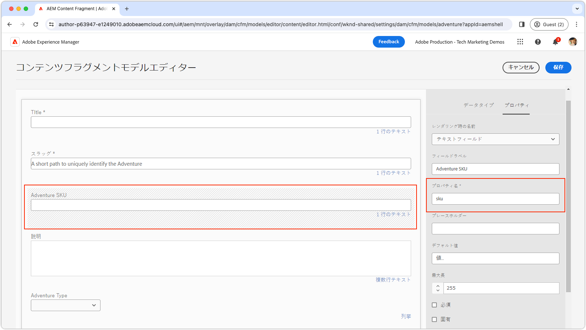

# カスタムフィールド

AEM コンテンツフラグメントエディターでカスタムフィールドを作成する方法について説明します。

>[!VIDEO](https://video.tv.adobe.com/v/3427585?learn=on)

AEM UI 拡張機能は、[Adobe React Spectrum](https://react-spectrum.adobe.com/react-spectrum/index.html) フレームワークを使用して開発する必要があります。これにより、AEM の他の部分と一貫した外観と操作性が維持され、事前に構築された機能の広範なライブラリも備えているので、開発時間が短縮されます。

## 拡張ポイント

この例では、コンテンツフラグメントエディター内の既存のフィールドをカスタム実装で置き換えます。

| AEM UI 拡張 | 拡張ポイント |
| ------------------------ | --------------------- | 
| [コンテンツフラグメントエディター](https://developer.adobe.com/uix/docs/services/aem-cf-editor/) | [カスタムフォーム要素のレンダリング](https://developer.adobe.com/uix/docs/services/aem-cf-editor/api/custom-fields/) |

## 拡張機能の例

この例では、標準フィールドを事前定義された SKU のカスタムドロップダウンで置き換えることで、コンテンツフラグメントエディターのフィールド値を事前に定義されたセットに制限する方法を示しています。作成者は、この特定の SKU リストから選択できます。SKU は通常、製品情報管理（PIM）システムから提供されますが、この例では SKU を静的にリストすることで簡素化しています。

この例のソースコードは、[ダウンロード可能](./assets/editor-custom-field/content-fragment-editor-custom-field-src.zip)です。

### コンテンツフラグメントモデルの定義

この例では、（`^sku$` の[正規表現の一致](#extension-registration)を介して）`sku` という名前のコンテンツフラグメントフィールドにバインドされます。この例では、更新された WKND アドベンチャーコンテンツフラグメントモデルを使用し、定義は次のようになります。



カスタム SKU フィールドがドロップダウンとして表示されているにもかかわらず、その基になるモデルはテキストフィールドとして設定されます。カスタムフィールドの実装は、適切なプロパティ名とタイプに合わせるだけで済むので、標準フィールドをカスタムドロップダウンバージョンに簡単に置き換えることができます。


### アプリルート

メインの React コンポーネント `App.js` に、`SkuField` React コンポーネントをレンダリングする `/sku-field` を含めます。

`src/aem-cf-editor-1/web-src/src/components/App.js`

```javascript
import React from "react";
import ErrorBoundary from "react-error-boundary";
import { HashRouter as Router, Routes, Route } from "react-router-dom";
import ExtensionRegistration from "./ExtensionRegistration";
import SkuField from "./SkuField"; // Custom component implemented below

function App() {
  return (
    <Router>
      <ErrorBoundary onError={onError} FallbackComponent={fallbackComponent}>
        <Routes>
          <Route index element={<ExtensionRegistration />} />
          <Route
            exact path="index.html"
            element={<ExtensionRegistration />}
          />
          {/* This is the React route that maps to the custom field */}
          <Route
            exact path="/sku-field"
            element={<SkuField />}/>
        </Routes>
      </ErrorBoundary>
    </Router>
  )
  ...
}
...
```

`SkuField` コンポーネントにマッピングされる `/sku-field` のこのカスタムルートは、以下の[拡張機能の登録](#extension-registration)で使用されます。

### 拡張機能の登録

index.html ルートにマッピングされた `ExtensionRegistration.js` は、AEM 拡張機能のエントリポイントであり、次を定義します。

+ `fieldNameExp` や `url` の属性を含む `getDefinitions()` 関数のウィジェット定義。使用可能な属性の完全なリストは、[カスタムフォーム要素レンダリング API リファレンス](https://developer.adobe.com/uix/docs/services/aem-cf-editor/api/custom-fields/#api-reference)で参照できます。
+ `url` 属性値、フィールド UI を読み込む相対 URL パス（`/index.html#/skuField`）。

`src/aem-cf-editor-1/web-src/src/components/ExtensionRegistration.js`

```javascript
import { Text } from "@adobe/react-spectrum";
import { register } from "@adobe/uix-guest";
import { extensionId } from "./Constants";

function ExtensionRegistration() {
  const init = async () => {
    const guestConnection = await register({
      id: extensionId,
      methods: {
        field: {
          getDefinitions() {
            return [
              // Multiple fields can be registered here.
              {
                fieldNameExp: '^sku$',  // This is a regular expression that matches the field name in the Content Fragment Model to replace with React component specified in the `url` key.
                url: '/#/sku-field',    // The URL, which is mapped vai the Route in App.js, to the React component that will be used to render the field.
              },
              // Other bindings besides fieldNameExp, other bindings can be used as well as defined here:
              // https://developer.adobe.com/uix/docs/services/aem-cf-editor/api/custom-fields/#api-reference
            ];
          },
        },
      }
    });
  };
  init().catch(console.error);

  return <Text>IFrame for integration with Host (AEM)...</Text>;
}

export default ExtensionRegistration;
```

### カスタムフィールド

`SkuField` React コンポーネントは、ピッカーフォームに Adobe React Spectrum を使用して、カスタム UI でコンテンツフラグメントエディターを更新します。主なものは次のとおりです。

+ AEM コンテンツフラグメントエディターの初期化と接続に `useEffect` を活用すると、設定が完了するまで読み込み状態が表示されます。
+ iFrame 内でのレンダリングでは、Adobe React Spectrum Picker のドロップダウンに合わせて `onOpenChange` 関数を使用して、iFrame の高さを動的に調整します。
+ `onSelectionChange` 関数の `connection.host.field.onChange(value)` を使用してフィールドの選択をホストに返し、選択した値がコンテンツフラグメントモデルのガイドラインに従って検証され、自動保存されることを確認します。

カスタムフィールドは、コンテンツフラグメントエディターに挿入された iFrame 内でレンダリングされます。カスタムフィールドコードとコンテンツフラグメントエディター間の通信は、`@adobe/uix-guest` パッケージの `attach` 関数によって確立される `connection` オブジェクトを通じてのみ行われます。

`src/aem-cf-editor-1/web-src/src/components/SkuField.js`

```javascript
import React, { useEffect, useState } from "react";
import { extensionId } from "./Constants";
import { attach } from "@adobe/uix-guest";
import { Provider, View, lightTheme } from "@adobe/react-spectrum";
import { Picker, Item } from "@adobe/react-spectrum";

const SkuField = (props) => {
  const [connection, setConnection] = useState(null);
  const [validationState, setValidationState] = useState(null);
  const [value, setValue] = useState(null);
  const [model, setModel] = useState(null);
  const [items, setItems] = useState(null);

  /**
   * Mock function that gets a list of Adventure SKUs to display.
   * The data could come anywhere, AEM's HTTP APIs, a PIM, or other system.
   * @returns a list of items for the picker
   */
  async function getItems() {
    // Data to drive input field validation can come from anywhere.
    // Fo example this commented code shows how it could be fetched from an HTTP API.
    // fetch(MY_API_URL).then((response) => response.json()).then((data) => { return data; }

    // In this example, for simplicity, we generate a list of 25 SKUs.
    return Array.from({ length: 25 }, (_, i) => ({ 
        name: `WKND-${String(i + 1).padStart(3, '0')}`, 
        id: `WKND-${String(i + 1).padStart(3, '0')}` 
    }));
  }

  /**
   * When the fields changes, update the value in the Content Fragment Editor
   * @param {*} value the selected value in the picker
   */
  const onSelectionChange = async (value) => {
    // This sets the value in the React state of the custom field
    setValue(value);
    // This calls the setValue method on the host (AEM's Content Fragment Editor)
    connection.host.field.onChange(value);
  };

  /**
   * Some widgets, like the Picker, have a variable height.
   * In these cases adjust the Content Fragment Editor's iframe's height so the field doesn't get cut off.     *
   * @param {*} isOpen true if the picker is open, false if it's closed
   */
  const onOpenChange = async (isOpen) => {
    if (isOpen) {
      // Calculate the height of the picker box and its label, and surrounding padding.
      const pickerHeight = Number(document.body.clientHeight.toFixed(0));
      // Calculate the height of the picker options dropdown, and surrounding padding.
      // We do this  by multiplying the number of items by the height of each item (32px) and adding 12px for padding.
      const optionsHeight = items.length * 32 + 12;

      // Set the height of the iframe to the height of the picker + the height of the options, or 400px, whichever is smaller.
      // The options will scroll if they they cannot fit into 400px
      const height = Math.min(pickerHeight + optionsHeight, 400);

      // Set the height of the iframe in the Content Fragment Editor
      await connection.host.field.setHeight(height);
    } else {
      // Set the height of the iframe in the Content Fragment Editor to the height of the closed picker.
      await connection.host.field.setHeight(
        Number(document.body.clientHeight.toFixed(0))
      );
    }
  };

  useEffect(() => {
    const init = async () => {
      // Connect to the host (AEM's Content Fragment Editor)
      const conn = await attach({ id: extensionId });
      setConnection(conn);

      // get the Content Fragment Model
      setModel(await conn.host.field.getModel());

      // Share the validation state back to the client.
      // When conn.host.field.setValue(value) is called, the
      await conn.host.field.onValidationStateChange((state) => {
        // state can be `valid` or `invalid`.
        setValidationState(state);
      });
      // Get default value from the Content Fragment Editor
      // (either the default value set in the model, or a perviously set value)
      setValue(await conn.host.field.getDefaultValue());

      // Get the list of items for the picker; in this case its a list of adventure SKUs 
      // This could come from elsewhere in AEM or from an external system.
      setItems(await getItems());
    };

    init().catch(console.error);
  }, []);

  // If the component is not yet initialized, return a loading state.
  if (!connection || !model || !items) {
    // Put whatever loader you like here...
    return <Provider theme={lightTheme}>Loading custom field...</Provider>;
  }

  // Wrap the Spectrum UI component in a Provider theme, such that it is styled appropriately.
  // Render the picker, and bind to the data and custom event handlers.

  // Set as much of the model as we can, to allow maximum authoring flexibility without developer support.
  return (
    <Provider theme={lightTheme}>
      <View width="100%">
        <Picker
          label={model.fieldLabel}
          isRequired={model.required}
          placeholder={model.emptyText}
          errorMessage={model.customErrorMsg}
          selectedKey={value}
          necessityIndicator="icon"
          shouldFlip={false}
          width={"90%"}
          items={items}
          isInvalid={validationState === "invalid"}
          onSelectionChange={onSelectionChange}
          onOpenChange={onOpenChange}
        >
          {(item) => <Item key={item.value}>{item.name}</Item>}
        </Picker>
      </View>
    </Provider>
  );
};

export default SkuField;
```
