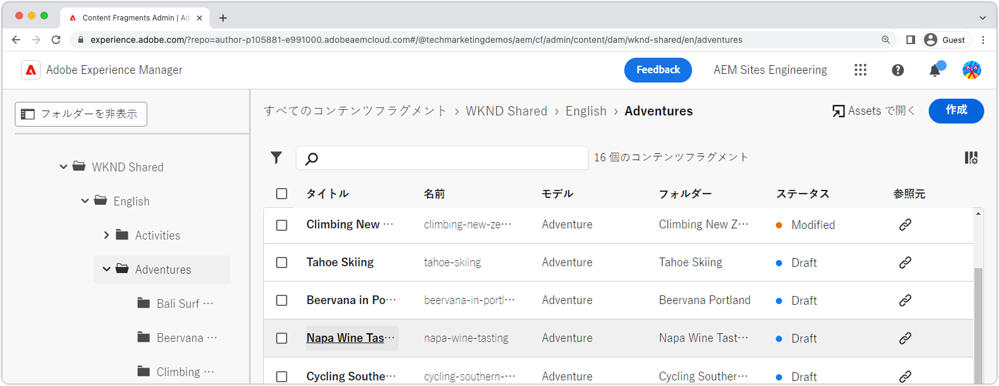
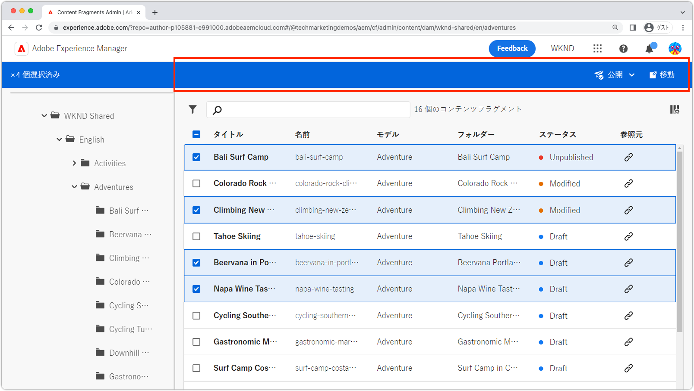
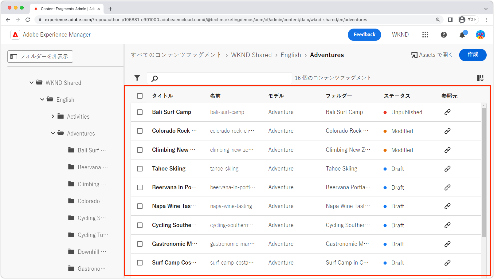
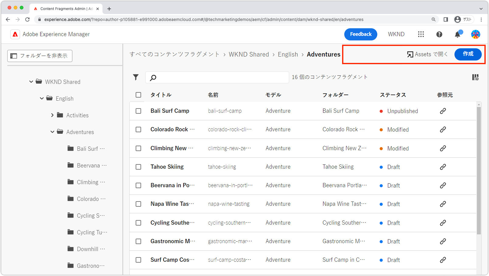
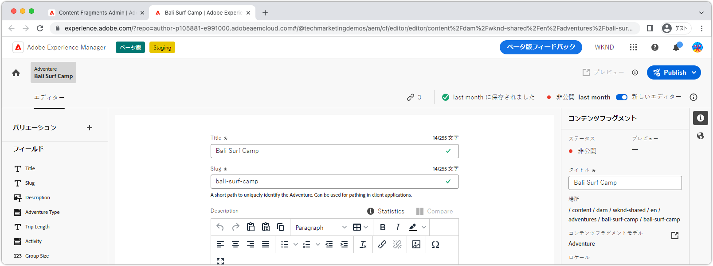
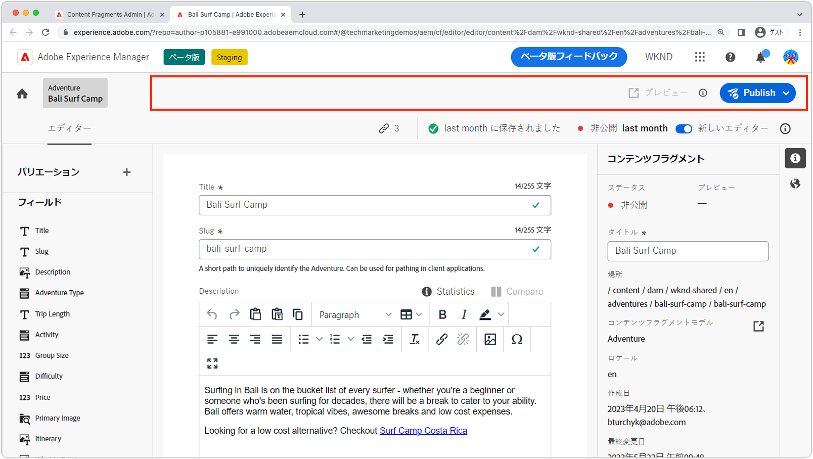
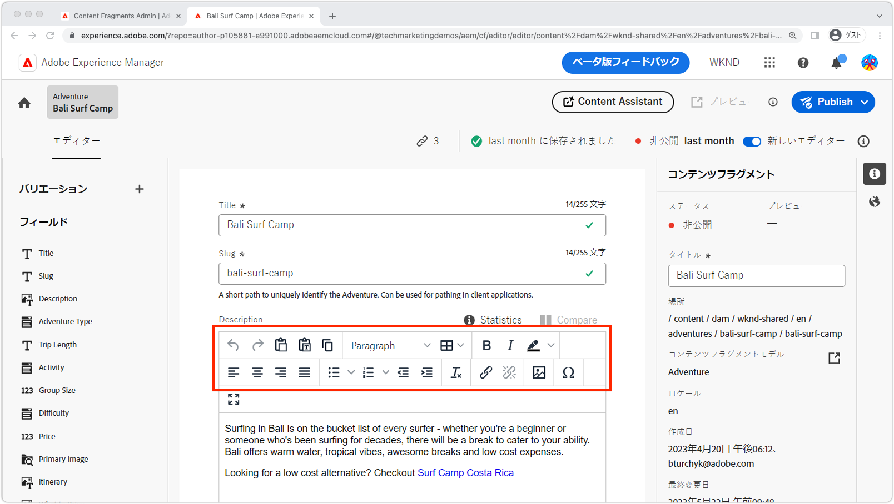
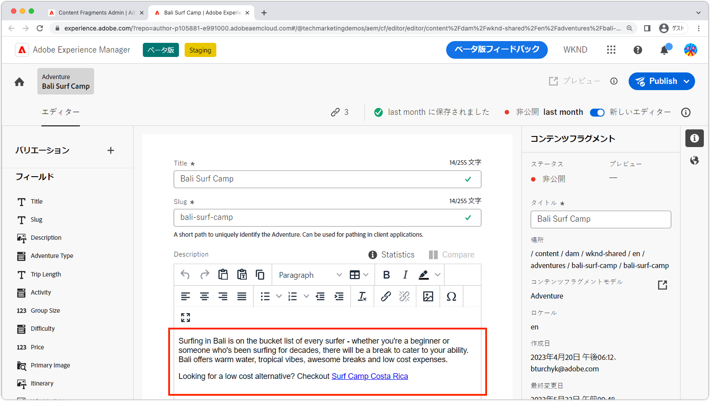
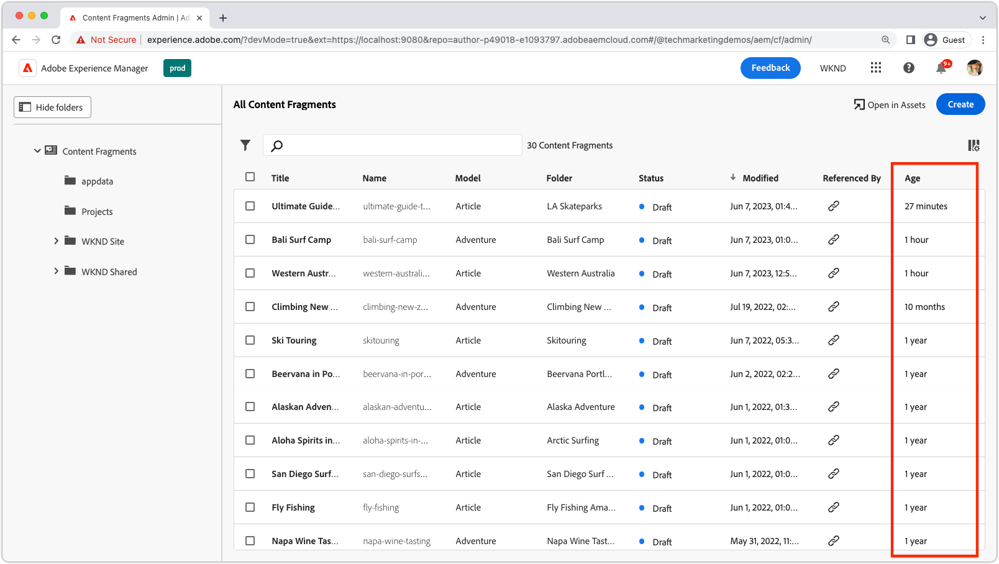
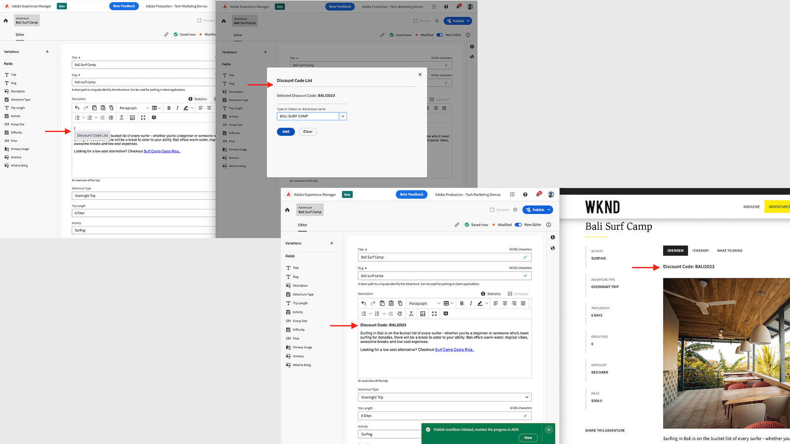

# AEM コンテンツフラグメントの拡張性

AEM コンテンツフラグメント UI は、コンテンツフラグメントの作成、管理および編集を管理するための強力で拡張可能な UI です。ニーズに合わせて UI をカスタマイズするために使用できる拡張ポイントがいくつかあります。拡張対象の UI によって、使用できる拡張ポイントは異なります。

## コンテンツフラグメントコンソールの拡張ポイント

AEM（Adobe Experience Manager）のコンテンツフラグメントコンソールは、コンテンツフラグメントを一元的に管理および整理するためのユーザーインターフェイスです。コンテンツフラグメントを作成、編集、公開および追跡するための包括的なツールおよび機能セットを提供するので、ユーザーは、様々なチャネルやタッチポイントにわたって構造化コンテンツを効率的に管理できます。

[AEM コンテンツフラグメントコンソール](https://experienceleague.adobe.com/docs/experience-manager-cloud-service/content/sites/administering/content-fragments/content-fragments-console.html?lang=ja)は、コンテンツフラグメントのリストと管理を行うための拡張可能な UI です。`@adobe/aem-cf-admin-ui-ext-tpl` Application Builder テンプレートを使用して、[AEM コンテンツフラグメントコンソール拡張機能を作成します](https://developer.adobe.com/uix/docs/services/aem-cf-console-admin/code-generation)。

次のコンテンツフラグメントコンソール拡張ポイントを使用できます。

      

        

          

            <figure class="image is-16by9">
              
            </figure>
          

          

            

              
<a href="https://developer.adobe.com/uix/docs/services/aem-cf-console-admin/api/action-bar/" title="アクションバー" target="_blank" rel="referrer">アクションバー</a>

              
1 つ以上のコンテンツフラグメントが選択されている場合のアクションをカスタマイズします。

              <a href="https://developer.adobe.com/uix/docs/services/aem-cf-console-admin/api/action-bar/" class="spectrum-Button spectrum-Button--outline spectrum-Button--primary spectrum-Button--sizeM" target="_blank" rel="referrer">
 ドキュメントを表示
 </a>
            

          

        

      

  

    

      

        <figure class="image is-16by9">
          
        </figure>
      

      

        

          
<a href="https://developer.adobe.com/uix/docs/services/aem-cf-console-admin/api/grid-columns/" title="グリッド列" target="_blank" rel="referrer">グリッド列</a>

          
コンテンツフラグメントリストに表示されるデータをカスタマイズします。

          <a href="https://developer.adobe.com/uix/docs/services/aem-cf-console-admin/api/grid-columns/" class="spectrum-Button spectrum-Button--outline spectrum-Button--primary spectrum-Button--sizeM" target="_blank" rel="referrer">
 ドキュメントを表示
 </a>
        

      

    

  

  

    

      

        <figure class="image is-16by9">
          
        </figure>
      

      

        

          
<a href="https://developer.adobe.com/uix/docs/services/aem-cf-console-admin/api/header-menu/" title="ヘッダーメニュー" target="_blank" rel="referrer">ヘッダーメニュー</a>

          
コンテンツフラグメントが選択されていない場合のアクションをカスタマイズします。

          <a href="https://developer.adobe.com/uix/docs/services/aem-cf-console-admin/api/header-menu/" class="spectrum-Button spectrum-Button--outline spectrum-Button--primary spectrum-Button--sizeM" target="_blank" rel="referrer">
 ドキュメントを表示
 </a>
        

      

    

  
  

## コンテンツフラグメントエディターの拡張ポイント

AEM（Adobe Experience Manager）のコンテンツフラグメントエディターは、ユーザーがコンテンツフラグメントを作成、編集および管理できるようにするユーザーインターフェイスコンポーネントです。構造化コンテンツを操作するための視覚的に直感的でわかりやすい環境を提供するので、ユーザーは、コンテンツ要素を定義および整理したり、テンプレートを適用したり、バリエーションを管理したり、様々なチャネルでのコンテンツの表示をプレビューしたりできます。コンテンツフラグメントエディターにより、複数のデジタルエクスペリエンスにわたって簡単に配布および公開できる再利用可能なモジュール型コンテンツを効率的に作成できるようになります。

AEM コンテンツフラグメントエディターは、コンテンツフラグメントを編集するための拡張可能な UI です。`@adobe/aem-cf-editor-ui-ext-tpl` Application Builder テンプレートを使用して、[AEM コンテンツフラグメントエディター拡張機能を作成します](https://developer.adobe.com/uix/docs/services/aem-cf-editor/code-generation/)。

次のコンテンツフラグメントエディター拡張ポイントを使用できます。

    

      

        

          <figure class="image is-16by9">
            
          </figure>
        

        

          

            
<a href="https://developer.adobe.com/uix/docs/services/aem-cf-editor/api/header-menu/" title="ヘッダーメニュー" target="_blank" rel="referrer">ヘッダーメニュー</a>

            
コンテンツフラグメントエディターのヘッダーメニューのアクションをカスタマイズします。

            <a href="https://developer.adobe.com/uix/docs/services/aem-cf-editor/api/header-menu" class="spectrum-Button spectrum-Button--outline spectrum-Button--primary spectrum-Button--sizeM" target="_blank" rel="referrer">
 ドキュメントを表示
 </a>
          

        

      

    

  

    

      

        <figure class="image is-16by9">
          
        </figure>
      

      

        

          
<a href="https://developer.adobe.com/uix/docs/services/aem-cf-editor/api/rte-toolbar/" title="リッチテキストエディターツールバー"  target="_blank" rel="referrer">リッチテキストエディターツールバー</a>

          
コンテンツフラグメントエディターのリッチテキストエディター（RTE）にカスタムボタンを追加します。

          <a href="https://developer.adobe.com/uix/docs/services/aem-cf-editor/api/rte-toolbar/" class="spectrum-Button spectrum-Button--outline spectrum-Button--primary spectrum-Button--sizeM" target="_blank" rel="referrer">
 ドキュメントを表示
 </a>
        

      

    

  

    

      

        <figure class="image is-16by9">
          
        </figure>
      

      

        

          
<a href="https://developer.adobe.com/uix/docs/services/aem-cf-editor/api/rte-widgets/" title="リッチテキストエディターウィジェット" target="_blank" rel="referrer">リッチテキストエディターウィジェット</a>

          
キーストロークにバインドされる RTE のアクションをカスタマイズします。

          <a href="https://developer.adobe.com/uix/docs/services/aem-cf-editor/api/rte-widgets/" class="spectrum-Button spectrum-Button--outline spectrum-Button--primary spectrum-Button--sizeM" target="_blank" rel="referrer">
 ドキュメントを表示
 </a>
        

      

    

  

  

    

      

        <figure class="image is-16by9">
          
        </figure>
      

      

        

          
<a href="https://developer.adobe.com/uix/docs/services/aem-cf-editor/api/rte-badges/ " title="リッチテキストエディターバッジ" target="_blank" rel="referrer">リッチテキストエディターバッジ</a>

          
RTE 内の編集できないスタイル付きブロックをカスタマイズします。

          <a href="https://developer.adobe.com/uix/docs/services/aem-cf-editor/api/rte-badges/" class="spectrum-Button spectrum-Button--outline spectrum-Button--primary spectrum-Button--sizeM" target="_blank" rel="referrer">
 ドキュメントを表示
 </a>
        

      

    

  

## 拡張例

AEM UI 拡張性コード例のコレクションにようこそ。このリソースは、Adobe Experience Manager（AEM）ユーザーインターフェイスの拡張に関する実践的なデモとインサイトを提供するように設計されています。AEM の機能の強化を検討している開発者であるかどうかにかかわらず、これらのコード例は貴重な参考資料として役に立ちます。

  

    

      

        <figure class="image is-16by9">
          
        </figure>
      

      

        

          
<a href="./examples/console-bulk-property-update.md" title="プロパティの一括更新">コンテンツフラグメントプロパティの一括更新</a>

          
モーダルと Adobe I/O Runtime アクションを備えたコンテンツフラグメントコンソールアクションバー拡張機能です。

          <a href="./examples/console-bulk-property-update.md" class="spectrum-Button spectrum-Button--outline spectrum-Button--primary spectrum-Button--sizeM">
 例を表示
 </a>
        

      

    

  

  

        

            

                <figure class="image is-16by9">
                    
                </figure>
            

            

                

                    
<a href="./examples/console-image-generation-and-image-upload.md" title="OpenAI ベースの画像生成と AEM へのアップロードを行う拡張機能">OpenAPI 画像生成</a>

                    
OpenAI を使用して画像を生成し、それを AEM にアップロードして、選択されたコンテンツフラグメントの画像プロパティを更新するアクションバー拡張機能の例について説明します。

                    <a href="./examples/console-image-generation-and-image-upload.md" class="spectrum-Button spectrum-Button--outline spectrum-Button--primary spectrum-Button--sizeM">
 例を表示
 </a>
                

            

        

    
    
  

    

      

        <figure class="image is-16by9">
          
        </figure>
      

      

        

          
<a href="./examples/custom-grid-columns.md" title="カスタム列">カスタム列</a>

          
コンテンツフラグメントコンソールにカスタム列を追加します。

          <a href="./examples/custom-grid-columns.md" class="spectrum-Button spectrum-Button--outline spectrum-Button--primary spectrum-Button--sizeM">
 例を表示
 </a>
        

      

    

  
    
  

    

      

        <figure class="image is-16by9">
          
        </figure>
      

      

        

          
<a href="./examples/editor-export-to-xml.md" title="XML への書き出し">XML への書き出し</a>

          
コンテンツフラグメントエディターからコンテンツフラグメントを XML として書き出します。

          <a href="./examples/editor-export-to-xml.md" class="spectrum-Button spectrum-Button--outline spectrum-Button--primary spectrum-Button--sizeM">
 例を表示
 </a>
        

      

    

  
    
  

    

      

        <figure class="image is-16by9">
          
        </figure>
      

      

        

          
<a href="./examples/editor-rte-toolbar.md" title="リッチテキストエディターツールバーボタン">リッチテキストエディターツールバーボタン</a>

          
コンテンツフラグメントエディターの RTE フィールドにカスタムツールバーボタンを追加します。

          <a href="./examples/editor-rte-toolbar.md" class="spectrum-Button spectrum-Button--outline spectrum-Button--primary spectrum-Button--sizeM">
 例を表示
 </a>
        

      

    

  
   
  

    

      

        <figure class="image is-16by9">
          
        </figure>
      

      

        

          
<a href="./examples/editor-rte-toolbar.md" title="リッチテキストエディターウィジェット">リッチテキストエディターウィジェット</a>

          
コンテンツフラグメントエディターのリッチテキストエディターにウィジェットを追加します。

          <a href="./examples/editor-rte-widget.md" class="spectrum-Button spectrum-Button--outline spectrum-Button--primary spectrum-Button--sizeM">
 例を表示
 </a>
        

      

    

  
   
  

    

      

        <figure class="image is-16by9">
          
        </figure>
      

      

        

          
<a href="./examples/editor-rte-badges.md" title="リッチテキストエディターバッジ">リッチテキストエディターバッジ</a>

          
コンテンツフラグメントエディターのリッチテキストエディターにバッジを追加します。

          <a href="./examples/editor-rte-badges.md" class="spectrum-Button spectrum-Button--outline spectrum-Button--primary spectrum-Button--sizeM">
 例を表示
 </a>
        

      

    

  

    

      

        <figure class="image is-16by9">
          
        </figure>
      

      

        

          
<a href="./examples/editor-custom-field.md" title="カスタムフィールド">カスタムフィールド</a>

          
カスタムコンテンツフラグメントフィールドを作成します。

          <a href="./examples/editor-custom-field.md" class="spectrum-Button spectrum-Button--outline spectrum-Button--primary spectrum-Button--sizeM">
            例を表示
          </a>
        

      

    

  
 

