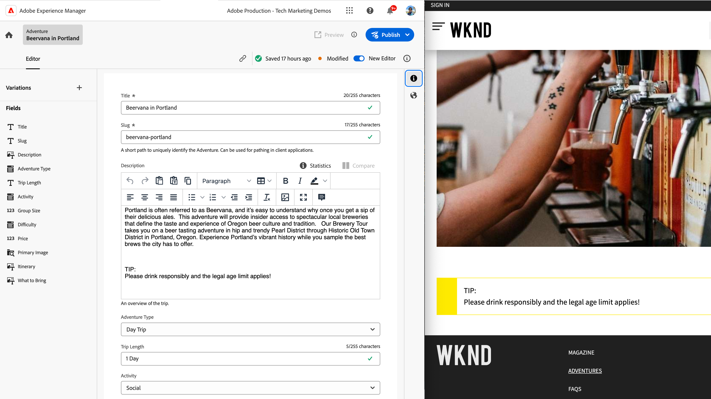

# AEM Content Fragments 拡張機能

AEM Content Fragments UI は、コンテンツフラグメントの作成、管理、編集を管理するための強力な拡張可能な UI です。 ニーズに合わせて UI をカスタマイズするために、いくつかの拡張ポイントを使用できます。 拡張する UI に応じて、様々な拡張ポイントを使用できます。

## コンテンツフラグメントコンソール拡張ポイント

AEM(Adobe Experience Manager) のコンテンツフラグメントコンソールは、コンテンツフラグメントを一元管理し、整理するためのユーザーインターフェイスです。 コンテンツフラグメントの作成、編集、公開、追跡のための包括的なツールと機能のセットを提供し、様々なチャネルやタッチポイントをまたいで構造化コンテンツを効率的に管理できます。

[AEMコンテンツフラグメントコンソール](https://experienceleague.adobe.com/docs/experience-manager-cloud-service/content/sites/administering/content-fragments/content-fragments-console.html?lang=ja) は、コンテンツフラグメントのリストと管理を行うための拡張可能な UI です。 [AEMコンテンツフラグメントコンソールの拡張機能が作成される](https://developer.adobe.com/uix/docs/services/aem-cf-console-admin/code-generation) の使用 `@adobe/aem-cf-admin-ui-ext-tpl` App Builder テンプレート。

次のコンテンツフラグメントコンソール拡張ポイントを使用できます。

      

        

          

            <figure class="image is-16by9">
              
            </figure>
          

          

            

              
<a href="https://developer.adobe.com/uix/docs/services/aem-cf-console-admin/api/action-bar/" title="アクションバー" target="_blank" rel="referrer">アクションバー</a>

              
1 つ以上のコンテンツフラグメントが選択されている場合のアクションをカスタマイズします。

              <a href="https://developer.adobe.com/uix/docs/services/aem-cf-console-admin/api/action-bar/" class="spectrum-Button spectrum-Button--outline spectrum-Button--primary spectrum-Button--sizeM" target="_blank" rel="referrer">
                ドキュメントを表示
              </a>
            

          

        

      

  

    

      

        <figure class="image is-16by9">
          
        </figure>
      

      

        

          
<a href="https://developer.adobe.com/uix/docs/services/aem-cf-console-admin/api/grid-columns/" title="グリッド列" target="_blank" rel="referrer">グリッド列</a>

          
コンテンツフラグメントリストに表示されるデータをカスタマイズします。

          <a href="https://developer.adobe.com/uix/docs/services/aem-cf-console-admin/api/grid-columns/" class="spectrum-Button spectrum-Button--outline spectrum-Button--primary spectrum-Button--sizeM" target="_blank" rel="referrer">
            ドキュメントを表示
          </a>
        

      

    

  

  

    

      

        <figure class="image is-16by9">
          
        </figure>
      

      

        

          
<a href="https://developer.adobe.com/uix/docs/services/aem-cf-console-admin/api/header-menu/" title="ヘッダーメニュー" target="_blank" rel="referrer">ヘッダーメニュー</a>

          
コンテンツフラグメントが選択されていない場合のアクションをカスタマイズします。

          <a href="https://developer.adobe.com/uix/docs/services/aem-cf-console-admin/api/header-menu/" class="spectrum-Button spectrum-Button--outline spectrum-Button--primary spectrum-Button--sizeM" target="_blank" rel="referrer">
            ドキュメントを表示
          </a>
        

      

    

  
  

## コンテンツフラグメントエディターの拡張ポイント

AEM(Adobe Experience Manager) のコンテンツフラグメントエディターは、コンテンツフラグメントの作成、編集、管理をユーザーがおこなうためのユーザーインターフェイスコンポーネントです。 構造化されたコンテンツを操作するための視覚的に直感的で使いやすい環境を提供し、コンテンツ要素の定義と整理、テンプレートの適用、バリエーションの管理、様々なチャネルでのコンテンツの表示方法のプレビューをおこなえます。 コンテンツフラグメントエディターは、複数のデジタルエクスペリエンスに簡単に配布および公開できる、再利用可能でモジュラー型のコンテンツを作成するプロセスを合理化します。

AEM Content Fragments Editor は、コンテンツフラグメントを編集するための拡張可能な UI です。 [AEMコンテンツフラグメントエディターの拡張機能が作成される](https://developer.adobe.com/uix/docs/services/aem-cf-editor/code-generation/) の使用 `@adobe/aem-cf-editor-ui-ext-tpl` App Builder テンプレート。

次のコンテンツフラグメントエディター拡張ポイントを使用できます。

    

      

        

          <figure class="image is-16by9">
            
          </figure>
        

        

          

            
<a href="https://developer.adobe.com/uix/docs/services/aem-cf-editor/api/header-menu/" title="ヘッダーメニュー" target="_blank" rel="referrer">ヘッダーメニュー</a>

            
コンテンツフラグメントエディターのヘッダーメニューでアクションをカスタマイズします。

            <a href="https://developer.adobe.com/uix/docs/services/aem-cf-editor/api/header-menu" class="spectrum-Button spectrum-Button--outline spectrum-Button--primary spectrum-Button--sizeM" target="_blank" rel="referrer">
              ドキュメントを表示
            </a>
          

        

      

    

  

    

      

        <figure class="image is-16by9">
          
        </figure>
      

      

        

          
<a href="https://developer.adobe.com/uix/docs/services/aem-cf-editor/api/rte-toolbar/" title="リッチテキストエディターのツールバー"  target="_blank" rel="referrer">リッチテキストエディターのツールバー</a>

          
コンテンツフラグメントエディターのリッチテキストエディター (RTE) にカスタムボタンを追加します。

          <a href="https://developer.adobe.com/uix/docs/services/aem-cf-editor/api/rte-toolbar/" class="spectrum-Button spectrum-Button--outline spectrum-Button--primary spectrum-Button--sizeM" target="_blank" rel="referrer">
            ドキュメントを表示
          </a>
        

      

    

  

    

      

        <figure class="image is-16by9">
          
        </figure>
      

      

        

          
<a href="https://developer.adobe.com/uix/docs/services/aem-cf-editor/api/rte-widgets/" title="リッチテキストエディターウィジェット" target="_blank" rel="referrer">リッチテキストエディターウィジェット</a>

          
RTE でキーストロークにバインドされるアクションをカスタマイズします。

          <a href="https://developer.adobe.com/uix/docs/services/aem-cf-editor/api/rte-widgets/" class="spectrum-Button spectrum-Button--outline spectrum-Button--primary spectrum-Button--sizeM" target="_blank" rel="referrer">
            ドキュメントを表示
          </a>
        

      

    

  

  

    

      

        <figure class="image is-16by9">
          
        </figure>
      

      

        

          
<a href="https://developer.adobe.com/uix/docs/services/aem-cf-editor/api/rte-badges/ " title="リッチテキストエディターバッジ" target="_blank" rel="referrer">リッチテキストエディターバッジ</a>

          
RTE 内の編集不可能なスタイルブロックをカスタマイズします。

          <a href="https://developer.adobe.com/uix/docs/services/aem-cf-editor/api/rte-badges/" class="spectrum-Button spectrum-Button--outline spectrum-Button--primary spectrum-Button--sizeM" target="_blank" rel="referrer">
            ドキュメントを表示
          </a>
        

      

    

  

## 拡張の例

AEM UI 拡張機能コード例のコレクションへようこそ。 このリソースは、Adobe Experience Manager(AEM) ユーザーインターフェイスの拡張に関する実際のデモとインサイトを提供するように設計されています。 AEMの機能を強化したい開発者であれ、これらのコード例は有益な参考になります。

  

    

      

        <figure class="image is-16by9">
          
        </figure>
      

      

        

          
<a href="./examples/console-bulk-property-update.md" title="プロパティの一括更新">コンテンツフラグメントの一括更新</a>

          
モーダルアクションとAdobe I/O Runtimeアクションを含むコンテンツフラグメントコンソールアクションバー拡張機能。

          <a href="./examples/console-bulk-property-update.md" class="spectrum-Button spectrum-Button--outline spectrum-Button--primary spectrum-Button--sizeM">
            例を表示
          </a>
        

      

    

  

  

        

            

                <figure class="image is-16by9">
                    
                </figure>
            

            

                

                    
<a href="./examples/console-image-generation-and-image-upload.md" title="OpenAI ベースの画像生成とAEM拡張機能へのアップロード">OpenAPI 画像生成</a>

                    
OpenAI を使用して画像を生成し、AEMにアップロードして、選択したコンテンツフラグメントの画像プロパティを更新するアクションバー拡張機能の例を見てみましょう。

                    <a href="./examples/console-image-generation-and-image-upload.md" class="spectrum-Button spectrum-Button--outline spectrum-Button--primary spectrum-Button--sizeM">
                        例を表示
                    </a>
                

            

        

    
    
  

    

      

        <figure class="image is-16by9">
          
        </figure>
      

      

        

          
<a href="./examples/custom-grid-columns.md" title="カスタム列">カスタム列</a>

          
コンテンツフラグメントコンソールにカスタム列を追加します。

          <a href="./examples/custom-grid-columns.md" class="spectrum-Button spectrum-Button--outline spectrum-Button--primary spectrum-Button--sizeM">
            例を表示
          </a>
        

      

    

  
    
  

    

      

        <figure class="image is-16by9">
          
        </figure>
      

      

        

          
<a href="./examples/editor-export-to-xml.md" title="XML に書き出し">XML に書き出し</a>

          
コンテンツフラグメントエディターからコンテンツフラグメントを XML 形式で書き出します。

          <a href="./examples/editor-export-to-xml.md" class="spectrum-Button spectrum-Button--outline spectrum-Button--primary spectrum-Button--sizeM">
            例を表示
          </a>
        

      

    

  
    
  

    

      

        <figure class="image is-16by9">
          
        </figure>
      

      

        

          
<a href="./examples/editor-rte-toolbar.md" title="リッチテキストエディターのツールバーボタン">リッチテキストエディターのツールバーボタン</a>

          
コンテンツフラグメントエディターで、カスタムツールバーボタンを RTE フィールドに追加します。

          <a href="./examples/editor-rte-toolbar.md" class="spectrum-Button spectrum-Button--outline spectrum-Button--primary spectrum-Button--sizeM">
            例を表示
          </a>
        

      

    

  
   

