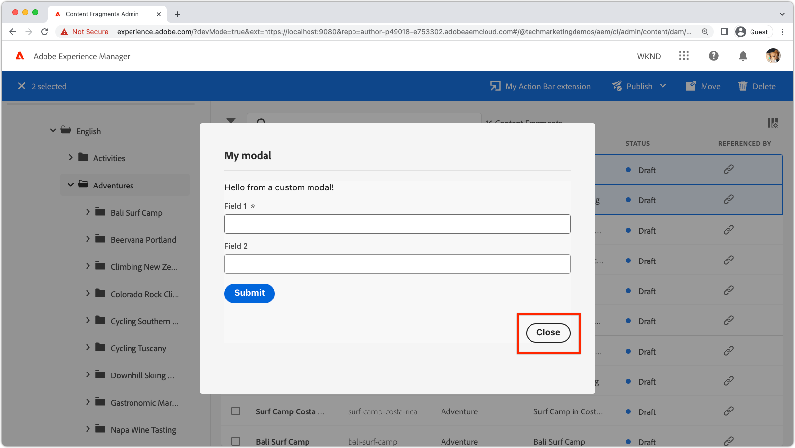

# 拡張機能モーダル

{align="center"}

AEM UI 拡張機能モーダルは、カスタム UI を AEM UI 拡張機能に接続する方法を提供します。

モーダルは [React スペクトル](https://react-spectrum.adobe.com/react-spectrum/)に基づく React アプリケーションであり、拡張機能に必要な任意のカスタム UI を作成できます。

+ 確認ダイアログ
+ [入力フォーム](https://react-spectrum.adobe.com/react-spectrum/#forms)
+ [進行状況インジケーター](https://react-spectrum.adobe.com/react-spectrum/#status)
+ [結果の概要](https://react-spectrum.adobe.com/react-spectrum/#collections)
+ エラーメッセージ
+ ...または、本格的なマルチビューの React アプリケーションも。

## モーダルルート

モーダルエクスペリエンスは、`web-src` フォルダーの下に定義された拡張機能アプリケーションビルダー React アプリケーションによって定義されます。他の React アプリケーションと同様に、完全なエクスペリエンスは、[React コンポーネント](https://reactjs.org/docs/components-and-props.html)をレンダリングする [React ルート](https://reactrouter.com/en/main/components/routes)を使用して調整されます。

モーダルの初期表示を生成するには、少なくとも 1 つのルートが必要です。この初期ルートは、以下に示すように、[拡張機能の登録](#extension-registration)の `onClick(..)` 関数で呼び出されます。


+ `./src/aem-ui-extension/web-src/src/components/App.js`

```javascript
import MyModal from './MyModal';
import MyModalResults from './MyModalResults';
...
function App(props) {
  return (
    <Router>
      <ErrorBoundary onError={onError} FallbackComponent={fallbackComponent}>
        <Routes>
          ...         
          {/* 
            Define the entry route to the modal.

            For modals opened from Action Bar extensions.
            Depending on the extension point, different parameters are passed to the modal.
            This example illustrates a modal for the AEM Content Fragment Console (list view), where typically a :selection parameter is used to pass in the list of selected Content Fragments.
            Where as Header Menu extensions do not use a selection parameter.
           */}
          <Route
            exact path="aem-ui-extension/:selection/my-modal"
            element={<MyModal />}
          />                    

          {/* Define any other routes the modal may need */}
          <Route
            exact path="aem-ui-extension/my-modal"
            element={<MyOtherModalView />}
          />                    

        </Routes>
      </ErrorBoundary>
    </Router>
  )
  ...
}
```

## 拡張機能の登録

モーダルを開くには、拡張機能の `onClick(..)` 関数から `guestConnection.host.modal.showUrl(..)` を呼び出します。`showUrl(..)` は、キーと値を持つ JavaScript オブジェクトを渡します。

+ `title` は、ユーザーに表示されるモーダルのタイトルの名前を提供します
+ `url` は、モーダルの初期表示に使用される [React ルート](#modal-routes)を呼び出す URL です。

`guestConnection.host.modal.showUrl(..)` に渡された `url` が拡張機能でルーティングされるように解決する必要があり、それ以外の場合は、モーダルには何も表示されません。

+ `./src/aem-ui-extension/web-src/src/components/ExtensionRegistration.js`

```javascript
function ExtensionRegistration() {
  ...
  onClick() {
    // Create a URL that maps to the React route to be rendered in the modal
    const modalURL = "/index.html#/aem-ui-extension/my-modal";

    // Open the modal and display the React route created above
    guestConnection.host.modal.showUrl({
      title: "My modal title",
      url: modalURL
    })     
  }
  ...     
}...
```

## モーダルコンポーネント

[`index` ルートではない](./extension-registration.md#app-routes)拡張機能の各ルートは、拡張機能のモーダルでレンダリングできる React コンポーネントにマッピングされます。

モーダルは、シンプルな 1 ルートモーダルから複雑なマルチルートモーダルまで、任意の数の React ルートで構成することができます。

次に、シンプルな 1 ルートモーダルを示します。ただし、このモーダルビューには、他のルートや動作を呼び出す React リンクを含めることができます。

+ `./src/aem-ui-extension/web-src/src/components/MyModal.js`

```javascript
import React, { useState, useEffect } from 'react'
import { attach } from "@adobe/uix-guest"
import {
  Flex,
  Provider,
  Content,
  defaultTheme,
  Text,
  ButtonGroup,
  Button
} from '@adobe/react-spectrum'
import Spinner from "./Spinner"
import { useParams } from "react-router-dom"
import { extensionId } from "./Constants"

export default function MyModal() {
  // Initial modal views for Action Bar extensions typically pass in the list of selected Content Fragment Paths from ExtensionRegistration.js
  // Get the paths from useParams() and split on delimiter used
  let { selection } = useParams();
  let contentFragmentPaths = selection?.split('|') || [];
  
  // Asynchronously attach the extension to AEM. 
  // Wait or the guestConnection to be set before doing anything in the modal.
  const [guestConnection, setGuestConnection] = useState()

  useEffect(() => {
    (async () => {
      const guestConnection = await attach({ id: extensionId })
      setGuestConnection(guestConnection);
    })()
  }, [])

  if (!guestConnection) {
    // If the guestConnection is not initialized, display a loading spinner
    return <Spinner />
  } else {
    // Else the modal is ready to render!
    return (
        <Provider theme={defaultTheme} colorScheme='light'>
        {/* 
            Use the React Spectrum components to render the modal UI.
            Using React Spectrum ensures a consistent, accessible, future-proof look-and-feel and speeds up development.
        */}
            <Content width="100%">
                <Flex width="100%">
                    <Text>
                        This is the contents in the modal! 
                        Anything can be created in this return statement!

                        The selected Content Fragments are: { contentFragmentPaths.join(', ') }
                    </Text>                    
                    {/*
                        Modals must provide their own Close button, by calling: guestConnection.host.modal.close()
                    */}
                    <ButtonGroup align="end">
                        <Button variant="primary" onPress={() => guestConnection.host.modal.close()}>Close</Button>
                    </ButtonGroup>
                </Flex>
            </Content>
        </Provider>
    )
  }
}
```

## モーダルを閉じる

{align="center"}

モーダルでは、独自のクローズコントロールを提供する必要があります。これは `guestConnection.host.modal.close()` を呼び出すことによって行われます。

```javascript
<ButtonGroup align="end">
    <Button variant="primary" onPress={() => guestConnection.host.modal.close()}>Close</Button>
</ButtonGroup>
```
