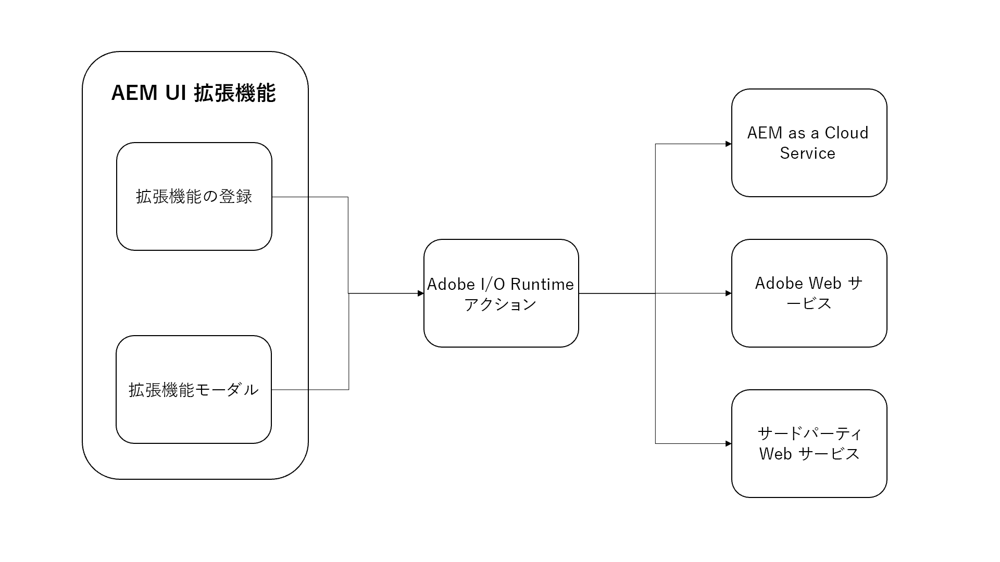

# Adobe I/O Runtime アクション

{align="center"}

AEM UI 拡張機能には、オプションで任意の数の [Adobe I/O Runtime アクション](https://developer.adobe.com/runtime/docs/)を組み込むことができます。

Adobe I/O Runtime のアクションは、拡張機能で呼び出すことができるサーバーレス関数です。アクションは、AEM やその他の Adobe web サービスとのやり取りが必要な作業を実行する場合に役立ちます。アクションは通常、長時間（数秒以上）のタスクを実行したり、AEM や他の web サービスに HTTP リクエストを送信したりする場合に最も役に立ちます。

Adobe I/O Runtime アクションを使用して作業を実行する利点は、次のとおりです。

+ アクションは、ブラウザーのコンテキスト外で実行されるサーバーレス関数で、CORS について心配する必要がなくなります
+ ユーザーがアクションを中断することはできません（例えば、ブラウザーを更新するなど）。
+ アクションは非同期なので、ユーザーをブロックすることなく、必要に応じて実行できます

AEM UI 拡張機能のコンテキストでは、アクションは次のような場合に AEM as a Cloud Service との直接通信によく使用されます。

+ 選択されたコンテンツまたは現在のコンテンツに関する関連データの AEM からの収集
+ コンテンツに対するカスタム操作の実行
+ コンテンツのカスタム作成

AEM UI 拡張機能は、特定の AEM UI、拡張機能およびそのサポートアクションに表示されますが、カスタム AEM API エンドポイントなど、使用可能なあらゆる AEM HTTP API を呼び出すことができます。

## アクションの呼び出し

Adobe I/O Runtime のアクションは、主に AEM UI 拡張機能の次の 2 つの場所から呼び出されます。

1. [拡張機能登録の](./extension-registration.md) `onClick(..)` ハンドラー
1.  [モーダル](./modal.md)内

### 拡張機能の登録から

Adobe I/O Runtimeのアクションは、拡張機能の登録コードから直接呼び出すことができます。 最も一般的なユースケースは、 [モデル](./modal.md)を使用しない[ヘッダーメニュー](https://developer.adobe.com/uix/docs/services/aem-cf-console-admin/api/header-menu/)のボタンにアクションをバインドすることです。

+ `./src/aem-ui-extension/web-src/src/components/ExtensionRegistration.js`

```javascript
...
// allActions is an object containing all the actions defined in the extension's manifest
import allActions from '../config.json'

// actionWebInvoke is a helper that invokes an action
import actionWebInvoke from '../utils'
...
function ExtensionRegistration() {
  const init = async () => {
    const guestConnection = await register({
      id: extensionId, // A unique ID for the extension, usually defined in Constants.js
      methods: {
        // Configure your header menu button here
        headerMenu: {
          getButtons() {
            return [{
              'id': 'example.my-header-menu-extension',  // Unique ID for the button
              'label': 'My header menu extension',       // Button label 
              'icon': 'Edit',                             // Button icon from https://spectrum.adobe.com/page/icons/

              // Click handler for the extension button
              onClick() {
                // Set the HTTP headers required to access the Adobe I/O runtime action
                const headers = {
                  'Authorization': 'Bearer ' + guestConnection.sharedContext.get('auth').imsToken,
                  'x-gw-ims-org-id': guestConnection.sharedContext.get('auth').imsOrg
                };

                // Set the parameters to pass to the Adobe I/O Runtime action
                const params = {
                  aemHost: `https://${guestConnection.sharedContext.get('aemHost')}`, // Pass in the AEM host if the action interacts with AEM
                  aemAccessToken: guestConnection.sharedContext.get('auth').imsToken
                };

                try {
                  // Invoke Adobe I/O Runtime action named `generic`, with the configured headers and parameters.
                  const actionResponse = await actionWebInvoke(allActions['generic'], headers, params);
                } catch (e) {
                  // Log and store any errors
                  console.error(e)
                }           
              }
            }]
          }
        }
      }
    })
  }
  init().catch(console.error);
}

export default ExtensionRegistration;
```

### モーダルから

Adobe I/O Runtime のアクションは、モデルから直接呼び出してより複雑な作業を実行できます。特に、AEM as a Cloud Service、Adobe web サービス、またはサードパーティのサービスとの通信に依存する作業を実行する場合に便利です。

Adobe I/O Runtime のアクションは、サーバーレスの Adobe I/O Runtime 環境で実行される、Node.js ベースの JavaScript アプリケーションです。 これらのアクションは、拡張機能 SPAで HTTP を介してアドレス可能です。

+ `./src/aem-ui-extension/web-src/src/components/MyModal.js`

```javascript
import React, { useState, useEffect } from 'react'
import { attach } from "@adobe/uix-guest"
import {
  Flex,
  Provider,
  Content,
  defaultTheme,
  Text,
  ButtonGroup,
  Button
} from '@adobe/react-spectrum'
import Spinner from "./Spinner"
import { useParams } from "react-router-dom"
import { extensionId } from "./Constants"

export default function MyModal() {
  // Initial modal views for Action Bar extensions typically pass in the list of selected Content Fragment Paths from ExtensionRegistration.js
  // Get the paths from useParams() and split on delimiter used
  let { selection } = useParams();
  let contentFragmentPaths = selection?.split('|') || [];

  const [actionInvokeInProgress, setActionInvokeInProgress] = useState(false);
  const [actionResponse, setActionResponse] = useState();

  // Asynchronously attach the extension to AEM. 
  // Wait or the guestConnection to be set before doing anything in the modal.
  const [guestConnection, setGuestConnection] = useState()
  useEffect(() => {
    (async () => {
      const guestConnection = await attach({ id: extensionId })
      setGuestConnection(guestConnection);
    })()
  }, [])

  if (!guestConnection) {
    // If the guestConnection is not initialized, display a loading spinner
    return <Spinner />
  } else if (!actionResponse) {
    // Else if the modal is ready to render and has not called the Adobe I/O Runtime action yet
    return (
        <Provider theme={defaultTheme} colorScheme='light'>
            <Content width="100%">
                <Flex width="100%">
                    <Text>
                        The selected Content Fragments are: { contentFragmentPaths.join(', ') }
                    </Text>                    

                     <ButtonGroup align="end">
                        <Button variant="cta" onPress={doWork}>Do work</Button>
                        <Button variant="primary" onPress={() => guestConnection.host.modal.close()}>Close</Button>
                    </ButtonGroup>
                </Flex>
            </Content>
        </Provider>
    )
  } else {
    // Else the modal has called the Adobe I/O Runtime action and is ready to render the response
    return (
        <Provider theme={defaultTheme} colorScheme='light'>
            <Content width="100%">
                <Flex width="100%">
                    <Text>
                        Done! The response from the action is: { actionResponse }
                    </Text>                    

                     <ButtonGroup align="end">
                        <Button variant="primary" onPress={() => guestConnection.host.modal.close()}>Close</Button>
                    </ButtonGroup>
                </Flex>
            </Content>
        </Provider>
    )
  }

  /**
   * Invoke the Adobe I/O Runtime action and store the response in the React component's state.
   */
  async function doWork() {
    // Mark the extension as invoking the action, so the loading spinner is displayed
    setActionInvokeInProgress(true);

    // Set the HTTP headers to access the Adobe I/O runtime action
    const headers = {
      'Authorization': 'Bearer ' + guestConnection.sharedContext.get('auth').imsToken,
      'x-gw-ims-org-id': guestConnection.sharedContext.get('auth').imsOrg
    };

    // Set the parameters to pass to the Adobe I/O Runtime action
    const params = {
      aemHost: `https://${guestConnection.sharedContext.get('aemHost')}`,
      contentFragmentPaths: contentFragmentPaths
    };

    try {
      // Invoke Adobe I/O Runtime action with the configured headers and parameters
      // Invoke the Adobe I/O Runtime action named `generic`.
      const actionResponse = await actionWebInvoke(allActions['generic'], headers, params);

      // Set the response from the Adobe I/O Runtime action
      setActionResponse(actionResponse);
    } catch (e) {
      // Log and store any errors
      console.error(e)
    }

    // Set the action as no longer being invoked, so the loading spinner is hidden
    setActionInvokeInProgress(false);
  }
}
```

## Adobe I/O Runtime アクション

+ `src/aem-ui-extension/actions/generic/index.js`

```javascript
const fetch = require('node-fetch')
const { Core } = require('@adobe/aio-sdk')
const { errorResponse, getBearerToken, stringParameters, checkMissingRequestInputs } = require('../utils')

async function main (params) {
  const logger = Core.Logger('main', { level: params.LOG_LEVEL || 'info' })

  try {
    logger.debug(stringParameters(params))

    // Check for missing request input parameters and headers
    const requiredParams = [ 'aemHost', 'contentFragmentPaths' ]
    const requiredHeaders = ['Authorization']
    const errorMessage = checkMissingRequestInputs(params, requiredParams, requiredHeaders)
    if (errorMessage) {
      // return and log client errors
      return errorResponse(400, errorMessage, logger)
    }
      
    // Extract the user Bearer token from the Authorization header used to authenticate the request to AEM
    const accessToken = getBearerToken(params);

    // Example HTTP request to AEM payload; This updates all 'title' properties of the Content Fragments to 'Hello World'
    const body = {
      "properties": {
        "elements": {
          "title": {
            "value": "Hello World"
          }
        }
      }
    };

    let results = await Promise.all(params.contentFragmentPaths.map(async (contentFragmentPath) => {
      // Invoke the AEM HTTP Assets Content Fragment API to update each Content Fragment
      // The AEM host is passed in as a parameter to the Adobe I/O Runtime action
      const res = await fetch(`${params.aemHost}${contentFragmentPath.replace('/content/dam/', '/api/assets/')}.json`, { 
        method: 'put',
        body: JSON.stringify(body),
        headers: {
          // Pass in the accessToken as AEM Author service requires authentication/authorization
          'Authorization': `Bearer ${accessToken}`,
          'Content-Type': 'application/json'
        }
      });

      if (res.ok) {
        logger.info(`Successfully updated title of ${contentFragmentPath}`);
        return { contentFragmentPath, status: res.status, statusText: res.statusText, body: await res.json() };
      } else {
        logger.info(`Failed to update title of ${contentFragmentPath}`);
        return { contentFragmentPath, status: res.status, statusText: res.statusText, body: await res.text() };
      }
    }));

    // Return a response to the AEM Content Fragment extension React application
    const response = {
      statusCode: 200,
      body: results
    };
    return response;

  } catch (error) {
    logger.error(error)
    return errorResponse(500, 'server error', logger)
  }
}
```

## AEM HTTP API

次の AEM HTTP API は、 AEM の拡張機能とのやり取りで一般的に使用されます。

+ [AEM GraphQL API](https://experienceleague.adobe.com/landing/experience-manager/headless/developer.html?lang=ja)
+ [AEM Assets HTTP API](https://experienceleague.adobe.com/docs/experience-manager-cloud-service/content/assets/admin/mac-api-assets.html?lang=ja)
   + [AEM Assets HTTP API でのコンテンツフラグメントのサポート](https://experienceleague.adobe.com/docs/experience-manager-cloud-service/content/assets/admin/assets-api-content-fragments.html?lang=ja)
+ [AEM QueryBuilder API](https://experienceleague.adobe.com/docs/experience-manager-cloud-service/content/implementing/developing/full-stack/search/query-builder-api.html?lang=ja)
+ [完全な AEM as a Cloud Service API リファレンス](https://experienceleague.adobe.com/docs/experience-manager-cloud-service/content/implementing/developing/reference-materials.html?lang=ja)


## Adobe npm モジュール

以下は、Adobe I/O Runtime のアクションを開発する際に役立つ npm モジュールです。

+ [@adobe/aio-sdk](https://www.npmjs.com/package/@adobe/aio-sdk)
   + [コア SDK](https://github.com/adobe/aio-sdk-core)
   + [ステートライブラリ](https://github.com/adobe/aio-lib-state)
   + [ファイルライブラリ](https://github.com/adobe/aio-lib-files)
   + [Adobe Target ライブラリ](https://github.com/adobe/aio-lib-target)
   + [Adobe Analytics ライブラリ](https://github.com/adobe/aio-lib-analytics)
   + [Adobe Campaign Standard ライブラリ](https://github.com/adobe/aio-lib-campaign-standard)
   + [Adobe 顧客プロファイルライブラリ](https://github.com/adobe/aio-lib-customer-profile)
   + [Adobe Audience Manager 顧客データライブラリ](https://github.com/adobe/aio-lib-audience-manager-cd)
   + [Adobe I/O イベント](https://github.com/adobe/aio-lib-events)
+ [@adobe/aio-lib-core-networking](https://github.com/adobe/aio-lib-core-networking)
+ [@adobe/node-httptransfer](https://github.com/adobe/node-httptransfer)
