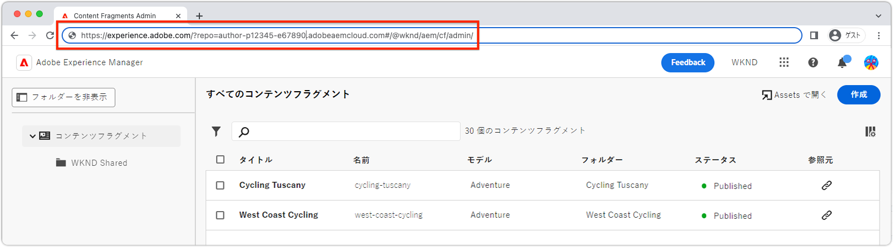

# 拡張機能の検証

AEM UI 拡張機能は、拡張機能が属する Adobe 組織内の任意の AEM as a Cloud Service 環境に対して検証できます。

拡張機能のテストは、そのリクエストに対してのみ、AEM に拡張機能を読み込むように指示する、特別に作成された URL を介して行われます。

>[!VIDEO](https://video.tv.adobe.com/v/3412877?quality=12&learn=on)

>[!IMPORTANT]
>
> 上記のビデオでは、コンテンツフラグメントコンソール拡張機能を使用して、App Builder 拡張機能アプリのプレビューと検証を示します。ただし、ここで扱う概念はすべての AEM UI 拡張機能に適用できます。

## AEM UI URL

{align="center"}

実稼動以外の拡張機能を AEM にマウントする URL を作成するには、拡張機能が挿入される AEM UI の URL を取得する必要があります。AEM as a Cloud Service 環境に移動して拡張機能を検証し、拡張機能をプレビューする UI を開きます。

例えば、コンテンツフラグメントコンソールの拡張機能をプレビューするには、次の操作を実行します。

1. 目的の AEM as a Cloud Service 環境にログインします。
1. 「__コンテンツフラグメント__」アイコンを選択します。
1. AEM コンテンツフラグメントコンソールがブラウザーに読み込まれるまで待ちます。
1. AEM コンテンツフラグメントコンソールの URL をブラウザーのアドレスバーからコピーします。URL は以下のようになります。

   ```
   https://experience.adobe.com/?repo=author-p1234-e5678.adobeaemcloud.com#/@wknd/aem/cf/admin
   ```

この URL は、開発およびステージ検証用の URL を作成する際に以下で使用します。他の AEM UI に対して拡張機能を検証する場合は、これらの URL を取得し、以下と同じ手順を適用します。

## ローカル開発ビルドの検証

1. 拡張機能プロジェクトのルートへのコマンドラインを開きます。
1. AEM UI 拡張機能をローカルの App Builder アプリとして実行します

   ```shell
   $ aio app run
   ...
   No change to package.json was detected. No package manager install will be executed.
   
   To view your local application:
     -> https://localhost:9080
   To view your deployed application in the Experience Cloud shell:
     -> https://experience.adobe.com/?devMode=true#/custom-apps/?localDevUrl=https://localhost:9080
   ```

上記の `-> https://localhost:9080` として示されているローカルアプリケーションの URL をメモします

1. 最初に（接続エラーが表示された場合は常に）web ブラウザーで `https://localhost:9080`（または任意のローカルアプリケーションの URL）を開き、手動で [HTTPS 証明書](https://developer.adobe.com/uix/docs/services/aem-cf-console-admin/extension-development/#accepting-the-certificate-first-time-users)を受け入れます。
1. 次の 2 つのクエリパラメーターを [AEM UI の URL](#aem-ui-url) に追加します
   + `&devMode=true`
   + `&ext=<LOCAL APPLICATION URL>`、通常は `&ext=https://localhost:9080` です。

   上記の 2 つのクエリパラメーター（`devMode` と `ext`）を URL の __最初__&#x200B;のクエリパラメーターとして追加します。AEM の拡張可能な UI はハッシュルート（`#/@wknd/aem/...`）を使用するので、誤って `#` の後にパラメーターを後置すると機能しません。

   プレビュー URL は次のようになります。

   ```
   https://experience.adobe.com/?devMode=true&ext=https://localhost:9080&repo=author-p1234-e5678.adobeaemcloud.com#/@wknd/aem/cf/admin
   ```

1. プレビュー URL をブラウザーにコピー＆ぺーストします。

   + 最初に、それからは定期的に、ローカルアプリケーションのホスト（`https://localhost:9080`）の [HTTPS 証明書を受け入れる](https://developer.adobe.com/uix/docs/services/aem-cf-console-admin/extension-development/#accepting-the-certificate-first-time-users)必要があります。

1. AEM UI は、検証用に拡張機能のローカルバージョンが挿入されて読み込まれます。

>[!IMPORTANT]
>
>このアプローチを使用する場合、開発中の拡張機能はご自身のエクスペリエンスにのみ影響します。AEM UI を使用するその他のユーザーは、挿入された拡張機能なしの UI エクスペリエンスとなります。

## ステージビルドの検証

1. 拡張機能プロジェクトのルートへのコマンドラインを開きます。
1. ステージワークスペースがアクティブ（または検証に使用するワークスペース）であることを確認します。

   ```shell
   $ aio app use -w Stage
   ```

   変更を `.env` と `.aio` に結合します。

1. 更新された拡張機能の App Builder アプリをデプロイします。ログインしていない場合は、最初に `aio login` を実行します。

   ```shell
   $ aio app deploy
   ...
   Your deployed actions:
   web actions:
     -> https://98765-123aquarat.adobeio-static.net/api/v1/web/aem-cf-console-admin-1/generic 
   To view your deployed application:
     -> https://98765-123aquarat.adobeio-static.net/index.html
   To view your deployed application in the Experience Cloud shell:
     -> https://experience.adobe.com/?devMode=true#/custom-apps/?localDevUrl=https://98765-123aquarat.adobeio-static.net/index.html
   New Extension Point(s) in Workspace 'Production': 'aem/cf-console-admin/1'
   Successful deployment 🏄
   ```

1. 次の 2 つのクエリパラメーターを [AEM UI の URL](#aem-ui-url) に追加します
   + `&devMode=true`
   + `&ext=<DEPLOYED APPLICATION URL>`

   拡張可能な AEM UI はハッシュルート（`#/@wknd/aem/...`）を使用するので、上記の 2 つのクエリパラメーター（`devMode` と `ext`）を URL の&#x200B;__最初__&#x200B;のクエリパラメーターとして追加します。そのため、誤って `#` の後にパラメーターを後置すると機能しません。

   プレビュー URL は次のようになります。

   ```
   https://experience.adobe.com/?devMode=true&ext=https://98765-123aquarat.adobeio-static.net/index.html&repo=author-p1234-e5678.adobeaemcloud.com#/@wknd/aem/cf/admin
   ```

1. プレビュー URL をブラウザーにコピー＆ぺーストします。
1. AEM コンテンツフラグメントコンソールは、ステージワークスペースにデプロイされた拡張機能のバージョンを挿入します。このステージ URL は、検証用に QA またはビジネスユーザーに共有できます。

この方法を使用する場合、ステージングされた拡張機能は、作成されたステージ URL を使用してアクセスする際に AEM コンテンツフラグメントコンソールにのみ挿入されます。

1. デプロイされた拡張機能は、`aio app deploy` を再度実行することで更新できます。これらの変更は、プレビュー URL を使用すると自動的に反映されます。
1. 検証用に拡張機能を削除するには、`aio app undeploy` を実行します。

## ブックマークレットのプレビュー

上記のプレビューおよびプレビュー URL の作成を簡単にするために、拡張機能を読み込む JavaScript ブックマークレットを作成できます。

以下のブックマークレットは、`https://localhost:9080` にある拡張機能の[ローカル開発ビルド](#verify-local-development-builds)をプレビューします。[ステージビルド](#verify-stage-builds)をプレビューするには、デプロイ済みの App Builder アプリの URL に設定された `previewApp` 変数を使用してブックマークレットを作成します。

1. ブラウザーにブックマークを作成します。
1. ブックマークを編集します。
1. ブックマークに `AEM UI Extension Preview (localhost:9080)` などの意味のある名前を付けます。
1. ブックマークの URL を次のコードに設定します。

   ```javascript
   javascript: (() => {
       /* Change this to the URL of the local App Builder app if not using https://localhost:9080 */
       const previewApp = 'https://localhost:9080';
   
       const repo = new URL(window.location.href).searchParams.get('repo');
   
       if (window.location.href.match(/https:\/\/experience\.adobe\.com\/.*\/aem\/cf\/(editor|admin)\/.*/i)) {
           window.location = `https://experience.adobe.com/?devMode=true&ext=${previewApp}&repo=${repo}${window.location.hash}`;
       } 
   })();
   ```

1. 拡張可能な AEM UI に移動してプレビュー拡張機能を読み込み、ブックマークレットをクリックします。

>[!TIP]
>
> `&ext=https://localhost:9080` を使用する際に App Builder 拡張機能が読み込まれない場合は、ブラウザータブでそのホストとポートを直接開き、自己署名証明書を受け入れます。次に、ブックマークレットをもう一度試してください。
