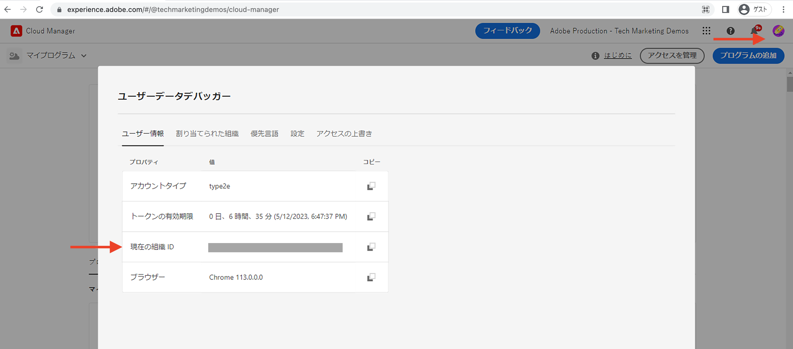
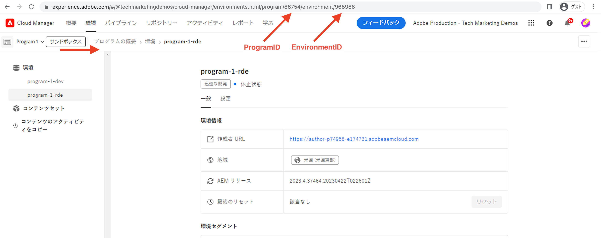

# 迅速な開発環境の設定方法

AEM as a Cloud Service で迅速な開発環境（RDE）を&#x200B;**設定する方法**&#x200B;を説明します。

このビデオでは、次の内容を紹介します。

- Cloud Manager を使用した、プログラムへの RDE の追加
- Adobe IMS を使用した RDE ログインフロー（他の AEM as a Cloud Service 環境との類似）
- [Adobe I/O Runtime 拡張可能 CLI](https://developer.adobe.com/runtime/docs/guides/tools/cli_install/)（別名 `aio CLI`）の設定
- AEM RDE および Cloud Manager `aio CLI` プラグインのセットアップと設定

>[!VIDEO](https://video.tv.adobe.com/v/3415490?quality=12&learn=on)

## 前提条件

以下をローカルにインストールしておく必要があります。

- [Node.js](https://nodejs.org/ja/)（LTS - 長期サポート）
- [npm 8 以降](https://docs.npmjs.com/)

## ローカル設定

[WKND Sites プロジェクト](https://github.com/adobe/aem-guides-wknd#aem-wknd-sites-project)のコードとコンテンツをローカルマシンから RDE 上にデプロイするには、次の手順を実行します。

### Adobe I/O Runtime 拡張可能 CLI

コマンドラインから次のコマンドを実行して、Adobe I/O Runtime 拡張可能 CLI（別名 `aio CLI`）をインストールします。

```shell
$ npm install -g @adobe/aio-cli
```

### AEM プラグイン

`aio cli` の `plugins:install` コマンドを使用して、Cloud Manager と AEM RDE のプラグインをインストールします。

```shell
$ aio plugins:install @adobe/aio-cli-plugin-cloudmanager

$ aio plugins:install @adobe/aio-cli-plugin-aem-rde
```

Cloud Manager プラグインは、開発者がコマンドラインから Cloud Manager を操作できるようにします。

AEM RDE プラグインは、開発者がローカルマシンからコードとコンテンツをデプロイできるようにします。

また、プラグインを更新するには、`aio plugins:update` コマンドを使用します。

## AEM プラグインの設定

AEM プラグインは、RDE とやり取りできるように設定する必要があります。まず、Cloud Manager UI を使用して、組織、プログラム、環境の ID の値をコピーします。

1. 組織 ID：**プロファイル画像／アカウント情報（内部）／モーダルウィンドウ／現在の組織 ID** から値をコピーします

   

1. プログラム ID：**プログラム概要／環境／{ProgramName}-rde／ブラウザー URI／`program/` と`/environment`** の間の数値から値をコピーします

1. 環境 ID：**プログラム概要／環境／{ProgramName}-rde／ブラウザー URI／`environment/`** の後の数値から値をコピーします

   

1. 次に、`aio cli` の `config:set` コマンドを実行して、これらの値を設定します。

   ```shell
   $ aio config:set cloudmanager_orgid <org-id>
   
   $ aio config:set cloudmanager_programid <program-id>
   
   $ aio config:set cloudmanager_environmentid <env-id>
   ```

次のコマンドを実行すると、現在の設定値を確認できます。

```shell
$ aio config:list
```

また、現在ログインしている組織を切り替えたり、把握したりするには、次のコマンドを使用します。

```shell
$ aio where
```

## RDE アクセスの検証

次のコマンドを実行して、AEM RDE プラグインのインストールと設定を確認します。

```shell
$ aio aem:rde:status
```

RDE ステータス情報として、環境ステータス、_AEM プロジェクト_&#x200B;バンドルのリスト、オーサー サービスとパブリッシュサービスの設定が表示されます。

## 次の手順

お気に入りの統合開発環境（IDE）からコードとコンテンツをデプロイして、開発サイクルを高速化する RDE の[使用方法](./how-to-use.md)を説明します。


## その他のリソース

[プログラムドキュメントでの RDE の有効化](https://experienceleague.adobe.com/docs/experience-manager-cloud-service/content/implementing/developing/rapid-development-environments.html?lang=ja#enabling-rde-in-a-program)

[Adobe I/O Runtime 拡張可能 CLI](https://developer.adobe.com/runtime/docs/guides/tools/cli_install/)（別名 `aio CLI`）の設定

[AIO CLI の使用とコマンド](https://github.com/adobe/aio-cli#usage)

[AEM の迅速な開発環境とやり取りするための Adobe I/O Runtime CLI プラグイン](https://github.com/adobe/aio-cli-plugin-aem-rde#aio-cli-plugin-aem-rde)

[Cloud Manager AIO CLI プラグイン](https://github.com/adobe/aio-cli-plugin-cloudmanager)
