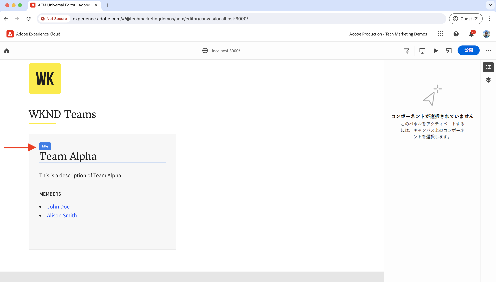
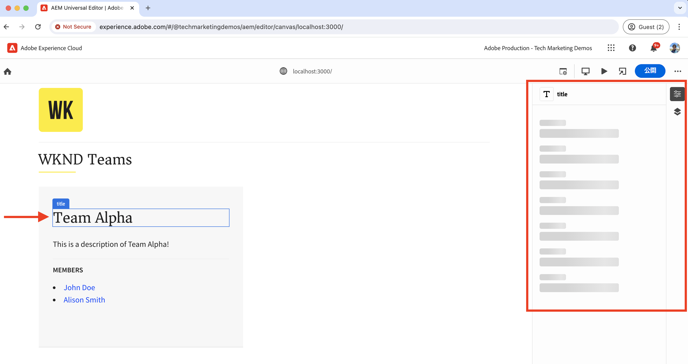
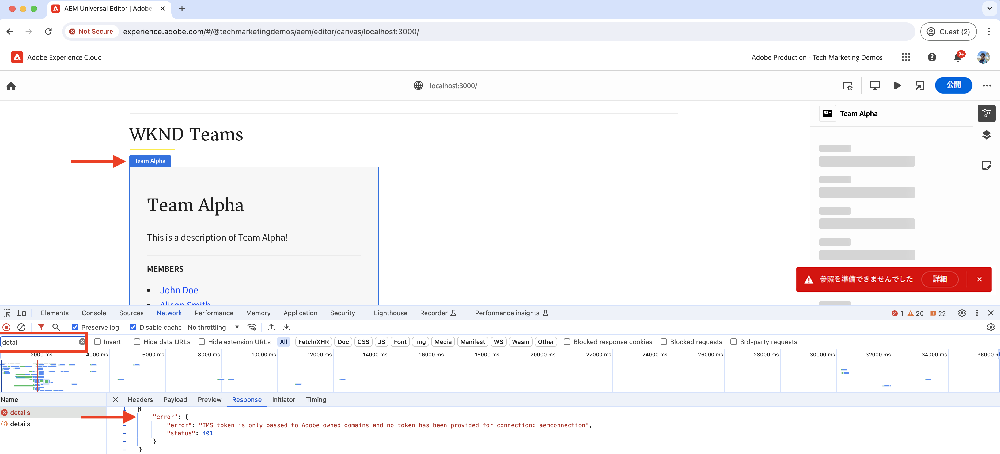
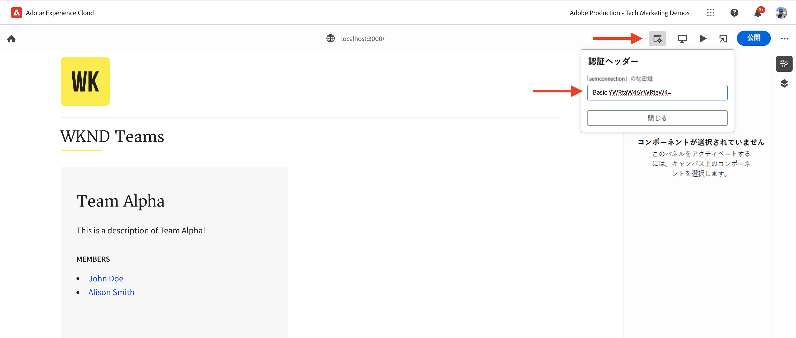
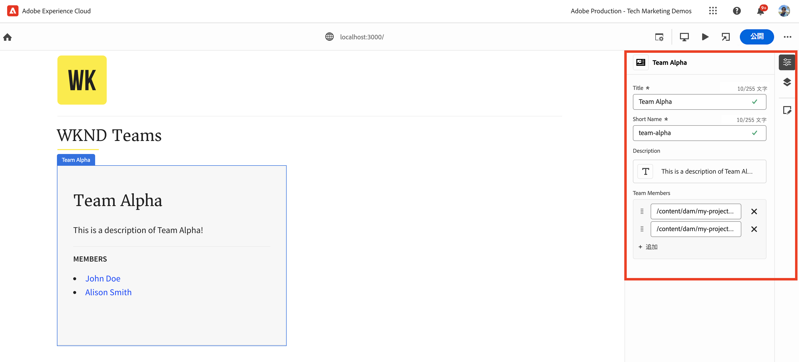
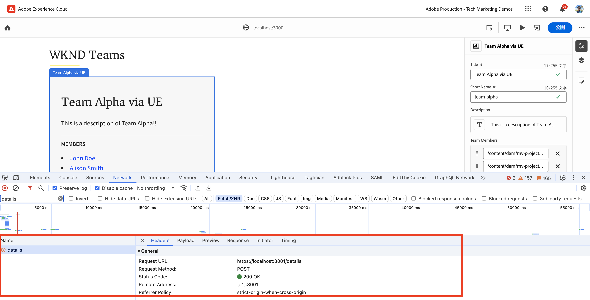
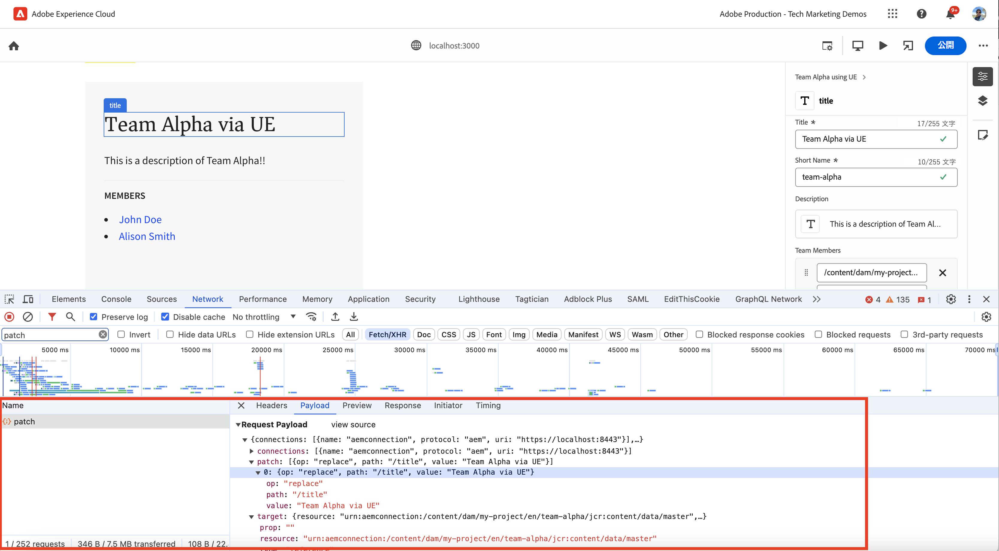
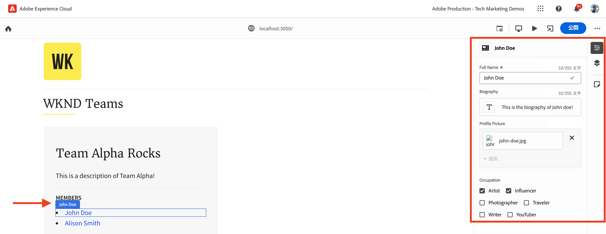
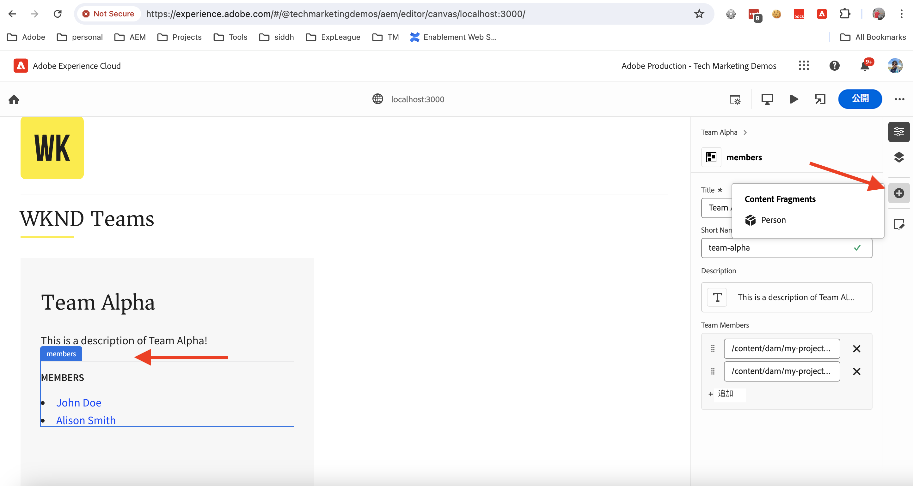
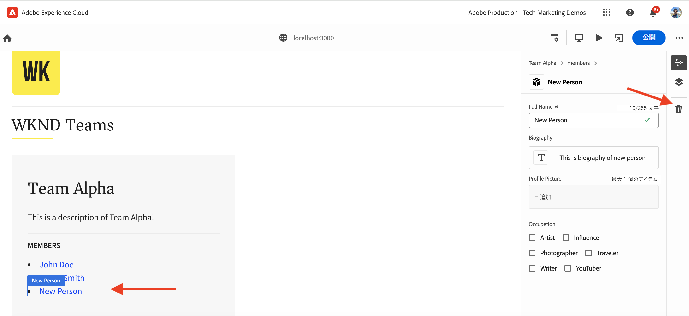

# React アプリを実装して、ユニバーサルエディターを使用してコンテンツを編集する

ユニバーサルエディターを使用してコンテンツを編集するように React アプリを実装する方法を説明します。

## 前提条件

前述のように、ローカル開発環境を設定している [ローカル開発設定](./local-development-setup.md) ステップ。

## ユニバーサルエディターのコアライブラリを含める

まず、WKND Teams の React アプリにユニバーサルエディターのコアライブラリを含めます。 これは、編集されたアプリとユニバーサルエディターの間の通信レイヤーを提供する JavaScript ライブラリです。

ユニバーサルエディターのコアライブラリを React アプリに含める方法は 2 とおりあります。

1. npm レジストリからのノードモジュールの依存関係については、を参照してください [@adobe/universal-editor-cors](https://www.npmjs.com/package/@adobe/universal-editor-cors).
1. スクリプトタグ （`<script>`）がHTMLファイル内に含まれています。

このチュートリアルでは、スクリプトタグのアプローチを使用します。

1. のインストール `react-helmet-async` を管理するパッケージ `<script>` React アプリでタグ付けします。

   ```bash
   $ npm install react-helmet-async
   ```

1. を更新 `src/App.js` ユニバーサルエディターのコアライブラリを含めるための WKND Teams React アプリのファイル。

   ```javascript
   ...
   import { Helmet, HelmetProvider } from "react-helmet-async";
   
   function App() {
   return (
       <HelmetProvider>
           <div className="App">
               <Helmet>
                   {/* AEM Universal Editor :: CORE Library
                     Loads the LATEST Universal Editor library
                   */}
                   <script
                       src="https://universal-editor-service.experiencecloud.live/corslib/LATEST"
                       async
                   />
               </Helmet>
               <Router>
                   <header>
                       <Link to={"/"}>
                       
                       </Link>
                       <hr />
                   </header>
                   <Routes>
                       <Route path="/" element={<Home />} />
                       <Route path="/person/:fullName" element={<Person />} />
                   </Routes>
               </Router>
           </div>
       </HelmetProvider>
   );
   }
   
   export default App;
   ```

## メタデータの追加 – コンテンツソース

WKND Teams React アプリを接続するには _コンテンツソースを使用_ 編集するには、接続メタデータを指定する必要があります。 ユニバーサルエディターサービスは、このメタデータを使用してコンテンツソースとの接続を確立します。

接続メタデータは、次のように保存されます。 `<meta>` HTMLファイルのタグ。 接続メタデータの構文は次のとおりです。

```html
<meta name="urn:adobe:aue:<category>:<referenceName>" content="<protocol>:<url>">
```

内の WKND Teams React アプリに接続メタデータを追加します `<Helmet>` コンポーネント。 を更新 `src/App.js` 次を含むファイル `<meta>` タグ。 この例では、コンテンツソースは、上で実行されているローカル AEM インスタンスです `https://localhost:8443`.

```javascript
...
function App() {
return (
    <HelmetProvider>
        <div className="App">
            <Helmet>
                {/* AEM Universal Editor :: CORE Library
                    Loads the LATEST Universal Editor library
                */}
                <script
                    src="https://universal-editor-service.experiencecloud.live/corslib/LATEST"
                    async
                />
                {/* AEM Universal Editor :: Connection metadata 
                    Connects to local AEM instance
                */}
                <meta
                    name="urn:adobe:aue:system:aemconnection"
                    content={`aem:https://localhost:8443`}
                />
            </Helmet>
            ...
    </HelmetProvider>
);
}

export default App;
```

この `aemconnection` コンテンツソースの短い名前を指定します。 その後のインストルメンテーションでは、短い名前を使用してコンテンツソースを参照します。

## メタデータの追加 – ローカルユニバーサルエディターサービスの設定

Adobeにホストされたユニバーサルエディターサービスの代わりに、ユニバーサルエディターサービスのローカルコピーがローカル開発に使用されます。 ローカルサービスはユニバーサルエディターとAEM SDK をバインドするので、ローカルのユニバーサルエディターサービスのメタデータを WKND Teams React アプリに追加します。

これらの設定は、次の場所にも保存されます `<meta>` HTMLファイルのタグ。 ローカルのユニバーサルエディターサービスのメタデータの構文は、次のとおりです。

```html
<meta name="urn:adobe:aue:config:service" content="<url>">
```

内の WKND Teams React アプリに接続メタデータを追加します `<Helmet>` コンポーネント。 を更新 `src/App.js` 次を含むファイル `<meta>` タグ。 この例では、ローカルのユニバーサルエディターサービスがで実行されています `https://localhost:8001`.

```javascript
...

function App() {
  return (
    <HelmetProvider>
      <div className="App">
        <Helmet>
          {/* AEM Universal Editor :: CORE Library
              Loads the LATEST Universal Editor library
          */}
          <script
            src="https://universal-editor-service.experiencecloud.live/corslib/LATEST"
            async
          />
          {/* AEM Universal Editor :: Connection metadata 
              Connects to local AEM instance
          */}
          <meta
            name="urn:adobe:aue:system:aemconnection"
            content={`aem:https://localhost:8443`}
          />
          {/* AEM Universal Editor :: Configuration for Service
              Using locally running Universal Editor service
          */}
          <meta
            name="urn:adobe:aue:config:service"
            content={`https://localhost:8001`}
          />
        </Helmet>
        ...
    </HelmetProvider>
);
}
export default App;
```

## React コンポーネントの実装

次のような WKND Teams React アプリのコンテンツを編集します _チーム タイトルとチームの説明_&#x200B;を作成する場合は、React コンポーネントを実装する必要があります。 実装とは、関連するデータ属性（`data-aue-*`）を選択し、ユニバーサルエディターを使用して編集可能にするHTML要素に変更します。 データ属性の詳細については、を参照してください。 [属性とタイプ](https://experienceleague.adobe.com/en/docs/experience-manager-cloud-service/content/implementing/developing/universal-editor/attributes-types).

### 編集可能な要素の定義

まず、ユニバーサルエディターを使用して編集する要素を定義します。 WKND Teams の React アプリでは、チームのタイトルと説明がAEMの Team コンテンツフラグメントに保存されるので、最も適した編集候補になります。

を実装しましょう `Teams` React コンポーネントを使用して、チームのタイトルと説明を編集可能にする。

1. を開きます `src/components/Teams.js` wknd Teams React アプリのファイル。
1. を追加 `data-aue-prop`, `data-aue-type` および `data-aue-label` チームのタイトルおよび説明の要素の属性。

   ```javascript
   ...
   function Teams() {
       const { teams, error } = useAllTeams();
       ...
   
       return (
           <div className="team">
               // AEM Universal Editor :: Instrumentation using data-aue-* attributes
               <h2 className="team__title" data-aue-prop="title" data-aue-type="text" data-aue-label="title">{title}</h2>
               <p className="team__description" data-aue-prop="description" data-aue-type="richtext" data-aue-label="description">{description.plaintext}</p>
               ...
           </div>
       );
   }
   
   export default Teams;
   ```

1. WKND Teams React アプリを読み込むブラウザーで、ユニバーサルエディターページを更新します。 これで、チームのタイトルと説明の要素が編集可能であることが確認できます。

   

1. インライン編集またはプロパティパネルを使用してチームのタイトルや説明を編集しようとすると、読み込みスピナーが表示されますが、コンテンツを編集できません。 ユニバーサルエディターは、コンテンツの読み込みと保存のためのAEM リソースの詳細を認識しないためです。

   

まとめると、上記の変更により、チームのタイトルと説明の要素がユニバーサルエディターで編集可能としてマークされます。 ただし、 **（インラインパネルまたはプロパティパネルを使用して）編集して、まだ変更を保存することはできません**&#x200B;そのため、を使用してAEM リソースの詳細を追加する必要があります。 `data-aue-resource` 属性。 次の手順でそれを行いましょう。

### AEM リソースの詳細を定義

編集したコンテンツをAEMに保存し直し、プロパティパネルにコンテンツを読み込むには、AEM リソースの詳細をユニバーサルエディターに指定する必要があります。

この場合、AEM リソースは Team コンテンツフラグメントパスなので、リソースの詳細をに追加します。 `Teams` トップレベルでの React コンポーネント `<div>` 要素。

1. を更新 `src/components/Teams.js` 追加するファイル `data-aue-resource`, `data-aue-type` および `data-aue-label` 最上位レベルに対する属性 `<div>` 要素。

   ```javascript
   ...
   function Teams() {
       const { teams, error } = useAllTeams();
       ...
   
       // Render single Team
       function Team({ _path, title, shortName, description, teamMembers }) {
           // Must have title, shortName and at least 1 team member
           if (!_path || !title || !shortName || !teamMembers) {
               return null;
           }
   
         return (
           // AEM Universal Editor :: Instrumentation using data-aue-* attributes
           <div className="team" data-aue-resource={`urn:aemconnection:${_path}/jcr:content/data/master`} data-aue-type="reference" data-aue-label={title}>
           ...
           </div>
       );
       }
   }
   export default Teams;
   ```

   の値 `data-aue-resource` attribute は、Team コンテンツフラグメントのAEM リソースパスです。 この `urn:aemconnection:` プレフィックスには、接続メタデータで定義されたコンテンツソースの短い名前を使用します。

1. WKND Teams React アプリを読み込むブラウザーで、ユニバーサルエディターページを更新します。 最上位のチーム要素が編集可能になっていますが、プロパティパネルがまだコンテンツを読み込んでいません。 ブラウザーの「ネットワーク」タブに、の 401 Unauthorized エラーが表示されます `details` コンテンツを読み込むリクエスト。 認証に IMS トークンを使用しようとしていますが、ローカルのAEM SDK は IMS 認証をサポートしていません。

   

1. 401 Unauthorized エラーを修正するには、を使用して、ローカルのAEM SDK 認証の詳細をユニバーサルエディターに指定する必要があります **認証ヘッダー** ユニバーサルエディターの「」オプション。 ローカルのAEM SDK として、値をに設定します `Basic YWRtaW46YWRtaW4=` （用） `admin:admin` 資格情報。

   

1. WKND Teams React アプリを読み込むブラウザーで、ユニバーサルエディターページを更新します。 プロパティパネルにコンテンツが読み込まれ、チームのタイトルと説明をインラインで編集するか、プロパティパネルを使用することが可能になりました。

   

#### 内部で

プロパティパネルは、ローカルのユニバーサルエディターサービスを使用して、AEM リソースからコンテンツを読み込みます。 ブラウザーの「ネットワーク」タブを使用すると、ローカルのユニバーサルエディターサービスに対するPOSTリクエストを確認できます（`https://localhost:8001/details`）に設定する必要があります。

インライン編集またはプロパティパネルを使用してコンテンツを編集すると、変更内容がローカルのユニバーサルエディターサービスを使用してAEM リソースに保存されます。 ブラウザーの「ネットワーク」タブを使用すると、ローカルのユニバーサルエディターサービスに対するPOSTリクエストを確認できます（`https://localhost:8001/update` または `https://localhost:8001/patch`）を選択して、コンテンツを保存します。



リクエストペイロードの JSON オブジェクトには、コンテンツサーバー（`connections`）、リソースパス （`target`）、および更新後のコンテンツ （`patch`）に設定します。



### 編集可能なコンテンツを展開する

編集可能なコンテンツを展開し、実装をに適用します **チームメンバー** そのため、プロパティパネルを使用してチームメンバーを編集できます。

上記のように、関連するを追加しましょう `data-aue-*` のチームメンバーに対する属性 `Teams` React コンポーネント。

1. を更新 `src/components/Teams.js` データ属性をに追加するファイル `<li key={index} className="team__member">` 要素。

   ```javascript
   ...
   function Teams() {
       const { teams, error } = useAllTeams();
       ...
   
       <div>
           <h4 className="team__members-title">Members</h4>
           <ul className="team__members">
               {/* Render the referenced Person models associated with the team */}
               {teamMembers.map((teamMember, index) => {
                   return (
                       // AEM Universal Editor :: Instrumentation using data-aue-* attributes
                       <li key={index} className="team__member" data-aue-resource={`urn:aemconnection:${teamMember?._path}/jcr:content/data/master`} data-aue-type="component" data-aue-label={teamMember.fullName}>
                       <Link to={`/person/${teamMember.fullName}`}>
                           {teamMember.fullName}
                       </Link>
                       </li>
                   );
               })}
           </ul>
       </div>
       ...
   }
   export default Teams;
   ```

   の値 `data-aue-type` 属性は `component` チームメンバーはとして保存されます。 `Person` AEMのコンテンツフラグメントで、コンテンツの移動可能/削除可能な部分を示すのに役立ちます。

1. WKND Teams React アプリを読み込むブラウザーで、ユニバーサルエディターページを更新します。 これで、プロパティパネルを使用してチームメンバーを編集できることが確認できます。

   

#### 内部で

上記のように、コンテンツの取得と保存は、ローカルのユニバーサルエディターサービスによって行われます。 この `/details`, `/update` または `/patch` コンテンツの読み込みと保存を行うためのリクエストが、ローカルのユニバーサルエディターサービスに対して行われます。

### コンテンツの追加および削除の定義

これまでのところ、既存のコンテンツを編集可能にしましたが、新しいコンテンツを追加する場合はどうすればよいですか？ ユニバーサルエディターを使用して、WKND チームにチームメンバーを追加または削除する機能を追加しましょう。 したがって、コンテンツ作成者は、AEMに移動してチームメンバーを追加または削除する必要はありません。

ただし、簡単にまとめると、WKND チームメンバーは次のように保存されます `Person` AEMのコンテンツフラグメントであり、 `teamMembers` プロパティ。 AEMでモデル定義を確認するには、次を参照してください。 [my-project](http://localhost:4502/libs/dam/cfm/models/console/content/models.html/conf/my-project).

1. まず、コンポーネント定義ファイルを作成します `/public/static/component-definition.json`. このファイルには、のコンポーネント定義が含まれます `Person` コンテンツフラグメント。 この `aem/cf` プラグインを使用すると、適用するデフォルト値を指定するモデルとテンプレートに基づいて、コンテンツフラグメントを挿入できます。

   ```json
   {
       "groups": [
           {
           "title": "Content Fragments",
           "id": "content-fragments",
           "components": [
               {
               "title": "Person",
               "id": "person",
               "plugins": {
                   "aem": {
                       "cf": {
                           "name": "person",
                           "cfModel": "/conf/my-project/settings/dam/cfm/models/person",
                           "cfFolder": "/content/dam/my-project/en",
                           "title": "person",
                           "template": {
                               "fullName": "New Person",
                               "biographyText": "This is biography of new person"
                               }
                           }
                       }
                   }
               }
           ]
           }
       ]
   }
   ```

1. 次に、上記のコンポーネント定義ファイルを `index.html` WKND チーム React アプリの。 を更新 `public/index.html` ファイルの `<head>` コンポーネント定義ファイルを含めるセクション。

   ```html
   ...
   <script
       type="application/vnd.adobe.aue.component+json"
       src="/static/component-definition.json"
   ></script>
   <title>WKND App - Basic GraphQL Tutorial</title>
   </head>
   ...
   ```

1. 最後に、を更新します `src/components/Teams.js` データ属性を追加するファイル。 この **メンバー** チームメンバーのコンテナとして機能するセクションに、 `data-aue-prop`, `data-aue-type`、および `data-aue-label` の属性です。 `<div>` 要素。

   ```javascript
   ...
   function Teams() {
       const { teams, error } = useAllTeams();
       ...
   
       {/* AEM Universal Editor :: Team Members as container */}
       <div data-aue-prop="teamMembers" data-aue-type="container" data-aue-label="members">
           <h4 className="team__members-title">Members</h4>
           <ul className="team__members">
           {/* Render the referenced Person models associated with the team */}
           {teamMembers.map((teamMember, index) => {
               return (
               // AEM Universal Editor :: Instrumentation using data-aue-* attributes
               <li key={index} className="team__member" data-aue-resource={`urn:aemconnection:${teamMember?._path}/jcr:content/data/master`} data-aue-type="component" data-aue-label={teamMember.fullName}>
                   <Link to={`/person/${teamMember.fullName}`}>
                   {teamMember.fullName}
                   </Link>
               </li>
               );
           })}
           </ul>
       </div>
       ...
   }
   export default Teams;
   ```

1. WKND Teams React アプリを読み込むブラウザーで、ユニバーサルエディターページを更新します。 これで、次のことがわかります **メンバー** セクションはコンテナとして機能します。 新しいチームメンバーを挿入するには、プロパティパネルと **+** アイコン。

   

1. チームメンバーを削除するには、チームメンバーを選択し、 **削除** アイコン。

   

#### 内部で

コンテンツの追加と削除の操作は、ローカルのユニバーサルエディターサービスによって行われます。 へのPOSTリクエスト `/add` または `/remove` 詳細なペイロードがローカルのユニバーサルエディターサービスに追加され、AEMにコンテンツが追加または削除されます。

## ソリューションファイル

実装の変更を確認する場合、またはユニバーサルエディターで動作する WKND Teams React アプリを取得できない場合は、 [basic-tutorial-instrumented-for-UE](https://github.com/adobe/aem-guides-wknd-graphql/tree/solution/basic-tutorial-instrumented-for-UE) ソリューションブランチ。

ファイルごとのファイルと作業中のファイルとの比較 **basic-tutorial** ブランチは使用可能です [こちら](https://github.com/adobe/aem-guides-wknd-graphql/compare/solution/basic-tutorial...solution/basic-tutorial-instrumented-for-UE?expand=1).

## これで完了です

ユニバーサルエディターを使用してコンテンツを追加、編集、削除するための WKND Teams React アプリのインストルメントが正常に行われました。 コアライブラリを含め、接続とローカルユニバーサルエディターサービスのメタデータを追加し、様々なデータ（`data-aue-*`）属性です。
