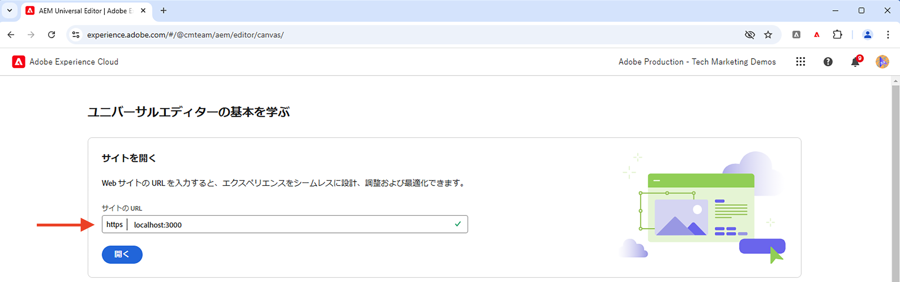

# ローカル開発設定

AEM ユニバーサルエディターを使用して React アプリのコンテンツを編集するためのローカル開発環境を設定する方法について説明します。

## 前提条件

このチュートリアルに従うには、以下が必要です。

- HTML と JavaScript の基本的なスキル。
- 以下のツールをローカルにインストールする必要があります。
   - [Node.js](https://nodejs.org/ja/download/)
   - [Git](https://git-scm.com/downloads)
   - [Visual Studio Code](https://code.visualstudio.com/) などの IDE またはコードエディター
- 次をダウンロードしてインストールします。
   - [AEM as a Cloud Service SDK](https://experienceleague.adobe.com/ja/docs/experience-manager-learn/cloud-service/local-development-environment-set-up/aem-runtime#download-the-aem-as-a-cloud-service-sdk)：開発目的で AEM オーサーおよびパブリッシュをローカルで実行するために使用されるクイックスタート jar が含まれています。
   - [ユニバーサルエディターサービス](https://experienceleague.adobe.com/ja/docs/experience-cloud/software-distribution/home)：ユニバーサルエディターサービスのローカルコピーで、機能のサブセットを備えており、ソフトウェア配布ポータルからダウンロードできます。
   - [local-ssl-proxy](https://www.npmjs.com/package/local-ssl-proxy#local-ssl-proxy)：ローカル開発用に自己署名証明書を使用するシンプルなローカル SSL HTTP プロキシ。AEM ユニバーサルエディターでは、エディターに React アプリを読み込むために、React アプリの HTTPS URL が必要です。

## ローカル設定

ローカル開発環境を設定するには、次の手順に従います。

### AEM SDK

WKND Teams React アプリのコンテンツを提供するには、ローカル AEM SDK に次のパッケージをインストールします。

- [WKND Teams - コンテンツパッケージ](./assets/basic-tutorial-solution.content.zip)：コンテンツフラグメントモデル、コンテンツフラグメント、永続 GraphQL クエリが含まれます。
- [WKND Teams - 設定パッケージ](./assets/basic-tutorial-solution.ui.config.zip)：クロスオリジンリソース共有（CORS）とトークン認証ハンドラーの設定が含まれます。CORS は、AEM 以外の web プロパティが AEM の GraphQL API に対してブラウザーベースのクライアントサイド呼び出しを行うことを容易にし、トークン認証ハンドラーは AEM への各リクエストを認証するために使用されます。

  

### React アプリ

WKND Teams React アプリを設定するには、次の手順に従います。

1. `basic-tutorial` ソリューション分岐から [WKND Teams React アプリ](https://github.com/adobe/aem-guides-wknd-graphql/tree/solution/basic-tutorial)を複製します。

   ```bash
   $ git clone -b solution/basic-tutorial git@github.com:adobe/aem-guides-wknd-graphql.git
   ```

1. `basic-tutorial` ディレクトリに移動し、コードエディターで開きます。

   ```bash
   $ cd aem-guides-wknd-graphql/basic-tutorial
   $ code .
   ```

1. 依存関係をインストールし、React アプリを起動します。

   ```bash
   $ npm install
   $ npm start
   ```

1. ブラウザーで [http://localhost:3000](http://localhost:3000) にある WKND Teams React アプリを開きます。チームメンバーとその詳細のリストが表示されます。React アプリのコンテンツは、GraphQL API（`/graphql/execute.json/my-project/all-teams`）を使用してローカル AEM SDK によって提供され、ブラウザーのネットワークタブを使用して確認できます。

   

### ユニバーサルエディターサービス

**ローカル**&#x200B;ユニバーサルエディターサービスを設定するには、次の手順に従います。

1. [ソフトウェア配布ポータル](https://experience.adobe.com/jp/downloads)から最新バージョンのユニバーサルエディターサービスをダウンロードします。

   

1. ダウンロードした zip ファイルを抽出し、`universal-editor-service.cjs` ファイルを `universal-editor-service` という名前の新しいディレクトリにコピーします。

   ```bash
   $ unzip universal-editor-service-vproduction-<version>.zip
   $ mkdir universal-editor-service
   $ cp universal-editor-service.cjs universal-editor-service
   ```

1. `universal-editor-service` ディレクトリに `.env` ファイルを作成し、次の環境変数を追加します。

   ```bash
   # The port on which the Universal Editor service runs
   UES_PORT=8000
   # Disable SSL verification
   UES_TLS_REJECT_UNAUTHORIZED=false
   ```

1. ローカルのユニバーサルエディターサービスを開始します。

   ```bash
   $ cd universal-editor-service
   $ node universal-editor-service.cjs
   ```

上記のコマンドでは、ポート `8000` でユニバーサルエディターサービスが開始され、次の出力が表示されます。

```bash
Either no private key or certificate was set. Starting as HTTP server
Universal Editor Service listening on port 8000 as HTTP Server
```

### ローカル SSL HTTP プロキシ

AEM ユニバーサルエディターでは、React アプリを HTTPS 経由で提供する必要があります。ローカル開発用に自己署名証明書を使用するローカル SSL HTTP プロキシを設定しましょう。

ローカル SSL HTTP プロキシを設定し、HTTPS 経由で AEM SDK およびユニバーサルエディターサービスを提供するには、次の手順に従います。

1. `local-ssl-proxy` パッケージをグローバルにインストールします。

   ```bash
   $ npm install -g local-ssl-proxy
   ```

1. 次のサービスに対して、ローカル SSL HTTP プロキシのインスタンスを 2 つ起動します。

   - ポート `8443` 上の AEM SDK ローカル SSL HTTP プロキシ。
   - ポート `8001` 上のユニバーサルエディターサービスのローカル SSL HTTP プロキシ。

   ```bash
   # AEM SDK local SSL HTTP proxy on port 8443
   $ local-ssl-proxy --source 8443 --target 4502
   
   # Universal Editor service local SSL HTTP proxy on port 8001
   $ local-ssl-proxy --source 8001 --target 8000
   ```

### HTTPS を使用する React アプリの更新

WKND Teams React アプリに対して HTTPS を有効にするには、次の手順に従います。

1. ターミナルで `Ctrl + C` を押して、React を停止します。
1. `start` スクリプトに `HTTPS=true` 環境変数を含めるよう `package.json` ファイルを更新します。

   ```json
   "scripts": {
       "start": "HTTPS=true react-scripts start",
       ...
   }
   ```

1. `.env.development` ファイルの `REACT_APP_HOST_URI` を更新して、AEM SDK の HTTPS プロトコルとローカル SSL HTTP プロキシポートを使用します。

   ```bash
   REACT_APP_HOST_URI=https://localhost:8443
   ...
   ```

1. `secure: false` オプションを使用して緩和された SSL 設定を使用するように `../src/proxy/setupProxy.auth.basic.js` ファイルを更新します。

   ```javascript
   ...
   module.exports = function(app) {
   app.use(
       ['/content', '/graphql'],
       createProxyMiddleware({
       target: REACT_APP_HOST_URI,
       changeOrigin: true,
       secure: false, // Ignore SSL certificate errors
       // pass in credentials when developing against an Author environment
       auth: `${REACT_APP_BASIC_AUTH_USER}:${REACT_APP_BASIC_AUTH_PASS}`
       })
   );
   };
   ```

1. React アプリを起動します。

   ```bash
   $ npm start
   ```

## 設定の検証

上記の手順でローカル開発環境を設定したら、設定を検証しましょう。

### ローカル検証

次のサービスが HTTPS 経由でローカルに実行されている場合、自己署名証明書のブラウザーでセキュリティ警告を受け入れる必要がある場合があります。

1. [https://localhost:3000](https://localhost:3000) 上の WKND Teams React アプリ
1. [https://localhost:8443](https://localhost:8443) 上の AEM SDK
1. [https://localhost:8001](https://localhost:8001) 上のユニバーサルエディターサービス

### ユニバーサルエディターでの WKND Teams React アプリの読み込み

設定を検証するために、ユニバーサルエディターで WKND チームの React アプリを読み込みましょう。

1. ブラウザーでユニバーサルエディター https:// experience.adobe.com/#/aem/editor を開きます。プロンプトが表示されたら、Adobe ID を使用してログインします。

1. ユニバーサルエディターのサイト URL 入力フィールドに WKND Teams React アプリの URL を入力し、「`Open`」をクリックします。

   

1. WKND Teams React アプリはユニバーサルエディターに読み込まれます。**ただし、まだコンテンツを編集することはできません**。ユニバーサルエディターを使用してコンテンツ編集を有効にするには、React アプリを実装する必要があります。

   


## 次の手順

詳しくは、[React アプリを実装してコンテンツを編集](./instrument-to-edit-content.md)する方法を参照してください。
