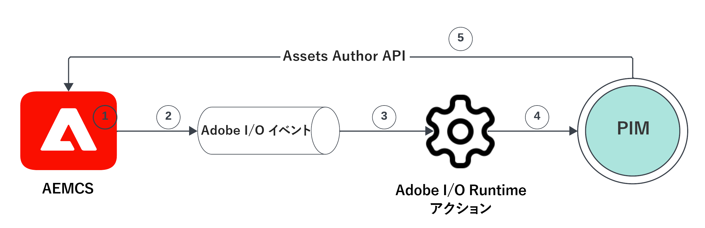
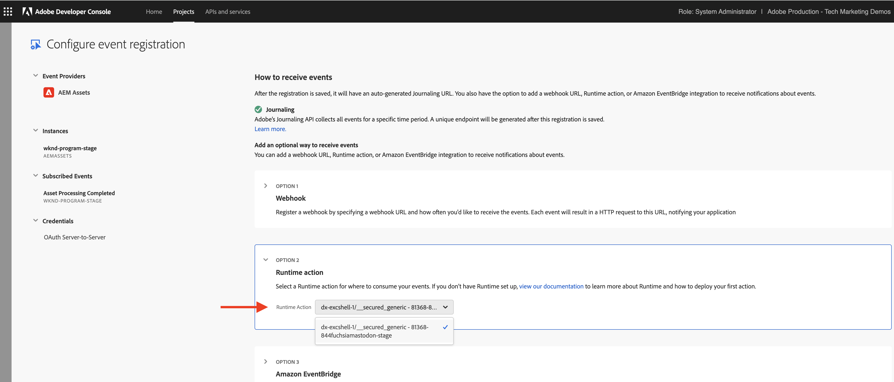
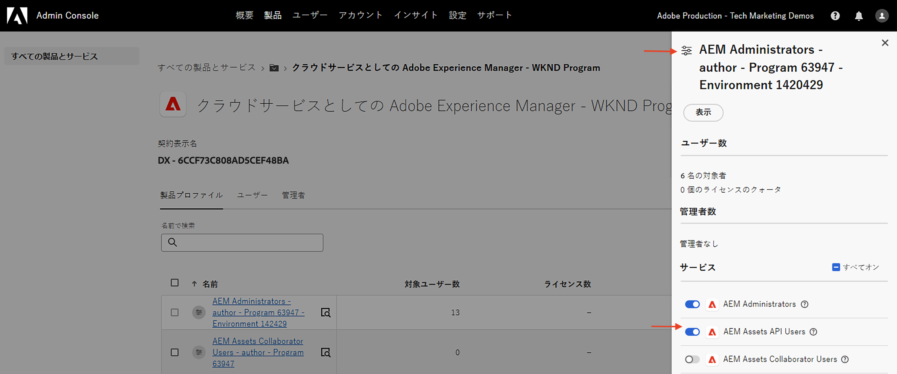
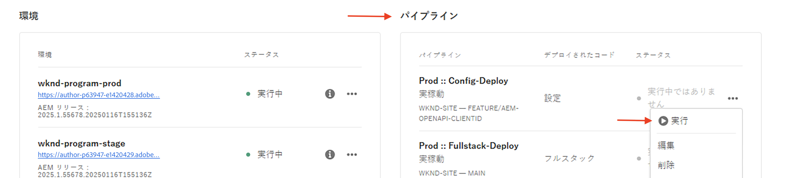
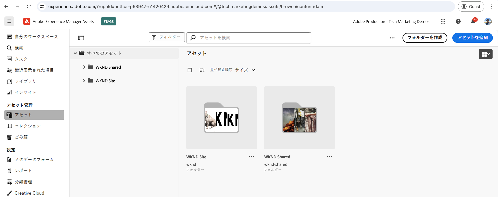
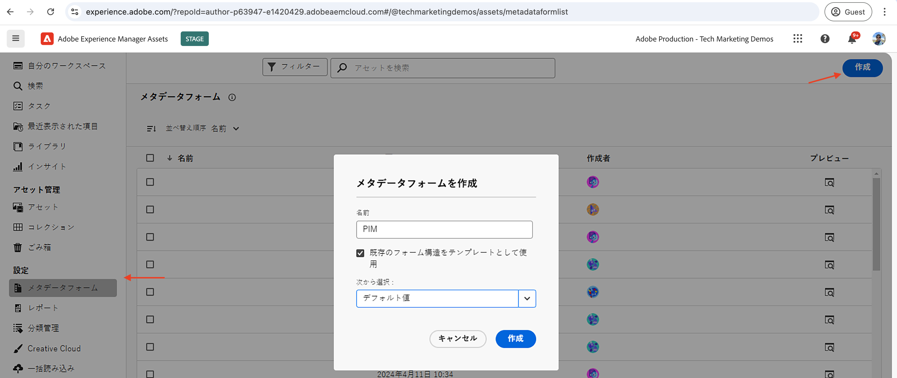
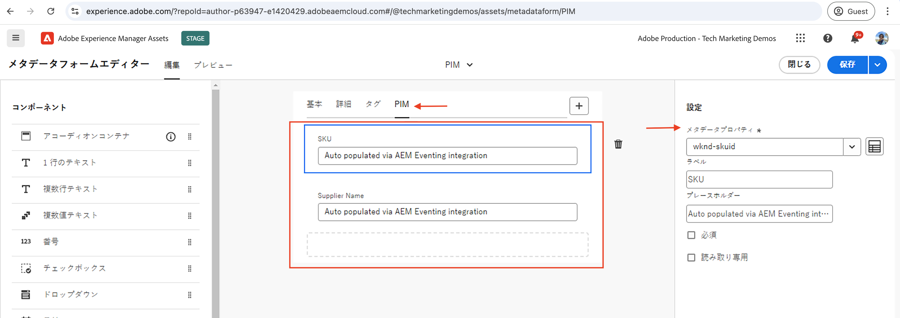
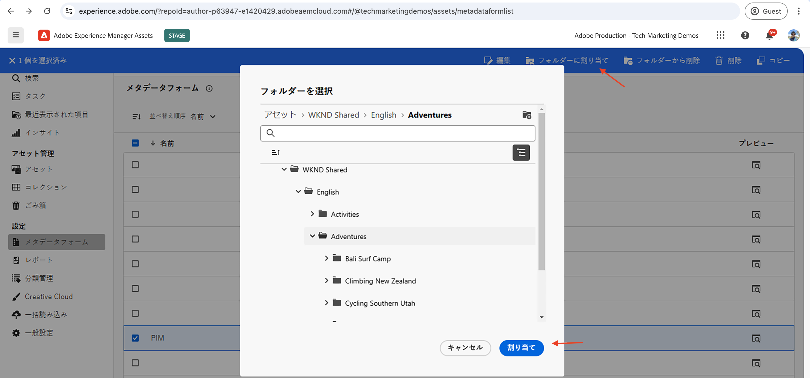
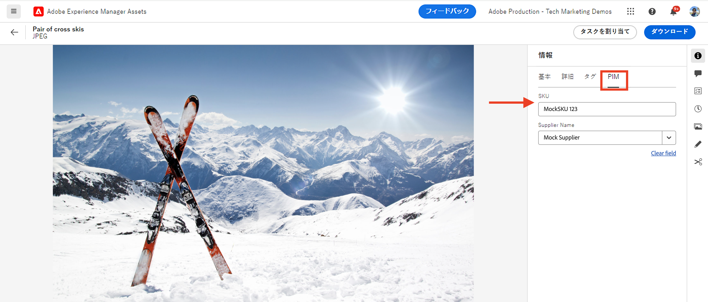

# PIM 統合用の AEM Assets イベント

>[!IMPORTANT]
>
>このチュートリアルでは、OpenAPI ベースの AEM API を使用します。 これらは、早期アクセスプログラムの一部としてご利用いただけます。早期アクセスプログラムへのアクセスに興味がある場合は、ユースケースの説明を添付して [aem-apis@adobe.com](mailto:aem-apis@adobe.com) までメールでお問い合わせください。

OpenAPI ベースの Assets オーサー API を使用して、AEM イベントを受信し、これに基づいて AEM のコンテンツの状態を更新する方法について説明します。

受信したイベントの処理方法は、ビジネス要件によって異なります。 例えば、イベントデータを使用して、サードパーティシステム、AEM、またはその両方を更新できます。

この例では、製品情報管理（PIM）システムなどのサードパーティシステムを、AEM as a Cloud Service Assets と統合する方法を示します。 AEM Assets イベントを受信すると、PIM システムから追加のメタデータを取得し、AEM のアセットメタデータを更新する処理が行われます。 更新されたアセットメタデータには、SKU、サプライヤー名、その他の製品詳細などの追加情報を含めることができます。

AEM Assets イベントを受信して処理するには、サーバーレスプラットフォームである [Adobe I/O Runtime](https://developer.adobe.com/runtime/docs/guides/overview/what_is_runtime/) を使用します。 ただし、サードパーティシステムの web フックや Amazon EventBridge などの他のイベント処理システムも使用できます。

統合の高レベルのフローは次のとおりです。



1. AEM オーサーサービスは、アセットのアップロードが完了し、すべてのアセット処理アクティビティも完了すると、_アセット処理の完了_&#x200B;イベントをトリガーします。 アセット処理の完了を待つことで、標準の処理（メタデータの抽出など）が確実に完了します。
1. イベントは [Adobe I/Oイベント](https://developer.adobe.com/events/)サービスに送信されます。
1. Adobe I/O イベントサービスは、イベントを [Adobe I/O Runtime アクション](https://developer.adobe.com/runtime/docs/guides/using/creating_actions/)に渡して、処理します。
1. Adobe I/O Runtime アクションは、PIM システムの API を呼び出して、SKU、サプライヤー情報などの追加のメタデータを取得します。
1. PIM から取得した追加のメタデータは、AEM Assets で OpenAPI ベースの [Assets Author API](https://developer.adobe.com/experience-cloud/experience-manager-apis/api/experimental/assets/author/) を使用して更新されます。

## 前提条件

このチュートリアルを完了するには、次が必要になります。

- [AEM イベンティングが有効な](https://developer.adobe.com/experience-cloud/experience-manager-apis/guides/events/#enable-aem-events-on-your-aem-cloud-service-environment) AEM as a Cloud Service 環境。 また、サンプル [WKND Sites](https://github.com/adobe/aem-guides-wknd?#aem-wknd-sites-project) プロジェクトをそこにデプロイする必要があります。

- [Adobe Developer Console](https://developer.adobe.com/developer-console/docs/guides/getting-started) にアクセスします。

- ローカルマシンにインストールされた [Adobe Developer CLI](https://developer.adobe.com/runtime/docs/guides/tools/cli_install/)。

## 開発手順

大まかな開発手順は次のとおりです。

1. [AEM as a Cloud Service 環境の最新化](https://experienceleague.adobe.com/ja/docs/experience-manager-learn/cloud-service/aem-apis/invoke-openapi-based-aem-apis#modernization-of-aem-as-a-cloud-service-environment)
1. [AEM API アクセスの有効化](https://experienceleague.adobe.com/ja/docs/experience-manager-learn/cloud-service/aem-apis/invoke-openapi-based-aem-apis#enable-aem-apis-access)
1. [Adobe Developer Console（ADC）でプロジェクトの作成](./runtime-action.md#Create-project-in-Adobe-Developer-Console)
1. [プロジェクトをローカル開発用に初期化](./runtime-action.md#initialize-project-for-local-development)
1. ADC でプロジェクトの設定
1. ADC プロジェクトの通信を有効にする AEM オーサーサービスの設定
1. 調整するランタイムアクションの開発
   1. PIM システムからのメタデータの取得
   1. Assets Author API を使用した AEM Assets でのメタデータの更新
1. アセットメタデータスキーマの作成と適用
1. アセットのアップロードとメタデータの更新の検証

手順 1～2 について詳しくは、[OpenAPI ベースの AEM API の呼び出し](https://experienceleague.adobe.com/ja/docs/experience-manager-learn/cloud-service/aem-apis/invoke-openapi-based-aem-apis)ガイドを参照し、手順 3～4 について詳しくは、[Adobe I/O Runtime アクションと AEM イベント](./runtime-action.md#)の例を参照してください。 手順 5～9 について詳しくは、次の節を参照してください。

### Adobe Developer Console（ADC）でのプロジェクトの設定

AEM Assets イベントを受け取り、前の手順で作成した Adobe I/O Runtime アクションを実行するには、ADC でプロジェクトを設定します。

- ADC で、手順 3 で作成した[プロジェクト](https://developer.adobe.com/console/projects)に移動します。 そのプロジェクトから、`Stage` ワークスペースを選択します。ここでは、手順 4 の指示の一部として `aio app deploy` を実行する際にランタイムアクションがデプロイされます。

- 「**サービスを追加**」ボタンをクリックし、「**イベント**」オプションを選択します。 **イベントを追加**&#x200B;ダイアログで、**Experience Cloud**／**AEM Assets** を選択し、「**次へ**」をクリックします。
  

- **イベント登録の設定**&#x200B;手順で、目的の AEMCS インスタンスを選択し、_アセット処理の完了_&#x200B;イベントと OAuth サーバー間認証タイプを選択します。

  

- 最後に、**イベントの受信方法**&#x200B;の手順で、「**ランタイムアクション**」オプションを展開し、前の手順で作成した&#x200B;_汎用_&#x200B;アクションを選択します。 「**設定済みイベントを保存**」をクリックします。

  

- 同様に、「**サービスを追加**」ボタンをクリックし、「**API**」オプションを選択します。 **API を追加**&#x200B;モーダルで、**Experience Cloud**／**AEM Assets Author API** を選択し、「**次へ**」をクリックします。

  

- 次に、認証タイプとして **OAuth サーバー間**&#x200B;を選択し、「**次へ**」をクリックします。

- 次に、イベントの作成元である AEM Assets 環境に関連付けられている正しい&#x200B;**製品プロファイル**&#x200B;を選択し、そこでアセットを更新する十分なアクセス権を持っている必要があります。 最後に、「**設定済み API を保存**」ボタンをクリックします。

  

  ここでは、_AEM 管理者 - 作成者 - プログラム XXX - 環境 YYY_ 製品プロファイルが選択され、**AEM Assets API ユーザー**&#x200B;サービスが有効になっています。

  

## ADC プロジェクト通信を有効にする AEM インスタンスの設定

AEM インスタンスと通信する ADC プロジェクトの OAuth サーバー間資格情報クライアント ID を有効にするには、AEM インスタンスを設定する必要があります。

これを行うには、AEM プロジェクトの `api.yaml`ファイルで設定を定義します。 次に、Cloud Manager の設定パイプラインを使用して `api.yaml` ファイルをデプロイします。

- AEM プロジェクトで、`config` フォルダーから `api.yaml` ファイルを見つけるか作成します。

  

- 次の設定を `api.yaml` ファイルに追加します。

  ```yaml
  kind: "API"
  version: "1.0"
  metadata: 
      envTypes: ["dev", "stage", "prod"]
  data:
      allowedClientIDs:
          author:
          - "<ADC Project's OAuth Server-to-Server credential ClientID>"
  ```

  `<ADC Project's OAuth Server-to-Server credential ClientID>` を ADC プロジェクトの OAuth サーバー間資格情報の実際のクライアント ID に置き換えます。

  >[!CAUTION]
  >
  > デモ目的では、すべての環境で同じクライアント ID が使用されます。セキュリティと制御の強化に、環境（開発、ステージ、実稼動）ごとに個別のクライアント ID を使用することをお勧めします。


- 設定の変更を Git リポジトリにコミットし、変更をリモートリポジトリにプッシュします。

- Cloud Manager の設定パイプラインを使用して、上記の変更をデプロイします。 また、`api.yaml` ファイルは、コマンドラインツールを使用して RDE にインストールすることもできます。

  

### ランタイムアクションの開発

メタデータの取得と更新を実行するには、まず `src/dx-excshell-1/actions/generic` フォルダーに自動作成された&#x200B;_汎用_&#x200B;アクションコードを更新します。

完全なコードについて詳しくは、添付の [WKND-Assets-PIM-Integration.zip](../assets/examples/assets-pim-integration/WKND-Assets-PIM-Integration.zip) ファイルを参照してください。以下の節では主要なファイルをハイライト表示しています。

- `src/dx-excshell-1/actions/generic/mockPIMCommunicator.js` ファイルは、PIM API 呼び出しをモックして、SKU やサプライヤー名などの追加のメタデータを取得します。 このファイルはデモ用に使用されます。 エンドツーエンドのフローが機能するようになったら、この関数を実際の PIM システムへの呼び出しに置き換えて、アセットのメタデータを取得します。

  ```javascript
  /**
   * Mock PIM API to get the product data such as SKU, Supplier, etc.
   *
   * In a real-world scenario, this function would call the PIM API to get the product data.
   * For this example, we are returning mock data.
   *
   * @param {string} assetId - The assetId to get the product data.
   */
  module.exports = {
      async getPIMData(assetId) {
          if (!assetId) {
          throw new Error('Invalid assetId');
          }
          // Mock response data for demo purposes
          const data = {
          SKUID: 'MockSKU 123',
          SupplierName: 'mock-supplier',
          // ... other product data
          };
          return data;
      },
  };
  ```

- `src/dx-excshell-1/actions/generic/aemCommunicator.js` ファイルは、[Assets Author API](https://developer.adobe.com/experience-cloud/experience-manager-apis/api/experimental/assets/author/) を使用して AEM のアセットメタデータを更新します。

  ```javascript
  const fetch = require('node-fetch');
  ...
  /**
  *  Get IMS Access Token using Client Credentials Flow
  *
  * @param {*} clientId - IMS Client ID from ADC project's OAuth Server-to-Server Integration
  * @param {*} clientSecret - IMS Client Secret from ADC project's OAuth Server-to-Server Integration
  * @param {*} scopes - IMS Meta Scopes from ADC project's OAuth Server-to-Server Integration as comma separated strings
  * @returns {string} - Returns the IMS Access Token
  */
  async function getIMSAccessToken(clientId, clientSecret, scopes) {
    const adobeIMSV3TokenEndpointURL = 'https://ims-na1.adobelogin.com/ims/token/v3';
    const options = {
      method: 'POST',
      headers: {
        'Content-Type': 'application/x-www-form-urlencoded',
      },
      body: `grant_type=client_credentials&client_id=${clientId}&client_secret=${clientSecret}&scope=${scopes}`,
    };
    const response = await fetch(adobeIMSV3TokenEndpointURL, options);
    const responseJSON = await response.json();
    return responseJSON.access_token;
  }    
  async function updateAEMAssetMetadata(metadataDetails, aemAssetEvent, params) {
    ...
    // Transform the metadata details to JSON Patch format,
    // see https://developer.adobe.com/experience-cloud/experience-manager-apis/api/experimental/assets/author/#operation/patchAssetMetadata
    const transformedMetadata = Object.keys(metadataDetails).map((key) => ({
      op: 'add',
      path: `wknd-${key.toLowerCase()}`,
      value: metadataDetails[key],
    }));
    ...
    // Get ADC project's OAuth Server-to-Server Integration credentials
    const clientId = params.ADC_CECREDENTIALS_CLIENTID;
    const clientSecret = params.ADC_CECREDENTIALS_CLIENTSECRET;
    const scopes = params.ADC_CECREDENTIALS_METASCOPES;
    // Get IMS Access Token using Client Credentials Flow
    const access_token = await getIMSAccessToken(clientId, clientSecret, scopes);
    // Call AEM Author service to update the metadata using Assets Author API
    // See https://developer.adobe.com/experience-cloud/experience-manager-apis/api/experimental/assets/author/
    const res = await fetch(`${aemAuthorHost}/adobe/assets/${assetId}/metadata`, {
      method: 'PATCH',
      headers: {
        'Content-Type': 'application/json-patch+json',
        'If-Match': '*',
        'X-Adobe-Accept-Experimental': '1',
        'X-Api-Key': 'aem-assets-management-api', // temporary value
        Authorization: `Bearer ${access_token}`,
      },
      body: JSON.stringify(transformedMetadata),
    });
    ...
  }
  module.exports = { updateAEMAssetMetadata };
  ```

  `.env` ファイルには、ADC プロジェクトの OAuth サーバー間認証情報の詳細が格納され、これらは `ext.config.yaml` ファイルを使用してアクションにパラメーターとして渡されます。 シークレットとアクションパラメーターの管理について詳しくは、[App Builder 設定ファイル](https://developer.adobe.com/app-builder/docs/guides/configuration/)を参照してください。
- `src/dx-excshell-1/actions/model` フォルダーには、`aemAssetEvent.js` および `errors.js` ファイルが含まれています。これらのファイルは、アクションが受け取ったイベントを解析し、エラーを処理するために使用されます。
- `src/dx-excshell-1/actions/generic/index.js` ファイルでは、上記のモジュールを使用して、メタデータの取得と更新を調整します。

  ```javascript
  ...
  let responseMsg;
  // handle the challenge probe request, they are sent by I/O to verify the action is valid
  if (params.challenge) {
    logger.info('Challenge probe request detected');
    responseMsg = JSON.stringify({ challenge: params.challenge });
  } else {
    logger.info('AEM Asset Event request received');
    // create AEM Asset Event object from request parameters
    const aemAssetEvent = new AEMAssetEvent(params);
    // Call mock PIM API to get the product data such as SKU, Supplier, etc.
    const mockPIMData = await mockPIMAPI.getPIMData(
      aemAssetEvent.getAssetName(),
    );
    logger.info('Mock PIM API response', mockPIMData);
    // Update PIM received data in AEM as Asset metadata
    const aemUpdateStatus = await updateAEMAssetMetadata(
      mockPIMData,
      aemAssetEvent,
      params,
    );
    logger.info('AEM Asset metadata update status', aemUpdateStatus);
    if (aemUpdateStatus) {
      // create response message
      responseMsg = JSON.stringify({
        message:
          'AEM Asset Event processed successfully, updated the asset metadata with PIM data.',
        assetdata: {
          assetName: aemAssetEvent.getAssetName(),
          assetPath: aemAssetEvent.getAssetPath(),
          assetId: aemAssetEvent.getAssetId(),
          aemHost: aemAssetEvent.getAEMHost(),
          pimdata: mockPIMData,
        },
      });
    } 
    // response object
    const response = {
      statusCode: 200,
      body: responseMsg,
    };
    // Return the response to the caller
    return response;
    ...
  }
  ```

- 次のコマンドを使用して、更新したアクションを Adobe I/O Runtime にデプロイします。

  ```bash
  $ aio app deploy
  ```

### アセットメタデータスキーマの作成と適用

デフォルトでは、WKND Sites プロジェクトには、SKU、サプライヤー名などの PIM 固有のメタデータを表示するアセットメタデータスキーマがありません。 アセットメタデータスキーマを作成して、AEM インスタンスのアセットフォルダーに適用してみましょう。

1. AEM as a Cloud Service アセットインスタンスにログインし、[アセットビュー](https://experienceleague.adobe.com/ja/docs/experience-manager-learn/assets/authoring/switch-views)に移動します。

   

1. 左側のパネルから&#x200B;**設定**／**メタデータフォーム**&#x200B;オプションに移動し、「**作成**」ボタンをクリックします。 **メタデータフォームを作成**&#x200B;ダイアログで、次の詳細を入力し、「**作成**」をクリックします。
   - 名前：`PIM`
   - 既存のフォーム構造をテンプレートとして使用：`Check`
   - 次から選択：`default`

   

1. **+** アイコンをクリックして新しい「**PIM**」タブを追加し、そこに **1 行のテキスト**&#x200B;コンポーネントを追加します。

   

   次の表に、メタデータのプロパティと、対応するフィールドを示します。

   | ラベル | プレースホルダー | メタデータプロパティ |
   | --- | --- | --- |
   | SKU | AEM イベンティング統合による自動入力 | `wknd-skuid` |
   | サプライヤー名 | AEM イベンティング統合による自動入力 | `wknd-suppliername` |

1. 「**保存**&#x200B;して&#x200B;**閉じる**」をクリックして、メタデータフォームを保存します。

1. 最後に、**PIM** メタデータスキーマを **PIM** フォルダーに適用します。

   

上記の手順で、**Adventures** フォルダーのアセットに SKU、サプライヤー名などの PIM 固有のメタデータを表示する準備が整いました。

### アセットのアップロードとメタデータの検証

AEM Assets と PIM の統合を確認するには、AEM Assets の **Adventures** フォルダーにアセットをアップロードします。 アセット詳細ページの「PIM」タブには、SKU とサプライヤー名のメタデータが表示されます。



## 概念と重要な留意点

企業では、AEM と PIM などの他のシステムとの間でアセットメタデータを同期する必要が生じる場合が多くあります。 AEM イベンティングを使用すると、このような要件を満たすことができます。

- アセットのメタデータ取得コードは AEM の外部で実行されるので、AEM オーサーサービスの負荷が回避され、独立して拡張できるイベント駆動型のアーキテクチャになります。
- 新しく導入された Assets Author API は、AEM のアセットメタデータの更新に使用されます。
- API 認証では、OAuth サーバー間（別名クライアント資格情報フロー）を使用します。[OAuth サーバー間の資格情報実装ガイド](https://developer.adobe.com/developer-console/docs/guides/authentication/ServerToServerAuthentication/implementation)を参照してください。
- Adobe I/O Runtime アクションの代わりに、他の web フックまたは Amazon EventBridge を使用して AEM Assets イベントを受け取り、メタデータの更新を処理できます。
- AEM イベンティングを通じたアセットイベントにより、企業が重要なプロセスを自動化および合理化し、コンテンツエコシステム全体の効率と一貫性を促進できます。
