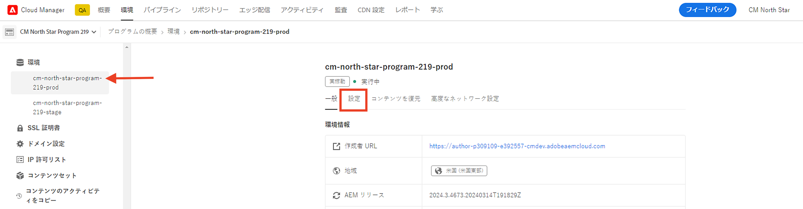
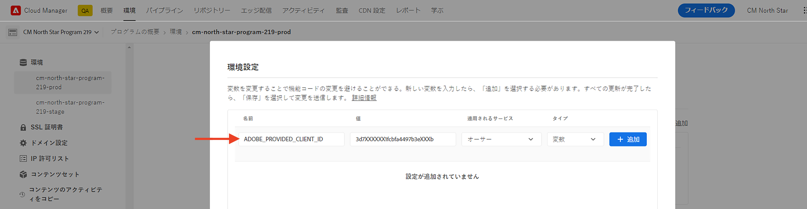

# PIM 統合用のAEM Assetsイベント

>[!IMPORTANT]
>
>このチュートリアルでは、実験的なAEMas a Cloud ServiceAPI を使用します。 これらの API へのアクセス権を取得するには、リリース前のソフトウェア使用許諾契約に同意し、Adobeエンジニアリングによって、お使いの環境でこれらの API を手動で有効にする必要があります。 アクセス権をリクエストするには、「Adobeサポート」にアクセスします。

AEM Assetsを製品情報管理 (PIM) や製品ライン管理 (PLM) システムなどのサードパーティシステムと統合して、アセットのメタデータを更新する方法を説明します。 **ネイティブAEM IO イベントの使用**. AEM Assetsイベントを受け取ると、ビジネス要件に基づいて、AEM、PIM、またはその両方のシステムでアセットメタデータを更新できます。 ただし、この例では、AEMでのアセットメタデータの更新方法を示しています。

>[!VIDEO](https://video.tv.adobe.com/v/3427592?quality=12&learn=on)

アセットメタデータの更新を実行するには **AEM外のコード**、 [Adobe I/O Runtime](https://developer.adobe.com/runtime/docs/guides/overview/what_is_runtime/)を使用しない場合は、サーバーレスプラットフォームが使用されます。

イベント処理フローは次のとおりです。


1. AEM Author サービスは、トリガーと _アセット処理が完了しました_ イベントを送信する必要があります。 処理の完了を待つことで、標準の処理（メタデータの抽出など）が完了しました。
1. イベントが [Adobe I/Oイベント](https://developer.adobe.com/events/) サービス。
1. Adobe I/Oイベントサービスがイベントを [Adobe I/O Runtime Action](https://developer.adobe.com/runtime/docs/guides/using/creating_actions/) を処理するために使用します。
1. Adobe I/O Runtime Action は、PIM システムの API を呼び出して、SKU、サプライヤー情報などの追加のメタデータを取得します。
1. PIM から取得した追加のメタデータは、AEM Assetsで [Assets オーサー API](https://developer.adobe.com/experience-cloud/experience-manager-apis/api/experimental/assets/author/).

## 前提条件

このチュートリアルを完了するには、以下が必要です。

- AEMas a Cloud Service環境 [AEM Eventing enabled](https://developer.adobe.com/experience-cloud/experience-manager-apis/guides/events/#enable-aem-events-on-your-aem-cloud-service-environment). また、サンプル [WKND サイト](https://github.com/adobe/aem-guides-wknd?#aem-wknd-sites-project) プロジェクトをそのプロジェクトにデプロイする必要があります。

- アクセス先 [Adobe Developer Console](https://developer.adobe.com/developer-console/docs/guides/getting-started/).

- [Adobe Developer CLI](https://developer.adobe.com/runtime/docs/guides/tools/cli_install/) をローカルマシンにインストールします。

## 開発手順

大まかな開発手順は次のとおりです。

1. [Adobe Developerコンソール (ADC) でプロジェクトを作成します](./runtime-action.md#Create-project-in-Adobe-Developer-Console)
1. [プロジェクトをローカル開発用に初期化](./runtime-action.md#initialize-project-for-local-development)
1. ADC でプロジェクトを設定
1. ADC プロジェクトの通信を有効にするAEM Author サービスを設定します
1. メタデータの取得と更新を編成するランタイムアクションの開発
1. アセットをAEMオーサーサービスにアップロードし、メタデータが更新されていることを確認します

手順 1 ～ 2 について詳しくは、 [Adobe I/O Runtime Action とAEM Events](./runtime-action.md#) 例、および手順 3～6 については、次の節を参照してください。

### Adobe Developerコンソール (ADC) でプロジェクトを設定

AEM Assetsイベントを受け取り、前の手順で作成したAdobe I/O Runtimeアクションを実行するには、ADC でプロジェクトを設定します。

- ADC で、 [プロジェクト](https://developer.adobe.com/console/projects). を選択します。 `Stage` workspace（ランタイムアクションがデプロイされた場所）。

- 次をクリック： **サービスを追加** ボタンをクリックし、 **イベント** オプション。 Adobe Analytics の **イベントを追加** ダイアログ、選択 **Experience Cloud** > **AEM Assets**&#x200B;をクリックし、 **次へ**. 追加の設定手順に従い、「 AEMCS インスタンス」を選択します。 _アセット処理が完了しました_ イベント、OAuth サーバー間認証タイプ、およびその他の詳細。

  

- 最後に、 **イベントの受信方法** ステップ、展開 **実行時アクション** オプションを選択し、 _汎用_ 前の手順で作成したアクション。 クリック **設定済みイベントを保存**.

  

- 同様に、 **サービスを追加** ボタンをクリックし、 **API** オプション。 Adobe Analytics の **API を追加** モーダルを選択します。 **Experience Cloud** > **AEMas a Cloud ServiceAPI** をクリックします。 **次へ**.

  

- 次に、 **OAuth サーバー間通信** 認証タイプの場合は、をクリックします。 **次へ**.

- 次に、 **AEM Administrators-XXX** 製品プロファイルを選択し、「 **設定済み API を保存**. 問題のアセットを更新するには、選択した製品プロファイルを、イベントの作成元であるAEM Assets環境に関連付け、そこでアセットを更新するための十分なアクセス権を持つ必要があります。

  

### ADC プロジェクトの通信を有効にするAEM Author サービスを設定します

上記の ADC プロジェクトからAEMのアセットメタデータを更新するには、ADC プロジェクトのクライアント ID を使用してAEMオーサーサービスを設定します。 The _クライアント id_ は、 [AdobeCloud Manager](https://experienceleague.adobe.com/docs/experience-manager-cloud-service/content/implementing/using-cloud-manager/environment-variables.html#add-variables) UI

- ログイン先 [AdobeCloud Manager](https://my.cloudmanager.adobe.com/)を選択します。 **プログラム** > **環境** > **省略記号** > **詳細を表示** > **設定** タブをクリックします。

  

- 次に、 **設定を追加** ボタンをクリックし、変数の詳細を次のように入力します。

  | 名前 | 値 | AEM サービス | タイプ |
  | ----------- | ----------- | ----------- | ----------- |
  | ADOBE_PROVIDED_CLIENT_ID | &lt;COPY_FROM_ADC_PROJECT_CREDENTIALS> | オーサー | 変数 |

  

- クリック **追加** および **保存** 設定。

### ランタイムアクションの開発

メタデータの取得と更新を実行するには、まず自動作成された _汎用_ のアクションコード `src/dx-excshell-1/actions/generic` フォルダー。

添付の [WKND-Assets-PIM-Integration.zip](../assets/examples/assets-pim-integration/WKND-Assets-PIM-Integration.zip) ファイルの完全なコードを示し、以下の節ではキーファイルをハイライトします。

- The `src/dx-excshell-1/actions/generic/mockPIMCommunicator.js` ファイルは、PIM API 呼び出しをモックして、SKU や仕入先名などの追加のメタデータを取得します。 このファイルはデモ用に使用されます。 エンドツーエンドのフローが機能したら、この関数を実際の PIM システムへの呼び出しで置き換えて、アセットのメタデータを取得します。

  ```javascript
  /**
   * Mock PIM API to get the product data such as SKU, Supplier, etc.
   *
   * In a real-world scenario, this function would call the PIM API to get the product data.
   * For this example, we are returning mock data.
   *
   * @param {string} assetId - The assetId to get the product data.
   */
  module.exports = {
      async getPIMData(assetId) {
          if (!assetId) {
          throw new Error('Invalid assetId');
          }
          // Mock response data for demo purposes
          const data = {
          SKUID: 'MockSKU 123',
          SupplierName: 'mock-supplier',
          // ... other product data
          };
          return data;
      },
  };
  ```

- The `src/dx-excshell-1/actions/generic/aemCommunicator.js` ファイルを使用してAEMのアセットメタデータを更新します。 [Assets オーサー API](https://developer.adobe.com/experience-cloud/experience-manager-apis/api/experimental/assets/author/).

  ```javascript
  const fetch = require('node-fetch');
  
  ...
  
  /**
  *  Get IMS Access Token using Client Credentials Flow
  *
  * @param {*} clientId - IMS Client ID from ADC project's OAuth Server-to-Server Integration
  * @param {*} clientSecret - IMS Client Secret from ADC project's OAuth Server-to-Server Integration
  * @param {*} scopes - IMS Meta Scopes from ADC project's OAuth Server-to-Server Integration as comma separated strings
  * @returns {string} - Returns the IMS Access Token
  */
  async function getIMSAccessToken(clientId, clientSecret, scopes) {
    const adobeIMSV3TokenEndpointURL = 'https://ims-na1.adobelogin.com/ims/token/v3';
  
    const options = {
      method: 'POST',
      headers: {
        'Content-Type': 'application/x-www-form-urlencoded',
      },
      body: `grant_type=client_credentials&client_id=${clientId}&client_secret=${clientSecret}&scope=${scopes}`,
    };
  
    const response = await fetch(adobeIMSV3TokenEndpointURL, options);
    const responseJSON = await response.json();
  
    return responseJSON.access_token;
  }    
  
  async function updateAEMAssetMetadata(metadataDetails, aemAssetEvent, params) {
    ...
    // Transform the metadata details to JSON Patch format,
    // see https://developer.adobe.com/experience-cloud/experience-manager-apis/api/experimental/assets/author/#operation/patchAssetMetadata
    const transformedMetadata = Object.keys(metadataDetails).map((key) => ({
      op: 'add',
      path: `wknd-${key.toLowerCase()}`,
      value: metadataDetails[key],
    }));
  
    ...
  
    // Get ADC project's OAuth Server-to-Server Integration credentials
    const clientId = params.ADC_CECREDENTIALS_CLIENTID;
    const clientSecret = params.ADC_CECREDENTIALS_CLIENTSECRET;
    const scopes = params.ADC_CECREDENTIALS_METASCOPES;
  
    // Get IMS Access Token using Client Credentials Flow
    const access_token = await getIMSAccessToken(clientId, clientSecret, scopes);
  
    // Call AEM Author service to update the metadata using Assets Author API
    // See https://developer.adobe.com/experience-cloud/experience-manager-apis/api/experimental/assets/author/
    const res = await fetch(`${aemAuthorHost}/adobe/assets/${assetId}/metadata`, {
      method: 'PATCH',
      headers: {
        'Content-Type': 'application/json-patch+json',
        'If-Match': '*',
        'X-Adobe-Accept-Experimental': '1',
        'X-Api-Key': 'aem-assets-management-api', // temporary value
        Authorization: `Bearer ${access_token}`,
      },
      body: JSON.stringify(transformedMetadata),
    });
  
    ...
  }
  
  module.exports = { updateAEMAssetMetadata };
  ```

  The `.env` ファイルは、ADC プロジェクトの OAuth サーバー間資格情報の詳細を格納し、これらはを使用してアクションにパラメーターとして渡されます。 `ext.config.yaml` ファイル。 詳しくは、 [App Builder 設定ファイル](https://developer.adobe.com/app-builder/docs/guides/configuration/) 秘密鍵とアクションパラメーターの管理に使用します。

- The `src/dx-excshell-1/actions/model` フォルダーの内容 `aemAssetEvent.js` および `errors.js` ファイル。アクションが受け取ったイベントを解析し、エラーを処理するために使用されます。

- The `src/dx-excshell-1/actions/generic/index.js` ファイルでは、前述のモジュールを使用して、メタデータの取得と更新を調整します。

  ```javascript
  ...
  
  let responseMsg;
  // handle the challenge probe request, they are sent by I/O to verify the action is valid
  if (params.challenge) {
    logger.info('Challenge probe request detected');
    responseMsg = JSON.stringify({ challenge: params.challenge });
  } else {
    logger.info('AEM Asset Event request received');
  
    // create AEM Asset Event object from request parameters
    const aemAssetEvent = new AEMAssetEvent(params);
  
    // Call mock PIM API to get the product data such as SKU, Supplier, etc.
    const mockPIMData = await mockPIMAPI.getPIMData(
      aemAssetEvent.getAssetName(),
    );
    logger.info('Mock PIM API response', mockPIMData);
  
    // Update PIM received data in AEM as Asset metadata
    const aemUpdateStatus = await updateAEMAssetMetadata(
      mockPIMData,
      aemAssetEvent,
      params,
    );
    logger.info('AEM Asset metadata update status', aemUpdateStatus);
  
    if (aemUpdateStatus) {
      // create response message
      responseMsg = JSON.stringify({
        message:
          'AEM Asset Event processed successfully, updated the asset metadata with PIM data.',
        assetdata: {
          assetName: aemAssetEvent.getAssetName(),
          assetPath: aemAssetEvent.getAssetPath(),
          assetId: aemAssetEvent.getAssetId(),
          aemHost: aemAssetEvent.getAEMHost(),
          pimdata: mockPIMData,
        },
      });
    } 
  
    // response object
    const response = {
      statusCode: 200,
      body: responseMsg,
    };
  
    // Return the response to the caller
    return response;
  
    ...
  }
  ```

次のコマンドを使用して、更新したアクションをAdobe I/O Runtimeにデプロイします。

```bash
$ aio app deploy
```

### アセットのアップロードとメタデータの検証

AEM Assetsと PIM の統合を検証するには、次の手順に従います。

- モック PIM で提供された SKU や仕入先名などのメタデータを表示するには、 AEM Assetsでメタデータスキーマを作成します。詳しくは、 [メタデータスキーマ](https://experienceleague.adobe.com/docs/experience-manager-learn/assets/configuring/metadata-schemas.html) SKU と仕入先名のメタデータプロパティを表示します。

- AEMオーサーサービスでアセットをアップロードし、メタデータの更新を検証します。

  

## 概念と重要な留意点

AEMと、PIM などの他のシステムとの間でアセットメタデータを同期する必要が生じる場合が多くあります。 AEM Eventing を使用すると、このような要件を満たすことができます。

- アセットメタデータ取得コードはAEMの外部で実行されるので、AEMオーサーサービスの負荷を回避できるので、独立して拡張できるイベント駆動型アーキテクチャです。
- 新しく導入された Assets オーサー API は、AEMのアセットメタデータの更新に使用されます。
- API 認証では、OAuth サーバー間（別名クライアント資格情報フロー）を使用します。詳しくは、 [OAuth サーバー間秘密鍵証明書実装ガイド](https://developer.adobe.com/developer-console/docs/guides/authentication/ServerToServerAuthentication/implementation/).
- Adobe I/O Runtime Actions の代わりに、他の Web フックまたはAmazon EventBridge を使用して、AEM Assetsイベントを受け取り、メタデータの更新を処理できます。
- AEM Eventing を通じたアセットイベントは、ビジネスが重要なプロセスを自動化および合理化し、コンテンツエコシステム全体の効率性と一貫性を促進する力を提供します。

