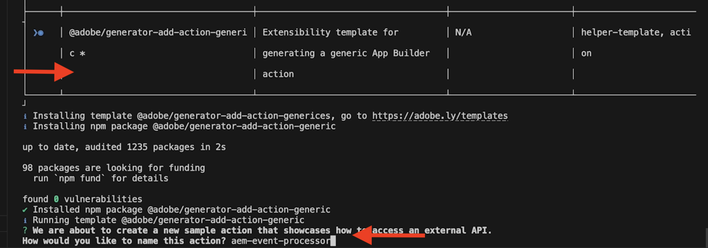

# Adobe I/O Runtime Action を使用したAEM Events 処理

次を使用して受け取ったAEMイベントを処理する方法を説明します。 [Adobe I/O Runtime](https://developer.adobe.com/runtime/docs/guides/overview/what_is_runtime/) アクション。 この例は、前の例を強化します [Adobe I/O Runtime Action とAEM Events](runtime-action.md)を使用する場合は、この操作を続行する前に、入力が完了していることを確認してください。

>[!VIDEO](https://video.tv.adobe.com/v/3427054?quality=12&learn=on)

この例では、イベント処理によって元のイベントデータと受信したイベントがアクティビティメッセージとしてAdobe I/O Runtimeストレージに保存されます。 ただし、イベントが _コンテンツフラグメントが変更されました_ タイプを入力すると、AEMオーサーサービスも呼び出して変更の詳細を検索します。 最後に、イベントの詳細が単一ページアプリケーション (SPA) に表示されます。

## 前提条件

このチュートリアルを完了するには、以下が必要です。

- AEMas a Cloud Service環境 [AEM Eventing enabled](https://developer.adobe.com/experience-cloud/experience-manager-apis/guides/events/#enable-aem-events-on-your-aem-cloud-service-environment). また、サンプル [WKND サイト](https://github.com/adobe/aem-guides-wknd?#aem-wknd-sites-project) プロジェクトをそのプロジェクトにデプロイする必要があります。

- アクセス先 [Adobe Developer Console](https://developer.adobe.com/developer-console/docs/guides/getting-started/).

- [Adobe Developer CLI](https://developer.adobe.com/runtime/docs/guides/tools/cli_install/) をローカルマシンにインストールします。

- 前の例からローカルに初期化されたプロジェクト [Adobe I/O Runtime Action とAEM Events](./runtime-action.md#initialize-project-for-local-development).


## AEM Events プロセッサーアクション

この例では、イベントプロセッサー [アクション](https://developer.adobe.com/runtime/docs/guides/using/creating_actions/) は次のタスクを実行します。

- 受信したイベントを解析してアクティビティメッセージにします。
- 受け取ったイベントが _コンテンツフラグメントが変更されました_ 「 」と入力し、AEMオーサーサービスにコールバックして変更の詳細を見つけます。
- 元のイベントデータ、アクティビティメッセージおよび変更の詳細（存在する場合）をAdobe I/O Runtimeストレージに保持します。

上記のタスクを実行するには、まず、プロジェクトにアクションを追加し、JavaScript モジュールを開発して上記のタスクを実行し、最後に、開発されたモジュールを使用するようにアクションコードを更新します。

添付の [WKND-AEM-Eventing-Runtime-Action.zip](../assets/examples/event-processing-using-runtime-action/WKND-AEM-Eventing-Runtime-Action.zip) ファイルの完全なコードを示し、以下の節ではキーファイルをハイライトします。

### アクションを追加

- アクションを追加するには、次のコマンドを実行します。

  ```bash
  aio app add action
  ```

- 選択 `@adobe/generator-add-action-generic` アクションテンプレートとして、アクションに「 」と名前を付けます。 `aem-event-processor`.

  

### JavaScript モジュールの開発

上記のタスクを実行するには、次の JavaScript モジュールを開発します。

- The `src/dx-excshell-1/actions/aem-event-processor/eventValidator.js` モジュールは、受信したイベントが _コンテンツフラグメントが変更されました_ タイプ。

  ```javascript
  async function needsAEMCallback(aemEvent) {
  // create a Logger
  const logger = Core.Logger('eventValidator', {
      level: 'info',
  });
  
  let isValid = false;
  
  // verify the event is a Content Fragment Modified event
  if (
      aemEvent
      && aemEvent.ContentType === 'contentFragment'
      && aemEvent.EventName === 'modified'
  ) {
      logger.info('Processing Content Fragment Modified Event');
      isValid = true;
  }
  
  return isValid;
  }
  
  module.exports = needsAEMCallback;
  ```

- The `src/dx-excshell-1/actions/aem-event-processor/loadEventDetailsFromAEM.js` モジュールはAEMオーサーサービスを呼び出して変更の詳細を見つけます。

  ```javascript
  ...
  const auth = require('@adobe/jwt-auth');
  ...
  // Get AEM Service Credentials aka Technical Account details.
  // These are passed to the action as params and added in .env file.
  const clientId = params.AEM_SERVICECREDENTIALS_TECHNICALACCOUNT_CLIENTID;
  const technicalAccountId = params.AEM_SERVICECREDENTIALS_ID;
  const orgId = params.AEM_SERVICECREDENTIALS_ORG;
  const clientSecret = params.AEM_SERVICECREDENTIALS_TECHNICALACCOUNT_CLIENTSECRET;
  // Private key is passed as a string with \n and \r characters escaped.
  const privateKey = params.AEM_SERVICECREDENTIALS_PRIVATEKEY.replace(
      /\\n/g,
      '\n',
  ).replace(/\\r/g, '\r');
  const metaScopes = params.AEM_SERVICECREDENTIALS_METASCOPES.split(',');
  const ims = `https://${params.AEM_SERVICECREDENTIALS_IMSENDPOINT}`;
  
  // Get the access token from IMS using Adobe I/O SDK
  const { access_token } = await auth({
      clientId,
      technicalAccountId,
      orgId,
      clientSecret,
      privateKey,
      metaScopes,
      ims,
  });
  ...
  // Call AEM Author service to get the CF details using AEM Assets API
  const res = await fetch(
      `${aemAuthorHost}${cfPath.replace('/content/dam/', '/api/assets/')}.json`,
  {
    method: 'GET',
    headers: {
      'Content-Type': 'application/json',
      Authorization: `Bearer ${access_token}`,
    },
  },
  );
  
  let newValuesOfCFPropertiesAddedOrModified = {};
  // If the response is OK, get the values of the CF properties that were added or modified
  if (res.ok) {
      logger.info('AEM Event Details loaded from AEM Author instance');
      const responseJSON = await res.json();
  
      // Get the values of the CF properties that were added or modified
      if (
      responseJSON
      && responseJSON.properties
      && responseJSON.properties.elements
      ) {
      const allCurrentCFProperties = responseJSON.properties.elements;
  
      newValuesOfCFPropertiesAddedOrModified = cfPropertiesAddedOrModified.map(
          (key) => ({
          key,
          value: allCurrentCFProperties[key],
          }),
      );
      }    
  }
  ...
  ```

  参照： [AEM Service 資格情報チュートリアル](https://experienceleague.adobe.com/docs/experience-manager-learn/getting-started-with-aem-headless/authentication/service-credentials.html?lang=en) 詳しくは、こちらを参照してください。 また、 [App Builder 設定ファイル](https://developer.adobe.com/app-builder/docs/guides/configuration/) 秘密鍵とアクションパラメーターの管理に使用します。

- The `src/dx-excshell-1/actions/aem-event-processor/storeEventData.js` モジュールは、元のイベントデータ、アクティビティメッセージおよび変更の詳細（存在する場合）をAdobe I/O Runtimeストレージに保存します。

  ```javascript
  ...
  const filesLib = require('@adobe/aio-lib-files');
  ...
  
  const files = await filesLib.init();
  
  const eventDataAsJSON = JSON.stringify({
      activity: activityMessage,
      aemEvent,
      aemEventDetails,
  });
  
  // store details in a folder named YYYY-MM-DD and a file named <eventID>.json
  const bytesWritten = await files.write(
      `${formattedDate}/${aemEvent.getEventID()}.json`,
      eventDataAsJSON,
  );
  ...
  ```

### アクションコードを更新

最後に、次の場所でアクションコードを更新します。 `src/dx-excshell-1/actions/aem-event-processor/index.js` を使用して開発済みモジュールを使用する。

```javascript
...
// handle the challenge probe request, they are sent by I/O to verify the action is valid
if (params.challenge) {
    logger.info('Challenge probe request detected');
    responseMsg = JSON.stringify({ challenge: params.challenge });
} else {
    logger.info('AEM Event request received');

    // create AEM Event object from request parameters
    const aemEvent = new AEMEvent(params);

    // get AEM Event as activity message using the helper method
    const activityMessage = aemEvent.getEventAsActivityMessage();

    // determine if AEM Event requires callback to AEM Author service
    const callbackAEMForEventDetails = await needsAEMCallback(aemEvent);

    let eventDetails = {};
    if (callbackAEMForEventDetails) {
    // call AEM Author service to get specifics about the event
    eventDetails = await loadEventDetailsFromAEMAuthorService(
        aemEvent,
        params,
    );
    }

    // store AEM Event and Event details in the file system
    const storageDetails = await storeEventData(
    activityMessage,
    aemEvent,
    eventDetails || {},
    );
    logger.info(`Storage details: ${JSON.stringify(storageDetails)}`);

    // create response message
    responseMsg = JSON.stringify({
    message: 'AEM Event processed',
    activityMessage,
    });

    // response object
    const response = {
    statusCode: 200,
    body: responseMsg,
    };
    logger.info('Adobe I/O Runtime action response', response);

    // Return the response to the caller
    return response;
}
...
```

## その他のリソース

- The `src/dx-excshell-1/actions/model` フォルダーの内容 `aemEvent.js` および `errors.js` ファイル。アクションが受け取ったイベントを解析し、エラーを処理するために使用されます。
- The `src/dx-excshell-1/actions/load-processed-aem-events` フォルダーにはアクションコードが含まれています。このアクションは、SPAがAdobe I/O Runtimeストレージから処理済みのAEMイベントを読み込むために使用します。
- The `src/dx-excshell-1/web-src` フォルダーには、処理されたAEMイベントを表示するSPAコードが含まれます。
- The `src/dx-excshell-1/ext.config.yaml` ファイルには、アクションの設定とパラメーターが含まれています。

## 概念と重要な留意点

イベント処理の要件は、プロジェクトによって異なりますが、この例で重要なポイントは次のとおりです。

- イベントの処理は、 Adobe I/O Runtime Action を使用しておこなうことができます。
- Runtime Action は、内部アプリケーション、サードパーティソリューション、Adobeソリューションなどのシステムと通信できます。
- ランタイムアクションは、コンテンツの変更に関連して設計されたビジネスプロセスのエントリポイントとなります。


