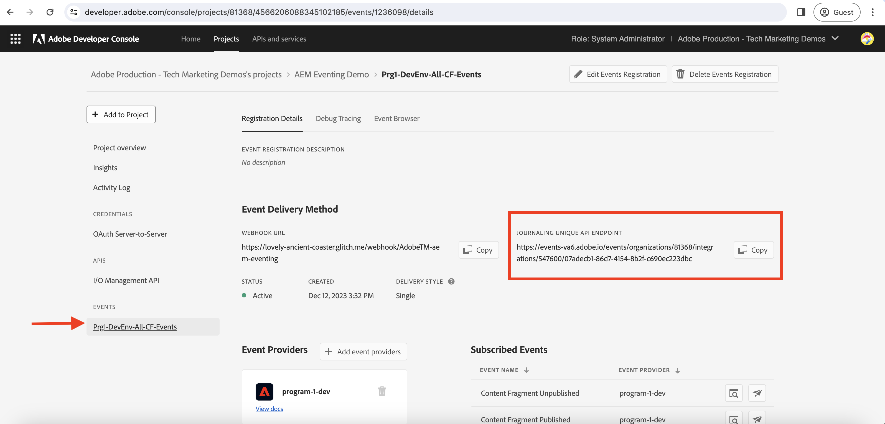
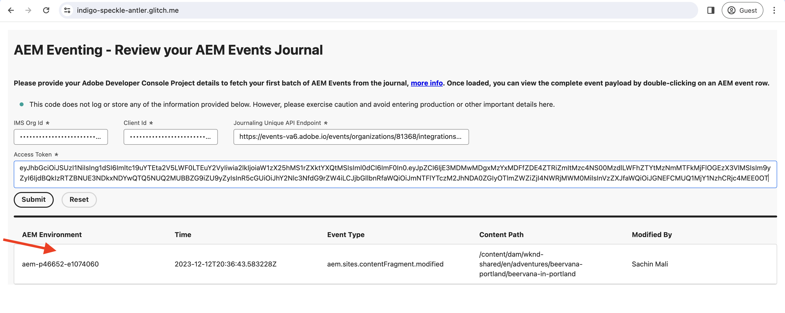

# ジャーナル処理と AEM イベント

ジャーナルから AEM イベントの初期セットを取得し、各イベントの詳細を調べる方法について説明します。

>[!VIDEO](https://video.tv.adobe.com/v/3427052?quality=12&learn=on)

ジャーナル処理は、AEM イベントを使用するプルメソッド、ジャーナルはイベントの順序付きリストです。Adobe I/O Events Journaling API を使用すると、ジャーナルから AEM イベントを取得して、アプリケーションで処理できます。このアプローチでは、指定したサイクルに基づいてイベントを管理し、それらを一括で効率的に処理できます。保持期間やページネーションなどの重要な考慮事項を含む、詳細なインサイトついては、[ジャーナル処理](https://developer.adobe.com/events/docs/guides/journaling_intro/)を参照してください。

Adobe Developer Console プロジェクト内では、ジャーナル処理に対してすべてのイベント登録が自動的に有効になり、シームレスな統合が可能になります。

>[!IMPORTANT]
>
>このチュートリアルのライブデモエンドポイントは、以前 [Glitch](https://glitch.com/) でホストされていました。 2025 年 7 月をもって、Glitch はホスティングサービスを廃止し、エンドポイントにアクセスできなくなりました。
>アドビでは、デモを代替プラットフォームに移行する取り組みを積極的に進めています。 チュートリアルのコンテンツは引き続き正確で、更新されたリンクはすぐに提供されます。
>ご理解とご辛抱をお願いいたします。

ライブデモエンドポイントが再び使用可能になるまで、独自のアプリケーションを使用します。

## 前提条件

このチュートリアルを完了するには、次が必要になります。

- [AEM イベント処理が有効](https://developer.adobe.com/experience-cloud/experience-manager-apis/guides/events/#enable-aem-events-on-your-aem-cloud-service-environment)になっている AEM as a Cloud Service 環境。

- [AEM イベント用に設定された Adobe Developer Console プロジェクト](https://developer.adobe.com/experience-cloud/experience-manager-apis/guides/events/#how-to-subscribe-to-aem-events-in-the-adobe-developer-console)。

## Web アプリケーションへのアクセス

アドビ提供の web アプリケーションにアクセスするには、次の手順に従います。

- 新しいブラウザータブで [Glitch：ホスト型 web アプリケーション](https://indigo-speckle-antler.glitch.me/)にアクセスできることを確認します。

  

## Adobe Developer Console プロジェクトの詳細の収集

ジャーナルから AEM イベントを取得するには、_IMS 組織 ID_、_クライアント ID_、_アクセストークン_&#x200B;などの資格情報が必要です。これらの資格情報を収集するには、次の手順に従います。

- [Adobe Developer Console](https://developer.adobe.com) でプロジェクトに移動し、クリックして開きます。

- 「**資格情報**」セクションで、「**OAuth サーバー間**」リンクをクリックして「**資格情報の詳細**」タブを開きます。

- 「**アクセストークンを生成**」ボタンをクリックして、アクセストークンを生成します。

  

- **生成されたアクセストークン**、**クライアント ID** および&#x200B;**組織 ID** をコピーします。これらは、このチュートリアルで後ほど必要になります。

  

- すべてのイベント登録は、ジャーナル処理に対して自動的に有効になっています。イベント登録の&#x200B;_一意のジャーナル処理 API エンドポイント_&#x200B;を取得するには、AEM イベントをサブスクライブしているイベントカードをクリックします。「**登録の詳細**」タブから、**ジャーナル処理の一意の API エンドポイント**&#x200B;をコピーします。

  

## AEM イベントジャーナルの読み込み

話を簡単にするために、このホスト型 web アプリケーションは、ジャーナルから AEM イベントの最初のバッチのみを取得します。これらは、ジャーナルで使用可能な最も古いイベントです。詳しくは、[イベントの最初のバッチ](https://developer.adobe.com/events/docs/guides/api/journaling_api/#fetching-your-first-batch-of-events-from-the-journal)を参照してください。

- [Glitch のホストされた web アプリケーション](https://indigo-speckle-antler.glitch.me/)で、Adobe Developer Console プロジェクトからコピーした **IMS 組織 ID**、**クライアント ID** および&#x200B;**アクセストークン**&#x200B;を入力し、「**送信**」をクリックします。

- 成功すると、テーブルコンポーネントに AEM イベントジャーナルデータが表示されます。

  

- イベントペイロード全体を表示するには、行をダブルクリックします。Web フックでイベントを処理するために必要な情報がすべて AEM イベントの詳細に含まれていることがわかります。例えば、イベントタイプ（`type`）、イベントソース（`source`）、イベント ID（`event_id`）、イベント時刻（`time`）、イベントデータ（`data`）が表示されています。

  

## その他のリソース

- [Adobe I/O Events Journaling API](https://developer.adobe.com/events/docs/guides/api/journaling_api/) は、イベントの最初、次、最後のバッチやページネーションなど、API に関する詳細情報を提供します。
