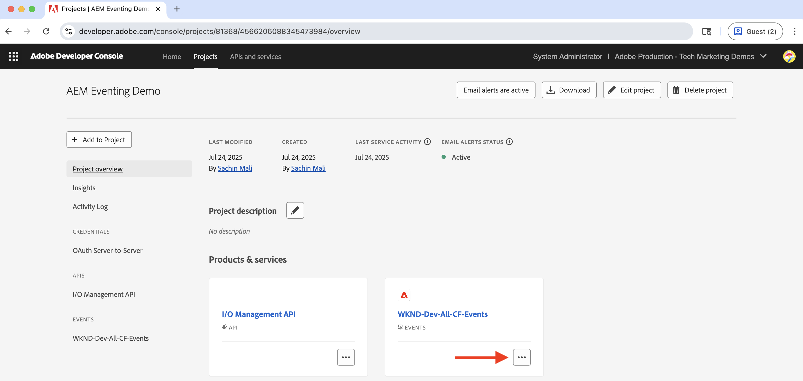

# Web フックと AEM イベント

Web フックで AEM イベントを受け取り、イベントの詳細（ペイロード、ヘッダー、メタデータなど）を確認する方法を学びます。


>[!VIDEO](https://video.tv.adobe.com/v/3449749?quality=12&learn=on&captions=jpn)


>[!IMPORTANT]
>
>このビデオは、グリッチがホストする Webhook エンドポイントを参照します。 Glitch がホスティングサービスを廃止したため、Webhook は Azure App Service に移行されました。
>
>機能は同じままです。ホスティングプラットフォームのみが変更されました。


Adobeが提供するサンプル Webhook を使用する代わりに、独自の Webhook エンドポイントを使用してAEM イベントを受け取ることもできます。

## 前提条件

このチュートリアルを完了するには、次が必要になります。

- [AEM イベント処理が有効](https://developer.adobe.com/experience-cloud/experience-manager-apis/guides/events/#enable-aem-events-on-your-aem-cloud-service-environment)になっている AEM as a Cloud Service環境。

- [AEM イベント用に設定された Adobe Developer Console プロジェクト](https://developer.adobe.com/experience-cloud/experience-manager-apis/guides/events/#how-to-subscribe-to-aem-events-in-the-adobe-developer-console)。


## Web フックにアクセス

Adobeが提供するサンプル Webhook にアクセスするには、次の手順に従います。

- 新しいブラウザータブで [Adobeが提供するサンプル Webhook](https://aemeventing-webhook.azurewebsites.net/) にアクセスできることを確認します。

  

- Web フックに一意の名前（例：`<YOUR_PETS_NAME>-aem-eventing`）を入力し、「**Connect**」をクリックします。「`Connected to: ${YOUR-WEBHOOK-URL}`」というメッセージが画面に表示されます。

  

- **Web フック URL** をメモします。この情報は、このチュートリアルの後半で必要になります。

## Adobe Developer Console プロジェクトでの web フックの設定

上記の web フック URL で AEM イベントを受け取るには、次の手順に従います。

- [Adobe Developer Console](https://developer.adobe.com) でプロジェクトに移動し、クリックして開きます。

- 「**製品とサービス**」セクションで、AEM イベントを web フックに送信するイベントカードの横にある省略記号 `...` をクリックして、「**編集**」を選択します。

  

- 新しく開かれた&#x200B;**イベント登録の設定**&#x200B;ダイアログで、「**次へ**」をクリックして&#x200B;**イベントの受信方法**&#x200B;の手順に進みます。

  

- **イベントの受け取り方法** ステップで、「**Webhook**」オプションを選択し、Adobeが提供するサンプル Webhook から以前にコピーした **Webhook URL** を貼り付けて、「**設定済みのイベントを保存**」をクリックします。

  

- Adobeが提供するサンプル Webhook ページにGET リクエストが表示されます。これは、Webhook URL を検証するためにAdobe I/O Eventsから送信されるチャレンジリクエストです。

  


## AEM イベントをトリガー

上記の Adobe Developer Console プロジェクトで登録した AEM as a Cloud Service 環境から AEM イベントをトリガーするには、次の手順に従います。

- [Cloud Manager](https://my.cloudmanager.adobe.com/) から AEM as a Cloud Service オーサー環境にアクセスし、ログインします。

- **購読しているイベント**&#x200B;に応じて、コンテンツフラグメントの作成、更新、削除、公開、非公開を行います。

## イベントの詳細を確認

上記の手順を完了すると、AEM イベントが web フックに配信されているのを確認できます。Adobeが提供するサンプル Webhook ページで POST リクエストを探します。


POST リクエストの主な詳細を次に示します。

- path：`/webhook/${YOUR-WEBHOOK-URL}`（例：`/webhook/AdobeTM-aem-eventing`）

- headers：Adobe I/O イベントによって送信されるリクエストヘッダー。次に例を示します。

```json
{
  "host": "aemeventing-webhook.azurewebsites.net",
  "user-agent": "Adobe/1.0",
  "accept-encoding": "deflate,compress,identity",
  "max-forwards": "10",
  "x-adobe-public-key2-path": "/prod/keys/pub-key-kruhWwu4Or.pem",
  "x-adobe-delivery-id": "25c36f70-9238-4e4c-b1d8-4d9a592fed9d",
  "x-adobe-provider": "aemsites_7ABB3E6A5A7491460A495D61@AdobeOrg_acct-aem-p63947-e1249010@adobe.com",
  "x-adobe-public-key1-path": "/prod/keys/pub-key-lyTiz3gQe4.pem",
  "x-adobe-event-id": "b555a1b1-935b-4541-b410-1915775338b5",
  "x-adobe-event-code": "aem.sites.contentFragment.modified",
  "x-adobe-digital-signature-2": "Lvw8+txbQif/omgOamJXJaJdJMLDH5BmPA+/RRLhKG2LZJYWKiomAE9DqKhM349F8QMdDq6FXJI0vJGdk0FGYQa6JMrU+LK+1fGhBpO98LaJOdvfUQGG/6vq8/uJlcaQ66tuVu1xwH232VwrQOKdcobE9Pztm6UX0J11Uc7vtoojUzsuekclKEDTQx5vwBIYK12bXTI9yLRsv0unBZfNRrV0O4N7KA9SRJFIefn7hZdxyYy7IjMdsoswG36E/sDOgcnW3FVM+rhuyWEizOd2AiqgeZudBKAj8ZPptv+6rZQSABbG4imOa5C3t85N6JOwffAAzP6qs7ghRID89OZwCg==",
  "x-adobe-digital-signature-1": "ZQywLY1Gp/MC/sXzxMvnevhnai3ZG/GaO4ThSGINIpiA/RM47ssAw99KDCy1loxQyovllEmN0ifAwfErQGwDa5cuJYEoreX83+CxqvccSMYUPb5JNDrBkG6W0CmJg6xMeFeo8aoFbePvRkkDOHdz6nT0kgJ70x6mMKgCBM+oUHWG13MVU3YOmU92CJTzn4hiSK8o91/f2aIdfIui/FDp8U20cSKKMWpCu25gMmESorJehe4HVqxLgRwKJHLTqQyw6Ltwy2PdE0guTAYjhDq6AUd/8Fo0ORCY+PsS/lNxim9E9vTRHS7TmRuHf7dpkyFwNZA6Au4GWHHS87mZSHNnow==",
  "x-arr-log-id": "881073f0-7185-4812-9f17-4db69faf2b68",
  "client-ip": "52.37.214.82:46066",
  "disguised-host": "aemeventing-webhook.azurewebsites.net",
  "x-site-deployment-id": "aemeventing-webhook",
  "was-default-hostname": "aemeventing-webhook.azurewebsites.net",
  "x-forwarded-proto": "https",
  "x-appservice-proto": "https",
  "x-arr-ssl": "2048|256|CN=Microsoft Azure RSA TLS Issuing CA 03, O=Microsoft Corporation, C=US|CN=*.azurewebsites.net, O=Microsoft Corporation, L=Redmond, S=WA, C=US",
  "x-forwarded-tlsversion": "1.3",
  "x-forwarded-for": "52.37.214.82:46066",
  "x-original-url": "/webhook/AdobeTechMarketing-aem-eventing",
  "x-waws-unencoded-url": "/webhook/AdobeTechMarketing-aem-eventing",
  "x-client-ip": "52.37.214.82",
  "x-client-port": "46066",
  "content-type": "application/cloudevents+json; charset=UTF-8",
  "content-length": "1178"
}
```

- 本文／ペイロード：Adobe I/O Events から送信されるリクエスト本文。次に例を示します。

```json
{
  "specversion": "1.0",
  "id": "83b0eac0-56d6-4499-afa6-4dc58ff6ac7f",
  "source": "acct:aem-p63947-e1249010@adobe.com",
  "type": "aem.sites.contentFragment.modified",
  "datacontenttype": "application/json",
  "dataschema": "https://ns.adobe.com/xdm/aem/sites/events/content-fragment-modified.json",
  "time": "2025-07-24T13:53:23.994109827Z",
  "eventid": "b555a1b1-935b-4541-b410-1915775338b5",
  "event_id": "b555a1b1-935b-4541-b410-1915775338b5",
  "recipient_client_id": "606d4074c7ea4962aaf3bc2a5ac3b7f9",
  "recipientclientid": "606d4074c7ea4962aaf3bc2a5ac3b7f9",
  "data": {
    "user": {
      "imsUserId": "ims-933E1F8A631CAA0F0A495E53@80761f6e631c0c7d495fb3.e",
      "principalId": "xx@adobe.com",
      "displayName": "Sachin Mali"
    },
    "path": "/content/dam/wknd-shared/en/adventures/beervana-portland/beervana-in-portland",
    "sourceUrl": "https://author-p63947-e1249010.adobeaemcloud.com",
    "model": {
      "id": "L2NvbmYvd2tuZC1zaGFyZWQvc2V0dGluZ3MvZGFtL2NmbS9tb2RlbHMvYWR2ZW50dXJl",
      "path": "/conf/wknd-shared/settings/dam/cfm/models/adventure"
    },
    "id": "9e1e9835-64c8-42dc-9d36-fbd59e28f753",
    "tags": [
      "wknd-shared:region/nam/united-states",
      "wknd-shared:activity/social",
      "wknd-shared:season/fall"
    ],
    "properties": [
      {
        "name": "price",
        "changeType": "modified"
      }
    ]
  }
}
```

Web フックでイベントを処理するために必要な情報がすべて AEM イベントの詳細に含まれていることがわかります。例えば、イベントタイプ（`type`）、イベントソース（`source`）、イベント ID（`event_id`）、イベント時刻（`time`）およびイベントデータ（`data`）などです。

## その他のリソース

- [AEM - イベント Webhook](../assets/examples/webhook/aemeventing-webhook.tgz) のソースコードは、参照用に利用できます。
