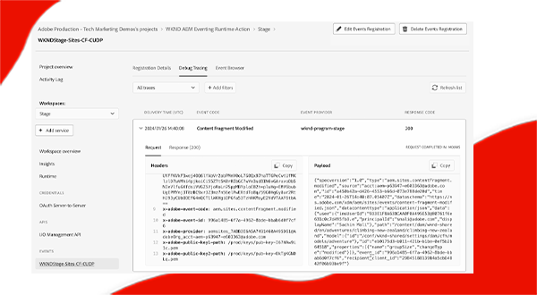

# AEM イベンティング

AEM イベンティング、その概要、使用する理由、タイミング、その例について説明します。

>[!VIDEO](https://video.tv.adobe.com/v/3426686?quality=12&learn=on)

>[!IMPORTANT]
>
>AEM as a Cloud Serviceイベンティングは、プレリリースモードで登録のユーザーのみが使用できます。 AEM as a Cloud Service 環境で AEM イベンティングを有効にするには、[AEM-イベンティングチーム](mailto:grp-aem-events@adobe.com)に連絡します。

## 内容

AEM イベンティングは、AEM イベントのサブスクリプションを外部システムで処理できるようにする、クラウドネイティブのイベンティングシステムです。AEM イベントは、特定のアクションが発生するたびに AEM によって送信される状態変更通知です。例えば、コンテンツフラグメントが作成、更新または削除されたときのイベントを含めることができます。

上の図では、AEM as a Cloud Service がイベントを生成して Adobe I/O イベントに送信する方法を視覚化し、イベントサブスクライバーに公開する様子を示しています。

要約すると、主要なコンポーネント次の 3 つです。

1. **イベントプロバイダー：** AEM as a Cloud Service。
1. **Adobe I/O イベント：**&#x200B;アドビ製品およびテクノロジーに基づいてアプリとエクスペリエンスを統合、拡張および構築するための開発者プラットフォーム。
1. **イベントコンシューマー：** AEM イベントを購読する顧客が所有するシステム。例えば、CRM（顧客関係管理）、PIM（製品情報管理）、OMS（受注管理システム）、カスタムアプリケーションなど。

### 相違点

[Apache Sling イベンティング](https://sling.apache.org/documentation/bundles/apache-sling-eventing-and-job-handling.html)、OSGi イベンティング、[JCR 監視](https://jackrabbit.apache.org/oak/docs/features/observation.html)はすべて、イベントを購読して処理するメカニズムを提供します。ただし、これらは本ドキュメントで説明する AEM イベンティングとは異なります。

AEM イベンティングの主な特徴は次のとおりです。

- イベントコンシューマーコードは AEM の外部で実行され、AEM と同じ JVM 内では実行されません。
- AEM 製品コードは、イベントを定義し、Adobe I/O イベントに送信します。
- イベント情報は標準化され、JSON 形式で送信されます。詳しくは、[cloudevents](https://cloudevents.io/) を参照してください。
- イベントコンシューマーは、AEM への返信に、AEM as a Cloud Service API を使用します。

## AEM イベンティングを使用する理由とタイミング

AEM イベンティングは、システムアーキテクチャと運用効率に多くの利点を提供します。AEM イベンティングを使用する主な理由は次のとおりです。

- **イベントドリブンアーキテクチャの構築**：個別に拡張でき、障害に強い疎結合システムの作成を促します。
- **低コード化と運用コストの削減**：AEM 内でカスタマイズが行われるのを防ぐことで、システムの保守と拡張を容易にして運用コストを削減します。
- **AEM と外部システム間の通信をシンプル化**：特定のシステムやサービスに配信する AEM イベントを決定するなど、Adobe I/O イベントがコミュニケーションを管理することで、ポイントツーポイント接続を排除します。
- **イベントの耐久性の向上**：Adobe I/O イベントは、高い可用性と拡張性を備えたシステムで、大量のイベントを処理し、サブスクライバーに確実に配信するように設計されています。
- **イベントの並列処理**：複数のサブスクライバーへと同時にイベントを配信し、様々なシステム間でイベント処理を分散させることができます。
- **サーバーレスアプリケーションの開発**：イベントコンシューマーコードのサーバーレスアプリケーションとしてのデプロイをサポートし、システムの柔軟性とスケーラビリティをさらに強化します。

### 制限事項

AEM イベンティングは強力な機能ですが、考慮すべき制限があります。

- **可用性は AEM as a Cloud Service に限定**：現在、AEM イベンティングは AEM as a Cloud Service でのみ利用可能です。
- **イベントのサポートが限定的**：現時点では、AEM コンテンツフラグメントイベントのみがサポートされています。ただし、今後、さらに多くのイベントが追加されるにつれ、範囲は拡大すると予想されます。

## 有効にする方法

AEM イベンティングは、AEM as a Cloud Service 環境ごとに有効化され、プレリリースモードの環境でのみ使用できます。AEM イベンティングを使用して AEM 環境を有効にするには、[AEM-イベンティングチーム](mailto:grp-aem-events@adobe.com)にお問い合わせください。

既に有効になっている場合は、[AEM Cloud Service 環境での AEM イベントの有効化](https://developer.adobe.com/experience-cloud/experience-manager-apis/guides/events/#enable-aem-events-on-your-aem-cloud-service-environment)を参照して、次の手順に進んでください。

## サブスクライブ方法

AEM イベントをサブスクライブするには、AEM でコードを記述する必要はなく、代わりに [Adobe Developer Console](https://developer.adobe.com/) プロジェクトを設定します。Adobe Developer Console は、Adobe API、SDK、イベント、ランタイムおよび App Builder へのゲートウェイとなります。

この場合、Adobe Developer Console の&#x200B;_プロジェクト_&#x200B;により、AEM as a Cloud Service 環境から送信されたイベントをサブスクライブし、外部システムへのイベント配信を設定できます。

詳しくは、[Adobe Developer Console で AEM イベントをサブスクライブする方法](https://developer.adobe.com/experience-cloud/experience-manager-apis/guides/events/#how-to-subscribe-to-aem-events-in-the-adobe-developer-console)を参照してください。

## 使用方法

AEM イベントを使用する主な手法としては、_プッシュ_&#x200B;と&#x200B;_プル_&#x200B;の 2 つの手法があります。

- **プッシュ手法**：このアプローチでは、イベントが利用可能になると、イベントコンシューマーは Adobe I/O イベントから事前に通知を受け取ります。統合オプションには、web フック、Adobe I/O Runtime、Amazon EventBridge が含まれます。
- **プルメソッド**：このアプローチでは、イベントコンシューマーは、Adobe I/O イベントを能動的にポーリングして、新しいイベントがないかどうかを確認します。このメソッドのメインの統合オプションは、Adobe Developer Journaling API です。

詳しくは、[Adobe I/O Events を介した AEM イベント処理](https://developer.adobe.com/experience-cloud/experience-manager-apis/guides/events/#aem-events-processing-via-adobe-io)を参照してください。

## 例

<table>
  <tr>
    <td>
        
        
<strong><a href="./examples/webhook.md">Web フックでの AEM イベントの受信</a></strong>

        

          アドビ提供の web フックを使用すると、AEM イベントを受信し、イベントの詳細を確認できます。
        

      </td>
      <td>
        
        
<strong><a href="./examples/journaling.md">AEM イベントジャーナルの読み込み</a></strong>

        

          アドビ提供の web アプリケーションを使用すると、ジャーナルから AEM イベントを読み込み、イベントの詳細を確認できます。
        

      </td>
    </tr>
  <tr>
    <td>
        
        
<strong><a href="./examples/runtime-action.md">Adobe I/O Runtime アクションで AEM イベントを受信</a></strong>

        

          AEM イベントを受け取り、イベントの詳細を確認します。
        

      </td>
      <td>
        
        
<strong><a href="./examples/event-processing-using-runtime-action.md">Adobe I/O Runtime アクションを使用した AEM イベント処理</a></strong>

        

          Adobe I/O Runtime アクションを使用して受け取った AEM イベントを処理する方法を説明します。イベント処理には、AEM コールバック、イベントデータの永続性、および SPA での表示が含まれます。
        

      </td>
  </tr>    
  <tr>
    <td>
        
        
<strong><a href="./examples/assets-pim-integration.md">PIM 統合用の AEM Assets イベント</a></strong>

        

          メタデータの更新に AEM Assets と製品情報管理（PIM）システムを統合する方法を説明します。
        

      </td>
  </tr>  
</table>
