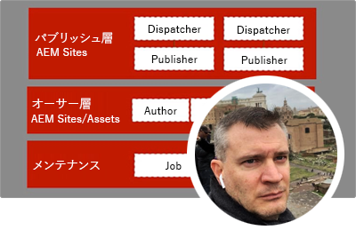
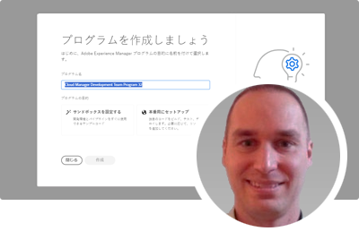
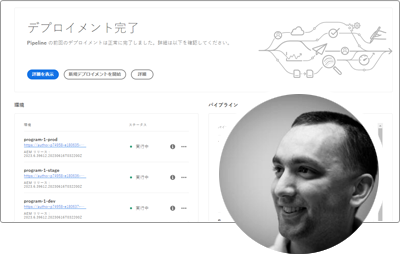
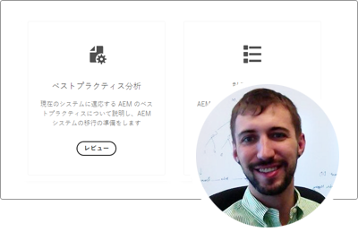
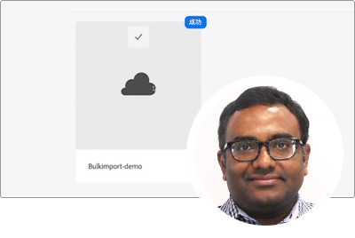
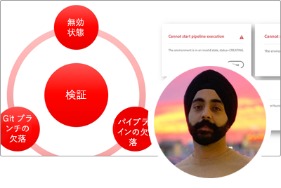

# AEM as a Cloud Service エキスパートシリーズ

Adobe Experience Manager（AEM）as a Cloud Service を作成するアドビのエキスパートエンジニアを紹介し、提供するプロフェッショナルサービスチームについて説明します。アドビのエキスパートと共に、AEM as a Cloud Service の概要、AEM 6 との違い、AEM 6 から AEM as a Cloud Service に移行する方法を探索します。

  
 

## AEM as a Cloud Service の基本を学ぶ

アドビエンジニアリングのシニアクラウドアーキテクトが、AEM as a Cloud Service の基礎と、AEM 6 との違いを説明します。

<table>
  <tr>
   <td>
      
      

         <a href="../../migration/moving-to-aem-as-a-cloud-service/introduction.md"><strong>異なる考え方をする</strong></a>
  <em>Darin Kuntze（シニアクラウドアーキテクト）</em>
      

      

         
 AEM as a Cloud Service のアーキテクチャと、AEM as a Cloud Service の実装についての考え方について説明します。
      

     </td>   
     <td>
      
      

         <a href="../../migration/moving-to-aem-as-a-cloud-service/onboarding.md"><strong>AEM as a Cloud Service のオンボーディング</strong></a>
  <em>Damian Langsweirdt（シニアクラウドアーキテクト）</em>
      

      

         
 契約段階から Cloud Manager を使用したセルフサービス環境の設定まで、AEM as a Cloud Service へのオンボーディングについて説明します。
      

   </td>     
   </td>   
     <td>
      
      

         <a href="../../migration/moving-to-aem-as-a-cloud-service/cloud-manager.md"><strong>AEM as a Cloud Service 用 Cloud Manager</strong></a>
  <em>Bryan Stopp（シニアクラウドアーキテクト）</em>
      

      

         
AEM as a Cloud Service 用 Cloud Manager について、Adobe Managed Services（AMS）上の AEM 用 Cloud Manager との違いを含めて説明します。
      

   </td> 
  </tr>
</table>

## AEM as a Cloud Service に移行?

AEM 6 から AEM as a Cloud Service に移行する予定はありますか？AEM as a Cloud Service に移行するためのアドビの方法と、スムーズに移行するための様々なツールと機能について説明します。

<table>
  <tr>
   <td>
      
      

         <a href="../../migration/moving-to-aem-as-a-cloud-service/bpa-and-cam.md" target="_aem-experts-series-video"><strong>移行方法</strong></a>
  <em>Roger Blanton（アドビコンサルティングサービステクニカルアーキテクト）</em>
      

      

         
 AEM のベストプラクティスアナライザー（BPA）と Cloud Acceleration Manager（CAM）を使用して、AEM 6 から AEM as a Cloud Service に移行するためのベストプラクティスの移行方法について説明します。
      

   </td>   
     <td>
      
      

         <a href="../../migration/moving-to-aem-as-a-cloud-service/aem-modernization-tools.md" target="_aem-experts-series-video"><strong>コンテンツの最新化</strong></a>
  <em>Bryan Stopp（シニアクラウドアーキテクト）</em>
      

      

         
 AEM コンテンツを自動的に最新化し、最新の AEM as a Cloud Service 機能を活用する方法について説明します。
      

   </td>     
   </td>   
     <td>
      
      

         <a href="../../migration/moving-to-aem-as-a-cloud-service/repository-modernization.md" target="_aem-experts-series-video"><strong>AEM Maven プロジェクトの最新化</strong></a>
  <em>Varun Mitra（クラウドアーキテクト）</em>
      

      

         
 カスタム AEM アプリケーションの Maven プロジェクトの構造と組織を自動的に最新化し、AEM as a Cloud Service との互換性を保ち、アドビの最新のベストプラクティスと一致するようにする方法について説明します。
      

   </td> 
  </tr>
  <tr>
   <td>
      
      

         <a href="../../migration/moving-to-aem-as-a-cloud-service/search-and-indexing.md" target="_aem-experts-series-video"><strong>Oak インデックスの最新化</strong></a>
  <em>Darin Kuntze（シニアクラウドアーキテクト）</em>
      

      

         
 AEM 6 Oak インデックス定義を AEM as a Cloud Service 互換に自動的に変換する方法と、今後 AEM as a Cloud Service の Oak インデックスを維持する方法について説明します。
      

   </td>   
     <td>
      
      

         <a href="../../migration/moving-to-aem-as-a-cloud-service/dispatcher.md" target="_aem-experts-series-video"><strong>Dispatcher 設定の最新化</strong></a>
  <em>Bryan Stopp（シニアクラウドアーキテクト）</em>
      

      

         
AEM 6 用 Dispatcher からの主要な変更点、Dispatcher 変換ツールおよび Dispatcher Tools SDK の使用方法に重点を置いて、AEM as a Cloud Service 用の AEM Dispatcher について説明します。
      

   </td>     
   </td>   
     <td>
      
      

         <a href="../../migration/moving-to-aem-as-a-cloud-service/content-migration/content-transfer-tool.md" target="_aem-experts-series-video"><strong>AEM as a Cloud Service へのコンテンツの転送</strong></a>
  <em>Kiran Murugulla（シニアクラウドアーキテクト）</em>
      

      

         
コンテンツ転送ツールを使用して、AEM 6.3 以降から AEM as a Cloud Service にコンテンツを移行する方法について説明します。
      

   </td> 
  </tr>  
</table>

## AEM as a Cloud Service の機能

アドビのエキスパートから、AEM as a Cloud Service の独自の機能について説明します。

<table>
  <tr>
   <td>
      
      

         <a href="../../migration/moving-to-aem-as-a-cloud-service/asset-compute-microservices.md" target="_aem-experts-series-video"><strong>Asset Compute マイクロサービス</strong></a>
  <em>Amol Anand（プリンシパルクラウドアーキテクト）</em>
      

      

         
 AEM Assets の Asset Compute マイクロサービス、AEM 6 アセット処理を置き換える方法、カスタムアセットレンディションを生成するために拡張する方法について説明します。
      

   </td>   
   <td>
      
      

         <a href="../../migration/moving-to-aem-as-a-cloud-service/content-migration/bulk-import-service.md" target="_aem-experts-series-video"><strong>コンテンツの一括読み込み</strong></a>
  <em>Kiran Murugulla（シニアクラウドアーキテクト）</em>
      

      

         
 一括読み込みサービスと AEM のパッケージマネージャーを使用して、コンテンツを AEM as a Cloud Service に安全かつ効率的に一括読み込みする方法を説明します。
      

   </td> 
    <td></td>
  </tr>
</table>

## AEM as a Cloud Services に関するヘルプが必要ですか？

AEM as a Cloud Service および AEM SDK のデバッグとトラブルシューティングの方法をエキスパートから説明します。

<table>
  <tr>
   <td>
      
      

         <a href="../../migration/moving-to-aem-as-a-cloud-service/troubleshooting.md" 
         target="_aem-experts-series-video"><strong>AEM as a Cloud Service のトラブルシューティング</strong></a>
  <em>Kunwar Saluja（クラウドアーキテクト）</em>
      

      

         
 AEM SDK と AEM as a Cloud Service のデバッグから、Cloud Manager のビルドとデプロイメントの失敗に至るまで、AEM as a Cloud Service の様々な側面のトラブルシューティングを行う方法について説明します。
      

   </td>   
    <td></td>
    <td></td>
  </tr>
</table>
