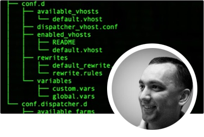

# Adobe Experience Manager as a Cloud Service Experts Series

Adobe Experience Manager(AEM) を構築するAdobeのエキスパートエンジニア、およびそれを提供するプロフェッショナルサービスチームからas a Cloud Serviceした情報を紹介します。 Adobeの専門家に参加して、AEMのas a Cloud Serviceとは何か、AEM 6 との同じ機能と違い、AEM 6 からAEM as a Cloud Serviceへの移行方法を調べてください。

  
 

## AEMas a Cloud Serviceの概要

AEM as aCloud Servicesの基本と、AEM 6 との違いについて、Adobeエンジニアリングのシニアクラウドアーキテクトから学びます。

<table>
  <tr>
   <td>
      
      

         <a href="../../migration/moving-to-aem-as-a-cloud-service/introduction.md"><strong>違う考え方</strong></a>         
          <em>シニアクラウドアーキテクトの Darin Kuntze 氏と共に</em>
      

      

         
         AEM as a Cloud Serviceのアーキテクチャと、AEM as a Cloud Serviceの実装について異なる考え方を見てみましょう。
      

     </td>   
     <td>
      
      

         <a href="../../migration/moving-to-aem-as-a-cloud-service/onboarding.md"><strong>AEM as a Cloud Serviceのオンボーディング</strong></a>
          <em>シニアクラウドアーキテクトの Damian Langsweirdt 氏と</em>
      

      

         
         Cloud Manager を使用してセルフサービス環境を設定する契約段階から、AEMas a Cloud Serviceのオンボーディングについて説明します。
      

   </td>     
   </td>   
     <td>
      
      

         <a href="../../migration/moving-to-aem-as-a-cloud-service/cloud-manager.md"><strong>Cloud Manager for AEM as a Cloud Service</strong></a>
          <em>Bryan Stopp 氏（上級クラウドアーキテクト）</em>
      

      

         Cloud Manager for AEM as a Cloud Service について、Adobe Managed Services（AMS）上の Cloud Manager for AEM との違いを含めて説明します。
      

   </td> 
  </tr>
</table>

## AEM as a Cloud Service への移行?

AEM 6 からAEM as a Cloud Serviceに移行する予定は？ AdobeのAEM as a Cloud Serviceへの移行方法と、これをスムーズな移行にする様々なツールと機能について説明します。

<table>
  <tr>
   <td>
      
      

         <a href="../../migration/moving-to-aem-as-a-cloud-service/bpa-and-cam.md" target="_aem-experts-series-video"><strong>移行手法</strong></a>
          <em>Adobeコンサルティングサービステクニカルアーキテクトの Roger Blanton と</em>
      

      

         
        AEM Best Practice Analyzer(BPA) と Cloud Acceleration Manager(CAM) を使用してAEM 6 からAEM as a Cloud Serviceに移行する際のベストプラクティス移行方法を説明します。
      

   </td>   
     <td>
      
      

         <a href="../../migration/moving-to-aem-as-a-cloud-service/aem-modernization-tools.md" target="_aem-experts-series-video"><strong>コンテンツの最新化</strong></a>
          <em>Bryan Stopp 氏（上級クラウドアーキテクト）</em>
      

      

         
         AEMコンテンツを自動的に最新化して、最新のAEMas a Cloud Service機能を利用する方法を説明します。
      

   </td>     
   </td>   
     <td>
      
      

         <a href="../../migration/moving-to-aem-as-a-cloud-service/repository-modernization.md" target="_aem-experts-series-video"><strong>AEM Maven プロジェクトの最新化</strong></a>
          <em>クラウドアーキテクトの Varun Mitra 氏と共に</em>
      

      

         
         カスタムAEMアプリケーションの Maven プロジェクト構造と組織を自動的に最新化し、AEMとas a Cloud Serviceの互換性を保ち、Adobeの最新のベストプラクティスに合わせる方法を説明します。
      

   </td> 
  </tr>
  <tr>
   <td>
      
      

         <a href="../../migration/moving-to-aem-as-a-cloud-service/search-and-indexing.md" target="_aem-experts-series-video"><strong>Oak インデックスの最新化</strong></a>
          <em>シニアクラウドアーキテクトの Darin Kuntze 氏と共に</em>
      

      

         
        AEM 6 Oak インデックス定義をAEMas a Cloud Service互換に自動的に変換する方法と、今後AEMのas a Cloud Service用に Oak インデックスを維持する方法について説明します。
      

   </td>   
     <td>
      
      

         <a href="../../migration/moving-to-aem-as-a-cloud-service/dispatcher.md" target="_aem-experts-series-video"><strong>Dispatcher 設定の最新化</strong></a>
          <em>Bryan Stopp 氏（上級クラウドアーキテクト）</em>
      

      

         Dispatcher for AEM 6 からの主要な変更点、Dispatcher 変換ツールおよび Dispatcher ツール SDK の使用方法に重点を置いて、AEM as a Cloud Service 用の AEM Dispatcher について説明します。
      

   </td>     
   </td>   
     <td>
      
      

         <a href="../../migration/moving-to-aem-as-a-cloud-service/content-migration/content-transfer-tool.md" target="_aem-experts-series-video"><strong>AEM as a Cloud Serviceへのコンテンツの転送</strong></a>
          <em>シニアクラウドアーキテクトの Kiran Murugulla 氏と共に</em>
      

      

         コンテンツ転送ツールを使用して、AEM 6.3 以降から AEM as a Cloud Service にコンテンツを移行する方法について説明します。
      

   </td> 
  </tr>  
</table>

## AEM as aCloud Services機能

AEMas a Cloud Serviceの専門家が提供する、Adobe独自の機能について学びます。

<table>
  <tr>
   <td>
      
      

         <a href="../../migration/moving-to-aem-as-a-cloud-service/asset-compute-microservices.md" target="_aem-experts-series-video"><strong>asset computeマイクロサービス</strong></a>
          <em>Amol Anand 氏（主要クラウドアーキテクト）</em>
      

      

         
        AEM Assets のAsset computeマイクロサービス、AEM 6 のアセット処理を置き換える方法、カスタムアセットレンディションを生成するために拡張する方法について説明します。
      

   </td>   
   <td>
      
      

         <a href="../../migration/moving-to-aem-as-a-cloud-service/content-migration/bulk-import-service.md" target="_aem-experts-series-video"><strong>コンテンツの一括読み込み</strong></a>
          <em>シニアクラウドアーキテクトの Kiran Murugulla 氏と共に</em>
      

      

         
        一括読み込みサービスとAEMパッケージマネージャーを使用して、AEMas a Cloud Serviceにコンテンツを一括で安全かつ効率的に読み込む方法を説明します。
      

   </td> 
    <td></td>
  </tr>
</table>

## AEM as aCloud Servicesのヘルプが必要な場合

エキスパートによるAEM as a Cloud Service SDK とAEM SDK のデバッグとトラブルシューティングの方法について説明します。

<table>
  <tr>
   <td>
      
      

         <a href="../../migration/moving-to-aem-as-a-cloud-service/troubleshooting.md" 
         target="_aem-experts-series-video"><strong>トラブルシューティングAEMas a Cloud Service</strong></a>
          <em>Kunwar Saluja とクラウドアーキテクト</em>
      

      

         
        AEM SDK とAEMのデバッグから、Cloud Manager のビルドおよびデプロイメントのas a Cloud Serviceに至るまで、AEMas a Cloud Serviceの様々な側面をトラブルシューティングする方法について説明します。
      

   </td>   
    <td></td>
    <td></td>
  </tr>
</table>
