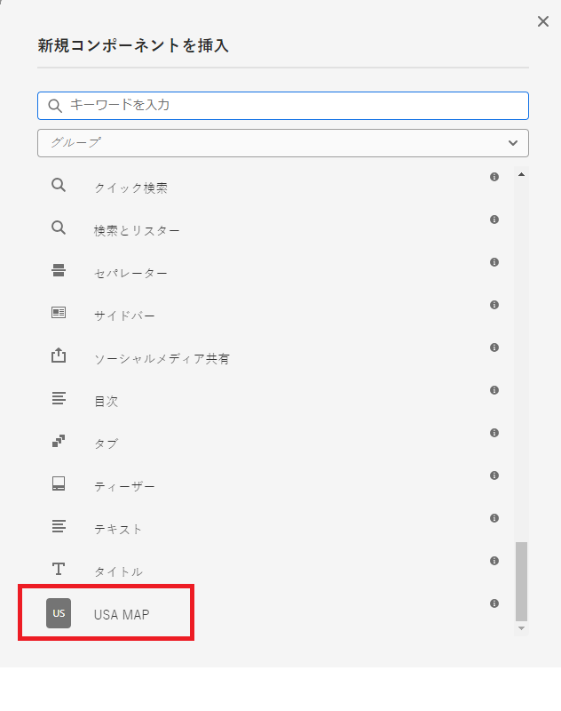

# コンポーネントの作成

この記事では、AEM Forms CS 向けの開発に関する経験があることを前提としています。また、AEM Forms アーキタイププロジェクトを作成していることも前提としています。

IntelliJ または任意の他の IDE で AEM Forms プロジェクトを開きます。以下に、svg という新しいノードを作成します。

```
apps\corecomponent\components\adaptiveForm
```

>[!NOTE]
>
> ``corecomponent`` は、Maven プロジェクトの作成時に提供された appId です。この appId は、環境によって異なる可能性があります。


## .content.xml ファイルの作成

svg ノードの下に .content.xml というファイルを作成します。新しく作成したファイルに次の内容を追加します。必要に応じて、jcr:description、jcr:title、componentGroup を変更できます。

```xml
<?xml version="1.0" encoding="UTF-8"?>
<jcr:root xmlns:jcr="http://www.jcp.org/jcr/1.0" xmlns:cq="http://www.day.com/jcr/cq/1.0" xmlns:sling="http://sling.apache.org/jcr/sling/1.0"
    jcr:description="USA MAP"
    jcr:primaryType="cq:Component"
    jcr:title="USA MAP"
    sling:resourceSuperType="wcm/foundation/components/responsivegrid"
    componentGroup="CustomCoreComponent - Adaptive Form"/>
```

## svg.html の作成

svg.html というファイルを作成します。このファイルは、米国マップの SVG をレンダリングします。[svg.html](assets/svg.html) の内容を、新しく作成したファイルにコピーします。コピーしたのは、米国マップの SVG です。ファイルを保存します。

## プロジェクトのデプロイ

プロジェクトをローカルクラウド対応インスタンスにデプロイして、コンポーネントをテストします。

プロジェクトをデプロイするには、コマンドプロンプトウィンドウでプロジェクトのルートフォルダーに移動し、次のコマンドを実行する必要があります。

```
mvn clean install -PautoInstallSinglePackage
```

これにより、プロジェクトがローカルの AEM Forms インスタンスにデプロイされ、コンポーネントをアダプティブフォームに含めることができるようになります。


